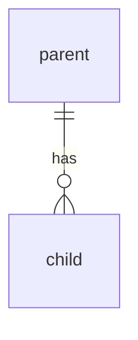

<!-- PR title must be a Conventional Commit, e.g. feat(logger): add bodyweight entry -->

## Description

<!-- What and why. Reference the backlog id (e.g. V0-1). -->

## Where this sits (milestone or multi-PR work)

<!-- DELETE THIS WHOLE SECTION for a standalone PR — a dependency bump, a one-off bug, a typo, a
     config one-liner. "Milestone: none" is noise, and a field that is empty half the time trains
     reviewers to skip it. Keep it when you can name the milestone, spec or multi-PR track this
     advances — a plan or spec PR counts, even though it is `docs`. -->

- **Pillar:** <!-- docs/roadmap.md → The pillars -->
- **Milestone:** <!-- e.g. beta-1 §3b Authoring — link the milestone doc or its spec -->
- **This PR:** <!-- e.g. chunk 1 of 6, the snapshot column -->
- **Next:** <!-- what this unblocks, and what that is gated on -->

## Type of Change

<!-- bug fix | new feature | breaking change | perf | refactor | docs -->

## How Has This Been Tested?

<!-- unit / integration / E2E. For endpoints, include the boundary cases: unauth, wrong-owner, invalid input. -->

## Test Configuration

<!-- Node version, DB (Docker Postgres / Neon branch), relevant env. -->

## Screenshots (optional)

<!-- REQUIRED for any UI change: before / after. -->

## Diagram (flow / model / schema changes)

<!-- Embed a Mermaid diagram for any pivotal flow, data-model, or schema change — it renders on GitHub
     and shows the reviewer the shape of the change. Reuse/update docs/architecture.md. Skip for trivial
     changes. e.g.:

-->

---

<!-- Fill only the section(s) that apply. -->

### Backend / API (if touched)

- Endpoints / actions touched:
- Request / response example:
- Breaking change? (y/n):
- Security notes (authz / ownership / validation):

### Database (if a migration)

- What changed & why:
- Lock / rewrite risk (paste Squawk / eugene output):
- Backfill plan (batch size, est. duration on prod row counts):
- Rollback plan:
- PII columns touched:
- New indexes for new query patterns:
