# mat-plan — Architecture Diagrams

Visual overview of the system — **v0 is built and live on Vercel + Neon; v1 (the generalized activity
model) is in progress** (V1-1). Detail in [spec.md](./spec.md); roadmap in [plan.md](./plan.md); the
v1 schema plan is [plans/v1-1-generalize-schema.md](./plans/v1-1-generalize-schema.md). Diagrams
render on GitHub (Mermaid).

## 1. System architecture (containers)

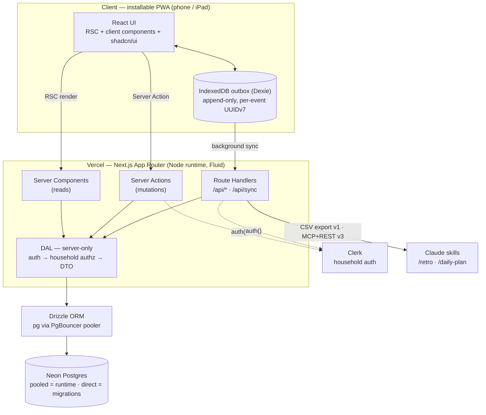

## 2. Write path — logging one entry

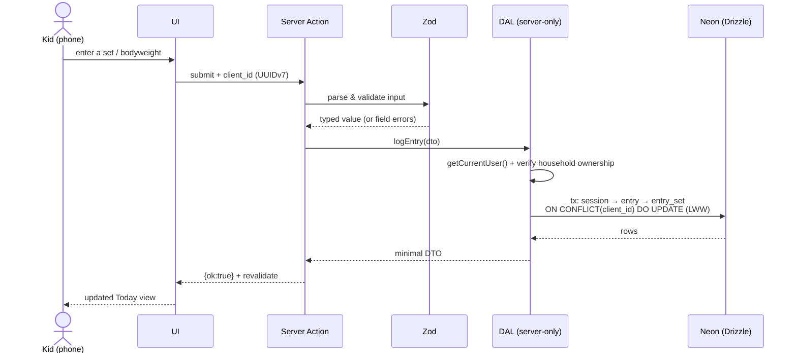

## 2c. Batch write path — logging a day's check-ins (V1-5)

The first **batch multi-row** write and the first writer to insert `kind = NULL` (unblocked by
V1-1c). Differs from §2 in three ways worth seeing at a glance: the action derives its fields from a
**server-side registry** rather than the request body, results are **per-item**, and the conflict
policy is `DO NOTHING` (not §2's LWW `DO UPDATE` — editing a check-in is V1-9).

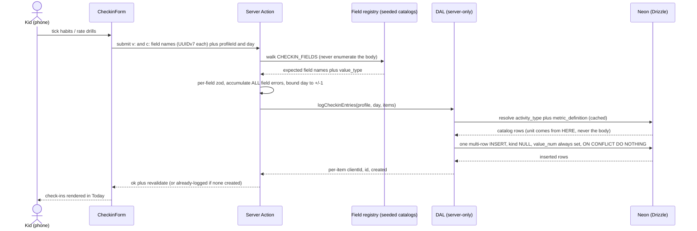

## 2b. Profile routing — landing → picker → scoped Today (V1-3, OSS-2)

`/` is the **public landing** (OSS-2): no cookie read, no DB query, the only route in `PUBLIC_PATHS`.
A caller who already holds the gate cookie never sees it — the proxy sends `/` (and `/gate`) to the
picker at **`/p`** (`APP_HOME_PATH`). That redirect is convenience routing, not authorization: every
gated page still calls `requireGatedPage()`, and `app/pages-are-gated.test.ts` fails CI if one
doesn't.

The picker at `/p` lists profiles; a tile routes to `/p/[profileId]` (the profile's UUIDv7 `public_id`). The
selection lives entirely in the URL — no client state. The `profileId` rides the log forms as a hidden
field, and every Server Action **re-validates it server-side** via `getProfileByPublicId` (the seam
v1.5's Clerk household scoping tightens). Profile tiles are a **UX switch, not a security boundary**;
an unknown/malformed id resolves to `notFound()` (404), never a 500.

```mermaid
flowchart LR
  LANDING["/ — public landing<br/>(no cookie, no DB)"]
  GATE["/gate — access code"]
  PICKER["/p — profile picker<br/>listProfiles() → tiles"]
  TODAY["/p/[profileId] — scoped Today<br/>getProfileByPublicId(id) → notFound() if null"]
  ACT["Server Action<br/>log bodyweight / strength"]
  DAL["DAL (server-only)<br/>getProfileByPublicId(id)"]

  LANDING -->|"Household sign-in"| GATE
  GATE -->|"code OK → APP_HOME_PATH"| PICKER
  LANDING -.->|"proxy: already has the cookie"| PICKER
  PICKER -->|"tap tile → next/link"| TODAY
  TODAY -->|"back-link"| PICKER
  TODAY -->|"hidden field profileId"| ACT
  ACT -->|"re-validate id (never trust the form)"| DAL
  DAL -->|"revalidatePath('/p/'+id)"| TODAY
```

## 2d. Program read path — today's weekday → the kid's prescribed movements (V1-10)

The programming tables (§4) surface on Today as a **read-only** card. The weekday comes from the
active-tz local day (V1-6c), maps through a hardcoded app-config schedule (`DAY_ROLE_BY_WEEKDAY` —
a documented stopgap, see [tech-debt.md](./tech-debt.md)) to a `day_role`, and one single-sourced
query resolves that day's prescriptions **plus this kid's own suggested loads**.

Two properties are load-bearing. **Ownership**: the household is resolved INSIDE the query
(`profiles.public_id → household_id → program_blocks`), so no caller can name a household and read
another one's program. **Read-only**: the card never writes and never pre-fills the log form — the
suggested load is Ray-authored text ("BW", "~75-85") that must be **typed** by a human to become a
logged, performed value. A prescription and a log entry stay strictly separate records.

```mermaid
flowchart LR
  RSC["/p/[profileId] RSC<br/>day = localDayIso(activeTz)"]
  SCHED["resolveDayRole(day)<br/>localWeekday → DAY_ROLE_BY_WEEKDAY<br/>(Mon/Wed/Fri → strength_a/b/c)"]
  DAL["DAL getProgramDay(publicId, dayRole)<br/>server-only · uuid guard · → DTO"]
  Q["packages/db programDayRows<br/>(single-sourced, db:verify-proven)"]
  DB[("program_blocks → prescriptions<br/>⟕ prescription_targets (this profile)")]
  CARD["&lt;ProgramReference&gt; RSC<br/>read-only, zero client JS"]
  FORM["&lt;StrengthForm&gt;<br/>UNCHANGED — empty + required"]

  RSC --> SCHED
  SCHED -->|"null → no card, no query"| FORM
  SCHED -->|"day_role"| DAL
  DAL --> Q
  Q -->|"profile → household → newest block<br/>(ownership resolved internally)"| DB
  DB -->|"movements in idx order<br/>+ THIS kid's load/reps, verbatim"| CARD
  CARD -.->|"coach reads it,<br/>TYPES what was performed"| FORM
```

## 3. Offline outbox → sync

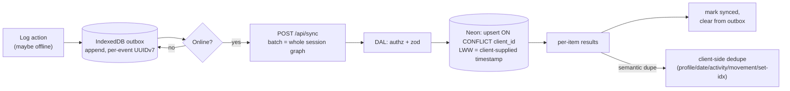

## 4. Data model — v1 generalized model (target of V1-1)

The concrete tables the v0 thin slice (`units · profiles · entries · entry_sets`) generalizes into.
`households` is the authz root; the catalogs (`activity_types · movements · metric_definitions`, all
keyed by natural keys and seeded from `@mat-plan/shared` in V1-2) classify each `entry`; `sessions`
group a training day's entries. Full column detail in [spec.md](./spec.md) §4a.

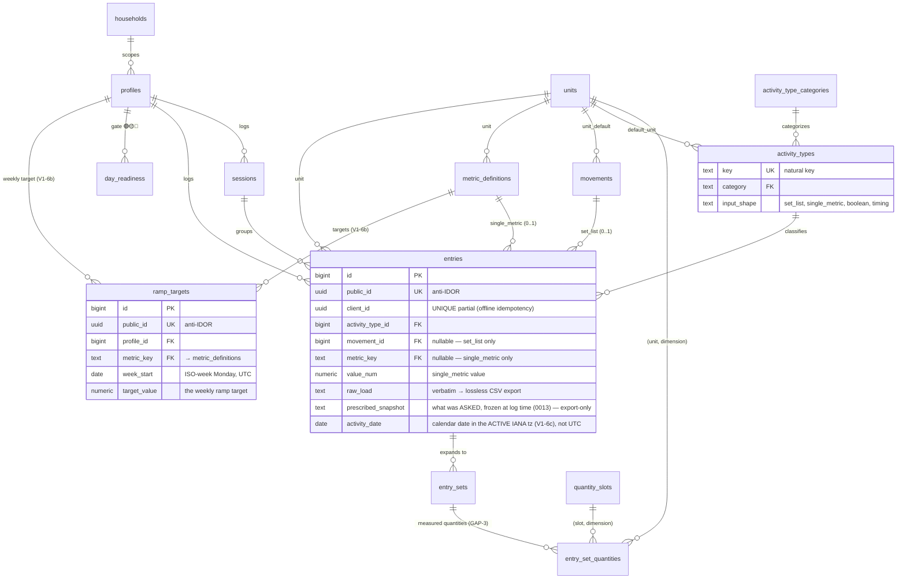

> **Ramp targets (V1-6b):** `ramp_targets` holds a per-profile, per-week TARGET value for a calisthenics
> metric, so weekly adherence (actual `entries` vs target) is computable in **SQL** (spec.md §4). A
> coach-authored weekly calendar, not engine-computed progression — see
> [ADR 0002](./decisions/0002-calisthenics-ramp-targets.md). Config data → no `client_id`; idempotency
> is the partial natural-key UNIQUE `(profile_id, metric_key, week_start) WHERE deleted_at IS NULL`.

> **Tagged union (V1-1b):** an `entry` carries **at most one** of `{movement_id, metric_key}` —
> `CHECK (movement_id IS NULL OR metric_key IS NULL)`. `boolean`/`timing` activities (e.g. `wake`,
> `brain_rep`) reference **neither** and are typed by `activity_type_id` alone.

### 4a. How one activity maps to an entry (the tagged union)

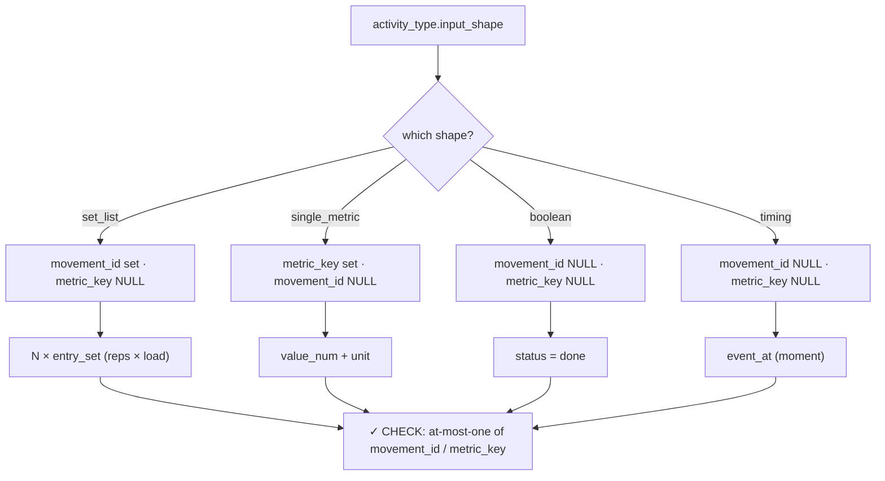

## 5. Deploy & CI topology

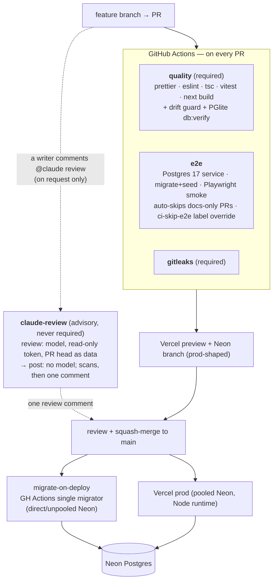

> `e2e` soaks as non-blocking until **PR 28**, then becomes a required check. Squawk (migration lint)
> and a Neon-branch apply are documented gates not yet wired into `ci.yml` (a follow-up).

## 6. Roadmap to MVP and beyond

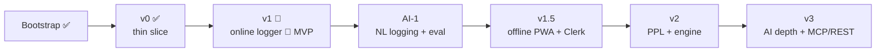

## 7. v1 build order & parallelization

The serial spine (schema → catalogs) must land first; then the feature slices are additive on the
settled model and **fan out in parallel**, before the serial tail (edit → prefill → export → capstone).

```mermaid
flowchart LR
  V11["V1-1<br/>generalize schema<br/>(a → b → c)"] --> V12["V1-2<br/>seed catalogs<br/>+ coverage test"]
  V12 --> BAND
  subgraph BAND["parallelizable — additive on the generalized model"]
    direction TB
    V13["V1-3 profile tiles"]
    V14["V1-4 weigh-ins"]
    V15["V1-5 checkins / habits"]
    V16["V1-6 calisthenics totals"]
    V17["V1-7 life activities"]
    V18["V1-8 strength session"]
  end
  BAND --> V19["V1-9 fix-a-set (LWW)"]
  V19 --> V110["V1-10 block-template prefill"]
  V110 --> V111["V1-11 copy-set-to-kid"]
  V111 --> V112["V1-12 a11y pass"]
  V112 --> V113["V1-13 CSV export"]
  V113 --> V114["V1-14 full-day E2E<br/>🎯 MVP complete"]
```

> Migrations serialize by rule (one per PR, drift-checked, forward-only), so schema-touching PRs stay
> on the spine; the parallel band is app-layer (no new migrations). The **training-log day**
> (`2026-07-20`) becomes fully loggable once V1-4 + V1-8 + V1-5 + V1-6 land, and V1-13 exports it.
