# mat-plan — Architecture Diagrams

Visual overview of the system — **v0 is built and live on Vercel + Neon; v1 (the generalized activity
model) is in progress** (V1-1). Detail in [spec.md](./spec.md); roadmap in [plan.md](./plan.md); the
v1 schema plan is [plans/v1-1-generalize-schema.md](./plans/v1-1-generalize-schema.md). Diagrams
render on GitHub (Mermaid).

## 1. System architecture (containers)

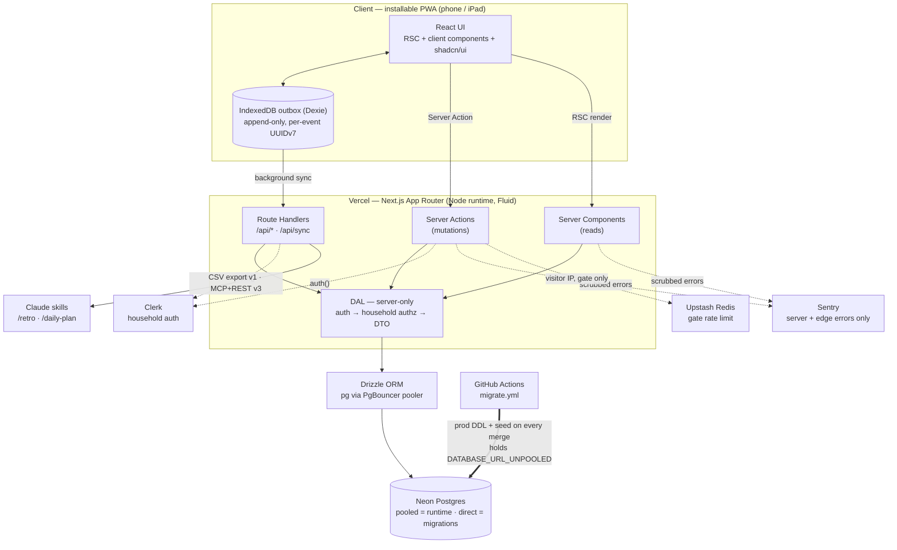

⚠️ **This is the containers view, not the egress list.** Sentry, Upstash and GitHub Actions are drawn
now because each receives something, and **GitHub Actions holding the production database credential**
is the edge people miss. But **Vercel is where every value entered actually passes through**, and its
platform logs hold IP + path. The complete, cited list of who receives what is
[privacy/data-inventory.md](./privacy/data-inventory.md) §7, which owns it.

## 2. Write path — logging one entry

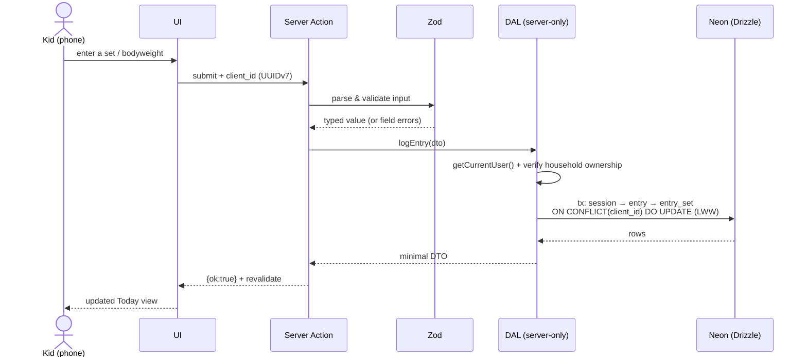

## 2c. Batch write path — logging a day's check-ins (V1-5)

The first **batch multi-row** write and the first writer to insert `kind = NULL` (unblocked by
V1-1c). Differs from §2 in three ways worth seeing at a glance: the action derives its fields from a
**server-side registry** rather than the request body, results are **per-item**, and the conflict
policy is `DO NOTHING` (not §2's LWW `DO UPDATE` — editing a check-in is V1-9).

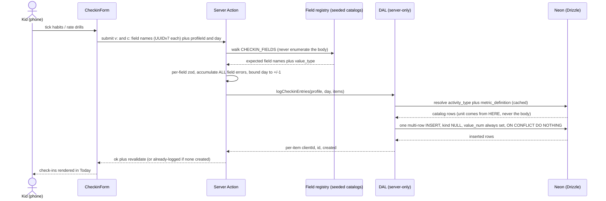

## 2b. Profile routing — landing → picker → scoped Today (V1-3, OSS-2)

`/` is the **public landing** (OSS-2): no cookie read, no DB query, the only route in `PUBLIC_PATHS`.
A caller who already holds the gate cookie never sees it — the proxy sends `/` (and `/gate`) to the
picker at **`/p`** (`APP_HOME_PATH`). That redirect is convenience routing, not authorization: every
gated page still calls `requireGatedPage()`, and `app/pages-are-gated.test.ts` fails CI if one
doesn't.

The picker at `/p` lists profiles; a tile routes to `/p/[profileId]` (the profile's UUIDv7 `public_id`). The
selection lives entirely in the URL — no client state. The `profileId` rides the log forms as a hidden
field, and every Server Action **re-validates it server-side** via `getProfileByPublicId`. Profile
tiles are a **UX switch, not a security boundary**; an unknown/malformed id resolves to `notFound()`
(404), never a 500.

**The household scope is where that re-validation now happens, and it is ONE point (TEN-1).**
[ADR 0006](./decisions/0006-household-addressing.md) decided the address stays `/p/<profileId>` with
**no household segment**, so `/p` is byte-identical for every household and the picker query is the
whole front-door isolation boundary. `lib/dal/household.ts` → `getHouseholdScope()` is the **one**
function that decides whose request this is; every DAL read and write resolves it there and passes it
into `packages/db`, so no page, action or Route Handler signature carries a scope.
`isLiveProfile(publicId, scope)` is the single predicate they all share, its `scope` parameter
**required and positional** so an unconverted call site is a compile error.

- **A wrong-household id is a 404, byte-identical to an unknown id** — the same `notFound()` /
  `NO_PROFILE_LOG` path, no new error shape and no new copy. The signal the scoped predicate destroys
  is recovered on the miss path only, as a structured `cross_household` / `unknown_resource` event
  (ADR 0006 obligation 3), never in the response.
- **Zero live households → `null` (the app goes dark); ≥ 2 → THROW.** Different states, different
  paths: `null` for both would tell a parent their data does not exist and suggest a production write.
- **AUTH-1 replaces only `getHouseholdScope()`'s body** (session → `household_members` → household).
  Nothing else moves, which is the whole reason the seam landed before its consumers.
- ⚠️ **Scoping is not authorization.** Before AUTH-1 the principal is a shared access code, so what
  is proved is _consistent scoping_, not that the requester is who they claim.
- ✅ **`movements` came inside the seam at `TEN-2b`.** `findOrCreateMovementId` takes a
  `HouseholdScope` and resolves **global-first** — the curated namespace (`household_id IS NULL`),
  then this household's own, then an insert into this household's own — so a name a household types
  belongs to it and is deleted with it. ⚠️ **One leak survives to `TEN-2c`:** the non-partial
  `movements_slug_unique` still forbids two households a row for one slug, so the second household to
  type a name is handed the first's row (a deliberate choice over failing a child's session write),
  and that leaves a cross-household `entries.movement_id` which **blocks household deletion**. Status:
  [data-inventory.md](./privacy/data-inventory.md) §4; the resolver's shape is in §4 below. TEN-1
  chunk 1d **proved** the original defect rather than assuming it, and its verdict is still `LEAKS`.

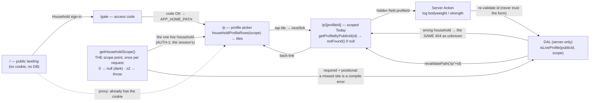

## 2d. Program read path — today's weekday → the kid's prescribed movements (V1-10)

The programming tables (§4) surface on Today as a **read-only** card. The calendar date comes from the
active-tz local day (V1-6c) and maps through a hardcoded app-config schedule — a documented stopgap,
see [tech-debt.md](./tech-debt.md) — to a `day_role`, and one single-sourced query resolves that day's
prescriptions **plus this kid's own suggested loads**.

⚠️ **The schedule is epoch-day PARITY, not a weekday map.** `resolveDayRole` alternates
`strength_a`/`strength_b` on every calendar day with no rest day
(`apps/web/lib/programming/day-role-schedule.ts:41-43`); the `DAY_ROLE_BY_WEEKDAY` Mon/Wed/Fri map this
section described was **deleted in #151**. Where it goes next is
[ADR 0007](./decisions/0007-scheduling-model.md).

Two properties are load-bearing. **Ownership**: the household is resolved INSIDE the query
(`profiles.public_id → household_id → program_blocks`), so no caller can name a household and read
another one's program. **Read-only**: the card never writes and never pre-fills the log form — the
suggested load is Ray-authored text ("BW", "~75-85") that must be **typed** by a human to become a
logged, performed value. A prescription and a log entry stay strictly separate records.

```mermaid
flowchart LR
  RSC["/p/[profileId] RSC<br/>day = localDayIso(activeTz)"]
  SCHED["resolveDayRole(day)<br/>epoch-day parity, every day<br/>(even → strength_b, odd → strength_a)"]
  DAL["DAL getProgramDay(publicId, dayRole)<br/>server-only · uuid guard · → DTO"]
  Q["packages/db programDayRows<br/>(single-sourced, db:verify-proven)"]
  DB[("program_blocks → prescriptions<br/>⟕ prescription_targets (this profile)")]
  CARD["&lt;ProgramReference&gt; RSC<br/>read-only, zero client JS"]
  FORM["&lt;StrengthForm&gt;<br/>UNCHANGED — empty + required"]

  RSC --> SCHED
  SCHED -->|"null → no card, no query"| FORM
  SCHED -->|"day_role"| DAL
  DAL --> Q
  Q -->|"profile → household → newest block<br/>(ownership resolved internally)"| DB
  DB -->|"movements in idx order<br/>+ THIS kid's load/reps, verbatim"| CARD
  CARD -.->|"coach reads it,<br/>TYPES what was performed"| FORM
```

## 3. Offline outbox → sync

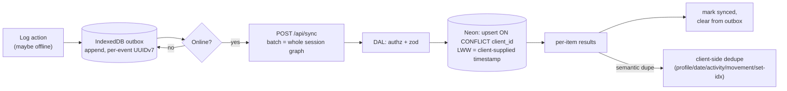

## 4. Data model — v1 generalized model (target of V1-1)

The concrete tables the v0 thin slice (`units · profiles · entries · entry_sets`) generalizes into.
`households` is the authz root; the catalogs (`activity_types · movements · metric_definitions`, all
keyed by natural keys and seeded from `@mat-plan/shared` in V1-2) classify each `entry`; `sessions`
group a training day's entries. Full column detail in [spec.md](./spec.md) §4a.

⚠️ **`households` is the authz root for everything that hangs off `profiles` — and two of the three
catalogs hang off nothing.** Global is right for `activity_types` and `metric_definitions` (seeded,
never written by the app) and **was wrong for `movements`**, which the strength form writes from free
text. TEN-1 1d proved the consequence: one household's typed name resolved to another household's
row, the first typist pinned that slug's `name` / `is_bodyweight` / `unit_default` for everyone, and
the row survived a session write the household seam refused.

**`TEN-2a` added the edge the ERD below draws** — `movements.household_id`, nullable, where `NULL`
means _reference data owned by no household_ (the seeded catalog) and a value means _this household
typed this name_ — plus the two partial unique indexes that give the table two namespaces.
✅ **`TEN-2b` lit it up**, so the edge is now in the behaviour as well as the schema: the resolver is
global-first (flowchart below), `seedProgram` reads the global namespace only, and the FK is
validated. **Two of 1d's three defects are closed**: a refused session's row lands in the caller's own
namespace, and a prescription can no longer resolve another household's movement — `seedProgram`
refuses loudly instead.

🔴 **One is not, and it is a schema window, not a code gap.** While the **non-partial**
`movements_slug_unique` lives, at most one row per slug exists in the whole table, so two households
cannot both hold one. `TEN-2a` chose, for that window, to hand the second household the first's row
(the pre-existing read leak) rather than fail its write forever with `23505` — availability over
confidentiality, bounded by the named invite precondition. ⚠️ **Its price:** the resulting
cross-household `entries.movement_id` **aborts the household-deletion procedure** (`23503`, measured),
which is why `runbooks.md` pre-flight (d) carries a repair step and `schema.ts` no longer claims the
reference is "prevented by construction". **`TEN-2c` drops the constraint and closes it.**

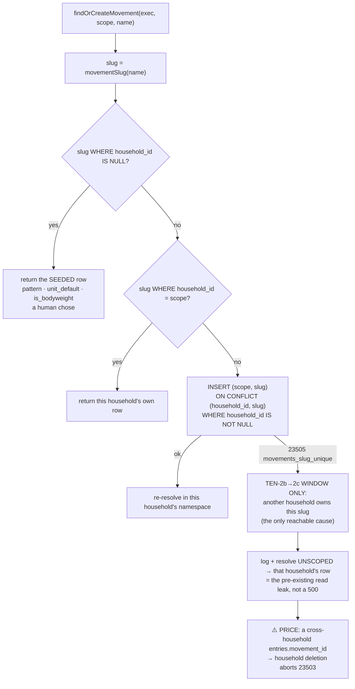

**Why global-first and not household-first** — the question a reader will ask: the only writer can
author `{publicId, slug, name, isBodyweight: false}` and never `pattern` or `unit_default`, so a
household row is always a **strictly worse** version of a curated one, and `programDayRows` reads
exactly those columns as _"the movement's declaration"_.

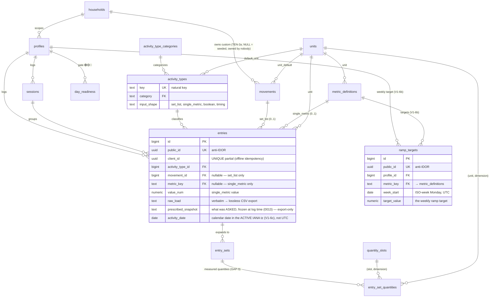

> **Ramp targets (V1-6b):** `ramp_targets` holds a per-profile, per-week TARGET value for a calisthenics
> metric, so weekly adherence (actual `entries` vs target) is computable in **SQL** (spec.md §4). A
> coach-authored weekly calendar, not engine-computed progression — see
> [ADR 0002](./decisions/0002-calisthenics-ramp-targets.md). Config data → no `client_id`; idempotency
> is the partial natural-key UNIQUE `(profile_id, metric_key, week_start) WHERE deleted_at IS NULL`.

> **Tagged union (V1-1b):** an `entry` carries **at most one** of `{movement_id, metric_key}` —
> `CHECK (movement_id IS NULL OR metric_key IS NULL)`. `boolean`/`timing` activities (e.g. `wake`,
> `brain_rep`) reference **neither** and are typed by `activity_type_id` alone.

### 4a. How one activity maps to an entry (the tagged union)

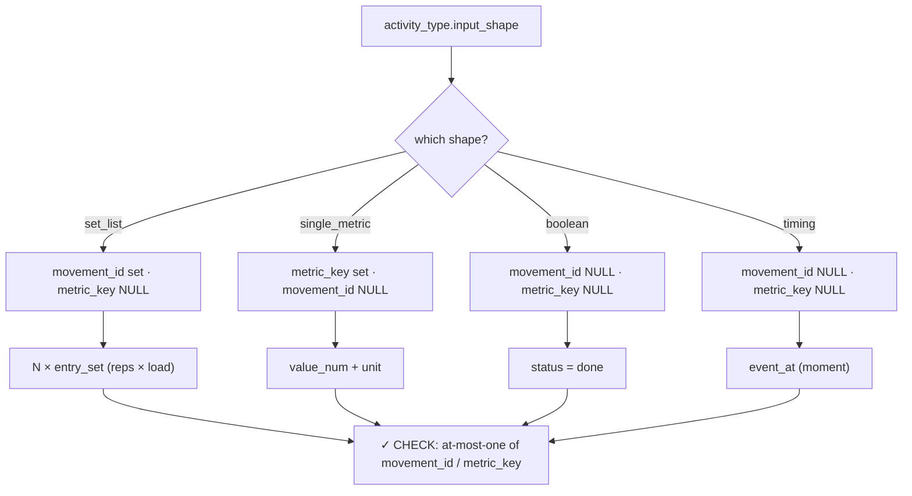

## 5. Deploy & CI topology

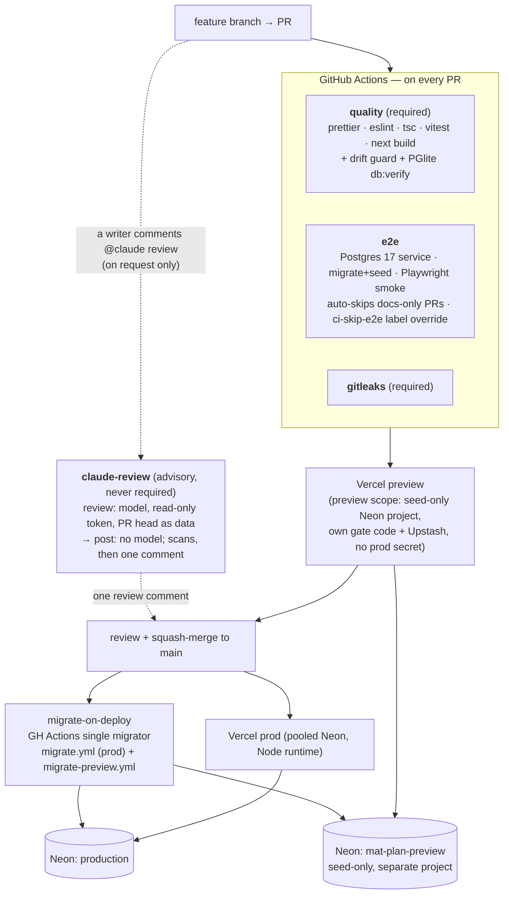

> `e2e` soaks as non-blocking until **PR 28**, then becomes a required check. Squawk (migration lint)
> and a Neon-branch apply are documented gates not yet wired into `ci.yml` (a follow-up).
>
> ⚠️ **Previews do NOT get a Neon branch of production, and never did.** This diagram said
> "Neon branch (prod-shaped)" in the present tense for months. A preview reads a **separate,
> seed-only Neon project** — a branch is a copy-on-write clone, so it would put every family's
> bodyweight in every preview ([OPS-1](./plans/ops-1-preview-isolation.md)). The unwired
> prod-shaped rehearsal is a different thing, and when it is built it must branch the **preview**
> project or use an anonymized snapshot, for the same reason.

## 6. Roadmap to MVP and beyond

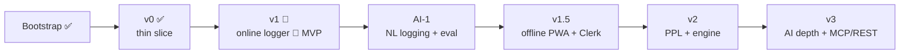

## 7. v1 build order & parallelization

The serial spine (schema → catalogs) must land first; then the feature slices are additive on the
settled model and **fan out in parallel**, before the serial tail (edit → prefill → export → capstone).

```mermaid
flowchart LR
  V11["V1-1<br/>generalize schema<br/>(a → b → c)"] --> V12["V1-2<br/>seed catalogs<br/>+ coverage test"]
  V12 --> BAND
  subgraph BAND["parallelizable — additive on the generalized model"]
    direction TB
    V13["V1-3 profile tiles"]
    V14["V1-4 weigh-ins"]
    V15["V1-5 checkins / habits"]
    V16["V1-6 calisthenics totals"]
    V17["V1-7 life activities"]
    V18["V1-8 strength session"]
  end
  BAND --> V19["V1-9 fix-a-set (LWW)"]
  V19 --> V110["V1-10 block-template prefill"]
  V110 --> V111["V1-11 copy-set-to-kid"]
  V111 --> V112["V1-12 a11y pass"]
  V112 --> V113["V1-13 CSV export"]
  V113 --> V114["V1-14 full-day E2E<br/>🎯 MVP complete"]
```

> Migrations serialize by rule (one per PR, drift-checked, forward-only), so schema-touching PRs stay
> on the spine; the parallel band is app-layer (no new migrations). The **training-log day**
> (`2026-07-20`) becomes fully loggable once V1-4 + V1-8 + V1-5 + V1-6 land, and V1-13 exports it.

## 8. Household deletion — the only path that removes rows (PRIV-1)

The procedure is [runbooks.md](./runbooks.md) → "Delete a household and everyone in it"; this is its
shape. It spans three systems and is irreversible, which is why the ordering is drawn rather than
left in prose. Two edges carry the non-obvious constraints: **Clerk ids are captured before the
transaction** (after AUTH-1 the mapping lives in the rows the transaction destroys), and **`entries`
is deleted before `sessions` and `supersets`** (it holds FKs to both).

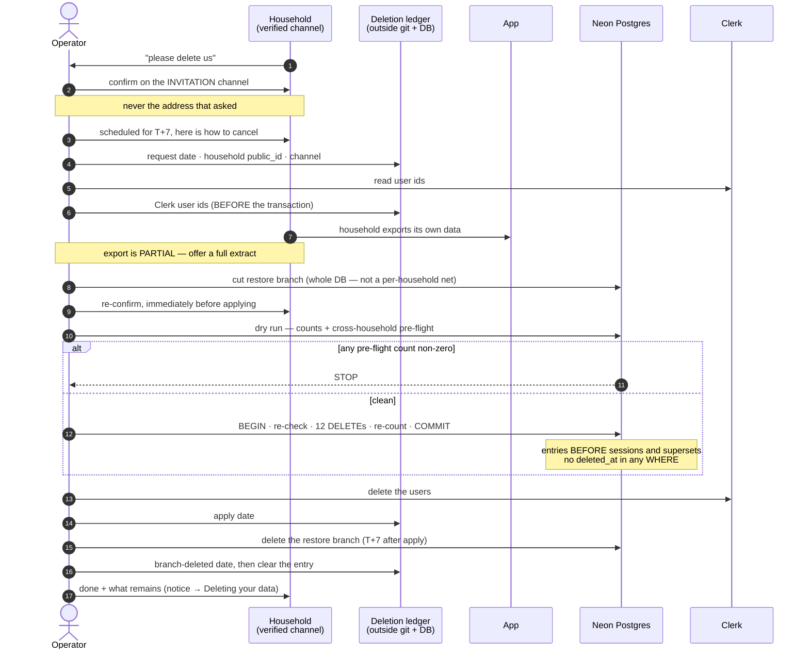

⛔ **Two preconditions this diagram assumes**: the household is **not in the seed** (`db:seed` runs on
every merge and would re-create it — `OPS-2`), and **`OPS-3`'s per-household restore has been
rehearsed** (without it a mistaken deletion is not practically recoverable, because the branch above
restores _everyone_).
