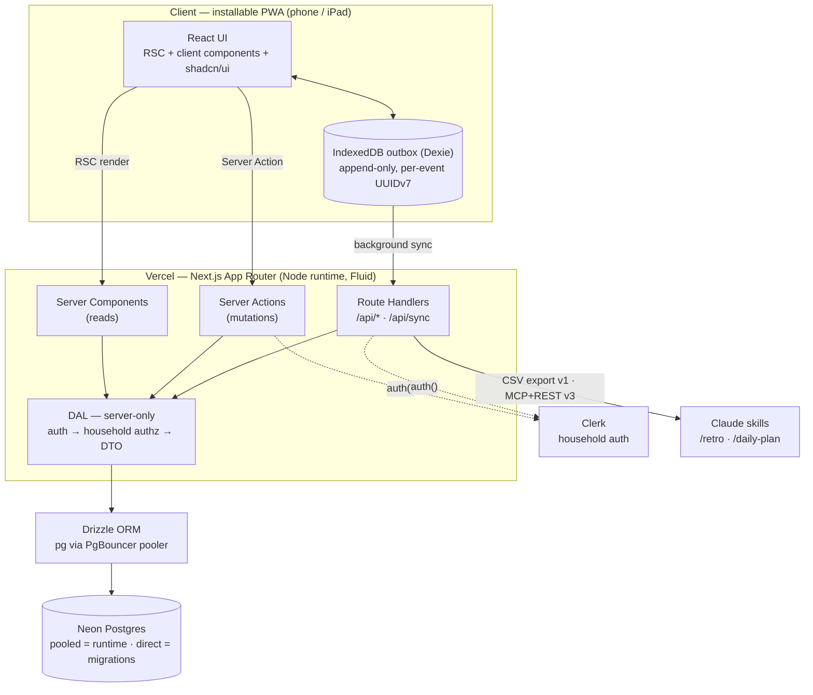
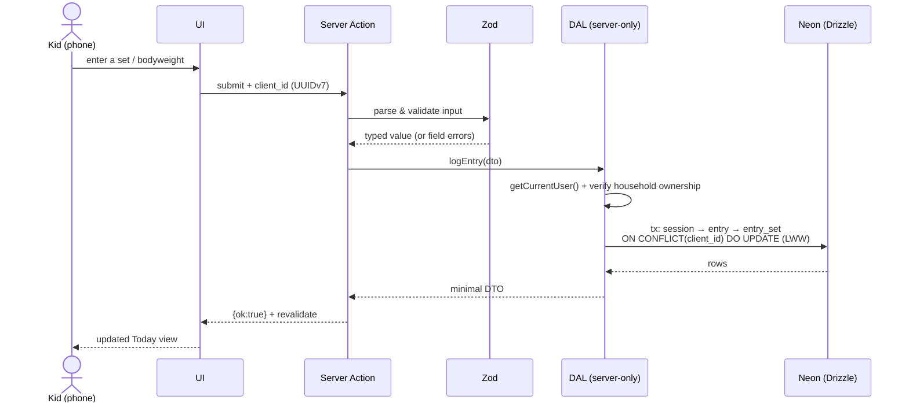
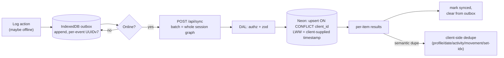
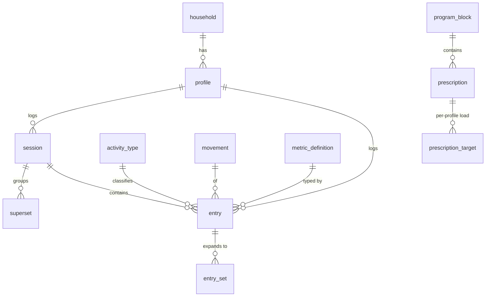
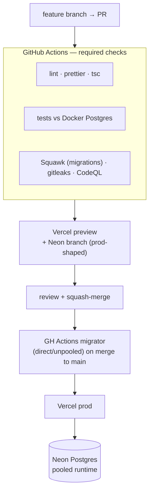
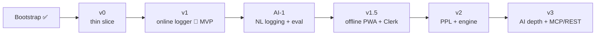

# mat-plan — Architecture Diagrams

Visual overview of the **designed** system (app not built yet). Detail in [spec.md](./spec.md);
roadmap in [plan.md](./plan.md). Diagrams render on GitHub (Mermaid).

## 1. System architecture (containers)

## 2. Write path — logging one entry

## 3. Offline outbox → sync

## 4. Data model (core — full ERD in spec.md §4a)

## 5. Deploy & CI topology

## 6. Roadmap to MVP and beyond

