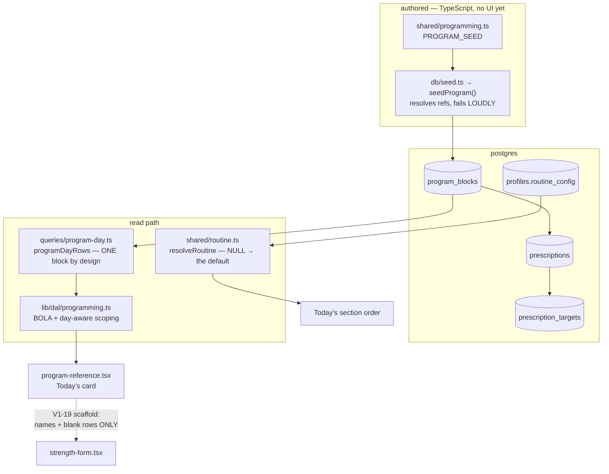

# Programming

**Read this before changing what the coach authors, or what Today shows an athlete.**

## What this is

The **plan**: which movements an athlete is meant to do on a given day, in what order, at what
prescribed sets/reps/load. Distinct from the **log**, which is what actually happened
([strength-logging](./strength-logging.md)).

Two independent axes that are easy to confuse, and confusing them has already cost a session:

- **Program** — `program_blocks → prescriptions → prescription_targets`. A coach-authored block of
  work with per-athlete loads. Currently **seed-only**; there is no write path in `apps/web` at all,
  so changing a load means editing TypeScript and deploying. V1-22 is the editor.
- **Routine** — `profiles.routine_config`, a per-kid ordered list of activity keys (rice bucket, then
  strength, then a habit). This is the shape of a **day**, not a block of strength work. V1-18
  shipped its editor.

They **co-exist permanently**. Ray runs a daily A/B program _and_ a weekday S&C block at once.

## The map

## Files

| File                         | What it is for                                                                                  |
| ---------------------------- | ----------------------------------------------------------------------------------------------- |
| `shared/programming.ts`      | `PROGRAM_SEED` — the authored program as data, and its types. The only author of prescriptions. |
| `shared/routine.ts`          | `RoutineConfig` + `resolveRoutine`. Every read zod-parses — the JSONB value is untrusted.       |
| `queries/program-day.ts`     | `programDayRows`, shared so the DAL and `db:verify` run the identical query.                    |
| `lib/programming/`           | App-side contract + day tests.                                                                  |
| `lib/dal/programming.ts`     | Ownership scoping and the DTO.                                                                  |
| `program-reference.tsx`      | Today's "here's your day" card.                                                                 |
| `app/p/[profileId]/routine/` | The V1-18 routine editor.                                                                       |

## Invariants

1. **The plan is never a performed value.** A prescription's load is the coach's _cue_, and it must
   not cross into the log as a logged number. V1-19's scaffold carries movement names and blank set
   rows **only** — `ScaffoldRow` has no `load` field, so the type enforces it. This is the product's
   one inviolable rule wearing a data-model hat.

2. **`prescriptions.target_reps` and `prescription_targets.load` are verbatim TEXT, deliberately.**
   They hold `AMRAP`, `~145-150`, `3 (top triple, then 2 back-offs)`. GAP-3 typed the **log**, not the
   plan — see [ADR 0004 §2](../decisions/0004-typed-measurements.md). Do not "fix" them into numbers.

3. **`programDayRows` returns ONE block by design.** It is not a bug that a second block does not
   appear. Anything wanting multiple concurrent programs is SCHED-1, a different model.

4. **Every read is scoped by profile `public_id` and filters soft-deleted rows at every level** —
   block, prescription, target, movement. `db:verify` proves each one independently.

5. **`routine_config` NULL means "the default routine", not "no routine".** It ships dark: a profile
   with no config renders the default order, which is how V1-18 landed without a backfill.

6. **The seed resolves references and fails loudly, writing nothing on an unresolved ref.** A silent
   partial program is worse than a red deploy — `db:verify` pins this.

7. **JSONB is a knowing exception here.** `routine_config` is the one place this repo stores structured
   data in JSONB, because nothing queries _into_ it. It has a promotion trigger in
   [tech-debt.md](../tech-debt.md). Do not add a second without that conversation.

## Traps

- **"B is purely additive" is wrong.** `programDayRows` returns one block by design; an A/B program and
  a weekday S&C block do not merge into one card. Cost a session to rediscover.

- **Block _creation_ is hard-disabled in V1-22 scope A.** The day's block resolves by `id DESC LIMIT 1`,
  so creating one would silently hijack every athlete's Today card.

- **`.$type<RoutineConfig>()` is a compile-time cast only.** The stored JSONB is untrusted input; every
  read must `resolveRoutine` (which zod-parses). Treating the cast as validation is a hole.

- **V1-22 widened by GAP-3.** A movement's **load-slot set** (`vest`/`ankle`/`wrist`) is something a
  coach declares, and that authoring surface lands here — it is what keeps the child table invisible on
  a 360px log row, and what makes "no vest row" mean "no vest" rather than "not logged".

## Changing it

| If you are…                      | Start here                                                                    |
| -------------------------------- | ----------------------------------------------------------------------------- |
| changing the authored program    | `shared/programming.ts` `PROGRAM_SEED`, then re-run the seed (idempotent)     |
| changing what Today shows        | `queries/program-day.ts` → `lib/dal/programming.ts` → `program-reference.tsx` |
| changing the day's section order | `shared/routine.ts` — and remember NULL is meaningful                         |
| adding a write path              | V1-22. Both panels required; these are the first config-mutating endpoints.   |

Then `pnpm verify` — the programming proofs in `db:verify` are extensive and will catch a scoping
regression that tests will not.

## Background

- [plan.md](../plan.md) rows V1-10, V1-18, V1-19, V1-22, SCHED-1
- [V1-22 plan](../plans/v1-22-program-editor.md) — panelled, scope A/B split
- [ADR 0002](../decisions/) — `ramp_target` is a coach-authored calendar, not a progression engine
