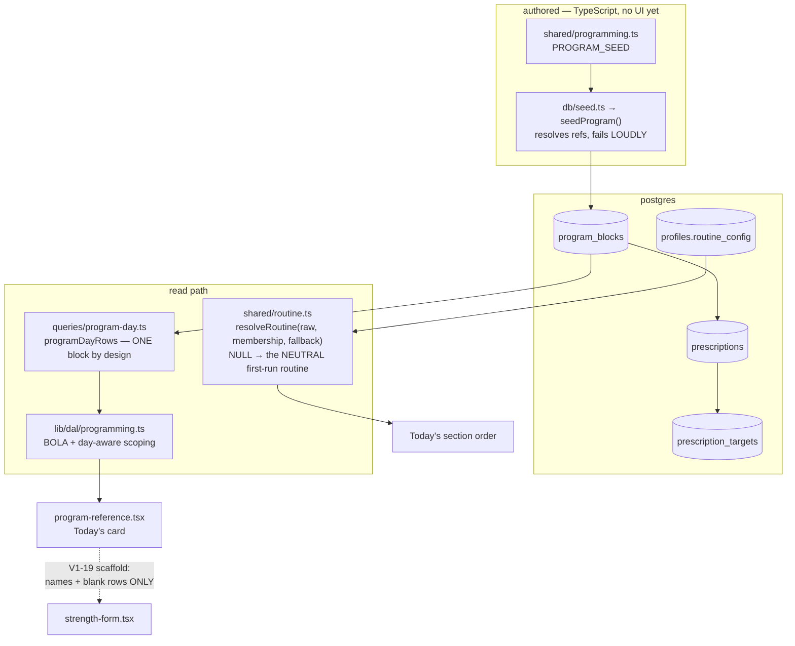

# Programming

**Read this before changing what the coach authors, or what Today shows an athlete.**

## What this is

The **plan**: which movements an athlete is meant to do on a given day, in what order, at what
prescribed sets/reps/load. Distinct from the **log**, which is what actually happened
([strength-logging](./strength-logging.md)).

Two independent axes that are easy to confuse, and confusing them has already cost a session:

- **Program** — `program_blocks → prescriptions → prescription_targets`. A coach-authored block of
  work with per-athlete loads. Currently **seed-only**; there is no write path in `apps/web` at all,
  so changing a load means editing TypeScript and deploying. V1-22 is the editor.
- **Routine** — `profiles.routine_config`, a per-kid ordered list of activity keys (rice bucket, then
  strength, then a habit). This is the shape of a **day**, not a block of strength work. V1-18
  shipped its editor.

They **co-exist permanently**. Ray runs a daily A/B program _and_ a weekday S&C block at once.

## The map

## Files

| File                         | What it is for                                                                                                                                                             |
| ---------------------------- | -------------------------------------------------------------------------------------------------------------------------------------------------------------------------- |
| `shared/programming.ts`      | `PROGRAM_SEED` — the authored program as data, and its types. The only author of prescriptions.                                                                            |
| `shared/routine.ts`          | `RoutineConfig` + `resolveRoutine`. Every read zod-parses — the JSONB value is untrusted.                                                                                  |
| `apps/web/lib/routine/`      | `ROUTINE_CATALOG` (membership + order), `NEUTRAL_DEFAULT_KEYS` (first-run), `resolveProfileRoutine` (the one pairing).                                                     |
| `queries/program-day.ts`     | `programDayRows`, shared so the DAL and `db:verify` run the identical query. Also feeds V1-13's `prescribed` column.                                                       |
| `lib/programming/`           | App-side contract + day tests.                                                                                                                                             |
| `lib/dal/programming.ts`     | Ownership scoping and the DTO.                                                                                                                                             |
| `program-reference.tsx`      | Today's "here's your day" card — a collapsible native `
` (V1-23 PR 3).                                                                                       |
| `app/p/[profileId]/routine/` | The V1-18 routine editor. **Linked from Today since V1-23** (below the logged entries) — it was URL-only before. Its own docstring claimed otherwise until ONB-0 fixed it. |

## Invariants

1. **The plan is never a performed value.** A prescription's load is the coach's _cue_, and it must
   not cross into the log as a logged number. V1-19's scaffold carries movement names and blank set
   rows **only** — `ScaffoldRow` has no `load` field, so the type enforces it. This is the product's
   one inviolable rule wearing a data-model hat.

1b. **Today's card collapses natively, and its `<h3 id=…>` MUST stay inside the `
`.** V1-23
PR 3 made the card a `
`. The wrapping `<section>` is labelled by that heading's id, so a
heading moved into the collapsible body is **gone from the accessibility tree when the card is closed** —
`aria-labelledby` dangles, axe raises `aria-valid-attr-value`, and `apps/web/e2e/a11y.spec.ts` (which now
scans the card in **both** states) **fails the build**. Two more things not to re-litigate:

- **Native, not React state, deliberately.** The rejected alternative was passing the card as `children`
  into `StrengthForm`; that form remounts on `key={gen}` after every logged session, so a state-based
  collapse would **re-expand on every log** — the exact complaint V1-23 exists to fix. `
` keeps
  the card a Server Component, ships zero client JS, and the athlete's collapse survives a log.
- ⚠️ **The "NOT a native `
`" note on the form's collapsed MOVEMENT cards does not generalise.**
  Its reason is `required`-INPUT-specific (a hidden-but-present `required` input deadlocks the native
  submit with an invisible error). This card has **no form controls at all**, and sits outside the
  `<form>` — so a `
` cannot submit either (a `<button>` trigger would need `type="button"`).

2. **`prescriptions.target_reps` and `prescription_targets.load` are verbatim TEXT, deliberately.**
   They hold `AMRAP`, `~145-150`, `3 (top triple, then 2 back-offs)`. GAP-3 typed the **log**, not the
   plan — see [ADR 0004 §2](../decisions/0004-typed-measurements.md). Do not "fix" them into numbers.

3. **`programDayRows` returns ONE block by design.** It is not a bug that a second block does not
   appear. Anything wanting multiple concurrent programs is SCHED-1, a different model.

   ⚠️ **This is why only ONE block is seeded.** Since 2026-09-24 that is the **Youth Daily Program**
   — the A/B rotation the kids actually run. The Kids S&C Foundation block it replaced is archived
   verbatim at [docs/programs/kids-sc-foundation-archived.md](../programs/kids-sc-foundation-archived.md)
   and can be re-seeded when it returns. Seeding both would silently hijack one card with the other,
   because the newest block per day-role wins.

3b. **The day letter comes from the CALENDAR, and that is a decision.** `resolveDayRole` is
epoch-day parity — every calendar day is A or B, alternating, with no rest day. Date parity, not
a weekday map: seven is odd, so a weekday map repeats a letter across every Sat→Sun boundary.

The program spec says the letter must come from the count of COMPLETED SESSIONS and warns that a
calendar-derived letter doubles up box jumps after a missed day. **Ray accepted that deliberately**
— the motivation model is streak and consistency. **Do not "fix" it without asking**; session
indexing is YDP-1, blocked on SCHED-1. The tests pin the decision, so a "fix" turns them red.

3c. **`strength_a`/`strength_b` are REUSED as Day A / Day B** — temporary. Proper `ydp_a`/`ydp_b`
roles need a migration altering two `day_role` CHECKs; reusing them is what let the athletes log
the same evening instead of on paper.

3d. **The day letter appears TWICE on Today, and the two are different things.** Since V1-23 the date
line reads `Today · Fri, Sep 26 · Strength B` — that badge is **derived** page metadata, straight off
`resolveDayRole`, and nobody asserts it. The `dayRole` **select** in `strength-form.tsx` is the
athlete's **assertion**, the one that gets stored on the session (GAP-1 P0-1), and it stays where it
is: after every movement card, immediately before submit. **Do not "deduplicate" them by moving the
select into the header** — three V1-23 panels rejected exactly that. What makes the assertion real is
the select's **position** (unavoidable on the way to "Log strength"), not its visibility; pre-filled
in the header it is functionally the hidden input the P0-1 note forbids. `DAY_ROLE_LABELS` is the
single label source for both, so the badge also inherits 3c's "Strength B" wording for Day B.

3e. **`resolveDayRole` is TOTAL** — `(day: string) => DayRole`, never null, because the YDP has no rest
day. Guards of the form `dayRole ? … : []` are dead code left over from the Mon/Wed/Fri map; V1-23
removed the one in Today's `Promise.all`. Do not add new ones, and do not read a `null` branch as
evidence that an unprogrammed day exists.

4. **Every read is scoped by profile `public_id` and filters soft-deleted rows at every level** —
   block, prescription, target, movement. `db:verify` proves each one independently.

4b. **`programDayRows` is HOUSEHOLD-scoped since TEN-1 1c, and that is a strengthening, not a
refactor.** `isThisProfile` is now the single-sourced `isLiveProfile(publicId, scope)` from
`packages/db/src/writers/ownership.ts`, with a **required** `scope` on the query — so an unconverted
caller is a compile error, and both sub-selects (the household hop and the per-kid target scope) pick
up the household conjunct together, which invariant 4's "one named predicate" rule already demanded.

What changed is the _claim_, not the shape. The pre-TEN-1 chain authorized the **block** against the
**profile's own** `household_id`; nothing checked that the **requester** belonged to that household,
because there was no requester. Now the requester's household is asserted independently and the two
must agree — so a profile whose `household_id` were ever repointed (a household transfer, a
correction, an ONB-2 bug) can no longer read the new household's program unchecked. `lib/dal/programming.ts`
resolves the scope with `getHouseholdScope()` and returns `[]` on a null one, so the page signature
and the no-card-rendered behaviour are unchanged.

Two things not to tidy:

- **The `profiles` join inside the block subquery is now redundant — leave it.** Removing a join from
  a BOLA-load-bearing subquery for neatness is risk with no payoff.
- **The "a NULL `household_id` matches no block" note is unreachable** (`profiles_household_id_not_null`
  is a validated CHECK), and it still stays. Do **not** conclude from the nullable drizzle type that an
  orphan profile can exist and add an `OR household_id IS NULL` escape — that would be a hole in the one
  predicate the seam exists to create.

⚠️ **The V1-10 BOLA probes ask from each household's OWN scope on purpose.** They test day_role
disjointness and block selection; asking from the wrong scope would make them pass for a second reason
and stop proving their own messages. The scope's own four-way proof is the TEN-1 matrix at the end of
`verify.ts`, which seeds a day_role **both** households program — so a refusal there cannot be mistaken
for an unprogrammed day.

5. **`routine_config` NULL means "the NEUTRAL FIRST-RUN routine", not "no routine" and not "everything".**
   It ships dark: a profile with no config renders a fallback order, which is how V1-18 landed without a
   backfill. **ONB-0 split what used to be one list into two, and the split is the invariant:**

   - **Membership** is `ROUTINE_CATALOG` — every key a stored config may legally name. It **never
     narrows.** Narrowing it would silently strip an authored item (a household's `brush_teeth` fields)
     on the next read, which is a data-visible regression rather than a fix.
   - **The fallback** is `NEUTRAL_DEFAULT_KEYS` = `['strength']`, which with the pinned weigh-in is
     "weigh-in + strength only". Before ONB-0 the fallback _was_ the membership set, so a brand-new
     household inherited the entire catalog — ~17 controls belonging to the maintainer's household,
     including seven wrestling-drill metrics grouped under the label "Brush teeth".
   - They are paired in **exactly one place**: `resolveProfileRoutine` in `apps/web/lib/routine/catalog.ts`,
     which is also the only module in `apps/web` that imports `resolveRoutine`. `resolveRoutine`'s third
     parameter is _defaulted_ to the membership set, so a two-arg call still means "inherit the whole
     catalog" — which is correct on the **write** side (`validateRoutineForWrite` pairs membership alone;
     a default is meaningless when authoring) and wrong on the read side, hence the wrapper.
   - **The neutral default is NEVER WRITTEN.** `routine_config = NULL` _is_ its representation, so a
     profile creator leaves it NULL. ⚠️ If PROF-1 / TEN-1 / ONB-2 ever needs to WRITE a starter routine
     from `packages/db`, `NEUTRAL_DEFAULT_KEYS` and the two registries it derives from have to move to
     `packages/shared` first — `packages/db` cannot import `apps/web`. The counter-precedent that makes
     this easy to break by accident is `SEED_FULL_ROUTINE` / `SEED_ATHLETE_TWO_ROUTINE`, which are routine
     literals living in `packages/db/src/seed.ts`.

6. **The seed resolves references and fails loudly, writing nothing on an unresolved ref.** A silent
   partial program is worse than a red deploy — `db:verify` pins this.

7. **JSONB is a knowing exception here.** `routine_config` is the one place this repo stores structured
   data in JSONB, because nothing queries _into_ it. It has a promotion trigger in
   [tech-debt.md](../tech-debt.md). Do not add a second without that conversation.

## Traps

- **"B is purely additive" is wrong.** `programDayRows` returns one block by design; an A/B program and
  a weekday S&C block do not merge into one card. Cost a session to rediscover.

- **Block _creation_ is hard-disabled in V1-22 scope A.** The day's block resolves by `id DESC LIMIT 1`,
  so creating one would silently hijack every athlete's Today card.

- **`.$type<RoutineConfig>()` is a compile-time cast only.** The stored JSONB is untrusted input; every
  read must `resolveRoutine` (which zod-parses). Treating the cast as validation is a hole.

- **`programDayRows` selects BOTH `movements.name` and `movements.slug`.** The Today card renders the
  name; the CSV export keys `prescribed` back to a logged movement by the **slug** (V1-13b), because
  `name` is a display string — `"Front Squat"` — and would never match. Both come from one query so
  neither side converts.

- **`programDayRows` also carries the MOVEMENT's declaration — and that is not the coach's
  prescription (V1-26 PR-A).** `movementIsBodyweight` / `movementUnitDefault` come off the
  already-joined `movements` row and ride `ProgramDayDTO` → `ScaffoldRow` → the log form's Unit select.

  ⚠️ **The line this query must never cross is `prescription_targets.load`.** The declaration says what
  KIND of number a movement is measured in; the prescription says WHICH number this athlete should
  lift. `ScaffoldRow` has no `load` field at all, so "no authored load reaches an input" — AGENTS.md's
  one inviolable product rule — is enforced by the **type**, not by care. `page.tsx` narrows
  `ProgramDayDTO` at the boundary for the same reason. Widening either is a product decision, not a
  plumbing one.

- **V1-13's `prescribed` reads TODAY's program, not the program as it was.** There is no
  `entries.prescription_id` (GAP-1 P1-2 unbuilt), so the export matches back by `(day_role, movement)`
  — a key `schema.ts` documents as **non-unique** ("a movement may legitimately appear twice in a day
  — warm-up + working"). An ambiguous match emits **empty**, never an arbitrary pick. ⚠️ **V1-22
  breaks this**: an edited load would retroactively rewrite exported history.

- **V1-22 widened by GAP-3.** A movement's **load-slot set** (`vest`/`ankle`/`wrist`) is something a
  coach declares, and that authoring surface lands here — it is what keeps the child table invisible on
  a 360px log row, and what makes "no vest row" mean "no vest" rather than "not logged".

- **The routine editor's "Routine saved." is a snapshot, not a flag.** It records the saved payload on
  the render where the action turns `ok` (`useOnActionSuccess`, shared with the log forms since V1-24
  PR 1b), and shows only while the current order still equals it, so an un-submitted edit can never
  read as persisted. Don't replace it with an effect or a boolean.
- **Every gated page calls `requireGatedPage()` first** (SEC-1), the routine editor included: the
  proxy is not the auth boundary, and before SEC-1 a prefetch-flagged request skipped it. A new page
  under `/p/` needs the same line — `app/pages-are-gated.test.ts` fails CI without it. The only
  exemptions are `isUngatedPath`'s: the public landing (`PUBLIC_PATHS`) and `/gate`.

- **Fixture athletes are role-named, and the name is a const.** `SEED_PROFILE_NAME` /
  `SEED_PROFILE_2_NAME` (`packages/shared/src/seed-ids.ts`) hold `Athlete One` / `Athlete Two`. Never
  re-type the literal and never put a real first name in a fixture, a comment or a test — this repo is
  public and holds minors' data (AGENTS.md → "No personal names"; `OSS-1`). `db:verify` pins the
  literal **once**, on the assertion side, so a real name cannot come back unnoticed. Prose about a
  real logged incident says "an athlete", not a fixture name — the fixture is not the child.

## Changing it

| If you are…                      | Start here                                                                    |
| -------------------------------- | ----------------------------------------------------------------------------- |
| changing the authored program    | `shared/programming.ts` `PROGRAM_SEED`, then re-run the seed (idempotent)     |
| changing what Today shows        | `queries/program-day.ts` → `lib/dal/programming.ts` → `program-reference.tsx` |
| changing the day's section order | `shared/routine.ts` — and remember NULL is meaningful                         |
| adding a write path              | V1-22. Both panels required; these are the first config-mutating endpoints.   |

Then `pnpm verify` — the programming proofs in `db:verify` are extensive and will catch a scoping
regression that tests will not.

## Background

- [plan.md](../plan.md) rows V1-10, V1-18, V1-19, V1-22, SCHED-1
- [V1-22 plan](../plans/v1-22-program-editor.md) — panelled, scope A/B split
- [ADR 0002](../decisions/) — `ramp_target` is a coach-authored calendar, not a progression engine
- [ADR 0005](../decisions/0005-programming-model.md) — workouts become data; the prescription is
  snapshotted on the logged record, not versioned
- **[ADR 0007](../decisions/0007-scheduling-model.md) — the scheduling model.** Read it before touching
  invariants 3, 3b or 3c: it decides that the one-block-by-design rule (invariant 3) becomes conditional
  on an assignment row, that invariant 3b's calendar anchor moves into data **without** changing to
  session-indexing, and that invariant 3c's "temporary" `strength_a`/`strength_b` reuse resolves by
  **naming** (they become the authored workouts' slugs) rather than by a CHECK migration. Nothing in it
  has shipped — it is a decision, and `SCHED-1` implements it.
