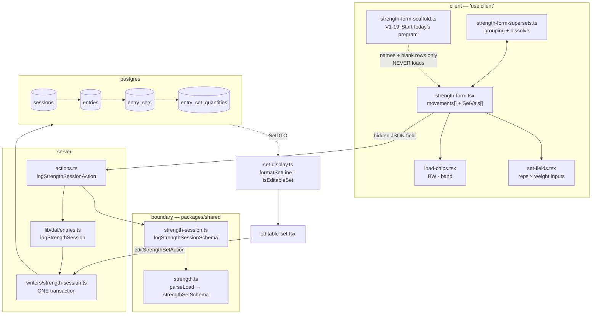

# Strength logging

**Read this before changing the log form, the set schema, or the strength writer.**

## What this is

A kid on a gym floor logs a strength session: some movements, each with some sets, each set a number
of reps against some kind of load. It is the app's most-used write path and its most-constrained UI —
one hand, a phone at 360px, sometimes an eight-year-old.

"Some kind of load" is the whole difficulty. A load is not always a number: it can be bodyweight, a
band, a box height, a hold duration, or bodyweight **plus** a weighted vest.

## The map

## Files

| File                          | What it is for                                                                                         |
| ----------------------------- | ------------------------------------------------------------------------------------------------------ |
| `strength-form.tsx`           | The whole client form: movement cards, set rows, collapse state, the untouched-card logic. ~660 lines. |
| `strength-form-scaffold.ts`   | V1-19. Turns today's program into blank cards. **Structure only — never a load or a rep count.**       |
| `strength-form-supersets.ts`  | Superset grouping, and `dissolveSmallSupersets` when a group drops below 2 members.                    |
| `set-fields.tsx`              | The shared `reps × weight` input pair — used by BOTH the log form and the V1-9 edit form.              |
| `load-chips.tsx`              | One-tap `BW` / `band`. Exists because iOS's numeric keypad has no letters.                             |
| `set-display.ts`              | `formatSetLine` (the read line) and `isEditableSet` (whether V1-9's inline edit is offered).           |
| `editable-set.tsx`            | The V1-9 fix-a-set row.                                                                                |
| `shared/strength.ts`          | `parseLoad` + `strengthSetSchema` — one wire key becomes a typed load.                                 |
| `shared/strength-session.ts`  | The session envelope: movements, supersets, client ids, the pairing refines.                           |
| `shared/quantity-slots.ts`    | The measurement-role vocabulary (`primary`/`vest`/`ankle`/`wrist`/`distance`) + legal dimensions.      |
| `writers/strength-session.ts` | The only writer. One transaction, per-row `ON CONFLICT` at every level, plus `updateStrengthSetById`.  |

## Invariants

These hold **across** files and are invisible from any single one. Breaking one is how this feature
regresses.

1. **The LLM never authors a load.** AGENTS.md's one inviolable product rule. The scaffold carries
   `ScaffoldRow` with no `load` field at all, so "the authored load never crosses into client state"
   is enforced by the **type**, not by care. Do not add one.

2. **A set must carry a load, and blank is unrepresentable.** `parseLoad`'s blank check is the FIRST
   branch, deliberately: a set with reps and no load renders `5 × ?` and `isEditableSet` then refuses
   to fix it — permanently unrecoverable, because **there is no delete action in this app.**

3. **`isEditableSet` and `updateStrengthSetById`'s WHERE must stay identical.** The client half is
   advisory; the SQL half is the boundary. They are two expressions of one predicate in two languages,
   and the docblocks on both say so. Change one, change the other.

4. **Every magnitude lives in `entry_set_quantities`, never on the set.** Since GAP-3 (#139) there is
   no `weight_num`, no `weight_label`, no `seconds`. The two MODES (`is_bodyweight`, `is_band`) are
   booleans on the set because neither is a quantity.

5. **A quantity's unit is guarded by TWO composite FKs sharing its `dimension` column.** `lb` in a
   box-jump height is rejected by the database. The writer must therefore derive `dimension` from the
   unit it is actually writing — the movement's unit for the primary, the row's own for anything else.

6. **Idempotency is per-row `ON CONFLICT` at every level, with no parent short-circuit.** A crash
   after the session commit would otherwise orphan it. A replay dedupes row by row; a replay that adds
   a new movement attaches it to the re-selected session.

7. **The profile is resolved by `public_id` INSIDE the transaction.** Never a raw internal id from the
   request. That is the BOLA seam.

8. **Absent ≠ default on the wire.** `status` is `.optional()`, never `.default('done')` — an omitted
   status means the writer omits the column and Postgres applies its own default. One default, in one
   place. Adding `.default()` anywhere here forks it and changes every stored row.

## Traps

Real ones, each with the file to look at.

- **A hidden-but-present `required` input makes the form silently dead.** Native validation blocks
  submit with a "not focusable" error you cannot see. `strength-form.tsx` documents this twice, at the
  collapse branch and the Skipped branch, at a scale of 25 rows. Any `required` field that can be
  legitimately empty is this bug.

- **"Untouched" is computed from `reps` and `weight` only.** `strength-form-supersets.ts` and
  `strength-form-scaffold.ts` both drop a card whose sets are all blank — silently, with no error. Add
  a new set-level field and a set that carries ONLY that field is deleted at submit. Both predicates
  must learn about it.

- **The row already wraps at 360px.** Usable width is ~294px (`main px-4` + `fieldset px-4`); line 1
  is ~260px. The card splits into two **explicit** lines rather than trusting flex-wrap, and the
  second line is already over budget and wrapping. Do the arithmetic against real classNames before
  adding a control — `text-base` is load-bearing (smaller triggers iOS zoom-on-focus), so there is no
  free shrink.

- **The a11y CI gate is narrower than it looks.** It runs at **390px, not 360**; it measures tap-target
  **height only**, not width; it **skips invisible controls**, so anything behind a disclosure passes
  vacuously; and nothing asserts horizontal overflow. A new collapsed UI can be fully broken and green.

- **`packages/**` is typechecked by nothing.** `pnpm typecheck` is `--filter web`. A stale reference in
  `writers/` or `verify.ts` surfaces only as a runtime crash in `db:verify`. Run `pnpm verify`.

- **Server Actions are public POSTs.** Page auth does not protect one. Re-validate every field at the
  boundary; a DB constraint reached by a crafted body is a 500 that discards the athlete's whole
  session, because the action has no `try/catch` around the writer.

## Changing it

| If you are…                 | Start here                                                                                  |
| --------------------------- | ------------------------------------------------------------------------------------------- |
| adding a field to a set     | `SetVals` in `strength-form.tsx` → both untouched-predicates → `strengthSetSchema` → writer |
| changing what a load can be | `shared/strength.ts`, then `set-display.ts` (BOTH functions), then the writer               |
| changing the read line      | `set-display.ts` only — it is single-sourced so the read and edit views cannot disagree     |
| adding a measurement role   | `shared/quantity-slots.ts` (const + dimensions) → seed → `db:verify` parity proof           |
| touching the edit path      | `isEditableSet` **and** `updateStrengthSetById` together, always                            |

Then: `pnpm verify` (includes `db:verify` on PGlite, no Docker) and `pnpm e2e:local`. A UI change also
needs screenshots at mobile/tablet/desktop and a UX panel — see AGENTS.md → "UI PR rules".

## Background

- [GAP-3 census + design](../plans/gap3-typed-measurements.md) — why the free-text load died
- [GAP-3 PR 3](../plans/gap3-pr3-entry-set-quantities.md) — the typed model (#139)
- [ADR 0004](../decisions/0004-typed-measurements.md) — superseded in part; read the banner
- [lessons.md](../lessons.md) — before debugging anything
