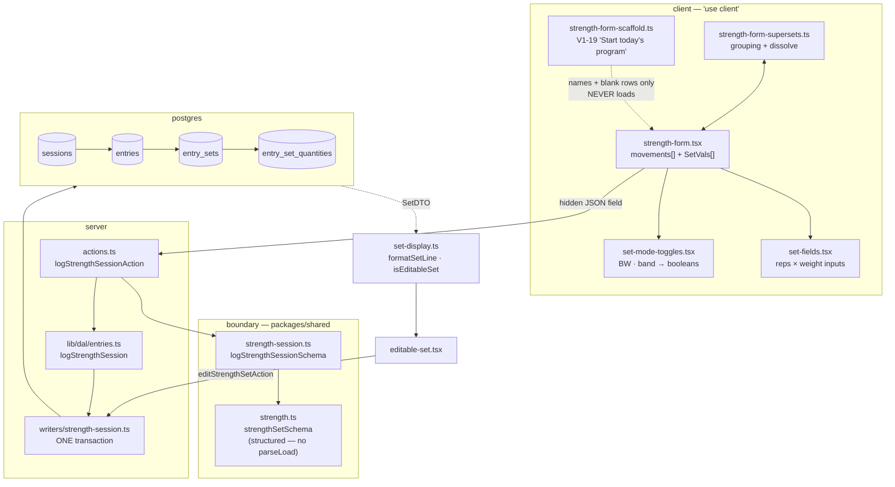

# Strength logging

**Read this before changing the log form, the set schema, or the strength writer.**

## What this is

A kid on a gym floor logs a strength session: some movements, each with some sets, each set a number
of reps against some kind of load. It is the app's most-used write path and its most-constrained UI —
one hand, a phone at 360px, sometimes an eight-year-old.

"Some kind of load" is the whole difficulty. A load is not always a number: it can be bodyweight, a
band, a box height, a hold duration, or bodyweight **plus** a weighted vest.

## The map

## Files

| File                          | What it is for                                                                                                                 |
| ----------------------------- | ------------------------------------------------------------------------------------------------------------------------------ |
| `strength-form.tsx`           | The whole client form: movement cards, set rows, collapse state, the summary line. ~800 lines.                                 |
| `strength-form-scaffold.ts`   | V1-19. Turns today's program into blank cards. **Structure only — never a load or a rep count.**                               |
| `strength-form-supersets.ts`  | Superset grouping, and `dissolveSmallSupersets` when a group drops below 2 members.                                            |
| `strength-form-untouched.ts`  | V1-27. The ONE "touched" judgement and all it drives: card and trailing-set drops, each input's `required`, `isSubmitBlocked`. |
| `set-fields.tsx`              | The shared `reps × weight` input pair — used by BOTH the log form and the V1-9 edit form.                                      |
| `load-chips.tsx`              | One-tap `BW` / `band`. Exists because iOS's numeric keypad has no letters.                                                     |
| `set-display.ts`              | `formatSetLine` (the read line) and `isEditableSet` (whether V1-9's inline edit is offered).                                   |
| `editable-set.tsx`            | The V1-9 fix-a-set row.                                                                                                        |
| `shared/strength.ts`          | `parseLoad` + `strengthSetSchema` — one wire key becomes a typed load.                                                         |
| `shared/strength-session.ts`  | The session envelope: movements, supersets, client ids, the pairing refines.                                                   |
| `shared/quantity-slots.ts`    | The measurement-role vocabulary (`primary`/`vest`/`ankle`/`wrist`/`distance`) + legal dimensions.                              |
| `writers/strength-session.ts` | The only writer. One transaction, per-row `ON CONFLICT` at every level, plus `updateStrengthSetById`.                          |

## Invariants

These hold **across** files and are invisible from any single one. Breaking one is how this feature
regresses.

1. **The LLM never authors a load.** AGENTS.md's one inviolable product rule. The scaffold carries
   `ScaffoldRow` with no `load` field at all, so "the authored load never crosses into client state"
   is enforced by the **type**, not by care. Do not add one.

   **Row COUNT is not an authored value.** `DEFAULT_SCAFFOLD_SETS` (V1-23 PR 1) makes a prescription
   with no `sets` scaffold three blank rows instead of one. That is form structure, the same category
   as the movement name the scaffold already places — every `reps`/`weight` in those rows is still
   empty, which is what the confirm-gate actually rests on. `strength-form-scaffold.test.ts` asserts
   blankness across the wider structure, including the null-`sets` shape, so widening it again cannot
   quietly smuggle a value in.

2. **A set must carry a load, and blank is unrepresentable.** Enforced by `strengthSetSchema`'s
   superRefine — `weight !== null || isBodyweight || isBand`. A set with reps and no load renders
   `5 × ?` and `isEditableSet` then refuses to fix it: permanently unrecoverable, because **there is
   no delete action in this app.** This was `parseLoad`'s first branch until PR 4a split the load
   across three fields, which removed the single-field invariant and made the rule explicit.

   **On a time or distance the rule is split across two files (V1-30)**, because a mode is not a load
   there: the set refine (`strength.ts`) rejects a BLANK set with no mode, and the session refine
   (`strength-session.ts`, check 6) rejects BW / band, where it can see the movement's unit. Each
   skips the other's case, which is what gives exactly one message per FAULT, each naming its set
   (a BW set with an out-of-range number has two faults and gets two messages). Moving the blank
   check into the session refine would double it (probed by the V1-30 panel).

   **Corollary: `required` on the weight input must be FALSE whenever a mode is toggled.** A
   `required` field that must be empty blocks the native submit with an invisible error — see Traps.

3. **`isEditableSet` and `updateStrengthSetById`'s WHERE must stay identical.** The client half is
   advisory; the SQL half is the boundary. They are two expressions of one predicate in two languages,
   and the docblocks on both say so. Change one, change the other.

4. **Every magnitude lives in `entry_set_quantities`, never on the set.** Since GAP-3 (#139) there is
   no `weight_num`, no `weight_label`, no `seconds`. The two MODES (`is_bodyweight`, `is_band`) are
   booleans on the set because neither is a quantity — and since PR 4a they can coexist with a
   magnitude, which is what makes `BW+8 (vest)` expressible.

4b. **The unit belongs to the MOVEMENT; its dimension is DERIVED from it.** There is no per-set unit
and no stored dimension on the movement — `UNIT_DIMENSION_BY_CODE[unit]` is the single source, so
the pair can never disagree with `units(code, dimension)`. The form asks "Measuring?" first and
then offers only `loggableUnitsOf(d)`, which makes a squat-logged-in-seconds **unlikely** (a
deliberate change of Measuring), not impossible. **The athlete picks the dimension; the catalog's
`unit_default` only seeds it**, and the server never checks one against the other (ADR 0004
addendum, V1-30). **Offerable ⊆ accepted ⊆ exportable** is enforced by the chain test in
`packages/shared/src/units.test.ts`, which runs the wired `sessionMovementSchema.shape.unit`
([V1-30 plan](../plans/v1-30-loggable-units.md)). On a non-mass movement BW / band are refused: they
are modes of a weight (see invariant 2 for where each half of that lives).

5. **A quantity's unit is guarded by TWO composite FKs sharing its `dimension` column.** `lb` in a
   box-jump height is rejected by the database. The writer must therefore derive `dimension` from the
   unit it is actually writing — the movement's unit for the primary, the row's own for anything else.

6. **Idempotency is per-row `ON CONFLICT` at every level, with no parent short-circuit.** A crash
   after the session commit would otherwise orphan it. A replay dedupes row by row; a replay that adds
   a new movement attaches it to the re-selected session.

7. **The profile is resolved by `public_id` INSIDE the transaction.** Never a raw internal id from the
   request. That is the BOLA seam.

8. **Absent ≠ default on the wire.** `status` is `.optional()`, never `.default('done')` — an omitted
   status means the writer omits the column and Postgres applies its own default. One default, in one
   place. Adding `.default()` anywhere here forks it and changes every stored row.

## Traps

Real ones, each with the file to look at.

- **⚠️ A BODYWEIGHT set cannot be corrected, by anyone, ever.** `isEditableSet` opens with
  `!set.isBodyweight` and `updateStrengthSetById`'s WHERE mirrors it — and there is **no delete action
  in the app**. So a mis-tapped BW is permanent data. Found by real use on 2026-09-28 (V1-24): Ray
  logged `20 × BW` KB swings that were `10 × 20 lb` and had no way back. The guard is correct in
  intent — a numeric edit would misrepresent a genuinely bodyweight set — but "refuse the edit" plus
  "no delete" adds up to "unrecoverable", which is not what either half intended.

- **~~The form does not read the movement's `isBodyweight` / `unitDefault`.~~** ✅ **Fixed, V1-26
  PR-A.** `programDayRows` now selects both, and they ride `ProgramDayDTO` → `ScaffoldRow` →
  `scaffoldMovements`. The declaration lands on the **Unit select**, and a BW tap on a
  catalog-declared-loaded movement raises a non-blocking note.

  **⚠️ It is carried on the UNIT, and NEVER as a pre-tapped BW chip — this is load-bearing.**
  `isUntouchedScaffold` requires `!s.isBodyweight`, so a scaffolded set seeded `isBodyweight: true` is
  permanently "touched", survives `dropUntouchedMovements`, and blocks submit behind a collapsed
  card whose `required` reps input is unmounted (the trap two bullets down, at a scale of 25 rows).
  Both review panels found this independently. A unit has none of that problem and is strictly better
  besides: it is **visible** in the select and the athlete can override it, where a pre-tapped chip is
  invisible state. `strength-form-scaffold.test.ts` pins "no set is ever pre-seeded `isBodyweight`"
  directly, and `e2e/scaffold-submit.spec.ts` asserts the submit itself in a real browser — jsdom
  never runs native constraint validation, so only the e2e can see this class of failure.

- **✅ Doing SOME of a movement's sets submits (V1-27, fixed).** It used to block: `reps` was
  unconditionally `required` and there was no per-**set** drop. Now the **trailing** untouched sets (the
  empty rows after the last touched set) are not `required` and are not sent — dropped at serialization,
  never in state. Only trailing rows, so every sent set's index still equals its on-screen number and the
  server's `set M` labels stay right. A gap, a half-entered set and a named all-blank card still block.
  The line above **Log strength** states what will be logged, from the post-drop payload — the real
  safeguard, because a forgotten last set is now logged short (Ray accepted that trade-off; see the
  [plan](../plans/v1-27-partial-sets.md)). Pinned in a real browser by `e2e/scaffold-submit.spec.ts`.

- **⚠️ `required` now depends on SIBLING rows (V1-27).** Whether set 2 is required depends on whether
  set 3 is touched: removing set 3 makes set 2 trailing and un-required. So the custom "Fill in this
  set, or tap Remove" message is set DECLARATIVELY from state (a `setCustomValidity` effect in
  `set-fields.tsx`), never by an `onInvalid` event — an event-set message lingers after the field stops
  being required, and the form appears dead. Only the log form passes `missingMessage`; the edit form
  has no Remove button.

- **⚠️ The summary's "needs finishing" state reads `isSubmitBlocked`, which is blind to two things.** It
  agrees with the browser on every blank required field (it reads the same `nameRequired` /
  `repsRequired` / `weightRequired` the inputs render from), but it cannot see a non-blank invalid value
  (reps `0` / `2.5` fail native step/min) or a `type=number` field holding partial input (`.` on the iOS
  decimal pad is `''` in React state and `badInput` to the browser). In both, the browser blocks with its
  own message while the line says "Logs…". A COLLAPSED gap card is not "needs finishing" either: its
  inputs are unmounted, so the tap sends and the server refuses it with a message naming the movement.

- **A renamed scaffolded card never collapses again (V1-27).** Renaming clears `scaffolded` (as it clears
  `declaredLoaded`), so the card counts as hand-added and named: it is never silently dropped, and it can
  never become an invisible block on a collapsed card. A rename that is then reverted stays hand-added —
  it errs toward blocking, and Remove clears it.

- **⚠️ Uncontrolled fields survive a DAY navigation — key on the day (V1-28).** V1-15 made day
  navigation a client-side RSC transition, so `StrengthFormBody` does not remount when only the day
  changes. It is keyed `` `${day}:${gen}` `` for exactly that reason; `gen` alone (a **submit**
  counter) left the day-role select reading the day the athlete had navigated AWAY from, and
  submitting it wrote a `day_role` nobody asserted — the one thing that column exists to guarantee.

  The general rule: **anything in this form using `defaultValue` / `defaultChecked` is only correct
  because of that key.** `checkin-form.tsx` solves the same problem the other way and says so —
  _"Checked state is CONTROLLED. `defaultChecked` is not reconciled after mount"_ — which is worth
  reading before adding an uncontrolled field here.

- **`formatSetLine`'s value+unit comes from the shared `formatValueUnit` (V1-24 PR 1a)** —
  `lib/entries/format-value-unit.ts`, also used by `entryLabel`, the bodyweight receipt and the e2e
  assertions. It takes a `Unit`, not a `string`, so a DTO whose unit is typed loosely fails to compile
  rather than rendering whatever it holds.
  ⚠️ **It is NOT `@mat-plan/shared/csv`'s `formatQuantity`, and the two must not be merged.** The CSV
  one emits a **bare** number for `lb`, `85kg` for `kg`, and `20s` for seconds, because those are
  contract bytes a downstream workflow diffs (and a bare number there means pounds). Using it here would drop the unit off every weight on
  screen; using the display one there would corrupt the export. A test pins the difference.

- **A time or distance set is not editable, and recovery means WRITING a correction (V1-30).** The edit
  guard is mass-only, in the form (`isEditableSet`) and in SQL (`updateStrengthSetById`), and
  invariant 3 keeps them identical. Before V1-30 no non-mass set could be saved, so this population is
  new. A typo (`300 sec`) needs a new entry in `packages/db/scripts/corrections/registry.ts`, since
  there is no generic "fix a set" correction. Making non-mass sets editable is its own backlog row.
  `db:verify` pins the refusal.

- **`EditableSet`'s collapse-on-success is the shared `useOnActionSuccess` hook (V1-24 PR 1b).** The
  during-render idiom — adjust state while rendering, so the editor never flashes open over its saved
  value — had **four** copies before this, one of which called itself _"the strength-form during-render
  idiom"_ in a comment. All four (and the bodyweight amend) use the hook now; `onSuccess` must still
  only touch the caller's OWN state.

- **`updateStrengthSetById`'s ownership subselect is `writers/ownership.ts`.** Same predicate as the
  bodyweight amend, extracted when the second caller arrived — which means V1-9's existing
  cross-profile `db:verify` proof now covers the shared helper too.

- **A hidden-but-present `required` input makes the form silently dead.** Native validation blocks
  submit with a "not focusable" error you cannot see. `strength-form.tsx` documents this twice, at the
  collapse branch and the Skipped branch, at a scale of 25 rows. Any `required` field that can be
  legitimately empty is this bug.

- **"Untouched" is computed in ONE place: `isUntouchedSet` (`strength-form-untouched.ts`, V1-27).** It
  used to be three copies (two card predicates and the collapsed counter), and they had drifted — the
  counter ignored sub-failure. Every drop, every `required`, the counter and the summary now derive
  from it. Add a set-level field without teaching `isUntouchedSet` and a set carrying ONLY that field is
  deleted at submit. PR 4a had to extend all three copies for the mode flags; now it would be one.

- **The set-row count has a DEFAULT and a FLOOR, and they are deliberately different numbers.**
  `clampSetCount` in `strength-form-scaffold.ts`: `sets == null` → `DEFAULT_SCAFFOLD_SETS` (3);
  `sets < 1` → **1**. The floor is the BUG-2(b) guard — a zero-row card is the vacuous-truth shape
  (`[].every(...)` is true) and fails the schema anyway — so collapsing the two branches back into one
  `?? 1` or `?? 3` breaks a different thing each way. Why 3 is the default: `PROGRAM_SEED` is `open()`
  on **11 of its 13** prescriptions, so one row per open movement cost ~10 "Add set" taps a session
  (~20% of the total) while the `filled/total` counter read `0/1 → 1/1` with two sets still to come —
  lying on the form's only "where am I" signal. See [V1-23's plan](../plans/v1-23-today-focused.md).

- **The row already wraps at 360px.** Usable width is ~294px (`main px-4` + `fieldset px-4`); line 1
  is ~260px. The card splits into two **explicit** lines rather than trusting flex-wrap, and the
  second line is already over budget and wrapping. Do the arithmetic against real classNames before
  adding a control — `text-base` is load-bearing (smaller triggers iOS zoom-on-focus), so there is no
  free shrink.

- **The a11y CI gate is narrower than it looks.** It measures tap-target **height only**, not width,
  and it **skips invisible controls**, so anything behind a disclosure passes vacuously. PR 4a closed
  two of the four gaps: there is now a **360px** case and a **horizontal-overflow** assertion (both
  proven to fail on a real regression before shipping). Width and the disclosure gap remain.

- **A visually-hidden (`sr-only`) checkbox cannot be driven by Playwright's `.check()`.** Its box is
  1px, so the actionability check fails. Click the **label** — which is what a person taps anyway, and
  what `targetOf` measures for the tap-target bar.

- **`packages/**` is typechecked by nothing.** `pnpm typecheck` is `--filter web`. A stale reference in
  `writers/` or `verify.ts` surfaces only as a runtime crash in `db:verify`. Run `pnpm verify`.

- **Server Actions are public POSTs.** Page auth does not protect one. Re-validate every field at the
  boundary; a DB constraint reached by a crafted body is a 500 that discards the athlete's whole
  session, because the action has no `try/catch` around the writer.

## Changing it

| If you are…                 | Start here                                                                                                        |
| --------------------------- | ----------------------------------------------------------------------------------------------------------------- |
| adding a field to a set     | `SetVals` in `strength-form.tsx` → `isUntouchedSet` (`strength-form-untouched.ts`) → `strengthSetSchema` → writer |
| changing what a load can be | `shared/strength.ts`, then `set-display.ts` (BOTH functions), then the writer                                     |
| changing the read line      | `set-display.ts` only — it is single-sourced so the read and edit views cannot disagree                           |
| adding a measurement role   | `shared/quantity-slots.ts` (const + dimensions) → seed → `db:verify` parity proof                                 |
| touching the edit path      | `isEditableSet` **and** `updateStrengthSetById` together, always                                                  |

Then: `pnpm verify` (includes `db:verify` on PGlite, no Docker) and `pnpm e2e:local`. A UI change also
needs screenshots at mobile/tablet/desktop and a UX panel — see AGENTS.md → "UI PR rules".

## Background

- [GAP-3 census + design](../plans/gap3-typed-measurements.md) — why the free-text load died
- [GAP-3 PR 3](../plans/gap3-pr3-entry-set-quantities.md) — the typed model (#139)
- [ADR 0004](../decisions/0004-typed-measurements.md) — superseded in part; read the banner
- [lessons.md](../lessons.md) — before debugging anything
