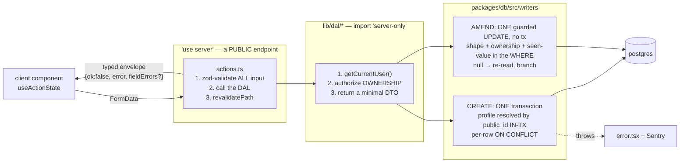

# The write path

**Read this before adding a Server Action, a DAL function, or anything that writes.**

## What this is

Every mutation in the app goes through the same three-layer seam: a thin Server Action validates, a
`server-only` DAL function authorizes and shapes, and a writer in `packages/db` performs the actual
SQL in one transaction. Reads that are batch or external go through Route Handlers instead.

The layering is not ceremony — it is what makes ownership checks testable and what keeps a crafted
POST from reaching the database.

## The map



## Files

| File / dir                     | What it is for                                                                                                                                                                                                       |
| ------------------------------ | -------------------------------------------------------------------------------------------------------------------------------------------------------------------------------------------------------------------- |
| `app/p/[profileId]/actions.ts` | Every Server Action. Thin by contract: validate → DAL → revalidate. Seven actions today.                                                                                                                             |
| `action-state.ts`              | The shared typed envelope + `INITIAL_ACTION_STATE` that `useActionState` starts from.                                                                                                                                |
| `lib/dal/`                     | All Drizzle access and all `process.env` reads. `import 'server-only'`. Returns DTOs, not rows.                                                                                                                      |
| `packages/db/src/writers/`     | The write cores — transactional creates, single guarded-UPDATE amends — shared so the DAL **and** `db:verify` prove the same guard.                                                                                  |
| `packages/db/src/client.ts`    | Pool + schema binding. Node runtime, Fluid `attachDatabasePool`, pooled string through PgBouncer. Also `withVerifiedTls` — upgrades a hosted `sslmode=require` to `verify-full`, leaves a no-TLS local string alone. |

## Invariants

1. **Every Server Action is a PUBLIC endpoint.** Page middleware does not protect it — it is a POST
   anyone can craft. Re-authenticate, re-authorize ownership, and zod-validate **inside** each one.
   Re-authenticating means `hasGateAccess()` (`lib/dal/gate.ts`) as the action's **first** line,
   returning the action's not-found copy. Until SEC-1 no action did, and requests carrying a prefetch
   header skipped the proxy, so every action was reachable without the gate cookie. A new action
   without it fails the unauth suite in `actions.test.ts` only if you add it to that suite: do.

2. **Ownership is proven by `public_id`, resolved inside the transaction.** Never trust an internal
   `bigint` id from a request. This is the BOLA/IDOR seam and it is why writers take
   `profilePublicId`, not `profileId`.

3. **The writer is shared with `db:verify`.** A guard that exists only in the DAL is a guard no proof
   covers. When a writer's WHERE encodes a rule, `packages/db/scripts/verify.ts` exercises the **same
   function** — cross-profile, wrong-shape, soft-deleted — against PGlite.

4. **Expected errors return a typed envelope; unexpected ones throw.** `{ok:false, error, fieldErrors?}`
   for anything a user can cause, surfaced through `useActionState`. Throwing for those would drop the
   athlete into `error.tsx` and lose the form. Conversely, never leak internals into the envelope.

5. **Idempotency is a client UUIDv7 + a DB UNIQUE + `ON CONFLICT`** — never an app-level "does it
   exist?" check, which races. Per-row at every level of a graph, with no parent short-circuit.

6. **A partial unique index needs its predicate repeated in `ON CONFLICT`.** Every `client_id` unique
   in this schema is `WHERE deleted_at IS NULL`, so the arbiter must say so too or Postgres rejects the
   statement outright. drizzle: `onConflictDoUpdate({ target, targetWhere })`.
   ⚠️ **Bodyweight's CREATE is the exception: target-less `ON CONFLICT DO NOTHING` (V1-24 PR 1e).**
   It has two uniques, `uq_entries_client_id` and 1d's natural key `uq_entries_profile_day_bodyweight`
   (one live weigh-in per `(profile, day, coalesce(context, 'morning'))`, an EXPRESSION drizzle's
   `target` cannot name). `insertBodyweightEntry` (`packages/db/src/writers/bodyweight.ts`) uses NO
   target, so every unique index is an arbiter: there is no spec to mis-infer, and a concurrent re-POST
   waits and does nothing instead of raising `23505`. It pays the three costs explicitly, and a change
   to it must keep paying them:
   - **(a) `RETURNING` is empty on any conflict** → it re-selects; it never assumes a row.
   - **(b) a second device's different weight must not read as success** → the re-select branches: the
     row is THIS submit's (`client_id` AND profile match, live, AND a weigh-in) → `{ id }`; the day's slot
     — the SAME `coalesce(context, 'morning')` key as the index — holds another
     submit's row → `{ dayTaken: true }`, the typed "already logged" envelope.
   - **(c) it swallows a violation of ANY unique**, including future ones → a no-op that is neither
     THROWS. Adding a unique index to `entries` means deciding how this writer answers it.
     The replay lookup is scoped to the profile (the pre-1e fallback looked up `client_id` alone and could
     hand back another profile's public id). `db:verify` ("V1-24 1e") drives the app's own statement for
     insert, replay, other-device, soft-delete, the foreign-`client_id` throw, a soft-deleted submit's
     replay (→ `dayTaken`, never the dead row's id), another metric's `client_id` (→ throws), and an
     evening slot (not read as the default slot taken). The metric pin on the replay lookup is the same
     lesson as the amend's: a POST reusing a check-in's `client_id` must not be answered with that row.
   - **Two caveats that would silently change it:** (1) under **REPEATABLE READ / SERIALIZABLE**, DO
     NOTHING against a conflicting row the snapshot cannot see raises a serialization failure (40001)
     instead of doing nothing — `logBodyweight` runs autocommit at READ COMMITTED, keep it there; (2) a
     **DEFERRABLE** unique constraint on `entries` cannot be an arbiter, and with a target-less ON
     CONFLICT that makes **every** bodyweight insert error ("ON CONFLICT does not support deferrable
     unique constraints as arbiters"). Never add one to `entries`.
   - **Concurrency is proven against real Postgres, not PGlite** (one connection, so `db:verify` can only
     run the cases in sequence): see the plan's "1e as built" for the two-connection probe.

7. **`ON DELETE CASCADE` is hard-delete only, and this app soft-deletes.** A soft-deleted parent leaves
   live children. Every read must filter through a live parent, or it counts rows whose owner is gone.

8. **Nothing outside `lib/dal/*` imports `db` or reads `process.env`.** Enforced by review and by the
   `server-only` import; breaking it is how a secret reaches a client bundle.

## Traps

- **A DB constraint reached by a crafted body is a 500 that discards the whole transaction.** For a
  gym-floor session that is the worst possible failure — the athlete loses everything they logged.
  Validate at the boundary so the constraint is a backstop, not the error message.

- **⚠️ An AMEND is a different verb from a CREATE, and its guard is the WHERE (V1-24 PR 1b).**
  `updateBodyweightEntryById` / `updateStrengthSetById` do not re-check ownership in the action — the
  guarded UPDATE _is_ the check, and it lives in `packages/db/src/writers/` so `db:verify` runs the
  same code the app does. Every pin in that WHERE refuses a crafted POST, and the metric pin matters
  most: **without `metric_key = 'bodyweight'` the endpoint rewrites any entry the profile owns** — a
  push-up bout, a sleep reading — into a bodyweight. It is a **constant, never an argument**, because
  a parameter can be passed wrong by a future caller.

  Two more rules that WHERE encodes:
  - **The live-profile predicate is `writers/ownership.ts` — for the two WRITERS.** It had 11 hand-typed
    copies; the two amend writers use the helper, and **nine full copies remain** in the writers, queries and the app DAL (DAL-2 in `docs/plan.md`). Two more sites — `listEntriesForDay` and `weeklyAdherenceRows` —
    were missing the soft-delete half entirely, and use the helper since DAL-1. A security predicate is the last thing
    that should drift between call sites, so a new write uses the helper, never a twelfth copy.
  - **The amend's re-read (`findAmendableBodyweight`) shares the UPDATE's shape predicate**, so the
    three-way branch can only ever see a row the UPDATE could have written. It lives in the writer, not
    the app DAL, so `db:verify` proves it.
  - **Zero rows means four different things** — wrong owner, stale id, wrong shape, someone got there
    first — and the action must tell them apart. `editBodyweightAction` re-selects under the same
    ownership scope and branches three ways, including the **replay** case: a lost response on gym
    wifi retries the POST, the row has already moved, and answering _"someone else changed this"_
    would be a conflict with nobody, over a value that is already correct.

- **⚠️ `logBodyweight` dedupes ONLY on `client_id`, so the UI is what prevents a second submit
  (V1-24 PR 1a).** `entries` has no natural-key uniqueness — the only unique index is
  `uq_entries_client_id`. The bodyweight form used to reset itself **and mint a fresh `client_id`**
  on every success, which made a second submit a second ROW, over an input the reset had just
  emptied. That is how prod ended up with duplicate weigh-ins.

  `BodyweightSection` (`app/p/[profileId]/bodyweight-section.tsx`) now renders the form only when
  the day has no weigh-in, the form's `client_id` is **stable for the life of the mount**, and the
  form is keyed on the **day** so a day change remounts it (a mount surviving a client-side day change
  replays one day's key for another — an `ON CONFLICT DO NOTHING` no-op that reports success). **Do
  not re-introduce key rotation or drop that key.** This removes the second-submit path; it does
  **not** make a duplicate impossible — two mounts (two phones, two tabs) hold two keys and can still
  write two rows until V1-24 PR 1d's index. So the receipt lists every live row, and nothing may
  assume one weigh-in per day yet. ⚠️ That index must be scoped `WHERE metric_key = 'bodyweight'`:
  `metric_key` is the discriminant for **every** metric, and the accumulating calisthenics log
  several rows a day by design.

- **The bodyweight plausibility bound lives in the shared schema, keyed on the unit** —
  `BODYWEIGHT_BOUNDS` in `packages/shared/src/bodyweight.ts` (20–500 lb, 10–230 kg), checked in a
  `superRefine` whose issue is filed on `value` so `flatten().fieldErrors.value` carries it to the
  form. Any spec or fixture that logs a bodyweight through the action must use an in-range value (the
  e2e warm-up used `0.5`).

- **`logStrengthSessionAction` returns the session's PUBLIC id as `savedId` (V1-24 3a-ii).** The form
  announces and focuses its save from it, so it must stay a public id (never an internal one) and be
  returned on a replay too (the writer re-selects the session, so a retried submit still lands focus).

- **A strength-session zod issue renders as `<movement name>, set M: <message>` (V1-30).** `flatten()`
  loses the index, so `logStrengthSessionAction` rebuilds each message from the issue path: `path[1]`
  is the movement — **named, never numbered**, because `path[1]` indexes the SUBMITTED list, which
  drops untouched scaffolded cards, so a number can point at the wrong card on screen (`Movement N`
  only when the name is empty), and `path[2] === 'sets'` with a numeric `path[3]` adds the set. A refine that wants
  a message to point at a row must file its issue on that path (the non-mass BW/band check uses
  `['movements', i, 'sets', j, 'weight']`). Without the set number, three bad sets repeat one string,
  which is unlocatable and also a duplicate React key in the form's error list.

- **⚠️ React 19 resets UNCONTROLLED fields in a `<form action>` when the action settles — even when
  it returns `{ ok: false }`.** A rejection that names the typed value ("check the decimal point")
  then points at an empty input, and a `<select>` snaps back to its `defaultValue`. On the weigh-in
  that turned a kg user's corrected `84.5` into a saved 84.5 **lb** — in range, so nothing caught
  it. `bodyweight-form.tsx` therefore holds `value` and `unit` in state (`checkin-form.tsx` is the
  older precedent); `e2e/a11y.spec.ts` pins that both survive a rejection. Any form whose fields
  must outlive a rejected submit needs the same. **⚠️ Controlling a `<select>` is not enough:** the
  reset is a native `form.reset()`, and React keeps a controlled input's `value` attribute in sync
  but never a select's `defaultSelected`, so the select shows the first option while state holds
  another. The form re-asserts it in a layout effect. (`strength-form.tsx`'s Measuring/Unit selects
  are controlled the same bare way inside `<form action>`; their data rides a JSON field built from
  state, so the payload stays right, but the visible select may not after a rejection — unverified.)

- **`revalidatePath` is not optional.** Per-user data is dynamic and must never be cached across
  users; forgetting the revalidate after a mutation shows the athlete stale data and looks like the
  write failed, which prompts a duplicate submit.

- **Server Actions are not HTTP routes and cannot be tested as such.** Test them as plain async
  functions with Clerk's `auth()` and Drizzle mocked. Async Server Components need Playwright, not
  Vitest. This is why logic belongs in the (synchronous, testable) DAL.

- **`packages/**` is typechecked by nothing** — `pnpm typecheck` is `--filter web`. A stale column in a
  writer surfaces as a runtime crash in `db:verify`, not a compile error. This bites in a specific
  way: a writer's `sets` parameter type can say a field is REQUIRED while `db:verify`'s fixtures omit
  it, and nothing objects until Postgres reports `invalid input syntax for type numeric: "undefined"`.
  A writer taking values from both zod output and hand-written fixtures should check
  `=== null || === undefined`, not just one.

- **A derived column must be derived from the value actually being written.** `entry_set_quantities`
  stores `dimension` alongside `unit` and a composite FK checks the pair. Hard-coding `'mass'` there
  was correct while movements were lb/kg-only and became an FK violation — surfacing as a 500 — the
  moment a movement could be logged in `sec`. Derive it (`UNIT_DIMENSION_BY_CODE[unit]`).

- **⚠️ The access-gate matcher EXCLUDES `/api`.** `config.matcher` in `proxy.ts` skips `/api` and
  `/api/*` (segment-anchored since OSS-2, so `/apiary` is gated), so **any Route Handler under `/api`
  is completely ungated.** V1-13b's export therefore lives at `/p/[profileId]/export`, inside the
  matcher — and still re-checks the gate itself, because middleware is not an authorization boundary
  (a matcher edit or a rewrite silently exposes it). **This is a live hazard for the `/api/sync`
  AGENTS.md plans.**

- **⚠️ The bodyweight export carries each row's UNIT; `kg` is converted, everything but `lb`/`kg`
  throws (CSV-1).** The legacy column is `weight_lb`, so a kg weigh-in written bare reads as pounds
  downstream. `lib/dal/export.ts` must keep mapping `unit` from `bodyweightMonthRows`. A kg row writes
  the pounds equivalent (one decimal) and keeps `logged <value> kg` in notes — Ray's decision
  (2026-10-02), because a kg weigh-in is ordinary and cannot be repaired in the app (the amend keeps the
  unit; there is no delete), so refusing would have 500'd the whole export (EXP-1). A NEW bodyweight unit
  must get its own rule in `buildBodyweight`, or it throws.

- **`sslmode=require` encrypts but does NOT verify the certificate.** Neon's strings ship `require`,
  which leaves the connection open to an active machine-in-the-middle. `createDbPool` upgrades it to
  `verify-full`, and deliberately leaves a string with **no** `sslmode` untouched — local Postgres has
  no TLS, and forcing it there would break every local run to fix a hosted-only concern.

- **The UI must never be STRICTER than the endpoint it fronts.** `resolveDeclaredDay` accepts a write
  within ±1 day (`WRITABLE_DAY_RADIUS`), so the page gates its forms on the _same_ exported constant
  (`isWritableDay`) rather than a re-typed `1`. V1-15 hit this twice: hiding yesterday's forms would
  have refused what the server allows, and flooring day-navigation at `profiles.created_at` alone
  would have clamped away a day that was still writable.

- **Sentry does NOT auto-instrument Server Actions.** They must be wrapped in
  `withServerActionInstrumentation` or the failure is invisible.

## When the app cannot fix the data

Some shapes are **deliberately not editable** (a bodyweight set, a labelled set, a non-`done` set) and
there is **no delete action anywhere in the app** — so a mis-tap can be unrecoverable through the UI.
For data already on the board, use a **correction**:

```bash
pnpm --filter @mat-plan/db db:correct            # list
pnpm --filter @mat-plan/db db:correct <name>     # dry run (default — writes nothing)
```

Guarded, idempotent, dry-run-by-default, targeted by `public_id`. Add one in
`packages/db/scripts/corrections/registry.ts`; rules in its README, runbook in
[runbooks.md](../runbooks.md). **A correction treats the data — the bug that produced it still needs
its own PR.**

## Changing it

| If you are…                  | Start here                                                                      |
| ---------------------------- | ------------------------------------------------------------------------------- |
| adding a mutation            | a writer in `packages/db/src/writers/` first, so `db:verify` can prove it       |
| adding a read                | `lib/dal/` — and decide DTO shape before the query, not after                   |
| changing a request/response  | the shared zod schema in `packages/shared` in the SAME PR (types via `z.infer`) |
| adding a batch/external read | a Route Handler, not a Server Action — actions dispatch sequentially            |

Mandatory boundary tests in the same PR: **unauth → reject · wrong-owner → forbid · bad body →
zod-reject**, plus replay → one effect. Then `pnpm verify` and `pnpm e2e:local`.

## Background

- [AGENTS.md](../../AGENTS.md) → "Server conventions" and "Backend / API PR rules"
- [.github/SECURITY.md](../../.github/SECURITY.md) — BOLA-first
- [spec.md](../spec.md) §4 — the data model
