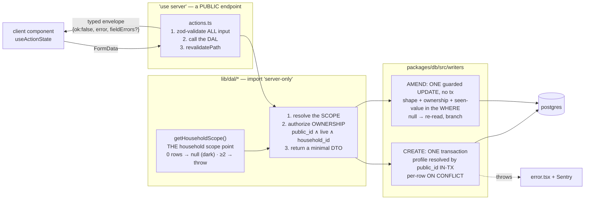

# The write path

**Read this before adding a Server Action, a DAL function, or anything that writes.**

## What this is

Every mutation in the app goes through the same three-layer seam: a thin Server Action validates, a
`server-only` DAL function authorizes and shapes, and a writer in `packages/db` performs the actual
SQL in one transaction. Reads that are batch or external go through Route Handlers instead.

The layering is not ceremony — it is what makes ownership checks testable and what keeps a crafted
POST from reaching the database.

## The map



## Files

| File / dir                        | What it is for                                                                                                                                                                                                                                                                                                                              |
| --------------------------------- | ------------------------------------------------------------------------------------------------------------------------------------------------------------------------------------------------------------------------------------------------------------------------------------------------------------------------------------------- |
| `app/p/[profileId]/actions.ts`    | Every Server Action. Thin by contract: validate → DAL → revalidate. Seven actions today.                                                                                                                                                                                                                                                    |
| `action-state.ts`                 | The shared typed envelope + `INITIAL_ACTION_STATE` that `useActionState` starts from.                                                                                                                                                                                                                                                       |
| `lib/dal/`                        | All Drizzle access and all `process.env` reads. `import 'server-only'`. Returns DTOs, not rows.                                                                                                                                                                                                                                             |
| `lib/dal/profiles.ts`             | Also the one READ that resolves untrusted JSONB: `getProfileByPublicId` maps `routine_config` through `resolveProfileRoutine`, which pairs the membership set (the whole catalog) with the neutral first-run fallback — see [programming](./programming.md) invariant 5. Never pass those two lists by hand.                                |
| `lib/dal/household.ts`            | **`getHouseholdScope()`** — the ONE place in the repo that derives a household from a request, plus `reportScopeMiss` (ADR 0006's miss-path event). AUTH-1 replaces only this body.                                                                                                                                                         |
| `lib/dal/recording-db.ts`         | TEST SUPPORT: a Drizzle client over a recording pg pool, for emitted-SQL proofs of reads `db:verify` cannot execute (they are `server-only`). Rows are ARRAYS — drizzle queries with `rowMode: 'array'`.                                                                                                                                    |
| `packages/db/src/scope.ts`        | `HouseholdScope` (branded) + `householdScopeForRequest`. `householdScopeForScript` lives in `writers/household-scope-script.ts`, which the package barrel does **not** re-export — so `apps/web` cannot reach it by **module resolution**, which is why the one `apps/web` fixture script that needs a scope _derives_ one instead (below). |
| `packages/db/src/queries/`        | The single-sourced, security-load-bearing reads: `household-profiles.ts` (the picker — the whole isolation boundary under ADR 0006), `household-scope.ts` (the resolver's own probe), `weekly-adherence.ts`, `export-month.ts`. Owned by name, not by prefix: `program-day.ts` belongs to [programming](./programming.md).                  |
| `packages/db/src/writers/`        | The write cores — transactional creates, single guarded-UPDATE amends — shared so the DAL **and** `db:verify` prove the same guard.                                                                                                                                                                                                         |
| `…/writers/movement-catalog.ts`   | 🔴 `findOrCreateMovement` — the **one** write core here that takes **no** `HouseholdScope`, because `movements` has no `household_id` column to scope by. Extracted in TEN-1 1d solely so `db:verify` could run the real function for the catalog verdict. Read its docblock before touching it; `TEN-2` is what changes its signature.     |
| `apps/web/lib/dal/scoped.test.ts` | TEN-1 1d's structural guard: nothing in `lib/dal` reaches `db` unscoped, and nothing builds its own ownership predicate. Two exception lists, both enumerated with a reason, both final. Not to be confused with `packages/db/src/scope.test.ts`, which guards the scope **type**.                                                          |
| `packages/db/src/client.ts`       | Pool + schema binding. Node runtime, Fluid `attachDatabasePool`, pooled string through PgBouncer. Also `withVerifiedTls` — upgrades a hosted `sslmode=require` to `verify-full`, leaves a no-TLS local string alone.                                                                                                                        |

## Invariants

1. **Every Server Action is a PUBLIC endpoint.** Page middleware does not protect it — it is a POST
   anyone can craft. Re-authenticate, re-authorize ownership, and zod-validate **inside** each one.
   Re-authenticating means `hasGateAccess()` (`lib/dal/gate.ts`) as the action's **first** line,
   returning the action's not-found copy. Until SEC-1 no action did, and requests carrying a prefetch
   header skipped the proxy, so every action was reachable without the gate cookie. A new action
   without it fails the unauth suite in `actions.test.ts` only if you add it to that suite: do.

2. **Ownership is proven by `public_id`, resolved inside the transaction.** Never trust an internal
   `bigint` id from a request. This is the BOLA/IDOR seam and it is why writers take
   `profilePublicId`, not `profileId`.

   **Since TEN-1 that predicate also carries the HOUSEHOLD.** `isLiveProfile(publicId, scope)` emits
   three conjuncts — `public_id` ∧ `deleted_at IS NULL` ∧ `household_id = scope` — and the scope
   parameter is **required and positional on purpose**: an unconverted call site is a **compile
   error**, which is the only mechanism that makes a sweep this wide safe. **Never** default it or
   make it optional; `packages/db/src/scope.test.ts` fails the build if you do.

   - **`lib/dal/*` resolves the scope; nothing above it holds one.** Each DAL function calls
     `getHouseholdScope()` itself and passes the result down. Page, action and Route Handler
     signatures carry no scope — invariant 8 already makes `lib/dal` the one layer allowed ambient
     server state, and a threading mistake one layer up is a leak the compiler cannot see (the
     parameter is present, just wrong).
   - **`scope.householdId` is read in exactly ONE place** (`writers/ownership.ts` → `inHousehold`).
     The scope is a **capability**, not a tenant id: a call site that unwraps it to build its own
     `eq()` has turned it back into a number, and COACH-1's _"not mine, but shared with me"_ would
     then have to widen every such site instead of one function (ADR 0006, fwd-1).
   - **A wrong-household id is a 404, never a 403**, and never a new error shape: it takes the exact
     path an unknown id already takes (`notFound()` / `NO_PROFILE_LOG`, now in `lib/constants.ts` so
     the byte-identity is structural). The threat is not enumeration but a _leak_ — an id an attacker
     holds came from a shared link or a screenshot, and 403 would confirm the leak is live.
   - **Zero live households → `null` (the app goes dark); ≥2 → THROW.** Different states, different
     paths: `null` for both would render _"Seed the database to get started"_ for an invariant
     violation, telling a parent their data does not exist and suggesting a production write.
   - **One fixture script outside `lib/dal/` names a constructor, and it is named in the guard**
     (TEN-1 1c). `apps/web/scripts/screenshot-ephemeral.ts` writes fixtures through `packages/db`'s
     write cores into a throwaway embedded Postgres, so since 1c it needs a scope — and the module
     boundary above means it cannot use the _script_ constructor. It **derives** one from the
     throwaway database through `liveHouseholdIds`, the resolver's own probe, and throws on anything
     but exactly one live household. `scope.test.ts` allowlists that one path **and** adds a second,
     absolute assertion that nothing under `app/`, `lib/` or `components/` mints a scope at all. If
     you need a scope in a script, put the script under `scripts/` and derive — never name an id.
   - ⚠️ **Scoping is not authorization.** Before AUTH-1 the principal is a shared access code, so
     TEN-1 buys _consistent scoping_ — B's data is unreachable from a request scoped to A. It does
     not prove the requester is who they claim. That is the most likely thing to over-claim here.
   - 🔴 **ONE WRITE PATH IS OUTSIDE THIS INVARIANT AND CANNOT BE BROUGHT IN:
     `findOrCreateMovementId`.** `movements` has **no `household_id` column at all**, so there is
     nothing to scope by — and a `scope` parameter accepted and ignored would be worse than the honest
     absence, which is why `findOrCreateMovement` (`packages/db/src/writers/movement-catalog.ts`)
     takes none. TEN-1 chunk 1d **proved** the consequence in both directions against a real
     database — `db:verify` → _"TEN-1 1d: the catalog verdict"_ — rather than asserting it:
     - one household typing a movement is handed another household's row, inheriting its `name`,
       `is_bodyweight` and `unit_default`, and `programDayRows` renders those on the **other**
       household's Today card under its own correct scope;
     - whoever types a name **first** pins that slug permanently (`ON CONFLICT (slug) DO NOTHING`
       discards the second household's text, and the seed only ever touches its own slugs, so nothing
       repairs it);
     - this function can only ever write `is_bodyweight: false` and no `unit_default`, so a movement
       first typed by one household is declared loaded-with-no-default-unit for everybody — and given
       the inviolable load rule that is safety-adjacent, not cosmetic;
     - 🔴 **a session write the seam REFUSES has already committed the caller's text**, because the
       DAL resolves every movement before `writeStrengthSession`, whose in-transaction re-resolve is
       the actual seam. A cross-tenant **write** primitive surviving its own refusal, which is
       categorically worse than a read leak.

     **`TEN-2` is the fix**, and the recorded verdict is that it belongs in Beta 0 — before a second
     household exists: [the plan](../plans/ten-1-household-scope.md) → _"1d as built"_. Do not read
     "the writer is scoped" as "the strength write path is tenant-isolated".

3. **The writer is shared with `db:verify`.** A guard that exists only in the DAL is a guard no proof
   covers. When a writer's WHERE encodes a rule, `packages/db/scripts/verify.ts` exercises the **same
   function** — cross-profile, wrong-shape, soft-deleted — against PGlite.

4. **Expected errors return a typed envelope; unexpected ones throw.** `{ok:false, error, fieldErrors?}`
   for anything a user can cause, surfaced through `useActionState`. Throwing for those would drop the
   athlete into `error.tsx` and lose the form. Conversely, never leak internals into the envelope.

5. **Idempotency is a client UUIDv7 + a DB UNIQUE + `ON CONFLICT`** — never an app-level "does it
   exist?" check, which races. Per-row at every level of a graph, with no parent short-circuit.

6. **A partial unique index needs its predicate repeated in `ON CONFLICT`.** Every `client_id` unique
   in this schema is `WHERE deleted_at IS NULL`, so the arbiter must say so too or Postgres rejects the
   statement outright. drizzle: `onConflictDoUpdate({ target, targetWhere })`.
   ⚠️ **Bodyweight's CREATE is the exception: target-less `ON CONFLICT DO NOTHING` (V1-24 PR 1e).**
   It has two uniques, `uq_entries_client_id` and 1d's natural key `uq_entries_profile_day_bodyweight`
   (one live weigh-in per `(profile, day, coalesce(context, 'morning'))`, an EXPRESSION drizzle's
   `target` cannot name). `insertBodyweightEntry` (`packages/db/src/writers/bodyweight.ts`) uses NO
   target, so every unique index is an arbiter: there is no spec to mis-infer, and a concurrent re-POST
   waits and does nothing instead of raising `23505`. It pays the three costs explicitly, and a change
   to it must keep paying them:
   - **(a) `RETURNING` is empty on any conflict** → it re-selects; it never assumes a row.
   - **(b) a second device's different weight must not read as success** → the re-select branches: the
     row is THIS submit's (`client_id` AND profile match, live, AND a weigh-in) → `{ id }`; the day's slot
     — the SAME `coalesce(context, 'morning')` key as the index — holds another
     submit's row → `{ dayTaken: true }`, the typed "already logged" envelope.
   - **(c) it swallows a violation of ANY unique**, including future ones → a no-op that is neither
     THROWS. Adding a unique index to `entries` means deciding how this writer answers it.
     The replay lookup is scoped to the profile (the pre-1e fallback looked up `client_id` alone and could
     hand back another profile's public id). `db:verify` ("V1-24 1e") drives the app's own statement for
     insert, replay, other-device, soft-delete, the foreign-`client_id` throw, a soft-deleted submit's
     replay (→ `dayTaken`, never the dead row's id), another metric's `client_id` (→ throws), and an
     evening slot (not read as the default slot taken). The metric pin on the replay lookup is the same
     lesson as the amend's: a POST reusing a check-in's `client_id` must not be answered with that row.
   - **Two caveats that would silently change it:** (1) under **REPEATABLE READ / SERIALIZABLE**, DO
     NOTHING against a conflicting row the snapshot cannot see raises a serialization failure (40001)
     instead of doing nothing — `logBodyweight` runs autocommit at READ COMMITTED, keep it there; (2) a
     **DEFERRABLE** unique constraint on `entries` cannot be an arbiter, and with a target-less ON
     CONFLICT that makes **every** bodyweight insert error ("ON CONFLICT does not support deferrable
     unique constraints as arbiters"). Never add one to `entries`.
   - **Concurrency is proven against real Postgres, not PGlite** (one connection, so `db:verify` can only
     run the cases in sequence): see the plan's "1e as built" for the two-connection probe.

7. **`ON DELETE CASCADE` is hard-delete only, and this app soft-deletes.** A soft-deleted parent leaves
   live children. Every read must filter through a live parent, or it counts rows whose owner is gone.

8. **Nothing outside `lib/dal/*` imports `db` or reads `process.env`.** Enforced by review and by the
   `server-only` import; breaking it is how a secret reaches a client bundle.

9. **⚠️ NO household-scoped read may enter a cache without the household id in the key** (ADR 0006's
   obligation 2). Under option A the household comes from the session, so `/p` and `/p/<profileId>`
   are **byte-identical URLs for every household** — _nothing in any cache key distinguishes
   tenants._ `export const dynamic = 'force-dynamic'` in `app/layout.tsx` is the only thing between
   that and serving one family's athletes to another, and since TEN-1 that directive is load-bearing
   for **tenancy**, not just for the CSP nonce. `app/tenancy-is-not-cached.test.ts` pins it, the
   export handler's own dynamism (a Route Handler inherits **no** segment config — it is dynamic only
   because it calls `cookies()`), and the rule that no `unstable_cache` / `'use cache'` /
   `export const revalidate` appears in `apps/web` at all. `revalidatePath` is **not** affected:
   profile public ids are globally unique, so the 12 call sites cannot collide across households —
   non-obvious, and the reason TEN-1 needed no route sweep.

## Traps

- **A DB constraint reached by a crafted body is a 500 that discards the whole transaction.** For a
  gym-floor session that is the worst possible failure — the athlete loses everything they logged.
  Validate at the boundary so the constraint is a backstop, not the error message.

- **⚠️ An AMEND is a different verb from a CREATE, and its guard is the WHERE (V1-24 PR 1b).**
  `updateBodyweightEntryById` / `updateStrengthSetById` do not re-check ownership in the action — the
  guarded UPDATE _is_ the check, and it lives in `packages/db/src/writers/` so `db:verify` runs the
  same code the app does. Every pin in that WHERE refuses a crafted POST, and the metric pin matters
  most: **without `metric_key = 'bodyweight'` the endpoint rewrites any entry the profile owns** — a
  push-up bout, a sleep reading — into a bodyweight. It is a **constant, never an argument**, because
  a parameter can be passed wrong by a future caller.

  Two more rules that WHERE encodes:
  - **The live-profile predicate is `writers/ownership.ts`, and since TEN-1 it carries the household.**
    It had 11 hand-typed copies; the amends, `listEntriesForDay` and `weeklyAdherenceRows` converted at
    V1-24/DAL-1, TEN-1 1b converted the three profile-resolution sites plus everything `ownedEntryIds`
    reaches, and **TEN-1 1c converted the tail: the hand-written count is now ZERO.** 1c's seven sites
    were `logCheckinEntries`, `writeStrengthSession`'s in-transaction resolve, `programDayRows`'s
    `isThisProfile`, `export-month`'s three reads, and `seed.ts`'s plural variant (`inArray` where
    `isLiveProfile` has `eq`, so it takes the household half, `inHousehold`, directly). A security
    predicate is the last thing that should drift between call sites, so a new read or write uses the
    helper — never an eighth copy, and never a hand-written `household_id =` beside it.

    **Four deliberate exceptions, each documented where it lives, none a copy of this predicate** —
    and they are **not all reads**. `reportScopeMiss` in `lib/dal/household.ts` is an _existence-only_
    probe that reaches `db` with no scope on purpose (it is how the miss path tells `cross_household`
    from `unknown_resource`) and returns `void` so it cannot be copied into something that returns
    data. `getActivityTypeByKey` and `getMetricDefinition` in `catalog.ts` are global reference reads.
    ⚠️ **`findOrCreateMovementId` in `catalog.ts` is a global unscopable WRITE**, not a reference read:
    `movements` has no `household_id` column, so a household typing a name another household already
    created is handed that household's row. TEN-2 is the fix; 1d records the proof and the Beta-0
    verdict. The canonical list lives in `packages/db/src/writers/ownership.ts`'s docblock — read it
    there rather than trusting this restatement.

    **Since TEN-1 1d those four are a TEST rather than this paragraph** —
    `apps/web/lib/dal/scoped.test.ts`, two assertions with one exception list each: (1) nothing in
    `lib/dal` reaches `db` without resolving or being handed a `HouseholdScope` (exceptions:
    `catalog.ts`'s three), and (2) nothing builds its own ownership predicate (exception:
    `household.ts`, for the probe). Two lists rather than one because assertion 1 **cannot** see the
    probe: it resolves a scope to classify the outcome and then queries without it, so it reads as
    scoped there. The unit is a **top-level declaration, exported or not**, because a private helper
    reaching `db` unscoped is the same leak as a public one (`export.ts` → `prescribedFor` is that
    shape). Comments are stripped, so a `// TODO: getHouseholdScope()` cannot satisfy it. And a
    **dead-entry** assertion fails if an allowlisted function stops needing its entry, so `TEN-2` has
    to delete `findOrCreateMovementId`'s rather than leave it standing — the
    `household-synthetic-is-dark.test.ts` lesson: an allowlist that cannot go stale.

    ⚠️ **It is a call-site guard, so it cannot see SQL.** Delete the household conjunct from
    `isLiveProfile` and the `db:verify` matrix goes red in both directions while that file stays
    **green** (`db:mutations`' patch 01 demonstrates exactly that). Three vehicles, none of them the
    proof alone. The other half of the containment — the scope **type** — is
    `packages/db/src/scope.test.ts`, and the two deliberately do not overlap.

    ✅ **`packages/db/scripts/corrections/registry.ts`'s three copies are gone too (1d).** They were
    outside the domain the `lib/dal` guard inspects, so they were stated rather than claimed away;
    they now ride `isLiveProfile` / `inHousehold`, and no correction holds a raw `household_id`. See
    "When the app cannot fix the data" below.

  - **The amend's re-read (`findAmendableBodyweight`) shares the UPDATE's shape predicate**, so the
    three-way branch can only ever see a row the UPDATE could have written. It lives in the writer, not
    the app DAL, so `db:verify` proves it.
  - **Zero rows means four different things** — wrong owner, stale id, wrong shape, someone got there
    first — and the action must tell them apart. `editBodyweightAction` re-selects under the same
    ownership scope and branches three ways, including the **replay** case: a lost response on gym
    wifi retries the POST, the row has already moved, and answering _"someone else changed this"_
    would be a conflict with nobody, over a value that is already correct.

- **⚠️ `logBodyweight` dedupes ONLY on `client_id`, so the UI is what prevents a second submit
  (V1-24 PR 1a).** `entries` has no natural-key uniqueness — the only unique index is
  `uq_entries_client_id`. The bodyweight form used to reset itself **and mint a fresh `client_id`**
  on every success, which made a second submit a second ROW, over an input the reset had just
  emptied. That is how prod ended up with duplicate weigh-ins.

  `BodyweightSection` (`app/p/[profileId]/bodyweight-section.tsx`) now renders the form only when
  the day has no weigh-in, the form's `client_id` is **stable for the life of the mount**, and the
  form is keyed on the **day** so a day change remounts it (a mount surviving a client-side day change
  replays one day's key for another — an `ON CONFLICT DO NOTHING` no-op that reports success). **Do
  not re-introduce key rotation or drop that key.** This removes the second-submit path; it does
  **not** make a duplicate impossible — two mounts (two phones, two tabs) hold two keys and can still
  write two rows until V1-24 PR 1d's index. So the receipt lists every live row, and nothing may
  assume one weigh-in per day yet. ⚠️ That index must be scoped `WHERE metric_key = 'bodyweight'`:
  `metric_key` is the discriminant for **every** metric, and the accumulating calisthenics log
  several rows a day by design.

- **The bodyweight plausibility bound lives in the shared schema, keyed on the unit** —
  `BODYWEIGHT_BOUNDS` in `packages/shared/src/bodyweight.ts` (20–500 lb, 10–230 kg), checked in a
  `superRefine` whose issue is filed on `value` so `flatten().fieldErrors.value` carries it to the
  form. Any spec or fixture that logs a bodyweight through the action must use an in-range value (the
  e2e warm-up used `0.5`).

- **`logStrengthSessionAction` returns the session's PUBLIC id as `savedId` (V1-24 3a-ii).** The form
  announces and focuses its save from it, so it must stay a public id (never an internal one) and be
  returned on a replay too (the writer re-selects the session, so a retried submit still lands focus).

- **A strength-session zod issue renders as `<movement name>, set M: <message>` (V1-30).** `flatten()`
  loses the index, so `logStrengthSessionAction` rebuilds each message from the issue path: `path[1]`
  is the movement — **named, never numbered**, because `path[1]` indexes the SUBMITTED list, which
  drops untouched scaffolded cards, so a number can point at the wrong card on screen (`Movement N`
  only when the name is empty), and `path[2] === 'sets'` with a numeric `path[3]` adds the set. A refine that wants
  a message to point at a row must file its issue on that path (the non-mass BW/band check uses
  `['movements', i, 'sets', j, 'weight']`). Without the set number, three bad sets repeat one string,
  which is unlocatable and also a duplicate React key in the form's error list.

- **⚠️ React 19 resets UNCONTROLLED fields in a `<form action>` when the action settles — even when
  it returns `{ ok: false }`.** A rejection that names the typed value ("check the decimal point")
  then points at an empty input, and a `<select>` snaps back to its `defaultValue`. On the weigh-in
  that turned a kg user's corrected `84.5` into a saved 84.5 **lb** — in range, so nothing caught
  it. `bodyweight-form.tsx` therefore holds `value` and `unit` in state (`checkin-form.tsx` is the
  older precedent); `e2e/a11y.spec.ts` pins that both survive a rejection. Any form whose fields
  must outlive a rejected submit needs the same. **⚠️ Controlling a `<select>` is not enough:** the
  reset is a native `form.reset()`, and React keeps a controlled input's `value` attribute in sync
  but never a select's `defaultSelected`, so the select shows the first option while state holds
  another. The form re-asserts it in a layout effect. (`strength-form.tsx`'s Measuring/Unit selects
  are controlled the same bare way inside `<form action>`; their data rides a JSON field built from
  state, so the payload stays right, but the visible select may not after a rejection — unverified.)

- **`revalidatePath` is not optional.** Per-user data is dynamic and must never be cached across
  users; forgetting the revalidate after a mutation shows the athlete stale data and looks like the
  write failed, which prompts a duplicate submit.

- **Server Actions are not HTTP routes and cannot be tested as such.** Test them as plain async
  functions with Clerk's `auth()` and Drizzle mocked. Async Server Components need Playwright, not
  Vitest. This is why logic belongs in the (synchronous, testable) DAL.

- **`packages/db` is typechecked since DX-7 — `verify.ts` included.** `pnpm typecheck` runs
  `apps/web` **and** `packages/db` (`packages/db/tsconfig.json`), so `scripts/**` — unreachable from any
  app import, and where the `db:verify` proofs live — is finally covered. Before that a writer's `sets`
  parameter type could say a field was REQUIRED while `db:verify`'s fixtures omitted it, and nothing
  objected until Postgres reported `invalid input syntax for type numeric: "undefined"`; DX-7 found
  exactly that, three times. **Still handle both** (`=== null || === undefined`) in a writer taking
  values from both zod output and hand-written fixtures — the writer's inner signature deliberately
  permits omission, and the type only covers callers the compiler can see.
  ⚠️ **`packages/shared` and `packages/engine` have no tsconfig of their own**: they are checked only
  _transitively_, via the app's imports, so a file nothing imports is still checked by nothing.

- **A derived column must be derived from the value actually being written.** `entry_set_quantities`
  stores `dimension` alongside `unit` and a composite FK checks the pair. Hard-coding `'mass'` there
  was correct while movements were lb/kg-only and became an FK violation — surfacing as a 500 — the
  moment a movement could be logged in `sec`. Derive it (`UNIT_DIMENSION_BY_CODE[unit]`).

- **⚠️ The access-gate matcher EXCLUDES `/api`.** `config.matcher` in `proxy.ts` skips `/api` and
  `/api/*` (segment-anchored since OSS-2, so `/apiary` is gated), so **any Route Handler under `/api`
  is completely ungated.** V1-13b's export therefore lives at `/p/[profileId]/export`, inside the
  matcher — and still re-checks the gate itself, because middleware is not an authorization boundary
  (a matcher edit or a rewrite silently exposes it). **This is a live hazard for the `/api/sync`
  AGENTS.md plans.**

- **⚠️ The bodyweight export carries each row's UNIT; `kg` is converted, everything but `lb`/`kg`
  throws (CSV-1).** The legacy column is `weight_lb`, so a kg weigh-in written bare reads as pounds
  downstream. `lib/dal/export.ts` must keep mapping `unit` from `bodyweightMonthRows`. A kg row writes
  the pounds equivalent (one decimal) and keeps `logged <value> kg` in notes — Ray's decision
  (2026-10-02), because a kg weigh-in is ordinary and cannot be repaired in the app (the amend keeps the
  unit; there is no delete), so refusing would have 500'd the whole export (EXP-1). A NEW bodyweight unit
  must get its own rule in `buildBodyweight`, or it throws.

- **`sslmode=require` encrypts but does NOT verify the certificate.** Neon's strings ship `require`,
  which leaves the connection open to an active machine-in-the-middle. `createDbPool` upgrades it to
  `verify-full`, and deliberately leaves a string with **no** `sslmode` untouched — local Postgres has
  no TLS, and forcing it there would break every local run to fix a hosted-only concern.

- **The UI must never be STRICTER than the endpoint it fronts.** `resolveDeclaredDay` accepts a write
  within ±1 day (`WRITABLE_DAY_RADIUS`), so the page gates its forms on the _same_ exported constant
  (`isWritableDay`) rather than a re-typed `1`. V1-15 hit this twice: hiding yesterday's forms would
  have refused what the server allows, and flooring day-navigation at `profiles.created_at` alone
  would have clamped away a day that was still writable.

- **Sentry does NOT auto-instrument Server Actions.** They must be wrapped in
  `withServerActionInstrumentation` or the failure is invisible.

- **⚠️ A boundary test that cannot fail is worse than none, and `db:verify` has a gate for that
  (TEN-1 1b).** `pnpm db:mutations` applies each committed patch in
  `packages/db/scripts/mutations/`, runs `db:verify`, asserts it goes **RED**, and reverts; it runs
  inside `pnpm verify`. **Five mutations today**: deleting the household conjunct (must redden 18
  assertions), pointing `verify.ts`'s `A_SCOPE` at the household next door (the "dual" — it catches
  the half the first cannot, because a **negative** assertion like _"refuses a non-done row"_ still
  returns `null` when threaded with the wrong scope and would silently stop proving its own message),
  **undoing 1c's seven conversions**, dropping the **correction's** household conjunct, and — for
  1d's catalog verdict — removing the shared `movementSlug` derivation. **Each patch names the
  assertion that must fail FIRST in a sibling `.expect` file, and the runner compares it**, so a patch
  that reddens the wrong proof fails the gate rather than passing as "something went red". And since
  1d the TEN-1 block in `verify.ts` runs **1b-then-1c** (`ten1ReadMatrix` over two lists), so patch
  03's full claim — _every 1b assertion green, then a 1c one_ — is what one run shows; before the
  reorder the 1b rows below a 1c failure were unreached rather than green, because `db:verify` is
  fail-fast. **Order is load-bearing there: do not interleave a 1c proof back above a 1b one.**

  **Patch 04 is deliberately NOT "scope the catalog".** That is `TEN-2`, not a one-line break, and a
  leak assertion driven by the same name on both sides cannot be falsified by any change that keeps
  the signature. It breaks the property the verdict actually rests on — that one derivation is the
  single **global arbiter** two households' different spellings converge on. Without it the verdict
  would be measuring fixture ordering.
  **Patches, never a runtime flag:** a switch that can disable a BOLA predicate must not exist in
  shipped `packages/db` source. Editing a mutated line means regenerating its patch — the gate then
  fails loudly with _"does not apply"_ rather than passing vacuously.

- **⚠️ Every new `db:verify` leak assertion ships with its POSITIVE twin.** `verify.ts` learned this at
  V1-10: _"asking only one way would pass even with the household scoping deleted, since the
  globally-newest block happens to be the verify one — the assertion would then be proving fixture
  ordering, not ownership."_ So a zero-rows assertion always comes with one proving the same call
  returns rows for the right household. And `verify.ts` mints **exactly two** scopes, `A_SCOPE` and
  `B_SCOPE`: a scope minted at a call site makes an assertion pass for the wrong reason, invisibly.

## When the app cannot fix the data

Some shapes are **deliberately not editable** (a bodyweight set, a labelled set, a non-`done` set) and
there is **no delete action anywhere in the app** — so a mis-tap can be unrecoverable through the UI.
For data already on the board, use a **correction**:

```bash
pnpm --filter @mat-plan/db db:correct            # list
pnpm --filter @mat-plan/db db:correct <name>     # dry run (default — writes nothing)
```

Guarded, idempotent, dry-run-by-default, targeted by `public_id`. Add one in
`packages/db/scripts/corrections/registry.ts`; rules in its README, runbook in
[runbooks.md](../runbooks.md). **A correction treats the data — the bug that produced it still needs
its own PR.**

- **A correction NAMES its household, and that is the per-era guard (TEN-1 1b + 1d).** It has no
  request to derive a scope from, so `liveHouseholdScope(db, SEED_HOUSEHOLD_PUBLIC_ID)` resolves one
  by `public_id` — never an internal id — and every predicate in the file rides it:
  `isLiveProfile(publicId, scope)` where there is a `public_id`, `inHousehold(scope)` for the one
  **bulk** shape (a whole household's profiles). After 1d there is **no hand-written ownership
  predicate left in the registry**, and no correction holds a raw `household_id`, so ADR 0006's
  capability rule holds in this script too.

  Why the conjunct matters more here than anywhere else: a `WHERE` guarded only by the value being
  corrected **from** is idempotent per ROW but not per ERA. `routine_config IS NULL` is the correct
  state for a newly-created athlete after PROF-1, so an unscoped `--apply` later would stamp this
  household's routine onto somebody else's brand-new kid — a write with no delete action behind it,
  i.e. exactly the unrecoverable class corrections exist to repair rather than cause. The household
  predicate makes the correction **expire on its own**, and `db:verify` proves it in both directions
  by running the registry entry's own dry run.

- **Fixture athletes are role-named, and the name is a const.** `SEED_PROFILE_NAME` /
  `SEED_PROFILE_2_NAME` (`packages/shared/src/seed-ids.ts`) hold `Athlete One` / `Athlete Two`. Never
  re-type the literal and never put a real first name in a fixture, a comment or a test — this repo is
  public and holds minors' data (AGENTS.md → "No personal names"; `OSS-1`). `db:verify` pins the
  literal **once**, on the assertion side, so a real name cannot come back unnoticed. Prose about a
  real logged incident says "an athlete", not a fixture name — the fixture is not the child.

## Changing it

| If you are…                  | Start here                                                                      |
| ---------------------------- | ------------------------------------------------------------------------------- |
| adding a mutation            | a writer in `packages/db/src/writers/` first, so `db:verify` can prove it       |
| adding a read                | `lib/dal/` — and decide DTO shape before the query, not after                   |
| changing a request/response  | the shared zod schema in `packages/shared` in the SAME PR (types via `z.infer`) |
| adding a batch/external read | a Route Handler, not a Server Action — actions dispatch sequentially            |

Mandatory boundary tests in the same PR: **unauth → reject · wrong-owner → forbid · bad body →
zod-reject**, plus replay → one effect. Then `pnpm verify` and `pnpm e2e:local`.

## Background

- [AGENTS.md](../../AGENTS.md) → "Server conventions" and "Backend / API PR rules"
- [.github/SECURITY.md](../../.github/SECURITY.md) — BOLA-first
- [spec.md](../spec.md) §4 — the data model
