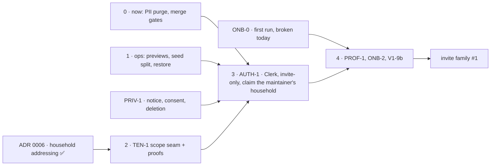

# Beta — a family that isn't Ray's can use mat-plan

> **Status: proposed 2026-09-30, awaiting Ray's review.** A cross-PR milestone, not an implementation
> plan: every row still gets its own branch, PR, and (where significant) plan and panels. The rows are
> filed in [plan.md](../plan.md); this file orders them and defines "done". It was hardened by a
> scope, architecture and security panel before it was committed — see the review log at the bottom.

## The goal

Invited households — a friend's family, a coach — use mat-plan on their phones for a few weeks, and
Ray learns whether it is worth widening. A tester can:

1. sign in with Google and land in **their own household**, never seeing anyone else's;
2. add their athletes; a new household starts on a sensible default program;
3. log every day on a phone at the gym;
4. **fix their own mistakes** without asking Ray to run a script;
5. leave, and have their data deleted.

And Ray can sleep: one household's data is unreachable from another — proved by tests, not by
convention — and a bad write can be restored without rolling back everyone else.

It ships in two steps, because the full feature set is months away at ~4h/week and a real family's
feedback is worth more than another month of guessing:

- **Beta 0 — one invited family.** The thinnest slice that is _safe_: isolation, identity, privacy, and
  just enough self-serve to start. **≈ 20–25 PRs.**
- **Beta 1 — 3–5 families, all the major features.** Program editing, schedules, streaks, invites,
  in-place correction. **≈ 20–30 more.**

Everything after that is post-beta (offline, the engine, the MCP, NL logging).

## Decisions

**Made (Ray, 2026-09-30):**

| Decision         | Choice                       | Consequence                                                                                                                                                                                                                                                                                          |
| ---------------- | ---------------------------- | ---------------------------------------------------------------------------------------------------------------------------------------------------------------------------------------------------------------------------------------------------------------------------------------------------- |
| Offline logging  | **Online-only beta**         | v1.5's PWA/sync phase is the first milestone after beta. On bad wifi a tester may have to retry a save; per-item `client_id` + `ON CONFLICT` makes a retry of the same submit a no-op.                                                                                                               |
| Who signs in     | **Parents and coaches only** | No child accounts. But a kid tapping their tile on a parent's phone **is** a child using the service, so PRIV-1 still needs a real privacy review — see below. For beta, **only a parent creates a household or an athlete**; a coach joins by a parent's invite (Beta 1).                           |
| Sign-in provider | **Google only, via Clerk**   | Clerk was already the spec'd choice; this **pulls it forward from v1.5** (spec, plan and AGENTS.md "Stack" are amended in this PR). Facebook and email links wait for a tester to ask. **Sign-up is invitation-only** — an open Google sign-up on a public repo is an open beta, not an invited one. |

**To decide — before the work that depends on it:**

| Question                                                                                                     | Decide by                                                                                                                                                                         | Recommendation                                                                                                                                                                                                                                                                                                                                                                                    |
| ------------------------------------------------------------------------------------------------------------ | --------------------------------------------------------------------------------------------------------------------------------------------------------------------------------- | ------------------------------------------------------------------------------------------------------------------------------------------------------------------------------------------------------------------------------------------------------------------------------------------------------------------------------------------------------------------------------------------------- |
| **Household in the URL, or only in the session?** ([HH-1](../plan.md) decided "path", before OAuth was a P0) | ⏳ **Written: [ADR 0006](../decisions/0006-household-addressing.md)** (proposed 2026-10-07). Unsigned — TEN-1 is its chunk 0 and does not start until the decision box is filled. | **Session-only for beta**, keep `/p/<profileId>` as the address. The ADR owns the argument, the measured blast radius of the path option, and the sourcing of the two prior incidents — the numbers live there and are not copied here, so they cannot drift. It also settles **404, not 403**, on a wrong household. It reverses a decision the maintainer made, so it is the maintainer's call. |
| **"Household" or "club"?** (HH-1 raised it)                                                                  | AUTH-1's plan — the first authored write to `households`                                                                                                                          | Keep "household" for beta; rename later is a copy change if the schema stays generic.                                                                                                                                                                                                                                                                                                             |
| **Household = a Clerk Organization?**                                                                        | AUTH-1's plan                                                                                                                                                                     | Evaluate. Native, email-bound, expiring invitations and memberships would replace a hand-built invite flow, and SECURITY.md already assumes an org-scoped Clerk key for the later MCP token. The cost is vendor coupling on the tenancy model.                                                                                                                                                    |
| How many families, and who?                                                                                  | Before inviting                                                                                                                                                                   | One for Beta 0. It shapes whether deletion and invites can stay runbooks.                                                                                                                                                                                                                                                                                                                         |
| Do testers need CSV export?                                                                                  | Beta 1                                                                                                                                                                            | Keep it working (CSV-1) but don't promote it; it is shaped for Ray's Claude workflow.                                                                                                                                                                                                                                                                                                             |

## What "all the major features" means

Confirmed against the backlog. Most of the logging core already ships; the gaps are everything a
stranger needs _around_ it.

| Feature                    | Today                                             | Beta 0                                                                                                      | Beta 1                                               |
| -------------------------- | ------------------------------------------------- | ----------------------------------------------------------------------------------------------------------- | ---------------------------------------------------- |
| Bodyweight log + correct   | ✅ V1-24 1a/1b                                    | —                                                                                                           | 1c/1d (duplicate cleanup + index)                    |
| Strength logging           | ✅, with **P0s V1-27, V1-30** open                | both P0s                                                                                                    | V1-24 3a/3b (correct a set)                          |
| Check-ins, life activities | ✅                                                | —                                                                                                           | V1-24 2 (correct a check-in)                         |
| Daily routine + editor     | ✅ (`/p/<id>/routine`)                            | —                                                                                                           | confirm-on-remove, restore default                   |
| History / day paging       | ✅ V1-15                                          | —                                                                                                           | —                                                    |
| **Delete / clear a day**   | ❌ only `db:correct`, which only Ray can run      | **V1-9b** — the only way a stranger undoes a mis-tap                                                        | —                                                    |
| **Athletes**               | ❌ created by the seed only                       | **ONB-0** empty state, **PROF-1** create                                                                    | PROF-1 rename + archive                              |
| **Programs**               | ❌ seed-only (`PROGRAM_SEED`)                     | **ONB-2** — a new household starts on The Daily Five (seeded under both A/B days, so no SCHED-1 dependency) | **V1-22** edit, **SCHED-1** which days               |
| **Sign-in + households**   | ❌ one shared access code, existence-only scoping | **TEN-1**, **AUTH-1**                                                                                       | invites, roles, step-up                              |
| Streaks                    | ❌                                                | —                                                                                                           | **MOT-1** (needs SCHED-1 so a rest day isn't a miss) |
| CSV export                 | ✅, CSV-1 open                                    | CSV-1                                                                                                       | —                                                    |

**Out of beta**, unchanged in the backlog: offline (v1.5), the engine and Ray's PPL (v2), the MCP/API
and LLM adapter (v3), NL logging (AI-1), the dashboard and charts (V1-16), DUALS, i18n, Facebook
login, child accounts, kid PINs.

## Beta 0 — one invited family

**This is the canonical chart.** Every PR in this milestone embeds it with its own step marked
(`AGENTS.md` → "Milestone PRs also embed a progress chart"), so a reviewer sees what is still between
that PR and the finish. If a PR's position disagrees with this chart, the chart is what gets fixed.

⚠️ **Two rows moved out of step 4 on 2026-10-07, and the reason generalises.** Step 4 previously
bundled `ONB-0` and `PRIV-1` behind `AUTH-1`, which cost schedule for nothing:

- **`ONB-0` starts now.** First run is **broken today**, it is a P0, and it blocks nothing — so holding
  it behind the auth chain buys no safety and delays a live defect. It feeds step 4; it does not wait
  for it. **Work that is already broken and blocks nothing is pure throughput.**
- **`PRIV-1` starts now, because it gates `AUTH-1`.** The Google consent screen needs a
  privacy-policy URL (§3), so privacy is **upstream** of auth, not a sibling of onboarding. It is also
  the row this file says "should not be designed casually", which is the other reason not to reach it
  late. **A hidden gate — work that blocks the critical path without appearing on it — is the cheapest
  schedule win available and the most commonly missed, because the dependency graph does not draw it.**

Both patterns are now recorded in [parallel-work.md](../parallel-work.md) → "How many lanes?", because
they are how to schedule any milestone, not facts about this one.

### 0 · Now, independent

- 🔴 **The public repo must not serve anyone's children's data — every ref, not just `main`.** OSS-1
  rewrote the tournament roster out of `main`, but older refs kept it. **Done 2026-09-30:** the one
  branch still carrying it (`docs/onb-2-daily-five`) was deleted after its draft was rescued (#198);
  a scan of all 30 remaining branches is clean. **Still open:** the read-only PR refs **#152–#167**
  carry it, and only **GitHub Support** can purge PR refs and cached commit views — Ray files that
  request. Then re-scan every ref (branches + `refs/pull/*`) with gitleaks.
- **Open P0s:** V1-30, V1-27, CSV-1 (check prod for kg rows first), DAL-1, SEC-3.
- **SEC-2** (SHA-pin every action, #195) and **the shared redirect helper fix (SEC-4)** from #193's review —
  `safeInternalPath` must reject `\`, `%5C`, `//`, absolute and `javascript:` URLs **before** any
  sign-in or invite flow reuses it.
- **DX-5(a)** — required checks, up-to-date branches, no direct pushes. A repo-settings change. (Its CI
  half, DX-5(b), can follow.)

### 1 · Ops fit for other people's data

- **OPS-1 — previews hold neither production data nor production credentials.** Today every preview
  gets the prod `DATABASE_URL` (deploy.md). The fix is **not** a Neon branch of prod — that clones every
  family's bodyweight into every preview. Previews get a database built from the seed only, and the
  Preview environment holds no production secret: a separate Clerk development instance, a separate
  Upstash, no prod Sentry DSN. Verify Vercel's fork-PR protection is on (the repo is public).
- **OPS-2 — split the seed: reference data for prod, fixtures for dev/CI.** `migrate.yml` seeds prod on
  every push, and the seed both writes Ray's family (with public, fixed UUIDs) **and** re-creates them if
  they are ever deleted. But `PROGRAM_SEED` is also how Ray's real program reaches prod, so: split into
  `seedReference` (prod) and `seedFixtures` (dev, CI, e2e, PGlite); keep Ray's program flowing until
  V1-22 replaces it; scope the ramp-target expansion by household (today it writes to every kid in the
  database).
- **OPS-3 — restore one household, rehearsed.** The restore runbook is a TODO stub. A whole-database
  point-in-time restore rolls back every other family's writes and un-deletes deleted ones, so the
  runbook restores **per household** (branch → extract → copy) and re-applies a deletion ledger. One
  drill; delete the drill branch after, since it holds everyone's data.
- **Speed Insights** (ADR 0001 deferred it to prod cutover; it needs the CSP nonce plumbing).

### 2 · TEN-1 — one household cannot see another

Today `listProfiles()` returns every profile in the database and every write is existence-scoped ("any
known profile id writes to that profile"). Accepted with one family; a breach with two.

- **The ADR first** — [ADR 0006](../decisions/0006-household-addressing.md) (household addressing,
  above), **written and proposed 2026-10-07, awaiting the maintainer's signature.** TEN-1 and AUTH-1
  both build on its answer.
- **TEN-1 — one scoping seam.** A `cache()`d `getHouseholdScope()` in `lib/dal`; **every** DAL read and
  write scopes through it. Before AUTH-1 it resolves to Ray's household; AUTH-1 then swaps only its
  implementation to session → membership, so the sweep happens once. Folds in **DAL-2** (the nine
  hand-written live-profile predicates).
- **The proofs are the point:** `db:verify` drives two households through every read, write, correction
  and export, and asserts B can never see or touch A. Including `findOrCreateMovementId`, which today
  silently **reuses another household's movement row** on a name clash — so B's free-text "RDL" takes
  A's unit and bodyweight flag. Either TEN-1 proves the picker and the metadata stay per household, or
  **TEN-2** (custom movements per household: expand → switch writers → contract, three PRs, partial
  unique indexes built `CONCURRENTLY`) moves into Beta 0.
- TEN-1 alone proves _consistent scoping_. Isolation is only _authorized_ once AUTH-1 lands — the exit
  criteria say both.

### 3 · AUTH-1 — Clerk, Google, invitation-only

- Clerk with **only** the Google strategy enabled and **sign-up restricted to invited emails**. The
  dashboard settings live nowhere in code, so they go in a runbook checklist — along with the
  production instance's own Google OAuth credentials, the consent screen's privacy-policy URL (PRIV-1
  first), and the domain.
- A **`household_members`** table (migration + ERD): a user belongs to a household; the first user is
  its owner.
- **Ray's existing household is claimed, not inherited.** A guarded `db:correct` correction binds it to
  Ray's Clerk user, run **before** the gate goes. No code path may ever treat "the seed household" or
  "the first sign-in" as an owner — its ids are public. A new user gets a new, empty household (a
  TEN-1 proof).
- **The gate is retired; the session replaces it everywhere it was checked.** Every `'use server'`
  export, gated page and Route Handler rejects a caller with no session, enforced by extending the
  existing export-enumeration test so a new action without the check fails CI. `auth()` fails closed;
  the middleware matcher is not relied on (SEC-1's lesson).
- The per-user rate limit: the existing Upstash limiter re-keyed from IP to user id.

### 3b · Authoring — the program gets a write path

**Added 2026-10-06, [ADR 0005](../decisions/0005-programming-model.md).** Beta 0 previously scoped
self-serve as ONB-0 + PROF-1 + ONB-2 + V1-9b. That understated it: a household cannot be productive on
programming it cannot change, and today **changing one prescribed load means editing TypeScript and
deploying**. The model is settled; the milestone is V1-22's own smallest slice.

**The spec is the contract:
[docs/specs/v1-22-authoring-program-editing.md](../specs/v1-22-authoring-program-editing.md)** — 17
acceptance criteria, the `ProgramEditDTO` contract, and six chunks in an order its panel corrected. It
is the single home for that ordering; this section deliberately does not restate it.

Two things the panel changed about the shape of this milestone, worth recording here because they
reverse what this doc previously said:

- **It is additive-only after all.** The seed guard needs no column — a day-scoped existence check in
  `seedProgram` beats a marker and is the only option that survives a reorder that compacts.
- **The seed was never a gate for editing values.** `onConflictDoNothing` is insert-only, so a value
  `UPDATE` already survives a re-seed. The guard gates add/remove/reorder only, which puts three PRs
  rather than six between here and the pain being gone.

**Integration and exit criteria are in the spec**, under
[§Integration](../specs/v1-22-authoring-program-editing.md) — the six invariants that span chunks and
so belong to no single PR, each with the chunk that closes it. This milestone is the first to run
chunks in parallel across pillars, which is why it is the first to need them written down.

Alongside, independently shippable: **[UI-1](../plan.md)** (the form becomes the day) and
**[SET-1](../plan.md)** (preferred units). The routine picker's offer list and the wrestling drills
**left this milestone** as backlog rows — independent PRs sharing nothing with the write path — and
TEST-1's routine-editor spec left with them.

**Deferred to a scheduling ADR, after beta:** RRULE recurrence, rotation as data, `day_role` becoming
rows, workout creation, and the planned-occurrence row.

### 4 · Just enough self-serve

⚠️ **`ONB-0` and `PRIV-1` moved out of this step on 2026-10-07** (see the chart above). `ONB-0` runs
**now** — it is a live P0 that blocks nothing — and `PRIV-1` runs **now** because it gates `AUTH-1`.
Their deliverables are unchanged and still written below; only when they start has moved.

- **ONB-0 — starts now, not here.** An explained empty state; a new household no longer inherits the
  maintainer's routine. **First run is broken today**, so this is a live P0 and it waits on nothing.
- **PROF-1 (create)** — add an athlete. The first profile-creating endpoint: both panels, the full
  boundary-test set.
- **ONB-2** — a new **household** starts on [The Daily Five](../programs/daily-five-default.md)
  (#198, corrected in #199). Programs are per household, not per athlete. **Decided (Ray, 2026-09-30): the A/B
  stopgap** — the same rows seeded under both `strength_a` and `strength_b`, so there is no new day
  role, no CHECK migration and **no SCHED-1 dependency**. Accepted consequences: CSV `session_type`
  alternates `strength-a`/`strength-b`; it runs every day; the real per-household daily role waits for
  SCHED-1 in Beta 1. Its doses are model-drafted and need Ray's (or a coach's) sign-off before seeding.
  Beta 0 ships **fixed doses + first-run copy**; the per-movement tap loop and ramp wait for the engine
  (post-beta). The rows are written at household creation, never via `PROGRAM_SEED` under Ray's
  household (that would replace YDP).
- **V1-9b** — delete a logged item and clear a day.
- **PRIV-1 — starts now, because it gates `AUTH-1`. Privacy done as a review, not a checkbox.**
  §3's Clerk consent screen needs the privacy-policy URL, so this is upstream of auth.
  ✅ **The documents are written** ([plan](../plans/priv-1-privacy-review.md),
  [docs/privacy/](../privacy/)): the [notice](../privacy/notice.md), the retention policy, the
  deletion procedure ([runbooks.md](../runbooks.md)) with its residuals, the `AUTH-1` consent
  checklist, and SECURITY.md's threat model rewritten for many households, adults and coaches. The
  deliverables are not restated here — the documents own them.

  **What is left, and it is the half that gates `AUTH-1`:** `PRIV-2` (serve the notice at `/privacy`,
  which is where the consent-screen URL points) and `PRIV-3` (the deletion as a guarded script with a
  `db:verify` proof). Plus four blanks the notice names rather than guesses: the Neon / Sentry /
  Vercel retention windows and the contact route.

  ⚠️ Bodily measurements of minors may count as health data under some state laws. **This file is not
  legal advice; get a second opinion before inviting anyone** — the one open question PRIV-1 says
  nobody in this repo can close.

### Beta 0 exit criteria — invite family #1 when

- [ ] No ref on the public remote — branches **and** PR refs — contains third-party or child PII,
      verified by a scan over every ref.
- [ ] No open P0. DX-5(a) merge gates are enforced.
- [ ] Previews hold no production data and no production credential; fork protection is on (OPS-1).
- [ ] The prod seed writes reference data only and cannot re-create a deleted household (OPS-2).
- [ ] A single household has been restored from backup without touching any other (OPS-3).
- [ ] `db:verify` proves that a second household cannot read, write, correct or export the first's data —
      every entry point, including the movement catalog (TEN-1).
- [ ] Every action, page and route handler rejects a caller with no session; a profile outside the
      session's household is a 404; per-user data is never cached across users (AUTH-1).
- [ ] An uninvited Google account cannot create a household. Ray's existing household is reachable after
      he signs in, and only by him.
- [ ] On iOS Safari and Android Chrome, with no help: sign in → add an athlete → log a day → delete a
      mis-logged entry.
- [ ] Privacy notice, consent and retention policy are live; household deletion has been run once end
      to end; the privacy review is **signed off by the accountable role, with a date** (PRIV-1).
      _(Was "by a named person" — `AGENTS.md` forbids personal names in docs, which made this
      unsatisfiable as written. Amended by PRIV-1; same accountability, the form this repo permits.)_
      **Live** means `PRIV-2` has shipped `/privacy` on the app's own domain — a `docs/` file is not a
      URL a consent screen can point at. **And the notice ships with no blanks:** the Neon, Sentry and
      Vercel retention windows filled from their consoles, and a real contact route.
- [ ] `OPS-3`'s per-household restore has been rehearsed **before** any real household is deleted —
      until it exists, a mistaken deletion is not recoverable without rolling back every other family
      (PRIV-1).
- [ ] 🔴 No minor's name or log data in the tree: `OSS-1`'s rename is done, re-scoped to the ~50 files
      PRIV-1 found rather than the 3 the row used to name
      ([data-inventory.md](../privacy/data-inventory.md) §9).
- [ ] SEC-3 merged: server-side errors carry no bodyweight to Sentry.

## Beta 1 — 3–5 families, all the major features

Starts after family #1 has used Beta 0 for two weeks **and Ray has read their feedback and decided to
widen.** That check-in is a step, not an afterthought — it is the reason for the beta.

- **Programs:** **V1-22** (edit a program — its plan sizes it at four PRs) and **SCHED-1** (which days
  a program runs; a fixed-weekday first cut is fine).
- **MOT-1** — streaks, on top of SCHED-1 so a rest day is not a broken streak.
- **Athletes:** PROF-1 rename and archive.
- **Household members:** a second parent, and a coach, join by invitation — Clerk Organizations or a
  hand-built link, decided in AUTH-1's plan. A hand-built link needs a ≥128-bit token stored hashed,
  short expiry, single use, revocable, owner-only minting, a confirm screen naming the household, and
  never a token in a logged URL path. **Roles:** owner vs member — who invites, removes, deletes,
  exports.
- **Step-up** (Clerk reverification) before delete-household, invite, member removal and export — on a
  shared phone, the kid holds the parent's session.
- **In-place correction:** V1-24 2 (check-ins), 3a/3b (strength sets), 1c/1d (duplicates).
- **Self-serve household deletion**, behind step-up, replacing the beta-0 runbook.
- **Client-side Sentry** with its own scrubber, Session Replay off, an opaque user id only, a tunnel
  rather than widening `connect-src`.
- **The sensitive-action audit log** SECURITY.md describes: actor, action and resource ids, never values.
- **Support:** runbooks for "I logged the wrong thing", account recovery and member removal; a feedback
  link in the footer; a short tester guide.

### Beta 1 exit criteria

- [ ] Everything in Beta 0, still true.
- [ ] A household can edit its program and choose its days; streaks survive a rest day.
- [ ] A second adult joins by invitation; the invite is single-use and expires; only an owner can invite,
      remove or delete; those actions and export require step-up.
- [ ] Every logged thing can be corrected or deleted in the app.
- [ ] Client errors reach Sentry with no PII; the audit log records sensitive actions without values.
- [ ] Recovery and member-removal runbooks exist and were walked once.

## Risks

- **Scope.** Counted honestly, Beta 0 is ≈ 20–25 PRs and Beta 1 ≈ 20–30 more — most need a plan and a
  panel. At ~4h/week that is several months to Beta 0. If it must shrink, shrink Beta 1, never TEN-1's
  proofs, the PII purge, or PRIV-1.
- **TEN-1 is a sweep.** One missed scope is a cross-family leak, which is why the exit criterion is a
  proof per entry point.
- **Clerk is a new runtime dependency on the auth path,** and its scripts need a reviewed widening of the
  strict CSP. Its outage is the app's outage; acceptable for a beta, recorded in AUTH-1's plan.
- **Ray's household's ids are public** (the seed ids are committed). After AUTH-1 that is harmless —
  only the session authorizes — but it is why no code may ever use them for authorization.

## Review log (panel, 2026-09-30, before commit)

Scope, architecture and security lenses reviewed the first draft. What changed:

| Finding (lens)                                                                                                                | Response                                                                                                                                                                                                                                                                                     |
| ----------------------------------------------------------------------------------------------------------------------------- | -------------------------------------------------------------------------------------------------------------------------------------------------------------------------------------------------------------------------------------------------------------------------------------------- |
| The PR estimate was ~2× low (scope)                                                                                           | **Accepted.** Counted per row; split into Beta 0 and Beta 1 with separate estimates.                                                                                                                                                                                                         |
| Ray's household would be orphaned, or claimable by a stranger, when the gate goes (scope, security)                           | **Accepted.** A guarded claim correction before the gate is retired, and an exit criterion.                                                                                                                                                                                                  |
| Open Google sign-up makes it an open beta (scope, security)                                                                   | **Accepted.** Invitation-only sign-up + exit criterion.                                                                                                                                                                                                                                      |
| Cut V1-22, SCHED-1, MOT-1 and in-place correction from the beta (scope)                                                       | **Partly.** Out of the _first-family_ gate (Beta 0), but kept as Beta 1's gate: Ray asked for "all the major features" and they are his P0 #5 and #7.                                                                                                                                        |
| Thin vertical slice to the first family (scope)                                                                               | **Accepted** — that is Beta 0.                                                                                                                                                                                                                                                               |
| Runbooks instead of self-serve deletion and invites for a handful of families (scope)                                         | **Accepted for Beta 0**; self-serve arrives in Beta 1 with step-up.                                                                                                                                                                                                                          |
| M2 depended on a decision M3 made — a cycle (architecture)                                                                    | **Accepted.** An ADR on household addressing comes first; moved from "Decisions" to "To decide".                                                                                                                                                                                             |
| TEN-1 had nothing to get a household from before auth (architecture)                                                          | **Accepted.** One scoping seam; AUTH-1 swaps its implementation.                                                                                                                                                                                                                             |
| OPS-2 would cut off Ray's program and re-create a deleted household (architecture)                                            | **Accepted.** Seed split into reference vs fixtures; `PROGRAM_SEED` keeps flowing until V1-22.                                                                                                                                                                                               |
| Catalog scoping mis-described as a hard failure, and under-sized (architecture, scope)                                        | **Accepted.** It silently shares; TEN-1 proves it or TEN-2 (3 PRs) moves into Beta 0.                                                                                                                                                                                                        |
| Clerk moving out of v1.5 contradicts spec/plan/AGENTS.md (architecture)                                                       | **Accepted.** Amended in this PR.                                                                                                                                                                                                                                                            |
| Rows claimed filed that weren't; new `docs/milestones/` unlisted; two priority lists (architecture)                           | **Accepted.** Rows filed; AGENTS.md lists `milestones/`; plan.md's priority section points here.                                                                                                                                                                                             |
| A Neon branch per preview would clone prod data; preview env holds prod secrets (security)                                    | **Accepted.** OPS-1 rewritten: seed-only preview DB, no prod credentials, fork protection verified.                                                                                                                                                                                          |
| Isolation proof missed "no session"; path must never authorize (security)                                                     | **Accepted.** Exit criteria for unauth-reject on every entry point, path-never-authorizes, no cross-user caching.                                                                                                                                                                            |
| Shared phone: the kid holds the parent's session (security)                                                                   | **Accepted for Beta 1** (step-up, roles); Beta 0 has no destructive self-serve action for a kid to reach.                                                                                                                                                                                    |
| Invite link had no security properties (security)                                                                             | **Accepted.** Properties listed; Clerk Organizations to be evaluated.                                                                                                                                                                                                                        |
| "Delete" undefined; a restore resurrects deleted data (security)                                                              | **Accepted.** Defined deletion with stated residuals; per-household restore with a deletion ledger.                                                                                                                                                                                          |
| COPPA argument assumed parents are the only users (security)                                                                  | **Accepted.** PRIV-1 is a signed-off review; only parents create households/athletes in beta.                                                                                                                                                                                                |
| Open redirect would carry into the sign-in flow (security)                                                                    | **Accepted.** Fixed in section 0, before AUTH-1.                                                                                                                                                                                                                                             |
| **Live, outside the doc:** a stale branch and PR refs still carry the minors' roster (security)                               | **Verified 2026-09-30.** Branch deleted (draft rescued, #198); PR refs #152–#167 await a GitHub Support purge. Section 0, first item.                                                                                                                                                        |
| Client Sentry is a gate-quality item, not a beta blocker; DX-5(b) and docs-truth too (scope)                                  | **Accepted.** Moved to Beta 1 / follow-ups.                                                                                                                                                                                                                                                  |
| ADR 0001 deferred only Speed Insights, not client Sentry; DAL-1 listed twice (architecture)                                   | **Accepted.** Corrected.                                                                                                                                                                                                                                                                     |
| ONB-2 claimed "daily, no schedule needed", but no `daily` day role exists and Today's role is global A/B parity (#198 review) | **Decided (Ray, 2026-09-30): the A/B stopgap.** Same rows under both `strength_a` and `strength_b`; no SCHED-1 dependency, so ONB-2 stays in Beta 0. CSV `session_type` alternates `strength-a`/`strength-b`; the real daily role is deferred to SCHED-1 (Beta 1). Default is per household. |
