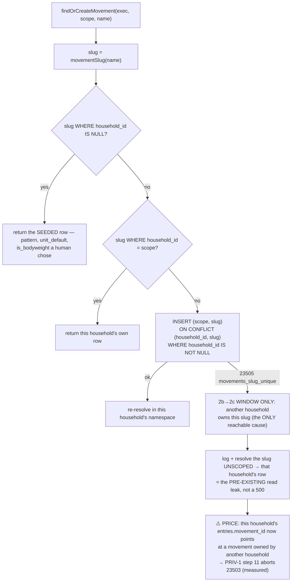

# TEN-2b — scope the writer: find-or-create resolves global-first, per household

> Backlog: [plan.md](../plan.md) row TEN-2b. Branch: `db/ten-2b-scoped-movement-lookup`.
> Milestone: [beta-1.md](../milestones/beta-1.md) → Beta 0, `TEN-2` (deadline: the **invite**).
> Stacked on **TEN-2a** ([plan](./ten-2a-household-movements.md), PR #273), the spec for every
> decision this plan does not re-open. ⚠️ **2b does not land until 2a is on `main`**, or the diff
> carries two migrations (AGENTS.md: one migration per PR) and an amendment to `0015` during 2a's
> review would surface here as a _modified_ migration, which the forward-only guard rejects.

## Goal

TEN-2a added `movements.household_id` and the two partial unique indexes and lit nothing up. This PR
is the writer: `findOrCreateMovement` takes a `HouseholdScope` and resolves **global-first**, the seed
and `seedProgram` move onto the global namespace, the FK is `VALIDATE`d, and the column stops being
dark. It also builds the control 2a left as prose — the `23505` fallback — and then pays that
fallback's real price, which the panel found and this plan measures.

## 🔴 What this PR does not do, and the one thing it cannot

The brief this PR was implemented from asked for TEN-1 1d's `db:verify` catalog verdict to be
**inverted** — _"LEAKS"_ → _"isolated", both directions_ — and for mutation patch
`04-slug-is-not-the-arbiter` to be rewritten or retired here. Both are **2c's**, by
[plan.md](../plan.md)'s own TEN-2b row (_"2b does NOT close the leak and does NOT flip the verdict"_)
and TEN-2c row, and by 2a's findings B8/P4. The correctness and security lenses each derived this
independently; correctness measured it four ways. The premise:

```
movements_slug_unique is NON-PARTIAL UNIQUE (slug) over the whole table. While it lives,
AT MOST ONE ROW PER SLUG EXISTS — so "A has a row for slug X and B has its own" is unreachable.
  A: insert (hh=A,'probe_novel') ON CONFLICT (household_id,slug) WHERE household_id IS NOT NULL => OK
  B: insert (hh=B,'probe_novel') same arbiter        => ERR 23505 movements_slug_unique
  A: same-scope retry                                => OK (absorbed, no 42P10)
  direct insert (hh=B,'box_jump')                    => ERR 23505 movements_slug_unique
```

⚠️ **Stated precisely, because "impossible" was too strong.** For a slug no global row owns, the
reachable outcomes are **(1) B is handed A's row** — the pre-existing read leak, via the fallback — or
**(2) B's write `23505`s**, a cross-household **denial**. Outcome 2 _is_ confidentiality-isolated and
would honestly redden the verdict. So the brief's demand is **satisfiable**; what it costs is
**availability**, and 2a already made that trade in the other direction (_"B gets A's row … instead of
a 500. That is the right failure direction"_). This PR honours 2a's choice and names it as a choice.
Two constructions that would give a third outcome, recorded so neither is reopened:

- **Drop the constraint in 2b** — 2a's P4, now measured rather than predicted: post-drop the
  _already-deployed_ `insert … on conflict (slug) do nothing` fails **`42P10`**, because a partial
  index is inferable only when the statement supplies an implying predicate. `migrate.yml` migrates on
  merge while Vercel deploys separately, so every free-text movement write breaks in the window.
- **Household-qualify the slug** (`slug || '__h' || id`) — genuinely a third outcome, and the wrong
  trade: `movementSlug` is the CSV grouping key (`export-month.ts`) and the v0→v1 bridge, it
  denormalises the tenant id into a text natural key, makes `uq_movements_household_slug` decorative,
  and obliges 2c to rewrite every household row's slug.

The verdict is the only input to `beta-1.md`'s go/no-go and its own header says _"an aspirational
assertion here would answer a go/no-go with a wish."_ **So the verdict stays `LEAKS`**, and 2b makes
it say which halves it closed — there are two, and one of them the draft of this plan was giving away.

⚠️ **Patch `04` is REGENERATED, which is not the same as rewritten or retired.** Its claim survives
(the global slug is still the arbiter of last resort) but its _bytes_ do not: every line of its only
hunk — the docblock tail, the signature, the mutated line, the `.values(...)` context — is rewritten
here, so `db:mutations` would fail `patch does not apply` rather than report RED. Same break
(`const slug = name`), same `.expect`, new context; traced and confirmed still the **first** assertion
to fail.

⚠️ **A correction to 2a's merged plan, recorded here because 2a is kept as-merged.** Its
§"The index behaviour, measured" lists `on conflict (slug) do nothing => OK (infers the non-partial)`
**under the `after … DROP CONSTRAINT` heading**. Post-drop it is **`42P10`** (measured). Harmless to
2a's conclusion — it _strengthens_ P4 — but a future author citing 2a as the spec could read it as
"the drop is safe for already-deployed code", which is the one mistake that breaks every movement
write in production. Also recorded in [lessons.md](../lessons.md).

## Acceptance

Verbatim from [plan.md](../plan.md) → TEN-2b:

> `findOrCreateMovementId` takes a `HouseholdScope` and resolves **GLOBAL-FIRST**: match `slug`
> against `household_id IS NULL` and return that row if found; **only then** `(scope, slug)`; **only
> then** insert `(scope, slug)`. The catalog read path and `programDayRows`' movement declaration
> follow.

Done when:

- `findOrCreateMovement(exec, scope, name)` resolves global → household → insert-household, with the
  narrow `23505` fallback, and **no module but `ownership.ts` can obtain the raw household id** —
  enforced, not claimed (see the `insertMovementOwnedBy` note).
- Every slug arbiter carries its index predicate **literally, in `where:`** (never `targetWhere:`).
- **The seed's shadow guard exists** and is **non-wedging**: detect before any movement write, omit
  only the shadowed seed rows, let everything after it seed, throw at the end of `seed()`.
- `seedProgram` resolves movements **in the global namespace only**.
- Migration `0016` runs `VALIDATE CONSTRAINT movements_household_id_households_id_fk`;
  `db:verify`'s `convalidated` assertion flips `false` → **`true`**.
- 🔴 **`db:verify`'s DB-side dark gate is RE-TAKEN, not deleted** — and **not** as "every non-seed row
  is owned", which is false (`verify.ts:755` replays the V1-1b backfill in raw SQL, minting non-seed,
  `pattern IS NULL`, `household_id IS NULL` rows no resolver ever touches). It becomes: **every row the
  resolver returned in this run is owned-or-seeded**, keeping 2a's anti-vacuity guard.
- 🔴 **Global-first is proved where the two orders actually differ** — inside a rolled-back transaction
  that drops `movements_slug_unique` (2a's own idiom). In 2b's live schema the two orders are
  **indistinguishable** (measured: identical ids, identical paths, identical sequence consumption), so
  an assertion outside that transaction would pass under the mutation it names.
- `apps/web/lib/dal/scoped.test.ts`'s `findOrCreateMovementId` entry is **gone**, forced by its own
  dead-entry assertion, **with one sentence left pointing at the surviving fallback residual** so the
  file does not read as "no residual"; `apps/web/lib/movements-household-is-dark.test.ts` is deleted.
- 🔴 **The fallback's price is documented where it is acted on and logged when it fires**:
  `runbooks.md` pre-flight (d) + step 11 + a repair step, `schema.ts`'s docblock, `notice.md`,
  `SECURITY.md` — all currently say this is impossible "by construction".
- Patch `04` regenerated and still RED; `01`/`03` still apply (the new helpers go at the **end** of
  `ownership.ts` so their contexts only shift).
- The sweep is clean:
  `git grep -nEi 'nothing reads or writes it|is \*\*dark\*\*|ships dark|cannot be scoped|must not start' -- . ':!docs/plans/' ':!docs/changelog'`
- `pnpm verify` · `db:verify` · `db:mutations` · `guides:check` · `status:check` · `e2e:local` ·
  `db:check` · Squawk on `0016` · forward-only + drift guards.

## The resolver



**Global-first, settled by 2a.** The only writer can author
`{publicId, slug, name, isBodyweight: false}` and never `pattern` or `unit_default`, so a household
row is always a strictly worse version of a curated one, and `programDayRows` reads exactly those
columns as _"the movement's declaration"_.

### The `23505` fallback — shape, and why it cannot be narrowed

Caught **narrowly** and only around the insert: code `23505` **and** constraint
`MOVEMENT_SLUG_UNIQUE_CONSTRAINT`, read off **either the error or its `.cause`** (the nesting is
`DrizzleQueryError`'s, not the driver's; production is node-postgres and `db:verify` is PGlite, so a
one-level difference would silently restore the denial with every gate green). Anything else
rethrows. The fallback resolves the slug **unscoped** and, finding nothing, **rethrows the original**
— never reaching `.id` on `undefined`.

⚠️ **A global-only fallback would be dead code.** Step 1 already missed, so no global row holds the
slug; step 2 missed, so we do not own it; therefore a `23505` on the non-partial constraint can only
mean **another household owns it**. Narrowing the re-resolve to `household_id IS NULL` would always
find nothing and always throw — i.e. it _is_ the denial. That is why the choice is binary, and why
2a's "fall back to the existing global row" reads as the unscoped lookup.

⚠️ **It fires silently otherwise, and it is the only control on the denial.** So it emits a structured
log (AGENTS.md → Observability) naming the slug's _collision_, never the household's free text.

⚠️ **The constraint name comes from a `schema.ts` const, and the pin already exists.**
`verify.ts:5456` hand-types `const SLUG_CONSTRAINT = 'movements_slug_unique'`; 2b hoists it and
converts that copy, so 2a's **existing** `expectRejectedBy(…)` assertions become the pin — by the
stronger mechanism, since `expectRejectedBy` reads `cause.constraint`, the field the fallback reads.
**No new `pg_constraint` query.** Name deliberately **not** `…_GLOBAL_…`: it would sit one line from
`MOVEMENT_SLUG_GLOBAL_UNIQUE_INDEX` with the opposite scope.

### 🔴 The fallback's price, measured — and the four documents that deny it

`schema.ts`'s `movements` docblock, [runbooks.md](../runbooks.md) pre-flight (d),
[SECURITY.md](../../.github/SECURITY.md) and [notice.md](../privacy/notice.md) all say a
cross-household `entries.movement_id` is _"prevented by construction"_. **2b's fallback is a writer
that produces it by design.** Measured:

```
B's entry referencing an A-owned movement                => INSERTED (nothing in the schema stops it)
step 11: DELETE FROM movements WHERE household_id = A    => ERR 23503 entries_movement_id_movements_id_fk
pre-flight (d) cross-household movement references       => 1
```

So household A's deletion — irreversible, hand-typed, after a 7-day cooling-off, in the procedure the
notice calls _"permanently removed"_ — **aborts mid-transaction**, and the runbook has no repair step.
2a's rule binds: _"Why 2a and not 2b: the FK that aborts the transaction is created by this PR, and the
runbook is read months later by someone who has just promised a family their data is gone."_ The writer
that creates this class is 2b's. The operator's answer: **repoint ¬A's `entries.movement_id` to a
¬A-owned clone, or refuse the deletion until 2c — never `SET NULL`**, which would promote the row into
the global reference namespace.

### 🔴 The seed's new arbiter silently skips — measured, and it reframes the shadow guard

The backlog's hazard is _"two rows, one slug"_. In the 2b→2c window that is not what happens:

```
insert (slug='x', household_id=NULL, pattern='squat')
  ON CONFLICT (slug) WHERE household_id IS NULL DO NOTHING   => OK, 0 rows
rows for slug 'x' => [{ household_id: A, pattern: null }]    -- the global catalog row was NEVER inserted
```

Postgres infers **both** arbiters — the non-partial constraint's empty predicate is trivially implied
by `WHERE household_id IS NULL` — so `DO NOTHING` absorbs the global collision too. **Without the guard
`db:seed` reports success while a seeded catalog row is missing**, seed-twice idempotency stays green,
and every household then falls into the fallback. The guard is the **only detector**; the symptom it
prevents is silence, not a duplicate.

**Refuse, not adopt** — adopting would promote one household's free text into the global reference
namespace, the defect `ON DELETE SET NULL` is forbidden for. And **non-wedging**, because `migrate.yml`
runs `db:migrate` then `db:seed` against production in one job on every push and `seed()` is **not**
transactional: detect before any movement write, omit only the shadowed seed rows, let `ramp_targets`
and `seedProgram` run, throw at the end. `runbooks.md` gains the recovery heading;
`migrate.yml`'s _"safe to always run"_ comment is corrected.

⚠️ The throw names **seed slugs only** — a public const — never the colliding row's `name`. The message
lands in a **world-readable** Actions log on a public repo, which is what makes that non-negotiable.

## 🔴 No backfill in 2b — a deliberate divergence from the backlog row

The TEN-2b row assigns a backfill. **This PR does not ship one, and moves it to 2c.** Six reasons,
five measured:

1. **Vacuous in production** — all 35 rows are the 35 const seed rows (2a's measurement).
2. 🔴 **It makes the 2b→2c window worse.** Moving a shared app-authored row out of the global namespace
   forces every _other_ household onto the fallback — which creates the `entries.movement_id` →
   foreign-household reference that **aborts PRIV-1 step 11**. Left at `household_id IS NULL`, those
   rows are resolved at step 1 by everyone, with no new erasure hazard: the status-quo leak 2c closes.
3. **It duplicates 2c**, which must compute referencing-households-per-movement anyway for the clone
   split, over the same row set.
4. **An unsolved edge 2a assigned to 2c**: `profiles.household_id` is nullable, so a row referenced by
   A _and_ an orphan profile satisfies `count(DISTINCT household_id) = 1` and is assigned to A
   (measured) — pre-flight (d)'s second direction.
5. 🔴 **A tombstone strands a row** (measured): a row with a live A entry and a **soft-deleted** B entry
   counts two households and stays global forever, where global-first keeps serving it to everyone and
   2c's splitter would clone A's text for a household whose only reference is a tombstone. Fixing it
   needs one definition of "referenced" shared with the orphan correction's hard `DELETE` — a decision
   2c should make once, not 2b make twice.
6. **It rewrites ownership with no dry run**, while AGENTS.md channels ownership-changing data edits
   into `db:correct` (dry-run-by-default, with an `Applied` table) — which is exactly where its sibling,
   the orphan `DELETE`, is already going.

Consequences: `0016` is `VALIDATE` only; the `RAISE NOTICE` question disappears (and notices are
discarded anyway — neither `createDbPool` nor `scripts/migrate.ts` attaches a `notice` listener);
`plan.md`'s _"logs each one"_ moves to 2c; and the restore-branch trigger (AGENTS.md: _"before any
destructive/backfill step"_) is not reached, so 2a's honest denial — **this migration changes no
data** — still applies.

### `0016` — shape

Produced with `drizzle-kit generate --custom --name ten2b_validate_movements_household` — **not** bare
`db:generate`, which emits _nothing_ for a no-schema-change migration (measured: `No schema changes,
nothing to migrate 😴`) and would leave the implementer hand-writing the snapshot and journal entry,
the silent chain break CI warns about. `--custom` emits the placeholder `.sql`,
`meta/0016_snapshot.json` with `prevId` chained to `0015`, and the journal entry; `db:check` then
passes and a following `db:generate` leaves a clean tree.

```sql
-- TEN-2b — VALIDATE the household FK that 0015 shipped NOT VALID.
-- (header: the Squawk-required timeouts, the measured lock set, IF IT FAILS, and a POINTER to this
--  plan — no production numbers, per 0015's own standing rule.)
SET lock_timeout = '5s';--> statement-breakpoint
SET statement_timeout = '60s';--> statement-breakpoint
ALTER TABLE "movements" VALIDATE CONSTRAINT "movements_household_id_households_id_fk";
```

**Squawk, measured:** as shown → `Found 0 issues`. `VALIDATE CONSTRAINT` **alone**, without the two
`SET`s → **2 warnings** (`require-lock-timeout`, `require-statement-timeout`). The timeouts are
gate-required here, not merely the 0006–0015 convention. ⚠️ Squawk lints **no DML at all**, so
"Squawk green" would have been zero evidence about a backfill.

**Locks, measured inside the transaction:** `movements` → `ShareUpdateExclusive` (+ `RowExclusive`,
`AccessShare`); `households` → `RowShare` (+ `AccessShare`). SUE blocks neither reads nor DML but
**does** conflict with `VACUUM`/`ANALYZE`/`CREATE INDEX`/another `ALTER`, so autovacuum on `movements`
is the realistic `55P03`. **Ordering vs a backfill was never load-bearing:** the `NOT VALID` FK's
referential triggers are already live (2a measured it), so `VALIDATE` can never be what catches a bad
`household_id`.

## What the verdict says after 2b — two halves close, and the plan claims both

The 1d section keeps its `LEAKS` headline and gains four facts. ⚠️ **"No assertion is weakened" was
false in the draft** — two existing assertions change, and both changes are honest wins:

1. **A seeded slug resolves from the global namespace explicitly** — `box_jump` resolves to the seeded
   row under **both** scopes, still `household_id IS NULL`. The 1d assertion that is **good** behaviour
   and had to survive.
2. **A novel name lands in the typist's OWN namespace.** So the surviving-refusal primitive is no
   longer cross-tenant: the row a refused session leaves behind is in the caller's own household, where
   step 11 removes it. It is garbage, not a leak. ⚠️ `verify.ts:5431`'s wording (_"still in the
   **shared catalog** — a cross-tenant write that survived its own refusal"_) is therefore **false after
   2b** and is corrected, not kept.
3. 🔴 **The programming half of the leak CLOSES.** 1d's (d) fixture seeds a block in household **A**
   naming a slug household **B** typed first; under 2b `seedProgram` finds it in neither the global nor
   A's namespace and **throws `unknown movement slug`**. So _"household A's own Today card renders
   household B's free text"_ is no longer reachable — a prescription can no longer attach to another
   household's movement row. The draft of this plan would have crashed `db:verify` here while claiming
   nothing changed; the block is restructured and the refusal is asserted as the win it is.
4. **The leak that survives is exactly one shape, named, and its price is proved.** B asking for a slug
   A owns gets A's row through the `23505` fallback; B's entry against A's movement then inserts, and
   step 11's `DELETE FROM movements WHERE household_id = A` raises `23503`. Committed so the erasure
   hazard cannot be forgotten between here and 2c.

## File-by-file changes

| Path                                                                              | Change     | What & why                                                                                                                                                                                                                                                                                                                                                                                                                                                                                                                                                                                                                                                                                                                                                                                                                  |
| --------------------------------------------------------------------------------- | ---------- | --------------------------------------------------------------------------------------------------------------------------------------------------------------------------------------------------------------------------------------------------------------------------------------------------------------------------------------------------------------------------------------------------------------------------------------------------------------------------------------------------------------------------------------------------------------------------------------------------------------------------------------------------------------------------------------------------------------------------------------------------------------------------------------------------------------------------- |
| `packages/db/src/writers/ownership.ts`                                            | EDIT       | At the **end** of the file (so patches `01`/`03` only shift): `movementIsGlobal()` / `movementIsOwned()` (the two namespace predicates, from `isNull`/`isNotNull`, each ≥2 consumers — the reuse rule) and `movementInHousehold(scope)` + **`insertMovementOwnedBy(exec, scope, row)`** (the containment rule). 🔴 The insert helper performs the insert so **the raw id never leaves this module** — a `movementOwnerValues(scope)` returning `{ householdId }` would hand any caller `.householdId` without matching `scope.test.ts`'s regex, i.e. an acceptance claim with no gate behind it. Docblock: the `<table>InHousehold` convention, the corrected "only place that reads `scope.householdId`" sentence, "four sites" → three. ⚠️ `inHousehold`'s own docblock tail stays byte-identical — patch `01`'s context. |
| `packages/db/src/writers/movement-catalog.ts`                                     | EDIT       | 🔴 The resolver: `(exec, scope, name)`, global-first, the partial arbiter with the predicate in `where:`, the narrow two-level `23505` catch, a structured log when it fires, a private `movementIdWhere(exec, where)` so the four lookups are one shape, and an explicit throw on every miss. **No throw interpolates `name` or `slug`** — `sentry-scrub.ts` passes `exception.value` through verbatim.                                                                                                                                                                                                                                                                                                                                                                                                                    |
| `packages/db/src/schema.ts`                                                       | EDIT       | Export `MOVEMENT_SLUG_UNIQUE_CONSTRAINT`. Correct two now-false claims: _"A predicate is not matched by anything"_ (an arbiter's `where:` must now imply the index predicate, or `42P10`), and _"cross-household references are prevented by construction"_.                                                                                                                                                                                                                                                                                                                                                                                                                                                                                                                                                                |
| `packages/db/src/seed.ts`                                                         | EDIT       | 🔴 The non-wedging shadow guard; the movements arbiter → `ON CONFLICT (slug) WHERE household_id IS NULL`; `seedProgram`'s `inArray` gains `movementIsGlobal()` — one line, one query, and last-row-wins dies **structurally**.                                                                                                                                                                                                                                                                                                                                                                                                                                                                                                                                                                                              |
| `apps/web/lib/dal/catalog.ts` · `entries.ts`                                      | EDIT       | `findOrCreateMovementId(scope, name)`; pass the already-resolved scope; the docblocks drop to two unscoped queries and state the honest residual.                                                                                                                                                                                                                                                                                                                                                                                                                                                                                                                                                                                                                                                                           |
| `apps/web/lib/dal/entries.test.ts`                                                | EDIT       | 🔴 The stub answers the **three** movement queries distinctly (global → `[]`, household → `[]`, re-resolve → the id). Today it answers any movements select with the id, so the resolver would short-circuit, emit no `INSERT`, and the order assertions would fail — and the tempting repair deletes the only test pinning "the catalog write commits before the session transaction opens". All three order assertions kept.                                                                                                                                                                                                                                                                                                                                                                                              |
| `apps/web/lib/dal/scoped.test.ts`                                                 | EDIT       | 🔴 Delete the `findOrCreateMovementId` entry; two left; one sentence kept pointing at the surviving fallback residual.                                                                                                                                                                                                                                                                                                                                                                                                                                                                                                                                                                                                                                                                                                      |
| `apps/web/lib/movements-household-is-dark.test.ts`                                | **DELETE** | The column is live. The deletion is the visible edit.                                                                                                                                                                                                                                                                                                                                                                                                                                                                                                                                                                                                                                                                                                                                                                       |
| `packages/db/migrations/0016_…sql` + `meta/`                                      | NEW/EDIT   | `VALIDATE CONSTRAINT`. Shape above.                                                                                                                                                                                                                                                                                                                                                                                                                                                                                                                                                                                                                                                                                                                                                                                         |
| `packages/db/scripts/verify.ts`                                                   | EDIT       | 🔴 `convalidated` → `true`; the dark gate re-taken (resolver-written rows); global-first proved inside the rolled-back constraint-drop transaction; `SLUG_CONSTRAINT` → the shared const; 1d's (d) block restructured + `:5431` corrected + the console line; the new TEN-2b section; `movementRow` gains `householdId`.                                                                                                                                                                                                                                                                                                                                                                                                                                                                                                    |
| `packages/db/scripts/mutations/04-*.{patch,expect}` · `README.md`                 | EDIT       | Regenerated against the new context; same break, same `.expect`; README says regenerated-not-retired, and why.                                                                                                                                                                                                                                                                                                                                                                                                                                                                                                                                                                                                                                                                                                              |
| `docs/runbooks.md`                                                                | EDIT       | 🔴 Pre-flight (d) from "prevented by construction" → "produced by 2b's fallback", **with the repair step**; step 11's abort case; the shadow-guard recovery heading.                                                                                                                                                                                                                                                                                                                                                                                                                                                                                                                                                                                                                                                        |
| `docs/privacy/data-inventory.md`                                                  | EDIT       | 🔴 Nine items: staleness header, re-review trigger 3, the twelve/six counts + 2a's ⚠️ box, **§1b → §1a** move, §1b's three claims, **delete** the §2 row (it cites the test this PR deletes), §3 item 2, §4's status, §8 retention re-pointed at `TEN-2b-2`.                                                                                                                                                                                                                                                                                                                                                                                                                                                                                                                                                                |
| `docs/privacy/notice.md`                                                          | EDIT       | The "not removed" bullet becomes scoped **plus an honest residual** — a name two households both used stays in the shared catalogue until 2c separates it. Re-dated.                                                                                                                                                                                                                                                                                                                                                                                                                                                                                                                                                                                                                                                        |
| `docs/architecture.md`                                                            | EDIT       | **Both** false notes (§2b and §4), and the resolver flowchart committed here — the diagram home, so the description and the repo agree.                                                                                                                                                                                                                                                                                                                                                                                                                                                                                                                                                                                                                                                                                     |
| `.github/SECURITY.md` · `docs/milestones/beta-1.md`                               | EDIT       | 🔴 _"no `household_id` column at all … cannot be scoped — there is nothing to scope by"_ sits under **MANDATORY** authorization rules and tells the next agent an unscoped write is permitted for this table. 2a's deferral ground (_"the conclusion is still true"_) expires here. One line each; the leak narrative stays 2c's.                                                                                                                                                                                                                                                                                                                                                                                                                                                                                           |
| `docs/features/write-path.md` (forced) · `strength-logging.md` · `programming.md` | EDIT       | The resolver row, invariant 2's four-sites paragraph, invariant 4c's mechanism (declaration resolved global-first; `seedProgram` now refuses a foreign slug). The latter two are not `guides:check`-forced; they are included because each states something 2b makes false.                                                                                                                                                                                                                                                                                                                                                                                                                                                                                                                                                 |
| `.claude/skills/db-migration/SKILL.md`                                            | EDIT       | Its seed section prescribes `targetWhere` for a conflict target — the form `onConflictDoNothing` **silently drops**. 2b is the first consumer, so 2b fixes the pointer.                                                                                                                                                                                                                                                                                                                                                                                                                                                                                                                                                                                                                                                     |
| `docs/plan.md`                                                                    | EDIT       | TEN-2 / 2b / 2c rows; **two new rows with ids** (`TEN-2b-1` find-or-create inside the transaction, `TEN-2b-2` the orphan correction) so deferred Beta-0 work is not left in a merged plan's prose; rule (d) re-pointed; the backfill and _"logs each one"_ moved to 2c with the tombstone definition; the acceptance sentences 2b rewrites, named.                                                                                                                                                                                                                                                                                                                                                                                                                                                                          |
| `docs/status.md` · `roadmap.md` · `tech-debt.md` · `lessons.md` · `beta-1.md`     | EDIT       | Pointers; tech-debt's _"2b and 2c each edit two files, not twelve"_ corrected (every "pointer" embeds the status clause); `lessons.md` gains the silent-skip measurement **and** 2a's probe-table correction.                                                                                                                                                                                                                                                                                                                                                                                                                                                                                                                                                                                                               |
| `docs/changelog/2026-10-10-db-ten-2b-scoped-movement-lookup.md`                   | NEW        | One fragment.                                                                                                                                                                                                                                                                                                                                                                                                                                                                                                                                                                                                                                                                                                                                                                                                               |

## Test plan

`db:verify`, PGlite, a new `// ── TEN-2b: the resolver is scoped ──` section plus the edits above.

1. **Resolution order, in 2b's live schema.** Under `A_SCOPE`: `seededBoxJump.name` → the seeded row,
   still `household_id IS NULL`; a novel slug → a new row with `household_id = A`; again → the same row.
   Under `B_SCOPE`: the seeded slug → the **same** seeded row. Fixtures from `MOVEMENT_SEED_ROWS` /
   `movementSlug()`, never hand-typed.
   ⚠️ **"No insert was attempted" is asserted on `movements_id_seq.last_value`**, not a row count: an
   absorbed `ON CONFLICT` **burns** an identity value while a pure `SELECT` does not, so the sequence is
   the only observable that distinguishes "resolved" from "tried to insert and was absorbed".
2. 🔴 **Global-first, inside the rolled-back constraint-drop transaction.** In 2b's live schema
   global-first and household-first are **indistinguishable** (measured: same ids, same paths, same
   sequence delta), because the distinguishing state — a global row and a household row sharing a slug —
   is exactly what the non-partial constraint forbids. So: `DROP CONSTRAINT`, create the pair, assert the
   resolver returns the **global** row, roll back unconditionally via the sentinel-throw idiom. Labelled
   for what it is: _the resolver under 2c's schema, with the interference removed_ — honest, because
   global-first is a property of **code**, unlike the verdict, which is a property of schema + code.
3. **The `23505` fallback.** A novel slug under `A_SCOPE`, then `B_SCOPE`: B gets A's row, exactly one
   row holds the slug, `movements_slug_unique` still binds, and the fallback's log fired.
4. 🔴 **The fallback's price.** B's entry against A's movement inserts; step 11's
   `DELETE FROM movements WHERE household_id = A` raises `23503` on
   `entries_movement_id_movements_id_fk`; pre-flight (d)'s query counts it. Rolled back.
5. **The arbiters.** A same-scope retry is absorbed (what `42P10` would break); the seed's global
   arbiter is idempotent across a third run.
6. **The shadow guard, both directions.** With a household row for a seed slug, `seed()` throws and the
   message **names the seed slug**; and the baseline it detects — with the omission removed, the global
   catalog row is _silently absent_. Without a shadow, `seed()` succeeds.
7. **The FK.** `convalidated = true`. (2a's "rejects a non-existent household" assertion is untouched.)
8. **`seedProgram`.** A slug existing **only** in a foreign household throws `unknown movement slug`
   with nothing written — the isolation assertion for this path, and fact 3 above. ⚠️ The draft's
   "exists both globally and in another household" case is **unconstructible** in 2b, so it moves inside
   test 2's transaction.
9. **The re-taken dark gate.** Every row the resolver returned in this run is owned-or-seeded, with 2a's
   property-based anti-vacuity guard kept.

Vitest: `scoped.test.ts`, `scope.test.ts`, `entries.test.ts`.

**Mutation testing.** `db:mutations` is the committed gate (`04` regenerated; `01`/`03` re-checked).
Hand-broken additionally, each reddening proof recorded in the PR body — three distinct ones:
**(i)** the global-first order reversed (caught only by test 2, which is why test 2 had to move inside
the transaction), **(ii)** the arbiter's `where:` predicate dropped (identical to moving it to
`targetWhere:`), **(iii)** the shadow guard's predicate inverted.

## Risks / rollback

| Risk                                                                                             | Mitigation                                                                                                                                                                                    |
| ------------------------------------------------------------------------------------------------ | --------------------------------------------------------------------------------------------------------------------------------------------------------------------------------------------- |
| 🔴 The 2b→2c **denial** window.                                                                  | The `23505` fallback, asserted by name and now logged, plus 2a's named invite precondition.                                                                                                   |
| 🔴 The fallback writes a cross-household movement reference → **PRIV-1 step 11 aborts `23503`**. | Measured, committed as an assertion, and `runbooks.md` pre-flight (d) + step 11 carry the **repair step**. Bounded to zero occurrences in practice by the invite precondition.                |
| `ON CONFLICT (household_id, slug)` without the predicate → `42P10` on the first custom movement. | The predicate is in `where:` (measured: a literal, no bind param); test 5 exercises the arbiter.                                                                                              |
| The error shape moves (a drizzle minor) → the fallback dies silently, restoring the denial.      | Read code/constraint off **either** level; test 3 is the backstop. ⚠️ Proved only on PGlite — production is node-postgres, which is why the two-level read is not optional.                   |
| The seed silently omits a global catalog row.                                                    | The shadow guard is the only detector; test 6 asserts the **baseline**, not just the throw.                                                                                                   |
| The shadow guard wedges the production migrate job.                                              | Non-wedging by construction, plus the runbook recovery heading and the named repair.                                                                                                          |
| A rename of `movements_slug_unique` makes the fallback dead code silently.                       | One `schema.ts` const, pinned by 2a's existing `expectRejectedBy` — the same field the fallback reads.                                                                                        |
| `0016` fails (`55P03` from autovacuum, or `statement_timeout`).                                  | One statement, one transaction, so no partial state; the migration stays pending and takes `db:seed` with it → `runbooks.md`'s pending-migration wedge. Recovery: `workflow_dispatch` re-run. |
| A reader of the column deploys ahead of `migrate.yml`.                                           | Not applicable — `0015` already added it. This is what 2a shipped dark for.                                                                                                                   |

**Rollback.** Reverting the code leaves a validated FK and the global UNIQUE intact, and the old
resolver still works (`ON CONFLICT (slug)` still infers the non-partial constraint). No data is
changed, so no restore branch — 2a's denial of the trigger holds now that the backfill is 2c's.

## Out-of-scope / deferred — each with a backlog row, not just prose

- 🔴 **The verdict flip and patch `04`'s retirement** — 2c's, per the top of this plan.
- 🔴 **The backfill** — moved to 2c, with the six reasons above and the tombstone definition it owes.
- 🔴 **Moving find-or-create inside `writeStrengthSession`'s transaction** — new row **`TEN-2b-1`**. 2a
  downgrades it from an isolation fix to garbage collection, and it needs the write core to take
  movement **names**, serializes the `Promise.all`, widens the transaction's lock footprint and flips a
  pinned assertion. ⚠️ **And it is strictly harder combined**: inside the transaction the `23505`
  fallback can no longer catch-and-re-query, because a failed statement aborts the transaction
  (`25P02`) and would kill the whole session write — it owes a `SAVEPOINT`, the mechanic `verify.ts`
  documents for exactly this. The two deferrals are therefore **not independent**.
- 🔴 **The orphan-row correction** (hard `DELETE`) — new row **`TEN-2b-2`**, ordered after `TEN-2b-1` by
  2a's rule (d). Vacuous today, and 2b gives _new_ orphans a deletion path they did not have
  (`household_id = H` → step 11), so deferring is not a privacy regression — but §8's retention row and
  `notice.md` now point at `TEN-2b-2`, not at "indefinitely with no owner".
- **A read-path predicate on `programDayRows` or `export-month`.** 2a settled the cross-household
  reference as writer-enforced; a predicate would make a card vanish or, in `export-month` — the
  de-facto portability answer — silently drop a month of training from the CSV, a privacy regression
  rather than a feature one. The fix 2b owes is in the writer, and that is what it ships.
- `movements.deleted_at` — still nothing may set it (2a alternative 5's hard constraint).

## Open questions

**None.** The draft offered the verdict's wording as a menu item; by 2a's own accepted finding S23 that
costs maintainer time, so it is **decided**: the headline stays `LEAKS` unqualified because it feeds a
go/no-go, and the four new assertions carry the nuance — including the two halves that genuinely closed.

## Review-response log (adversarial panel)

Panel: `correctness-reviewer`, `db-safety-reviewer` (required — migration), `scope-reviewer`,
`architecture-reviewer`, `reuse-reviewer`, `security-reviewer`, `privacy-reviewer`. **No UX panel:
nothing in 2b is user-facing.** Five lenses ran their own probes and their measurements are
load-bearing above. The shape survived (global-first, the fallback, `VALIDATE` in `0016`, verdict stays
`LEAKS`, patch `04` stays RED in substance); the findings landed on the **proofs** — two of which could
not fail and one of which crashed the run — the **documents that promise a parent something**, and one
thing the draft had plain wrong: the backfill.

### Accepted — blocking

| #   | Lens                                            | Critique                                                                                                                                                                                                                                                                                  | What changed                                                                                                                                                                                               |
| --- | ----------------------------------------------- | ----------------------------------------------------------------------------------------------------------------------------------------------------------------------------------------------------------------------------------------------------------------------------------------- | ---------------------------------------------------------------------------------------------------------------------------------------------------------------------------------------------------------- |
| B1  | **correctness** (measured)                      | 🔴 Test 2 and the "global-first reversed" mutation **cannot fail**: the two orders are indistinguishable in 2b's live schema (same ids, paths, sequence delta), because the distinguishing state is what the non-partial constraint forbids. Test 8 was **unconstructible**.              | Both moved inside a rolled-back `DROP CONSTRAINT` transaction (2a's idiom), labelled as _the resolver under 2c's schema_. The single most valuable catch: the plan's central design decision had no proof. |
| B2  | **correctness · security** (measured)           | 🔴 `seedProgram`'s change makes `db:verify` **crash** at the 1d (d) fixture — and that means 2b **closes the programming half of the leak**, a win the plan was giving away while claiming "no assertion changes".                                                                        | Fact 3 added and claimed; the (d) block restructured; `verify.ts:5431`'s "shared catalog" wording corrected; the "nothing is weakened" sentence withdrawn as false.                                        |
| B3  | **privacy · db-safety · security** (+ my probe) | 🔴 The `23505` fallback **creates** the cross-household `entries.movement_id` that `schema.ts`, `runbooks.md`, `SECURITY.md` and `notice.md` call _"prevented by construction"_, and PRIV-1 step 11 then aborts `23503` with no repair step.                                              | Measured, committed as fact 4/test 4, and all four documents added with the operator's repair. Plus a structured log, since the one control this PR builds was silent.                                     |
| B4  | **scope · db-safety · privacy** (independently) | 🔴 The backfill is vacuous in production, duplicates 2c, mis-assigns a row referenced by an orphan profile, strands a row behind a **tombstone**, assigns ownership without authorship — and **enlarges** B3's population.                                                                | **Cut from 2b**, six reasons, moved to 2c. `0016` becomes `VALIDATE`-only, which also removes the `RAISE NOTICE` question, the lookalike proof and the restore-branch trigger.                             |
| B5  | **correctness · architecture · security**       | 🔴 `verify.ts`'s DB-side all-NULL dark gate — 2a's _"load-bearing half"_ — goes RED in 2b and the plan never named it. **And the obvious replacement is wrong**: `verify.ts:755` replays the V1-1b backfill in raw SQL, minting non-seed `household_id IS NULL` rows no resolver touches. | Re-taken, scoped to **rows the resolver returned in this run**, keeping the anti-vacuity guard. The second catch saved a false assertion.                                                                  |
| B6  | **architecture · correctness · security**       | 🔴 "Patch `04` stays unchanged" is unachievable — every line of its hunk is rewritten, so `db:mutations` fails `patch does not apply`.                                                                                                                                                    | **Regenerated** (same break, same `.expect`, traced as still the first failure); the new helpers go at the **end** of `ownership.ts` so `01`/`03` only shift.                                              |
| B7  | **db-safety** (measured)                        | 🔴 The seed's new arbiter **silently skips** — Postgres infers both arbiters, so `DO NOTHING` absorbs the global collision and the catalog row is never inserted. The plan's stated hazard was 2c's symptom.                                                                              | Measurement in the plan; the guard is _"the only detector"_; test 6 asserts the **baseline**, not just the throw.                                                                                          |
| B8  | **db-safety · correctness**                     | 🔴 `drizzle-kit generate` emits **nothing** for a no-schema-change migration, so the plan's command would make the implementer hand-write the snapshot and journal — the silent chain break CI warns about.                                                                               | Replaced with the measured `--custom` invocation and its three artifacts; `db:check` added to the gates.                                                                                                   |
| B9  | **privacy · architecture**                      | 🔴 The `data-inventory.md` list covered 3 of 9 edits, including the §2 row that **cites the test this PR deletes** and the re-review trigger 2a armed to catch 2b.                                                                                                                        | All nine enumerated, with the §1b → §1a move `plan.md` names explicitly.                                                                                                                                   |
| B10 | **architecture**                                | 🔴 Two Beta-0 items with an invite deadline were deferred to _"their own row"_ with no row created — 2a's own B7 failure mode; rule (d) would point at a PR that does not exist.                                                                                                          | `TEN-2b-1` and `TEN-2b-2` created with ids, rule (d) re-pointed, and the acceptance sentences 2b rewrites named.                                                                                           |
| B11 | **privacy**                                     | 🔴 `movement-catalog.ts` interpolates the household-typed slug into an error message, and `sentry-scrub.ts` passes `exception.value` verbatim — and 2b adds two more failure paths.                                                                                                       | No throw in the rewritten resolver interpolates `name` or `slug`, as a standing rule for the function.                                                                                                     |
| B12 | **security**                                    | 🔴 `SECURITY.md`'s _"cannot be scoped — there is nothing to scope by"_ sits under **MANDATORY** authorization rules and tells the next agent an unscoped write is permitted for this table. 2a's deferral ground expires here.                                                            | Edited in 2b, with `beta-1.md`; the leak narrative and the mis-attribution stay 2c's.                                                                                                                      |
| B13 | **security**                                    | 🔴 `movementOwnerValues(scope)` is a hole in the capability rule the acceptance claims is _enforced_: it returns a plain object carrying the raw id, so any module can read `.householdId` without matching `scope.test.ts`'s regex.                                                      | Replaced with **`insertMovementOwnedBy(exec, scope, row)`** — the number never leaves `ownership.ts`, so the acceptance item has a gate behind it again.                                                   |

### Accepted — substantive

| #   | Lens                        | Critique                                                                                                                                                                                                                                       | What changed                                                                                                                                                      |
| --- | --------------------------- | ---------------------------------------------------------------------------------------------------------------------------------------------------------------------------------------------------------------------------------------------- | ----------------------------------------------------------------------------------------------------------------------------------------------------------------- |
| S1  | correctness                 | Test 3's negative ("no row count changed") cannot fail on what it names — both paths leave the count unchanged.                                                                                                                                | Asserted on `movements_id_seq.last_value`: an absorbed `ON CONFLICT` burns an identity value, a `SELECT` does not.                                                |
| S2  | correctness                 | `entries.test.ts`'s stub answers any movements select with the id, so under 2b the resolver short-circuits and the order assertions fail — and the easy repair deletes the only test pinning the commit-before-`BEGIN` order.                  | The stub answers the three queries distinctly; all three order assertions kept.                                                                                   |
| S3  | correctness                 | The fallback's error shape is **drizzle-internal**; production is node-postgres and `db:verify` is PGlite, so a one-level difference silently restores the denial with every gate green. Also: the re-resolve can legitimately return nothing. | Read off either level; explicit rethrow on a miss; both in the risk table.                                                                                        |
| S4  | security                    | "Isolation is not a reachable outcome" conflated confidentiality with a working writer: letting `23505` propagate _is_ isolated. It is a **choice** (availability over confidentiality), not an impossibility.                                 | Reframed as a trade, with 2a's reasoning cited; the mangled-slug option recorded as considered-and-rejected (raised independently by correctness).                |
| S5  | reuse                       | The predicate pair was half-extracted — no `IS NOT NULL` helper, the one the _new_ arbiter needs; and `isNull()`, not a `sql` copy, is the repo idiom.                                                                                         | Both halves named; measured that `isNull`/`isNotNull` render the literal the planner needs, matching `ramp_targets`.                                              |
| S6  | reuse                       | The new const would land three lines from a hand-typed copy it did not convert, recreating debt `tech-debt.md` already records — and `…_GLOBAL_…` collides with the partial-index const.                                                       | Renamed `MOVEMENT_SLUG_UNIQUE_CONSTRAINT`; `verify.ts:5456` converted; 2a's existing `expectRejectedBy` is the pin.                                               |
| S7  | reuse · architecture        | Four copies of one `select({id}).limit(1)`, and the resolution **order** was about to be written twice.                                                                                                                                        | A private `movementIdWhere`; and `seedProgram` takes the scope lens's smaller fix, which removes the second copy entirely.                                        |
| S8  | scope                       | `seedProgram`'s "global-first then block household" had no caller — every seeded slug is a catalog slug.                                                                                                                                       | Global namespace only; last-row-wins dies structurally; the existing unknown-slug throw covers the rest, and patch `03`'s context survives.                       |
| S9  | db-safety · security        | A throwing shadow guard fails the **production** migrate job on every push, and `seed()` is not transactional.                                                                                                                                 | Non-wedging: detect before any movement write → omit only shadowed rows → seed everything else → throw last. Runbook heading + `migrate.yml`'s comment corrected. |
| S10 | reuse · scope · correctness | Test 7 re-typed the migration's SQL into `verify.ts` — a lookalike proof, the failure `movement-catalog.ts` exists to argue against.                                                                                                           | Moot once the backfill is cut; the principle is recorded for 2c, which inherits the query.                                                                        |
| S11 | privacy · db-safety · reuse | A production measurement was headed for `0016`'s forward-only header, one PR after 2a banned exactly that.                                                                                                                                     | Header carries a pointer only.                                                                                                                                    |
| S12 | privacy                     | The `notice.md` edit traded an honest caveat for a removal promise three classes of row do not keep.                                                                                                                                           | The bullet keeps a one-sentence residual; §8's row rewritten and re-pointed at `TEN-2b-2`; both documents re-dated.                                               |
| S13 | architecture                | `architecture.md` has **two** false notes, and a three-way namespace resolution with a fallback is a pivotal flow the diagram home should hold.                                                                                                | Both edited; the flowchart committed there.                                                                                                                       |
| S14 | reuse · architecture        | `schema.ts`'s _"a predicate is not matched by anything"_ is falsified by 2b.                                                                                                                                                                   | Docblock corrected; the arbiter test named as the sync mechanism (a mismatch is `42P10`, a red build).                                                            |
| S15 | reuse · scope               | `movementRow` lacks `householdId`, which nearly every new assertion needs; fixtures hand-typed `'Box Jump'`.                                                                                                                                   | `movementRow` gains the column; fixtures from `MOVEMENT_SEED_ROWS` / `movementSlug()`.                                                                            |
| S16 | db-safety · scope           | Squawk was cited as evidence about the backfill; Squawk lints **no DML**, and `VALIDATE` alone raises two warnings without the `SET`s.                                                                                                         | Both measurements in the plan; the timeouts stated as gate-required.                                                                                              |
| S17 | architecture · reuse        | `tech-debt.md`'s _"2b and 2c each edit two files, not twelve"_ did not hold — every "pointer" embeds the status clause.                                                                                                                        | Corrected, and the phrasing-tolerant sweep added to Acceptance.                                                                                                   |
| S18 | db-safety                   | No "IF IT FAILS" row anywhere, though `0016` does real work and has a timeout mode `0015` never had.                                                                                                                                           | Added to the header and the risk table.                                                                                                                           |
| S19 | scope                       | The refusal section was ~35 lines duplicating three places the implementer already reads.                                                                                                                                                      | Cut hard, keeping 2b's own re-measurement, the two rejected constructions and the patch-`04` distinction.                                                         |
| S20 | scope                       | Six hand-mutations where three distinct ones exist.                                                                                                                                                                                            | Three.                                                                                                                                                            |
| S21 | architecture · scope        | `programming.md` invariant 4c is a 🔴 cross-file invariant whose mechanism 2b changes; a one-liner under-specifies it.                                                                                                                         | Expanded, and the deliberate (unforced) inclusion of two guides stated.                                                                                           |
| S22 | db-safety                   | Stacked-branch hazard: landing 2b before 2a merges puts two migrations in one PR.                                                                                                                                                              | In the plan's header.                                                                                                                                             |
| S23 | privacy                     | The guard's throw wording could leak the colliding row's free text, and the destination is a public Actions log.                                                                                                                               | Seed slugs only, with the destination as the stated reason.                                                                                                       |
| S24 | privacy                     | `export-month.ts` — not just `programDayRows` — is the de-facto portability answer.                                                                                                                                                            | Named in the no-read-predicate rationale.                                                                                                                         |
| S25 | correctness                 | 2a's merged plan mis-files a probe line: `on conflict (slug) do nothing => OK` appears under the post-`DROP` heading; post-drop it is `42P10`.                                                                                                 | Corrected here and in `lessons.md`, since 2a is kept as-merged.                                                                                                   |
| S26 | security                    | Deleting the allowlist entry leaves the file reading "no residual" while the fallback residual survives to 2c.                                                                                                                                 | One sentence kept, pointing at the verdict.                                                                                                                       |
| S27 | security · scope            | The Open Question offered the verdict wording as a menu item — 2a's own S23 says that costs maintainer time.                                                                                                                                   | Decided, not offered.                                                                                                                                             |

### Pushed back

| #   | Lens                 | Critique                                                                                                           | Why not                                                                                                                                                                                                                                                                                                                                                                                                                                                                       |
| --- | -------------------- | ------------------------------------------------------------------------------------------------------------------ | ----------------------------------------------------------------------------------------------------------------------------------------------------------------------------------------------------------------------------------------------------------------------------------------------------------------------------------------------------------------------------------------------------------------------------------------------------------------------------- |
| P1  | **security**         | Narrow the fallback to re-resolve **only** `household_id IS NULL`, so it provably cannot create a cross-tenant FK. | **Declined on a logical point the finding misses: that fallback would be dead code.** A `23505` here is reachable _only_ when another household owns the slug — step 1 proved no global row holds it and step 2 proved we do not. So a global-only re-resolve always finds nothing and always throws, i.e. it **is** the denial. The trade is binary, and 2a settled it for availability. I took everything else in the finding: the documents, the repair step, and the log. |
| P2  | reuse · architecture | Export `resolveMovementIdBySlug` so `seedProgram` shares the order.                                                | **Declined for the scope lens's smaller fix**, which dissolves the problem rather than abstracting it: `seedProgram` resolves in the **global namespace only**, where there is no order to duplicate and no last-row-wins. It also keeps the documented "one `inArray` per block, no N+1" invariant true and leaves patch `03`'s context intact.                                                                                                                              |
| P3  | security             | Hoist the shadow guard to the **top** of `seed()` so it fails before any write.                                    | **Partly declined**, against db-safety's opposite finding. The guard _detects_ before any movement write, so nothing harmful is written either way — and every seed write is `ON CONFLICT DO NOTHING`, so a completed seed is strictly better than a partial one. Throwing last satisfies db-safety's "one bad slug must not block unrelated reference data" and still fails loudly.                                                                                          |
| P4  | db-safety            | Attach a `notice` listener in `scripts/migrate.ts` so backfill notices are visible.                                | **Moot** — the backfill is cut, so 2b emits no notices. Recorded for 2c, which inherits the reporting obligation and already owes a prod-runnable dry-run reporter where the output is read.                                                                                                                                                                                                                                                                                  |
| P5  | scope                | Also cut the shadow guard and the `MOVEMENT_SLUG_UNIQUE_CONSTRAINT` const as one-PR ceremony.                      | **Split.** The const is kept but **re-justified**: it converts a hand-typed copy and reuses 2a's existing assertion as the pin, so the net is one fewer literal, not one more home. The guard is kept outright — db-safety measured that without it the failure is a _silently missing catalog row_, a state nothing else would ever report.                                                                                                                                  |
| P6  | scope                | The refusal belongs only in Out-of-scope.                                                                          | **Partly declined.** Trimmed hard, but 2b's own re-measurement stays at the top: this PR was briefed to do the opposite, and the next reader needs the arithmetic before the design, not after it.                                                                                                                                                                                                                                                                            |
