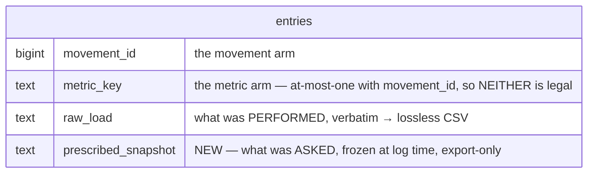

# V1-22 chunk 1 — `entries.prescribed_snapshot`, shipping dark

> Backlog: [docs/plan.md](../plan.md) → **V1-22**. Spec:
> [v1-22-authoring-program-editing](../specs/v1-22-authoring-program-editing.md), chunk 1.
> Model: [ADR 0005](../decisions/0005-programming-model.md) decision 5.
> Milestone: [beta-1](../milestones/beta-1.md) §3b.

## Goal

Add the column and the constraint that let a logged entry remember **what was asked of it**, so the
first prescription edit cannot rewrite a past month's CSV.

**Why it is its own PR:** chunk 2 is a separate concern whether or not the column ships first. It adds
`formatPrescribedForExport` to `packages/shared`, the log-time writer, the export fallback **and** a
prescription public id on the log form's submit payload, and it must sequence against V1-30b
(`spec:145`) — its own PR under AGENTS.md's one-concern rule regardless. So the split costs nothing.
The deploy race is the _secondary_ reason and is small at 3 users: `migrate.yml` runs on merge while
Vercel deploys in parallel, so merging them would expose a minutes-long window in which a strength
write 500s.

This is the `0006_spooky_lyja.sql` idiom, whose header already states every property this migration
has: _"Metadata-only ADD COLUMN: nullable, no default, no index … No table rewrite … No app code reads
the column here — the DAL/render land in PR 1b, so there is no deploy-order window."_

## Acceptance

Spec items **10** and **12** (`spec:69-71`, `:74-76`). Item **11** (byte-identity between the snapshot
and legacy paths) is **chunk 2's** and is named in Out-of-scope so it cannot fall between chunks.

> 10. **While** an entry's `prescribed_snapshot` **is NULL**, the export **shall** fall back to the
>     live `(day_role, movement)` match, including emitting **empty** on an ambiguous match. `''` and
>     `NULL` **shall** be distinct stored values; the predicate is `IS NULL`, never
>     `coalesce(…,'') = ''`.

Done when:

- `entries.prescribed_snapshot` exists, `text`, **nullable**, no default, **no index**.
- `entries_prescribed_snapshot_movement_check` rejects a non-NULL snapshot on **any non-movement-arm
  row** — the metric arm **and** the _neither_ arm — and accepts the three NULL-snapshot arms plus a
  snapshot on the movement arm. **Each of the state table's nine rows is a `db:verify` case**, including
  the `''`-on-movement-arm row, which doubles as the readback assertion (`''` reads back as `''`, and
  `IS NULL` is false for it).
- **The window stays shut:** no bare `.select()`, `.returning()` or `db.query.` against `entries`
  anywhere in `apps/` or `packages/`. That — not a grep for the column name — is the invariant, because
  drizzle expands the **schema's** column list for an unprojected read, so a bare `select()` would name
  the column from `schema.ts` alone and throw against an un-migrated DB.
  ⚠️ **Checked at MERGE time on the final branch, not at plan time** — another in-flight PR could add a
  bare `entries` read and merge first. The procedure, because a naive grep has false positives:
  `grep -rn '\.select()\|\.returning()\|db\.query\.' apps packages --include='*.ts'`, then read each
  hit and confirm none targets `entries`. _Today: nine hits, all bare `.select()` in
  `packages/db/scripts/verify.ts`, none on `entries`; zero `returning()`._ If this ever needs to be
  permanent, the committed precedent is `apps/web/app/p/[profileId]/use-server-exports.test.ts` — a
  source-scanning vitest guard with its own "the scan works" case so it cannot pass vacuously.
- `grep -rln prescribed_snapshot apps packages --include='*.ts' --include='*.tsx'` returns **exactly**
  `packages/db/src/schema.ts` and `packages/db/scripts/verify.ts`. (The `--include` matters: the
  migration `.sql` and `meta/0013_snapshot.json` both contain the column name and both live under
  `packages/`, so an unfiltered grep is false on a correct implementation.)
- `drizzle-kit generate` leaves a clean tree, with the CHECK **absent** from `schema.ts`.

## Why `entries`, not `entry_sets`

**There is no authored target at set grain anywhere.** `prescriptions` has only `sets` and
`target_reps` (`schema.ts:659-660`); `prescription_targets` has only `load` and `reps` (`:700-703`).
GAP-3 moved **measured** magnitudes down to `(set, slot)` and deliberately left the **authored** axis
at movement grain, and the spec defers set-grain shapes outright (`spec:187`). So `entry_sets` and
`entry_set_quantities` have nothing to snapshot. Corroborating: `prescribed` is a single non-nullable
field on `StrengthLogRow` (`packages/shared/src/csv/strength-log.ts:24`).

⚠️ **Two wordings not to inherit.** `foldStrengthRows`' own header says "one row per movement"
(`apps/web/lib/dal/export.ts:29`) but it folds by **entry id** (`:31`, `:36` — `byEntry` keyed on
`r.entryId`). And the spec's acceptance 9 says "when a strength **set** is logged" — the write is once
per **entry**; chunk 2 should correct that wording.
_(`docs/samples/legacy-csv/strength-log/README.md:52` also says "one row per movement", but that
describes the legacy CSV contract and is correct — not a third instance.)_

## The constraint

Line-for-line sibling of `entries_superset_movement_check`
(`packages/db/migrations/0005_silly_revanche.sql:47` — `CHECK ("superset_id" is null or "movement_id"
is not null)`, reasoned at `0005:44` as forbidding "a superset of check-ins"). Same table, same shape,
same rule. **Named for the rule, not the column**, per this table's convention: a value-domain check is
`entries_<col>_check` (`entries_kind_check`, `entries_status_check`), a cross-column guard is named for
what it enforces (`entries_shape_check`, `entries_value_source_check`,
`entries_superset_movement_check`).

```sql
-- Every existing row has prescribed_snapshot = NULL (the column is created in the statement above),
-- and `NULL IS NULL` is TRUE, so the validating scan reads rows that cannot fail — on a table of
-- <ROWS> rows.  ⚠️ <ROWS> IS A MERGE GATE: no row count, no merge (see Open questions).
-- NOT VALID + VALIDATE buys nothing here and Squawk rejects it anyway (verified): in one
-- file it is one transaction, and the gate answers "will block all reads while the constraint is
-- validated". See AGENTS.md's carve-out and 0009/0010. 0002/0005 did split it in-file; they predate
-- the Squawk gate and are grandfathered.
-- squawk-ignore constraint-missing-not-valid
ALTER TABLE "entries" ADD CONSTRAINT "entries_prescribed_snapshot_movement_check"
  CHECK ("prescribed_snapshot" IS NULL OR "movement_id" IS NOT NULL);--> statement-breakpoint
```

⚠️ **`--> statement-breakpoint` is itself a `--` comment.** On its own line between the ignore and the
statement it **voids the ignore** and the rule fires again. It stays a trailing token on the preceding
statement's line (the `0009:19` / `0012:31-33` style).

**Why this arm is provably right:** `prescriptions.movement_id` is `.notNull()`
(`schema.ts:655-657`), so no prescription can exist without a movement — there is no prescription shape
a metric or boolean entry could ever snapshot. A superset member is already constrained to the movement
arm, so it is a strict subset of the accept set.

### The state table — and it is the test specification

`entries_value_source_check` is **at-most-one, not XOR**
(`0002_freezing_cargill.sql:79` — `CHECK ("movement_id" IS NULL OR "metric_key" IS NULL)`), so the
_neither_ arm is legal and documented (`docs/spec.md:96-98`, `architecture.md:247-248`): a boolean
habit check-in names only its `activity_type`. V1-5 shipped that writer.

| `prescribed_snapshot` | Arm (`movement_id` / `metric_key`) | Result                           |
| --------------------- | ---------------------------------- | -------------------------------- |
| `NULL`                | movement (NOT NULL / `NULL`)       | accept                           |
| `NULL`                | metric (`NULL` / NOT NULL)         | accept                           |
| `NULL`                | **neither** (`NULL` / `NULL`)      | accept                           |
| `''`                  | movement                           | accept — **and reads back `''`** |
| `''`                  | metric                             | **reject**                       |
| `''`                  | **neither**                        | **reject**                       |
| `'4x3 @ 145'`         | movement                           | accept                           |
| `'4x3 @ 145'`         | metric                             | **reject**                       |
| `'4x3 @ 145'`         | **neither**                        | **reject**                       |

**Both axes are three-valued on purpose: these nine cases kill five mutants, and no smaller grid does.**
The **neither** rows kill the adjacent-column typo (`… OR metric_key IS NULL` — those columns are
declared consecutively at `schema.ts:196-197` and the existing guard is written in terms of that pair).
The NULL-snapshot accepts kill the dropped-left-disjunct (`CHECK (movement_id IS NOT NULL)`), which
would break every existing weigh-in. And the `''` rows kill three more a non-empty-only grid misses —
including `coalesce(prescribed_snapshot,'') = '' OR …`, **the exact form spec item 10 forbids by name**,
and `prescribed_snapshot = '' OR …`, which slips through on NULL because `NULL = ''` is NULL.

### Why `''` must be storable, and no `CHECK (<> '')`

**A _matched_ prescription legitimately renders `''`.** The composer is
`[sets ? \`${sets}x${reps}\` : reps, load ? \`@ ${load}\` : ''].filter(Boolean).join(' ')`
(`apps/web/lib/dal/export.ts:108-111`), and `sets`/`target_reps`/`load`are all nullable — so a
movement-only prescription renders empty. That is the **dominant** shape: 11 of the 13 live
prescriptions are`open()` (`packages/shared/src/programming.ts`). Ambiguity is the secondary reason,
not the primary one.

**Chunk 2 inherits one rule from this:** the fallback is `snapshot ?? live`, **never `||`**.
`StrengthLogRow.prescribed` is a non-nullable `string`, so `||` collapses a stored `''` back into the
live match and silently re-enables the rewrite acceptance 8 forbids. It is the TypeScript mirror of
"`IS NULL`, never `coalesce(…,'') = ''`".

## Mermaid ERD delta (for the PR description)

AGENTS.md wants an ERD in the description for a schema change, and ADR 0005's panel accepted it for
"the implementing PR **and** `docs/architecture.md`" (`0005:362`) — house precedent for putting it in
the plan is `docs/plans/v1-8-strength-sessions.md:152`. The committed `architecture.md` edit is **one
line** beside `text raw_load` (that file's `entries` block is already a curated subset); the
description embeds the same delta:



> `entries_prescribed_snapshot_movement_check`: `prescribed_snapshot IS NULL OR movement_id IS NOT NULL`

## File-by-file changes

| File                                                  | NEW/EDIT | Change                                                                                                                                                                                                                                                                   |
| ----------------------------------------------------- | -------- | ------------------------------------------------------------------------------------------------------------------------------------------------------------------------------------------------------------------------------------------------------------------------ |
| `packages/db/src/schema.ts`                           | EDIT     | One column on `entries`, beside `rawReps` (`:183-184`): `prescribedSnapshot: text('prescribed_snapshot')`. Docblock: the `raw_*` relationship, `''` ≠ NULL, and that the CHECK is hand-added in `0013`. **No `check()` entry** — the idiom at `:185-191` and `:201-204`. |
| `packages/db/migrations/0013_prescribed_snapshot.sql` | NEW      | `SET lock_timeout` → `SET statement_timeout` → `ADD COLUMN IF NOT EXISTS` → `ADD CONSTRAINT`, each with a trailing `--> statement-breakpoint`. Header: the WHY, the ships-dark invariant, the row count, the chunk-2 gate, the Squawk argument.                          |
| `packages/db/migrations/meta/*`                       | EDIT     | Generated. `_journal.json` append-only, and its `tag` renamed with the file **in the same commit** (drizzle reads `<tag>.sql`; a mismatch is an ENOENT in `db:verify`).                                                                                                  |
| `packages/db/scripts/verify.ts`                       | EDIT     | A `// ── V1-22 chunk 1: the prescribed snapshot ──` section — the six state-table cases. Ids from a **local counter** (the `insertBodyweightProbe` idiom, `verify.ts:2797`), never hand-assigned.                                                                        |
| `docs/architecture.md`                                | EDIT     | §4 ERD: one line beside `text raw_load` (`:204-214`).                                                                                                                                                                                                                    |
| `docs/spec.md`                                        | EDIT     | The `entry` bullet (`:93-98`): the column, and `entries_prescribed_snapshot_movement_check` with its migration number, in the existing style.                                                                                                                            |
| `docs/runbooks.md`                                    | EDIT     | NEW section — what a failed `0013` leaves behind, and the chunk-2 gate query.                                                                                                                                                                                            |
| `docs/plan.md`, `docs/status.md`, `docs/changelog/`   | EDIT     | V1-22 row links this plan; pointer; fragment.                                                                                                                                                                                                                            |
| `docs/specs/…authoring-program-editing.md`            | EDIT     | Mark chunk 1 done, **and correct the §`db:verify` line** (`spec:160`) — it still names the old `entries_prescribed_snapshot_check` and a metric-arm-only proof, both superseded. Plus the chunk-6 identity obligation.                                                   |
| `docs/csv-recording-gaps.md`                          | EDIT     | P1-2's **"Fix:"** gains the third answer these chunks actually chose.                                                                                                                                                                                                    |

### What the runbook owes

Only what is **not** already there. `docs/runbooks.md:78-95` already documents the wedge — a failed
migration re-fails on every later push, takes `db:seed` with it, and the freeze lasts until it goes
green — **including the `lock_timeout` variant by name**. So item 1 is one generalising clause on that
section ("the same for any pending migration, including `0013`"), not a third narrative copy.

The genuinely new thing is **the chunk-2 gate**, and `runbooks.md:64-72` is already the template
("**Check both, don't assume**"): the migrate run is green **on the merge SHA**, _and_

```sql
SELECT pg_get_constraintdef(oid) FROM pg_constraint
 WHERE conname = 'entries_prescribed_snapshot_movement_check';
```

returns the predicate in `0013`, _and_ the column is in `information_schema.columns`. The log alone
rules out only one failure mode (`migrate.yml:52-54` `exit 0`s when the secret is absent), and a wedge
from an unrelated pending migration also "looks fine in the log". It lives in the runbook because that
is where chunk 2's author will look.

## Test plan

`packages/db/scripts/verify.ts`, one section, the six state-table rows. Three fixture rules, each from
an existing trap:

- **Ids from a local counter**, per `verify.ts:2797` ("so adding a case never collides with the
  hand-assigned ids elsewhere in this file"). There are 23 hand-numbered insert families in that file;
  a `uq_entries_client_id` collision would make `expectRejectedBy` — which asserts on
  `cause.constraint` (`verify.ts:91-103`) — report the **wrong** constraint, and the proof would stop
  proving anything while staying green.
- **The reject fixtures must satisfy every other `entries` CHECK**, or Postgres reports a different
  constraint. Use `kind: ENTRY_KIND.bodyweight` + `valueNum` so `entries_shape_check` evaluates
  definitively TRUE rather than NULL (`schema.ts:243-253`). For the metric-arm row use
  `metricKey: 'stance'` + `unit: 'bool'` (the `verify.ts:704` fixture). Every reject row must also set
  `activityTypeId`, or `entries_activity_type_id_not_null` (`0003:21` — hand-added, so invisible in
  `schema.ts`) arbitrates first; that is the trap `verify.ts:703` already exists for.
- **Real strings, not invented ones.** `'4x3 @ 145'` is what `export.ts:108-111` actually emits. For a
  comma, use a real seeded value from `packages/shared/src/csv/row.ts:26-28` (`5, last set to failure`
  · `3 (top triple, then 2 back-offs)` · `40 yd, to grip failure`). The spec's panel already corrected
  an invented shape once (`8/side` → the seed's real `'10 per side'`). _Note `row.ts:26` says "8 of the
  21 seeded prescriptions"; `PROGRAM_SEED` holds **13**. The figure is stale — do not re-cite it._

No unit tests (no TypeScript behaviour) and no Playwright (nothing renders). The second seed pass stays
as a regression check but is not this chunk's proof — nothing here seeds.

⚠️ **What `db:verify` cannot prove.** It applies migrations to an **empty** PGlite on one connection
(`verify.ts:139`), so it exercises neither lock acquisition nor a validating scan over real rows. With
no Neon-branch apply wired ([tech-debt](../tech-debt.md)), **prod is the first place this file meets
non-empty data.**

## Risks / rollback

| Risk                                                                                                                                                                                                                                                         | Mitigation                                                                                                                                                                                                      |
| ------------------------------------------------------------------------------------------------------------------------------------------------------------------------------------------------------------------------------------------------------------ | --------------------------------------------------------------------------------------------------------------------------------------------------------------------------------------------------------------- |
| **Chunk 2 merges before the migration is applied** → `column … does not exist` on the strength write                                                                                                                                                         | The catalog gate above, in the runbook. Plus the ships-dark invariant: no bare `select()`/`returning()`/`db.query.`, verified clean.                                                                            |
| **The `ADD CONSTRAINT` holds `ACCESS EXCLUSIVE` for a full sequential scan.** The NULL argument proves the scan cannot _fail_; it says nothing about how long it _holds_. 0009 stated the other half — "on a table of a few dozen" — and this plan must too. | ⚠️ **Needs `SELECT count(*) FROM entries;` against prod**, stated here and in the header. See Open questions.                                                                                                   |
| A failed run wedges `migrate.yml` and takes `db:seed` with it on every later push                                                                                                                                                                            | The runbook section above.                                                                                                                                                                                      |
| The `squawk-ignore` silently voids                                                                                                                                                                                                                           | Directly above the statement, with `--> statement-breakpoint` as a trailing token ([lessons.md](../lessons.md)).                                                                                                |
| The column widens `EntryRow` / `NewEntry` (`packages/db/src/types.ts:21-22`), both public exports                                                                                                                                                            | Both have **zero consumers** (grepped). Chunk 2's writer must keep taking an explicit field list, never a `NewEntry` — `NewEntry` is the write shape, and acceptance 9 requires the snapshot be server-derived. |

**Rollback:** fix-forward. Additive and nullable, so an app rollback ignores it. No RESTORE branch —
metadata-only `ADD COLUMN`; that requirement is chunk 3's, before the backfill `--apply`.

## Alternatives considered and rejected

One line each; the reasoning lives where it was settled.

- **A second FK column for identity, _in addition_ to the string** — ADR 0005's actual open item
  (`0005:129-134`, `:306`), not the either/or. Deferred, not dismissed: `PROGRAM_SEED` has **no**
  duplicate `(day_role, movement_slug)`, so the ambiguity identity would resolve is unreachable until
  **chunk 6** adds an item. And an FK needs a covering index — `entries`' **11th**, past AGENTS.md's
  ~5–10 ceiling, amplifying the very backfill the no-index decision protects. The forward obligation is **recorded where it gets read
  forward from**, not left here: the spec's chunk-6 row, and `docs/csv-recording-gaps.md` P1-2, whose
  **"Fix:"** offers only two options (match on `movement_id`, or persist a `prescription_id`) — chunks
  1–2 choose a **third**, the rendered string, and leaving that unrecorded is how P1-2 closes as
  "never". The earlier deferral said editing P1-2's row "belongs to the PR that implements it"; this is
  that PR.
- **An FK _instead of_ the string** — ADR 0005 decision 5: the string is composed from two tables, both
  of which chunk 4 makes editable, so resolving at export time reproduces the defect.
- **Declare the CHECK in `schema.ts`** — breaks the drift-snapshot-clean idiom (`schema.ts:185-191`).
  _(Note: `entries_kind_check`, `entries_status_check` and `entries_shape_check` **are** declared
  there, so "every sibling is hand-added" would be false — the precedent is the cross-column guards:
  `entries_value_source_check`, the superset pair, the NOT-NULL guard.)_
- **`NOT VALID` → `VALIDATE`** — Squawk rejects it in one file regardless (verified).
- **Name it `raw_prescribed`** — the authored side's verbatim columns are deliberately **not** `raw_*`:
  `prescriptions.target_reps` and `prescription_targets.load` both say "like `entries.raw_reps`" /
  "like `entries.raw_load`" in their docblocks and still take meaning-names. `raw_*` marks verbatim
  strings on the **log** side (`docs/spec.md:100`).
- **`CHECK (prescribed_snapshot <> '')`** — `''` is the dominant _matched_ rendering.
- **`entry_sets.prescribed_snapshot`** — no authored target exists at set grain.
- **Column + writer in one PR** — chunk 2 is its own concern regardless; see Goal.

## Out-of-scope / deferred

- **Spec item 11** (byte-identity between the snapshot path and the legacy match) → **chunk 2**. Named
  explicitly because it is the renderer's anti-duplication test and must not fall between chunks.
- **The renderer, the writer, the export fallback** → chunk 2. **The backfill** → chunk 3, as a
  `db:correct` correction.
- **The export's flow diagram** (its two permanent code paths) → chunk 2, which owns that view in
  `docs/architecture.md`.
- **Chunk 3's backfill must be scoped `WHERE movement_id IS NOT NULL`**, or it trips this very CHECK on
  the neither-arm rows. Its dry run should also emit the `public_id` list it froze as
  ambiguous/unmatched, because `''` makes "frozen because ambiguous" indistinguishable from "a matched
  movement-only prescription rendered empty" — which is 11 of 13. Both are chunk 3's; recorded here
  because this CHECK is what creates them.
- **`docs/roadmap.md`** arrives with PR #228. Whichever of the two merges **second** adds the V1-22 row;
  neither blocks the other. (Both also edit `docs/plan.md` and `docs/status.md`, so expect a conflict
  there regardless.)
- **A feature guide.** `schema.ts`, `migrations/` and `scripts/verify.ts` are owned by **no** guide
  (verified against all three `owns:` blocks), so this PR owes none. The files carrying the invariants
  this column creates **are** owned and are all touched by chunk 2 —
  `packages/db/src/writers/strength-session.ts` (strength-logging) and `apps/web/lib/dal/export.ts`
  (write-path via `lib/dal/`) — so `guides:check` gates chunk 2 automatically and the two-path
  invariant lands in `write-path.md` then. `packages/db/src/queries/export-month.ts` remains unowned;
  that is the gap `spec:168-171` already files.

## Open questions

**One, and it needs the maintainer.**

**What is `SELECT count(*) FROM entries;` in prod?** The `ADD CONSTRAINT` takes `ACCESS EXCLUSIVE` and
scans the table, and with no Neon-branch apply wired, prod is the first non-empty database this file
ever touches. 0009 put the number in its header ("a table of a few dozen") and this must too — `<ROWS>`
is a **merge gate**, not a nicety. If it is in the thousands the plan stands unchanged; if it is
unexpectedly large, the CHECK moves to its own later PR behind a `NOT VALID`.

Worth asking at the same time, for chunk 3:
`SELECT count(*) FROM entries WHERE deleted_at IS NULL AND movement_id IS NULL AND metric_key IS NULL;`
— the neither-arm rows this CHECK makes permanently unsnapshottable.

## Review-response log (adversarial panel)

Five lenses — correctness, scope, architecture, reuse, db-safety — against the first draft. **~30
findings: 2 BLOCKING, 4 rejections.** The design survived unchanged; the _evidence_ did not.

### Accepted

| #   | Lens                                    | Finding                                                                                                                                                                                                                                                                                                                                                                                                                                                                                                                                                                                                                    | Resolution                                                                                                        |
| --- | --------------------------------------- | -------------------------------------------------------------------------------------------------------------------------------------------------------------------------------------------------------------------------------------------------------------------------------------------------------------------------------------------------------------------------------------------------------------------------------------------------------------------------------------------------------------------------------------------------------------------------------------------------------------------------- | ----------------------------------------------------------------------------------------------------------------- |
| B1  | correctness (+ db-safety, architecture) | **BLOCKING. The CHECK's proof could not fail on the likeliest error.** Mutate it to the adjacent column `metric_key IS NULL` and all three stated cases stay green. The discriminating state — `movement_id` NULL **and** `metric_key` NULL — was hidden under "anything", and it is legal, because `entries_value_source_check` is **at-most-one, not XOR**, and the _neither_ arm is a documented live shape (V1-5 check-ins).                                                                                                                                                                                           | State table expanded 3 → 6 rows, each a `db:verify` case; acceptance reworded to "any non-movement-arm row".      |
| B2  | architecture                            | **BLOCKING. ADR 0005's panel accepted an ERD/`architecture.md` obligation for the implementing PR, and no file owned it.** `docs/spec.md:93-98` enumerates `entries`' columns and names the 0002 CHECK. The failure mode has a precedent: 0011's PR updated both docs; 0009's updated neither, and `spec.md:90-91` **still omits `day_role`**.                                                                                                                                                                                                                                                                             | `docs/architecture.md` and `docs/spec.md` added to the file table; chunk 2 named as owner of the flow view.       |
| A4  | reuse, architecture, db-safety          | `0006_spooky_lyja.sql` is the line-for-line precedent, not `0007` (three net-new tables). Its header already contains the no-index and no-deploy-window arguments I re-derived, and `0006:9` / `0008:8` / `0009:19` answer open question 2 and **name it an idiom**.                                                                                                                                                                                                                                                                                                                                                       | Goal re-cites 0006; both open questions closed.                                                                   |
| A5  | reuse (+ architecture, correctness)     | `entries_superset_movement_check` (`0005:47`) is the CHECK's exact structural twin and went uncited. Also: the name used the _value-domain_ form for a cross-column guard.                                                                                                                                                                                                                                                                                                                                                                                                                                                 | Cited as the template; renamed `entries_prescribed_snapshot_movement_check`.                                      |
| A6  | db-safety                               | **The ships-dark proof aimed at the wrong hazard.** Drizzle expands the _schema's_ column list, so a bare `.select()` names the column with no code mentioning it. A grep for the name cannot see that.                                                                                                                                                                                                                                                                                                                                                                                                                    | Acceptance restated as the bare-`select()` invariant, verified clean, and it goes in the header.                  |
| A8  | db-safety                               | **"Row count: not a factor" is true of the `ADD COLUMN` and false of the `ADD CONSTRAINT`**, which holds `ACCESS EXCLUSIVE` for a full scan. 0009 stated the other half; I dropped it.                                                                                                                                                                                                                                                                                                                                                                                                                                     | Became the one open question, and a risk row.                                                                     |
| A9  | db-safety                               | No failure story. A `lock_timeout` abort wedges `migrate.yml` and takes `db:seed` with it on every later push.                                                                                                                                                                                                                                                                                                                                                                                                                                                                                                             | `docs/runbooks.md` section, mirroring 0012's.                                                                     |
| A10 | db-safety                               | The chunk-2 gate read the **log**, which rules out one failure mode. `runbooks.md:64-71` already says "check both, don't assume".                                                                                                                                                                                                                                                                                                                                                                                                                                                                                          | Gate is now a `pg_constraint` catalog query **and** the green run, in the runbook.                                |
| A11 | db-safety                               | `--> statement-breakpoint` **is itself a `--` comment**, so on its own line it voids the `squawk-ignore`. Found by _running_ Squawk, not reasoning — which also proved `NOT VALID` + `VALIDATE` in one file fails regardless.                                                                                                                                                                                                                                                                                                                                                                                              | Both in the SQL block. New lessons.md trap.                                                                       |
| A12 | correctness                             | The `''` justification named the one case where NULL is better and omitted the real one: a **matched** movement-only prescription renders `''`, and that is 11 of 13 live prescriptions.                                                                                                                                                                                                                                                                                                                                                                                                                                   | Re-grounded. Plus the chunk-2 rule: `snapshot ?? live`, never `                                                   |     | `.  |
| A14 | correctness, db-safety                  | `columnsOf` cannot prove nullability — it selects `column_name, data_type` only.                                                                                                                                                                                                                                                                                                                                                                                                                                                                                                                                           | Dropped, with the reason the insert cases prove more.                                                             |
| A15 | reuse, correctness, db-safety           | Fixture traps: hand-assigned ids collide with 23 existing families → `expectRejectedBy` reports the wrong constraint and passes green; `metric_key='bodyweight'` lets the day-unique index arbitrate first; the reject row needs `kind`+`valueNum` so `entries_shape_check` is definitively TRUE.                                                                                                                                                                                                                                                                                                                          | Three fixture rules in the test plan, each citing its existing idiom.                                             |
| A17 | architecture                            | The FK alternative rejected the ADR's _either/or_, not its actual open item (an FK **in addition**). Chunk 2 has the identity in hand and discards it, and it is not backfillable.                                                                                                                                                                                                                                                                                                                                                                                                                                         | Rewritten as a deferral with two reasons, plus a forward obligation on chunk 6.                                   |
| A18 | architecture                            | The per-entry grain rested on the weakest argument, and inherited a **stale code comment** — `foldStrengthRows` folds by entry id, not `(date, movement)`.                                                                                                                                                                                                                                                                                                                                                                                                                                                                 | Led with "no authored target exists at set grain"; flagged both stale comments.                                   |
| A19 | scope                                   | The ships-dark argument led with the deploy race, which a 3-user owner would overrule. The argument that holds is that **chunk 2 is a separate concern regardless**, so the split costs nothing.                                                                                                                                                                                                                                                                                                                                                                                                                           | Goal reordered.                                                                                                   |
| A21 | architecture, db-safety                 | The column widens `EntryRow` / `NewEntry`, both public exports, which is the hole in "enforced by the type".                                                                                                                                                                                                                                                                                                                                                                                                                                                                                                               | Risk row; both have zero consumers, and chunk 2 must keep explicit field lists.                                   |
| A22 | scope, reuse                            | Alternatives duplicated "Why this shape" row for row; the self-contradictory acceptance bullet; the lessons.md restatements dressed as mitigations.                                                                                                                                                                                                                                                                                                                                                                                                                                                                        | Alternatives cut to one-line verdicts, "Why this shape" to the one paragraph that earns it, risk rows compressed. |
| E   | all five                                | **Errata, five findings collapsed.** Every `schema.ts` line citation was wrong, off by exactly 161 — `grep -n` run against an `awk` extract, which renumbers from 1 (A3; now its own lessons/skill PR). The ships-dark grep gate was false on a correct implementation, because the migration `.sql` and `meta/*.json` both contain the column name under `packages/` (A7). The "verbatim" spec quote was renumbered, 12's text under "11" (A13). The fixture strings were invented rather than the composer's real output (A16). "Every sibling CHECK is hand-added" was false — three are declared in `schema.ts` (A20). | All re-cited and corrected against the files.                                                                     |

### Rejected

| #   | Lens                             | Finding                                                                                                                                           | Why not                                                                                                                                                                                                                                                                                                                                                                                                                                     |
| --- | -------------------------------- | ------------------------------------------------------------------------------------------------------------------------------------------------- | ------------------------------------------------------------------------------------------------------------------------------------------------------------------------------------------------------------------------------------------------------------------------------------------------------------------------------------------------------------------------------------------------------------------------------------------- |
| R1  | correctness                      | Chunk 3 should backfill **NULL**, not `''`, for an ambiguous or unmatched key — "the bytes are identical either way", and `''` is a one-way door. | The bytes are identical _at the moment of backfill_. The chunk exists for what happens **after** an edit: a NULL row's fallback re-runs at every export, so when chunk 6 removes one of a duplicated pair the key disambiguates and a past month's byte changes — the rewrite acceptance 8 forbids. "Unimprovable" is the goal; the door is meant to close. Same conclusion the spec panel reached (R1 there), on better grounds this time. |
| R2  | scope                            | Cut the 3-row truth table to one sentence.                                                                                                        | Correctness proved the table is the **test specification**, and the missing row is the only one that kills the adjacent-column mutant. Expanded to six instead. The two lenses disagree and correctness has the evidence.                                                                                                                                                                                                                   |
| R3  | scope, architecture, correctness | Drop the `docs/roadmap.md` row — the file does not exist.                                                                                         | True on this branch and it is a real defect, but the file exists on open PR #228, which also adds it to AGENTS.md's `docs/` inventory. Gated with a note instead of dropped, and the two trackers that exist **now** (the spec chunk table, beta-1 §3b) added alongside.                                                                                                                                                                    |
| R4  | reuse                            | Keep Alternatives, delete "Why this shape" entirely.                                                                                              | Directly conflicts with scope, which wanted Alternatives deleted and ¶1 of "Why this shape" kept verbatim as the one thing nothing else records. Took both halves: Alternatives survives as one-line verdicts (where a reviewer looks for rejected options), "Why this shape" keeps only ¶1.                                                                                                                                                |

### Round 2 — correctness, architecture, scope

All three ran against the revision. **Both round-1 rejections were withdrawn by the lens that raised
them**, and all three found more.

| #   | Lens                 | Finding                                                                                                                                                                                                                                                                                                                    | Resolution                                                                                  |
| --- | -------------------- | -------------------------------------------------------------------------------------------------------------------------------------------------------------------------------------------------------------------------------------------------------------------------------------------------------------------------- | ------------------------------------------------------------------------------------------- |
| C1  | correctness          | **B1 was only half fixed.** The arm axis was complete, but the snapshot axis was collapsed to "`''` / string", so three more mutants survived — including `coalesce(prescribed_snapshot,'') = '' OR …`, **the exact form spec item 10 forbids by name**, and `prescribed_snapshot = '' OR …`, which slips through on NULL. | Snapshot axis made three-valued: 6 → **9 cases**, 5 accept / 4 reject.                      |
| C2  | correctness          | The readback assertion was a **seventh case outside the table**, so the table could not be the complete test spec it claimed to be. Acceptance also said "four legal NULL states" against three.                                                                                                                           | Readback is now the `''`-on-movement-arm row; the count is corrected.                       |
| C3  | correctness          | The ships-dark invariant was a **plan-time human grep**, used as the mitigation for the worst failure mode. Another in-flight PR can add a bare `entries` read and merge first; and `.select()` has nine false positives.                                                                                                  | Moved to **merge time on the final branch**, with the hits-then-read procedure spelled out. |
| C4  | correctness          | `<ROWS>` was a placeholder that would ship silently.                                                                                                                                                                                                                                                                       | Named a merge gate, in the SQL and in Open questions.                                       |
| C5  | correctness          | Reject fixtures must also set `activityTypeId`, or `entries_activity_type_id_not_null` arbitrates first.                                                                                                                                                                                                                   | Added to fixture rule 2.                                                                    |
| R2a | architecture         | **B2 was half fixed:** the committed docs were owned, the **PR-description** ERD was not — the obligation is explicitly two-part, with a house precedent (`v1-8-strength-sessions.md:152`).                                                                                                                                | New "Mermaid ERD delta" section.                                                            |
| R2b | architecture         | **The A5 rename left the spec's own test spec wrong.** `spec:160` still named `entries_prescribed_snapshot_check` and a metric-arm-only proof — where `verify.ts`'s author will look.                                                                                                                                      | The spec row now covers correcting it.                                                      |
| R2c | architecture         | The FK forward obligation was parked in **"Alternatives rejected" of a chunk-1 plan**, which nobody reads forward from. `csv-recording-gaps.md` P1-2's "Fix:" offers two options; these chunks chose a third.                                                                                                              | Relocated to the spec's chunk-6 row and P1-2 itself.                                        |
| R2d | architecture + scope | ⚠️ **I repeated A3 inside A3's own fix.** `docs/architecture.md:29` is a Mermaid node; that file makes no claim about fold grain. Both lenses caught it independently.                                                                                                                                                     | Claim deleted; the real occurrence is the samples README, where it is correct.              |
| S1  | scope                | **I over-accepted A9.** `runbooks.md:78-95` already documents the wedge _and_ the `lock_timeout` case by name, so a new section would be a permanent third copy. The remedy was a cross-reference plus the one new thing.                                                                                                  | Runbook item 1 → one generalising clause; the catalog gate kept.                            |
| S2  | scope                | The log carried five **errata** rows as if they were design changes, drowning the signal.                                                                                                                                                                                                                                  | Collapsed into row **E** above.                                                             |
| S3  | scope                | A committed `_Pending_` is permanently stale — plans are kept as-merged, not retro-edited.                                                                                                                                                                                                                                 | Replaced with this table.                                                                   |
| S4  | scope                | Body trim: the mutation prose, the `columnsOf` eulogy, the closed open questions, two pointer risk rows.                                                                                                                                                                                                                   | All cut or moved to Out-of-scope.                                                           |

**Withdrawn by their own lens:** correctness conceded R1 (`''` not NULL) — _"a NULL row re-evaluates at
every export … the one-way door is the feature"_; scope conceded R2 (the truth table) — _"six rows of
table replacing six paragraphs of prose is the cheap direction"_. Both rejections stand as recorded.

**Still open:** the prod row count. Nothing else blocks implementation.
