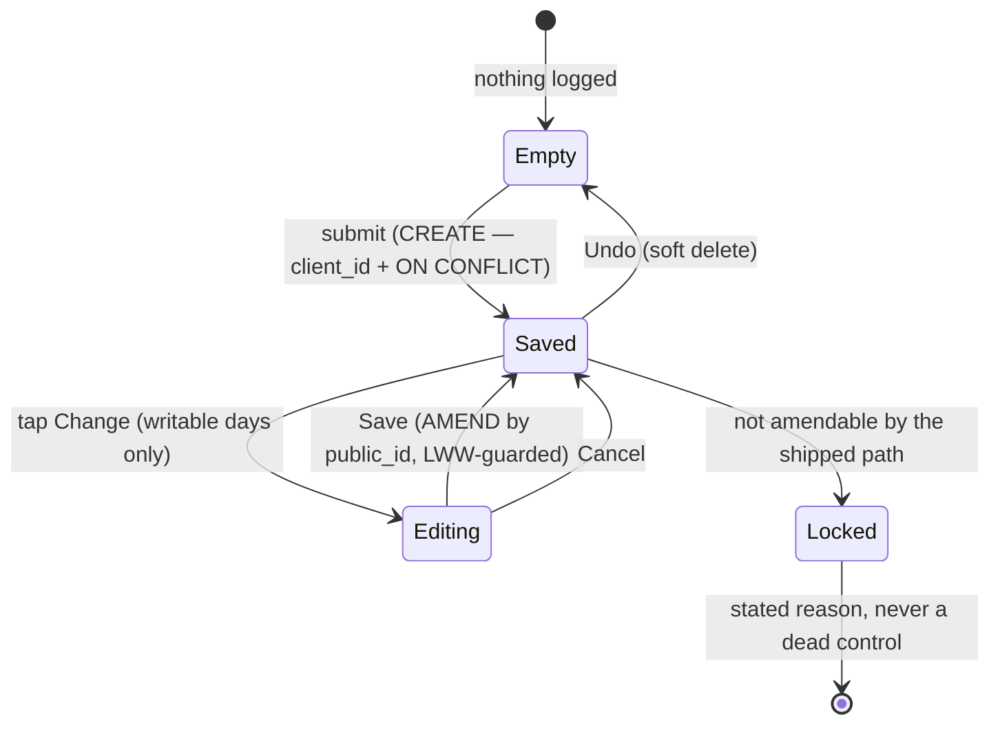

# V1-24 + V1-25 §3 — the form IS the day's state

> Backlog: [plan.md](../plan.md) rows **V1-24** (the form holds today's values so you can edit them)
> and **V1-25 §3** (…and it looks like you're done). The two rows say to plan them together; this is
> that plan.
>
> **Two panels ran. The UX panel ran first and produced the design; the engineering panel then found
> that the schema half would take the app down.** The draft's headline mechanism — a unique index on
> `(profile_id, activity_date, metric_key)` — was flagged **BLOCKING by all four engineering lenses
> independently**. Log at the end; the draft is not preserved, because it should not be copied.

## Goal

Ray, 2026-09-29 and again 2026-09-30 on a screenshot of an **already-completed day**:

> _"Once we've clicked Log Strength maybe we should change the treatment to make it appear complete.
> Once we've clicked Log Weight or check-ins, same thing — keep the value (checked, filled in) and
> just make it appear complete."_
>
> _"When will we just render the form with the performed activities — with a state that looks
> complete?"_

### The central question, and the answer the design turns on

**What does "complete" mean when the value is still editable?**

A checkmark asserts _this task is finished_ — finality. On a field you can still change, that is a
lie. But an inert field you **cannot** correct is [V1-24's own data-loss
bug](../features/strength-logging.md) in nicer clothes: that is exactly what check-ins ship today.

> **"Complete" is a property of the RECORD, not of the field — so the correct semantic is _saved_,
> not _done_. Render a receipt, not a checkmark.**

The completeness signal is **the value sitting where an empty input used to be**. Past tense,
factual — and facts are amendable.

That reframe also resolves the idempotency contradiction. **A surface with a record changes verb, from
CREATE to AMEND.** The saved state's control is _Change_, wired to a **separate edit action addressed
by `public_id`** — `editStrengthSetAction`'s shape ([actions.ts:441]). The create form's submit button
is **not shown** over a saved value, so "submit again" never happens and the per-row `ON CONFLICT DO
NOTHING` is never asked to behave like an upsert.

### Two corollaries, both load-bearing

**1. You cannot ship "looks complete" honestly without shipping amend.** `actions.ts` exports exactly
one edit (`editStrengthSetAction:441`) and zero deletes. Shipping the visual alone replicates
check-ins' current lie onto three more surfaces.

**2. The receipt is READ state, so it does not belong inside a write-gated client component.**
`page.tsx:186` mounts `BodyweightForm` only `{writable ? … : null}` — the ±1 day window. Putting the
receipt inside it makes the day's state invisible on exactly the history days V1-15 shipped, **which
is the screen Ray screenshotted**. The receipt renders from the **server**; a client Change control is
passed into a slot, only when writable. That also keeps `Locked` rows at zero JS, the rule
`EditableSet:14-19` already encodes.

## What is broken today (verified, not asserted)

| #      | Finding                                                                                                                                                                                                  | Evidence                                                                       |
| ------ | -------------------------------------------------------------------------------------------------------------------------------------------------------------------------------------------------------- | ------------------------------------------------------------------------------ |
| **S1** | **Logging bodyweight twice writes two rows.** The form resets _and rotates the clientId_ on success; `logBodyweight` dedupes **only** on `client_id`. No edit or delete exists to remove the second row. | `bodyweight-form.tsx:21-26`, `lib/dal/entries.ts:321-326`, `schema.ts:216-218` |
| **S1** | **Check-ins are "complete" and uncorrectable.** A mis-tapped habit or a sleep-hours `88` is permanent.                                                                                                   | `checkin-form.tsx:116,128-129,204-205`                                         |
| **S1** | **Success destroys focus on the biggest form**, and no form has a meaningful live region. A blind user submits bodyweight, hears nothing, sees a blank form — indistinguishable from failure.            | `strength-form.tsx:110-118`, `checkin-form.tsx:235-237`                        |
| **S2** | **Four forms, _five_ behaviours.** See below.                                                                                                                                                            | —                                                                              |
| **S2** | **Deleting the read-only list would delete the app's only edit path** — and the sole renderer of status badges, the superset bracket, session `feel` and the asserted `dayRole`.                         | `page.tsx:445-451,459-466,354-366,342-348,327-329`                             |
| **S2** | **The non-editable set kills the naive reframe.** `isEditableSet` refuses BW, band, non-mass dimensions and non-`done` status. A form-as-state model would render a control the server refuses.          | `set-display.ts:61-72`                                                         |
| **S3** | The a11y CI gate measures height only and skips invisible controls — a ghost "Change" passes it and fails a thumb.                                                                                       | `e2e/a11y.spec.ts:122`                                                         |

| surface                                         | on success                      | value kept? | correctable?                         |
| ----------------------------------------------- | ------------------------------- | ----------- | ------------------------------------ |
| bodyweight (`bodyweight-form.tsx:21-26`)        | `form.reset()` + new clientId   | no          | **no action exists**                 |
| check-in, log-once (`checkin-form.tsx:116,128`) | checked + inert, `name` dropped | yes         | **no**                               |
| check-in, accumulating (`page.tsx:97,101`)      | cleared, stays live forever     | no          | n/a (append)                         |
| strength (`strength-form.tsx:118`)              | full `key` remount              | no          | only numeric mass sets, via the list |
| life (`life-form.tsx:39-45`)                    | `<form>` → a `<p>`              | label only  | **no**                               |

**Check-ins is structurally the closest to right** — it derives its state from the server
(`loggedFieldKeys`, `page.tsx:97-101`) — and **semantically the most wrong**. Adopt its data flow;
reject its finality.

## The one model



**Three states, not two.** `Locked` is forced by `isEditableSet` _and_ by a non-writable day, and it
is the state a naive form-as-the-day model has no room for.

**The receipt** at 360px (usable ~294px): `84.5 lb` (~60px) as the primary text + an 88px `Change`
button fits with room.

- Accessible name is **`Change bodyweight — 84.5 lb`**, never bare "Change" — six identical "Change"
  buttons are indistinguishable in a screen-reader forms list. It comes from one exported
  `changeLabel(subject, value)` so the copy and the a11y assertions cannot drift.
- One `role="status"` per section announcing the **fact** (`"Bodyweight saved: 84.5 lb."`), replacing
  the contentless `checkin-form.tsx:236`.
- **On save, move focus to the saved row's Change button** — which also fixes the S1 focus loss.
- `Locked` renders the receipt with **no** Change and a plain reason, never a disabled button.
- **No tick on an editable field.**

## Acceptance

1. Logging bodyweight on a day that already has one is **impossible through the UI**.
2. A logged bodyweight can be **changed**, and the change reaches the day's entries and the CSV.
3. A logged numeric check-in can be **changed**; a logged boolean habit can be **undone**.
4. Every saved surface renders its value — **on every day, including read-only history days.**
5. A surface the shipped path cannot amend states **why**, and renders no dead control.
6. Each section announces its save through a live region carrying the **value**, and focus lands on
   the saved row.
7. axe + tap-target + 360px-overflow pass on **every** new state, including `Editing`.

## Staging

The draft had three PRs; the panel priced its "PR 1" at **~1,150 hand-written lines** against a stated 250. It splits into six, and the order is forced by the migrator (see §Risks).

| PR           | What                                                                                                                                                         | ~lines   |
| ------------ | ------------------------------------------------------------------------------------------------------------------------------------------------------------ | -------- |
| **1a**       | **The bodyweight receipt, read-only.** Server-rendered from `page.tsx`, visible on every day. Closes S1 through the UI. No schema, no action, no correction. | 150      |
| **1b**       | **Amend.** The generic writer + the shared editable primitive, designed against **two** consumers at once (bodyweight + a `Locked` strength set).            | 300      |
| **1c**       | **The duplicate-row correction only.** Merge, run, paste the dry-run receipt.                                                                                | 80       |
| **1d**       | **The unique index**, scoped to bodyweight. Gated on 1c's dry run reading 0 rows.                                                                            | 120      |
| **2**        | **Check-ins** — numeric amend + habit Undo. Blocked on the nested-`<form>` decision below.                                                                   | 250      |
| **3a/3b/3c** | Strength receipt · list relocation into `<details>` · (section counts, deferred)                                                                             | 3 × ~200 |

### Why bodyweight first, and the one thing that forces

Bodyweight is the **only surface with no structural constraint** — every bodyweight is amendable, it
is not nested in another form, and it has no row→section problem. A primitive designed against it
alone would not fit the other three. So **1b designs the shared primitive against a constrained second
consumer in the same PR**: rendering `Locked` for one non-editable strength set. That needs no new
action, no `<details>` move and no strength refactor, but it forces the three-state API to be real.

### The check-in nested-`<form>` problem — decided now, not deferred

`CheckinForm` is **one** `<form>` with **one** `useActionState` wrapping all ten fields
(`checkin-form.tsx:51,96`). A per-row amend `<form>` inside it is invalid HTML; the browser drops the
inner one. Deferring PR 2's file-by-file would have deferred the hardest structural question in the
plan.

**Decision: the primitive takes a rendered control as a SLOT and never owns a `<form>`.** The check-in
amend control is a submit button carrying `form="checkin-amend"`, associated with a sibling `<form>`
rendered **outside** the batch form. HTML's `form` attribute exists for exactly this, it keeps
`CheckinForm`'s documented single-island batch-submit design intact, and it means `EditableSet` (which
_can_ own its form, because it is mounted from the list) supplies the form itself through the same
slot. One contract, two mount stories.

## File-by-file — PR 1a only

PRs 1b–3 get their file-by-file when 1a lands. That is safe **here** and was not safe in the draft,
because 1a introduces no shared API: it is markup plus a derivation.

| Path                                                | Change | What & why                                                                                                                                                                                                                                                                              |
| --------------------------------------------------- | ------ | --------------------------------------------------------------------------------------------------------------------------------------------------------------------------------------------------------------------------------------------------------------------------------------- |
| `apps/web/lib/entries/activity-totals.ts`           | EDIT   | `loggedBodyweight(rows)` — keyed on `SEED_METRIC_KEYS.bodyweight`, never a re-typed literal. **Here, not inline in `page.tsx`**: this file already owns `todayRows`/`calisthenicsTotals`, has a test file, and `page.tsx` is 482 lines.                                                 |
| `apps/web/lib/entries/format-value-unit.ts`         | NEW    | `formatValueUnit(value, unit)` — the **one** display renderer. `entry-label.ts:55` and `set-display.ts:37` both re-spell it today; both switch to it. ⚠️ **Not** `csv/value.ts:86 formatQuantity` — its semantics are deliberately different (mass is bare, `sec`→`s`, throws on `kg`). |
| `apps/web/app/p/[profileId]/bodyweight-receipt.tsx` | NEW    | A **server** component: value + unit, and a `control?: ReactNode` slot. Zero client JS. Not named `SavedRow` — it is not yet shared, and 1b decides that API.                                                                                                                           |
| `apps/web/app/p/[profileId]/page.tsx`               | EDIT   | Render the receipt when `loggedBodyweight` exists, **outside** the `{writable}` gate; render `BodyweightForm` only when writable **and** nothing is logged.                                                                                                                             |
| `apps/web/app/p/[profileId]/bodyweight-form.tsx`    | EDIT   | Delete the `form.reset()` + clientId-rotation effect (`:21-26`) — with a receipt there is nothing to reset, and that effect is the S1 mechanism.                                                                                                                                        |
| `apps/web/lib/constants.ts`                         | EDIT   | The saved-state copy, so specs and components share it. Today `"Already logged today"` and `"{label} · logged today"` are re-typed in `e2e/steps.ts:143` — the drift AGENTS.md forbids.                                                                                                 |
| `apps/web/e2e/steps.ts`                             | EDIT   | **Required, and the draft omitted it.** `logBodyweight` gains the sibling retry-safe shape (`logCheckins:74`, `logLifeActivity:134`): receipt present → assert the end state; else fill + submit.                                                                                       |
| `apps/web/e2e/global.setup.ts`                      | EDIT   | Move the warm-up bodyweight off **Liam** (`:29`) — `log-bodyweight.spec.ts:31` and `export-full-day.spec.ts:122` both log Liam on the same day, so under a receipt their first interaction has no control to drive. The `Splits` precedent at `:37-39`.                                 |
| `apps/web/e2e/export-full-day.spec.ts`              | EDIT   | Use `steps.ts:logBodyweight` instead of its inline fourth copy.                                                                                                                                                                                                                         |
| `apps/web/scripts/screenshot-ephemeral.ts`          | EDIT   | Extend the existing `seedAlreadyLogged` fixture with a bodyweight row (~15 lines) rather than a second seeder. One state, not two.                                                                                                                                                      |
| `docs/features/write-path.md`                       | EDIT   | The receipt/read seam. CI-enforced.                                                                                                                                                                                                                                                     |

**Deliberately NOT in 1a:** the timestamp line (needs `createdAt` on `EntryDTO`, a select column and
tz projection — and §Open questions already suspected it was noise), `SavedRow`, any action, any
schema change.

## Key decisions the panel forced

### 1. The unique index is scoped to bodyweight, or it takes the app down

Draft: `WHERE deleted_at IS NULL AND metric_key IS NOT NULL`. **`metric_key` is the discriminant for
every metric, including the accumulating ones that log N rows a day by design** —
`catalog-metrics.ts:39,47,55` (`aggregation: 'sum'`), `checkin-fields.ts:73`, and `page.tsx:97-101`
which exists _because_ "they log multiple bouts a day". `e2e/log-bodyweight.spec.ts:60-67` already
asserts two push-up bouts folding into one row.

Worse than one rejected row: `logCheckinEntries` is a **single multi-row INSERT** whose
`onConflictDoNothing` arbiter is `client_id` only (`entries.ts:424-434`), so a violation of a
_different_ index aborts the whole statement — and `logCheckinsAction` has no try/catch
(`actions.ts:196-223`). **A second push-up bout would be a full-page crash on the gym floor.**

```sql
CREATE UNIQUE INDEX uq_entries_profile_day_bodyweight ON entries (profile_id, activity_date)
  WHERE deleted_at IS NULL AND metric_key = 'bodyweight';
```

Not `kind` either — `kind` is scheduled for deletion (`schema.ts:166-170`), so an index on it is born
dead. **Open question 1 is deleted: it was a defect, not a question.** PR 1d ships a `db:verify` proof
that two same-day push-up rows still insert — the proof that would have caught this.

### 2. No `CONCURRENTLY` — the runner does not exist

The draft spent the mechanism as if it were free. `migrations/0005:8-13` says in as many words that
CONCURRENTLY is unavailable "without the deferred transaction-stripping runner", `.squawk.toml:22-27`
says "it DOES NOT EXIST", and `scripts/migrate.ts` is still the stock migrator. Building it would also
break `verify.ts:131`, which replays the same folder into PGlite. **Plain `CREATE UNIQUE INDEX` behind
`lock_timeout`/`statement_timeout`**, with 0002/0005's justification (single-household table,
sub-second build). Revisit at v1.5, as 0005 already says.

### 3. The correction and the index are separate PRs, because I do not control the order

The draft said "run the correction, then deploy the migration". **`.github/workflows/migrate.yml:16-18`
runs `db:migrate` on every push to main, with no path filter and no manual gate** — the migration runs
minutes after the squash, before Ray can open a terminal. And a failed unique-index build leaves state
behind that **wedges the single prod migrator for every subsequent PR**.

So: **1c is the correction alone.** Merge → Ray runs `db:correct --apply` → the dry run afterwards
prints "No matching rows". **1d is the index**, and its DoD carries one literal line: _"`db:correct`
dry-run output pasted, 0 rows."_ Same construction AGENTS.md already mandates for `NOT VALID`/`VALIDATE`.

### 4. `ON CONFLICT` must move to the natural key

`ON CONFLICT` takes **exactly one arbiter**, so `logBodyweight` cannot cover both `uq_entries_client_id`
and the new natural key. `grep -rn 23505` returns **zero hits** — nothing in this codebase handles a
unique violation, so the row the index exists to prevent would throw past the action into `error.tsx`,
violating the typed-envelope rule. In 1d: arbiter moves to `(profile_id, activity_date)` with
`targetWhere`, `DO NOTHING`, and zero-rows → re-select and return
`{ ok:false, error:'Already logged today — showing the saved value.' }`.

### 5. **No day bound on the amend** — and the draft's premise was wrong

The draft said `editStrengthSetAction` "has no day bound" and called that a gap to fix.
`actions.ts:435-439` documents it as **deliberate**: _"No `day` handling: an edit never moves the
entry's date."_ A CREATE carries a client-supplied `day` that decides where the row lands; an amend
supplies no date at all, so a bound buys no integrity — ownership + `public_id` is the whole boundary.

Two concrete harms if I had kept it: a receipt on a 5-day-old day would render _Change_ and the server
would refuse it — **exactly the dead control acceptance 5 forbids** — and **±1 would have excluded the
incident that motivated this plan** (the correction targets 2026-09-28; the plan was written on the
30th). What _is_ day-gated is the create form, as today.

### 6. The writer lives in `packages/db`, is generic, and needs a shape guard

"Mirrors `editStrengthSet:497` exactly" mirrors a **four-line pass-through**. The guard is
`writers/strength-session.ts:394-455`, single-sourced there so that "the app DAL **and** `db:verify`
prove the IDENTICAL ownership guard" (`:364-368`). `verify.ts` imports only `../src/*` — **the draft's
proofs were impossible as filed.**

And the draft's WHERE had **no shape guard**: `editBodyweight({ profilePublicId, entryPublicId, value,
unit })` would happily rewrite _any_ entry the profile owns — a push-up bout, a sleep-hours reading, a
`scale_10` pressure score — into `value_num = 84.5, unit = 'lb'`. `updateStrengthSetById` pins its
shape server-side precisely because "a crafted POST is the real threat" (`:370-379`).

**1b ships one `updateEntryValueById(exec, { profilePublicId, entryPublicId, metricKey, value, unit })`
in `packages/db/src/writers/`**, using the `inArray(<owned subselect>)` idiom (`:398-410`, since
drizzle's `update()` cannot JOIN and `sql.raw` is banned), pinning `metric_key`, `status='done'` and
`deleted_at IS NULL` at entry **and** profile. Proved once, reused by all three amend actions.

**Per-surface _actions_ stay**, and I am pushing back on collapsing them: the validation genuinely
differs (bodyweight has a unit + range; a check-in value is validated off the trusted server registry
per field, `actions.ts:116-132`; life's correction is a soft delete). A generic action would have to
read the row before choosing a validator, inverting `logCheckinsAction`'s deliberate
never-enumerate-the-FormData discipline. **Generic writer, thin per-surface actions.**

### 7. LWW now, not v1.5 — the amend has a silent lost update

`entries` has no version, and the receipt renders from an RSC snapshot. Dad's phone shows `84.5`; the
kid amends to `85.2`; Dad taps Change on his stale render (prefilled `84.5`) and saves → **the correct
value is silently reverted, with no trace.** On a shared-household app that is the realistic failure.

1b carries the row's `updated_at` from the receipt render as a hidden field and adds
`eq(entries.updatedAt, seenUpdatedAt)` to the guarded WHERE; zero rows → the typed error path
`editStrengthSetAction:477` already has. Five lines, and it is the client-supplied compare AGENTS.md
§Schema asks for. (Note `updateStrengthSetById:431` stamps `now()` — a server clock, against that same
rule. Not fixed here; filed.)

### 8. Reuse the edit dance rather than building beside it

`EditableSet` is 105 lines of which the surface-agnostic part is everything except three slots: the
read text, the edit fields, the hidden ids. A `SavedRow` beside it makes two implementations of one
behaviour that PR 3 would then have to reconcile. **1b extracts the primitive _from_ `EditableSet`**,
with `EditableSet` reduced to a ~30-line caller.

Related: the legal during-render collapse-on-success update now has **three** copies
(`editable-set.tsx:41-45`, `checkin-form.tsx:79-87`, `strength-form.tsx:119-123`). 1b extracts
`useOnActionSuccess(state, fn)` (~10 lines) and converts all of them.

### 9. The `<details>` relocation costs more than one sentence (PR 3b)

Written in now as explicit line items: **five locators key off the `Logged entries` region name with
`toBeVisible()`**, which fails inside a closed `<details>` (`steps.ts:88,145`,
`log-bodyweight.spec.ts:69`, `scaffold-submit.spec.ts:59`, `export-full-day.spec.ts:146`) → it ships
**open**, the V1-23 precedent. The single region becomes N, so all five re-point. **Re-pointing them
into the section regions reintroduces a documented false positive** (`steps.ts:85-87`: the habit's own
`<label>` matches an unscoped `getByText`). **There is no row→section mapping** — `todayRows` is flat,
bodyweight is not a routine block, and an entry whose `activityKey` left the kid's routine would have
no section and **silently vanish**, so an explicit "everything else" bucket is required.

## Test plan (1a)

- **Unit** — `loggedBodyweight` derivation; `formatValueUnit`; the receipt renders value + unit and
  omits the control when no slot is passed.
- **e2e** — the retry-safe `steps.ts:logBodyweight`; a history day shows the receipt (the acceptance-4
  case that the draft would have failed); the smoke stays green with the warm-up moved.
- **a11y** — axe + tap targets + 360px on the receipt.
- **No `db:verify` change** — 1a writes nothing.

Dropped from the draft on the panel's advice: the e2e CSV assertion (V1-14b's
`export-full-day.spec.ts` already owns that chain end to end; re-asserting it for one amended value is
~40s for near-zero marginal signal) and two of the four proposed proofs (they were index proofs).

## Risks / rollback

| Risk                                                                                                                              | Mitigation                                                                                                                                                                                                                                                                                      |
| --------------------------------------------------------------------------------------------------------------------------------- | ----------------------------------------------------------------------------------------------------------------------------------------------------------------------------------------------------------------------------------------------------------------------------------------------- |
| **1a ships a receipt that cannot yet be corrected** — the "inert field you cannot correct" the design calls a lie.                | Accepted, with the copy stating it plainly rather than implying finality, **and 1b following immediately**. The honest cost: a typo'd weight stays wrong for about a week instead of zero. That is a smaller hole than shipping ~1,150 lines with a migration that can wedge the prod migrator. |
| Deciding which duplicate is a kid's real weight.                                                                                  | The 1c correction does **not** guess: it lists duplicates for a human and keeps the one Ray names. Never "keep the latest" silently.                                                                                                                                                            |
| An amend rewrites history the CSV already handed to the Claude workflow.                                                          | Correct and intended. Called out because re-exporting a month changes bytes V1-13 made stable.                                                                                                                                                                                                  |
| The receipt hides the create form, so a genuine second same-day weigh-in becomes unloggable.                                      | Accepted and intended. If wrong, the fix is the `context` column (`morning`/`evening`) the CSV contract already has and the app cannot write.                                                                                                                                                   |
| A soft-deleted entry frees its `client_id` slot (partial index), so **`/api/sync` replay at v1.5 would resurrect an undone row**. | One line in `write-path.md` beside the amend seam: _a soft delete is not replay-proof; sync must dedupe against deleted rows, not just live ones._                                                                                                                                              |
| Rollback                                                                                                                          | Forward-only. 1a is one prop away from current behaviour; the index is reversible by omission.                                                                                                                                                                                                  |

## Out-of-scope / deferred

- **Section counts (`3 of 6 movements`)** — cut. It was the plan's own addition with no request behind
  it, and it is a new derived metric.
- **The timestamp line** — cut from 1a; reconsidered in 1b if it earns its 360px line.
- **V1-27** (2 of 3 sets blocks submit) — adjacent, different mechanism, its own plan.
- **Deleting a strength set** — **V1-26 PR-B**, already planned. This plan does not touch
  `isEditableSet` or its SQL mirror.
- **A non-`done` set stays uncorrectable** — named so the guide's "uncorrectable" trap is not claimed
  closed when it is not.
- **Life activities** get a receipt but no Undo — `logLifeActivities` has no delete either, and two
  delete paths in one PR is how the ownership tests get skimmed.
- **`updateStrengthSetById`'s server-clock `updated_at`** (`:431`) — an existing AGENTS.md §Schema
  violation. Filed, not fixed here.
- Offline/sync (v1.5).

## Open questions

1. ~~`metric_key` or `kind`?~~ **Resolved as a defect** — see Decision 1.
2. **Does `Locked`'s reason copy differ between "not amendable" and "this day is closed"?** They are
   different facts and probably different sentences. Decide in 1b, when both render.

## Review-response log

### UX panel (ran BEFORE the plan, 2026-09-30, 3 lenses)

It produced the design rather than critiquing it.

| #   | Finding                                                                         | Effect                       |
| --- | ------------------------------------------------------------------------------- | ---------------------------- |
| U1  | "Complete" means **saved**, not done — a receipt, not a checkmark               | §Goal; the whole model       |
| U2  | Cannot ship the visual without amend, or the lie spreads to three more surfaces | Made the plan amend-first    |
| U3  | `Locked` is a **third** state, forced by `isEditableSet`                        | §The one model; acceptance 5 |

**Rejected:** _"delete the read-only list"_ (Ray's own phrasing). It is the only mount point for
`EditableSet` and the sole renderer of four other things. Demoted into a `<details>` instead — PR 3b.

### Engineering panel (round 1, 4 lenses, 2026-09-30)

| #   | Lens                | Critique                                                                                                                            | Verdict                                                 | Resolution                                                                                                                                                                                                                                 |
| --- | ------------------- | ----------------------------------------------------------------------------------------------------------------------------------- | ------------------------------------------------------- | ------------------------------------------------------------------------------------------------------------------------------------------------------------------------------------------------------------------------------------------ |
| C1  | **All four**        | The unique index forbids accumulating calisthenics; second bout → `23505` → aborts the whole multi-row INSERT → **full-page crash** | **accepted (BLOCKING)**                                 | Scoped to `metric_key='bodyweight'`; Decision 1; open question 1 deleted as a defect                                                                                                                                                       |
| C2  | Correctness         | No `ON CONFLICT` path for the new index — one arbiter only, and `grep 23505` = 0 hits, so it throws past the action                 | **accepted (BLOCKING)**                                 | Decision 4                                                                                                                                                                                                                                 |
| C3  | Correctness         | "Correction then migration" is not an order I control — `migrate.yml` runs on every push; a failed index wedges the migrator        | **accepted (BLOCKING)**                                 | Split into 1c and 1d; Decision 3                                                                                                                                                                                                           |
| C4  | Scope, Correctness  | `CONCURRENTLY` needs a transaction-stripping runner `.squawk.toml` says does not exist                                              | **accepted**                                            | Decision 2                                                                                                                                                                                                                                 |
| C5  | Scope               | PR 1 is ~1,150 hand-written lines, not 250 — priced item by item, three items missing from the table                                | **accepted (BLOCKING)**                                 | Six PRs; §Staging                                                                                                                                                                                                                          |
| C6  | Reuse, Architecture | The receipt breaks `steps.ts:logBodyweight`; the warm-up logs Liam, and two specs then log Liam the same day                        | **accepted (BLOCKING)**                                 | Both files in 1a's table                                                                                                                                                                                                                   |
| C7  | Architecture        | Check-in amend cannot be a nested `<form>`; deferring PR 2 defers the hardest question                                              | **accepted (BLOCKING)**                                 | Decided now — slot + `form=` attribute; §Staging                                                                                                                                                                                           |
| C8  | Architecture        | The receipt inside the `{writable}` gate is invisible on history days — the screen Ray screenshotted                                | **accepted**                                            | Corollary 2; server-rendered; acceptance 4                                                                                                                                                                                                 |
| C9  | Reuse, Architecture | `editBodyweight` in the app DAL is unreachable by `db:verify`; the guard is already copy-pasted 3×                                  | **accepted**                                            | Decision 6                                                                                                                                                                                                                                 |
| C10 | Correctness         | The proposed WHERE has **no shape guard** — it would rewrite any owned entry into `84.5 lb`                                         | **accepted**                                            | Decision 6                                                                                                                                                                                                                                 |
| C11 | Correctness         | The ±1 day bound is wrong, manufactures a dead control, and excludes the incident that motivated the plan                           | **accepted — reverses the draft**                       | Decision 5                                                                                                                                                                                                                                 |
| C12 | Correctness         | Silent lost update between two phones                                                                                               | **accepted**                                            | Decision 7; LWW in 1b                                                                                                                                                                                                                      |
| C13 | Architecture        | The index justified by `/api/sync` is what would break `/api/sync` (whole-graph atomic flush)                                       | **accepted**                                            | Justification removed; the index now stands on the UI bug alone                                                                                                                                                                            |
| C14 | Reuse               | `EditableSet` **is** the shared thing; `SavedRow` beside it = two implementations                                                   | **accepted**                                            | Decision 8                                                                                                                                                                                                                                 |
| C15 | Scope               | `SavedRow` is an abstraction before its second use                                                                                  | **accepted, partially**                                 | 1a inlines a server receipt with no shared API. 1b extracts — but **against two consumers**, per C16, not against bodyweight alone                                                                                                         |
| C16 | Architecture        | A primitive designed against bodyweight (the only unconstrained surface) will not fit the other three                               | **accepted**                                            | 1b renders `Locked` for a strength set in the same PR                                                                                                                                                                                      |
| C17 | Reuse               | `84.5 lb` already has two renderers; and `csv/value.ts` is the wrong one to reuse                                                   | **accepted**                                            | `formatValueUnit`; 1a's table                                                                                                                                                                                                              |
| C18 | Scope, Reuse, Arch  | The timestamp is not derivable from what the plan claimed; needs `createdAt` + tz projection                                        | **accepted**                                            | Cut from 1a                                                                                                                                                                                                                                |
| C19 | Scope               | Acceptance 7 (section counts) is the plan's addition, not Ray's ask                                                                 | **accepted**                                            | Cut                                                                                                                                                                                                                                        |
| C20 | Scope               | The e2e CSV assertion re-proves what V1-14b owns                                                                                    | **accepted**                                            | Dropped                                                                                                                                                                                                                                    |
| C21 | Architecture        | `<details>` blast radius is 6 items, not one sentence                                                                               | **accepted**                                            | Decision 9                                                                                                                                                                                                                                 |
| C22 | Reuse               | The during-render collapse idiom has 3 copies                                                                                       | **accepted**                                            | `useOnActionSuccess` in 1b                                                                                                                                                                                                                 |
| C23 | Correctness         | Soft delete is clean on every reader, **but** a tombstone frees the `client_id` slot for sync replay                                | **accepted**                                            | §Risks                                                                                                                                                                                                                                     |
| C24 | Architecture        | One generic `editEntryAction` instead of per-surface?                                                                               | **rejected** (the lens argued itself to the same place) | Validation differs per surface; a generic action must read the row to pick a validator, inverting `logCheckinsAction`'s discipline. Generic **writer**, thin actions — Decision 6                                                          |
| C25 | Reuse               | Extract `editTargetSchema(idKey)` for the `{profileId, setId}` / `{profileId, entryId}` pair                                        | **rejected**                                            | Two `uuidSchema` fields is ceremony, not sync — AGENTS.md's own "don't over-abstract". Stated deliberately so it does not drift by accident. `editBodyweightSchema = logBodyweightSchema.pick(…).extend({ entryId })` **is** adopted (C26) |
| C26 | Reuse               | Say _how_ the schema reuses the refinements, or it gets re-typed                                                                    | **accepted**                                            | `.pick().extend()`, mirroring `strength.ts:123-126`                                                                                                                                                                                        |
| C27 | Scope               | Two screenshot states where one does                                                                                                | **accepted**                                            | Extend `seedAlreadyLogged`                                                                                                                                                                                                                 |
| C28 | Reuse               | The saved-state copy is forked 3 ways incl. a re-typed e2e copy                                                                     | **accepted**                                            | `lib/constants.ts` + `changeLabel()`                                                                                                                                                                                                       |
| C29 | Reuse               | `loggedBodyweight` should live where it gets a unit test                                                                            | **accepted**                                            | `activity-totals.ts`                                                                                                                                                                                                                       |

**Confirmed sound, so recorded rather than changed:** `SavedRow`'s route-colocated placement (the
`set-fields.tsx` / `day-field.tsx` precedent — four consumers inside one route is not "genuinely
shared"); Saved/Editing/Locked composing on `ActionState` rather than beside it; the amend being
idempotent under retry; deriving Saved from a server read rather than optimistic local state, which
composes with v1.5's TanStack Query instead of fighting it.
