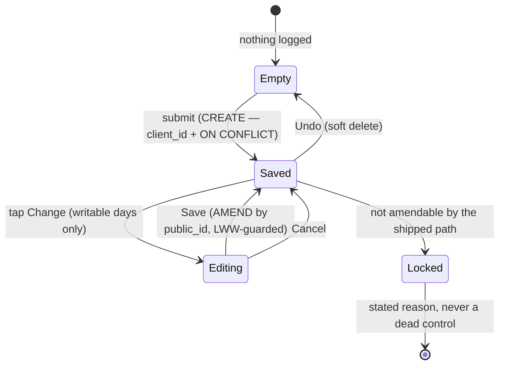

# V1-24 + V1-25 §3 — the form IS the day's state

> Backlog: [plan.md](../plan.md) rows **V1-24** (the form holds today's values so you can edit them)
> and **V1-25 §3** (…and it looks like you're done). The two rows say to plan them together; this is
> that plan.
>
> **This file is the whole V1-24 arc: one `## File-by-file` section per PR, each carrying its own
> panel log, and each recording its own branch at its heading.** It is appended to as the arc ships.
>
> ⚠️ **It used to claim the opposite** — that 1b, 1c+1d, 2 and 3 would each get their own plan file
> (`v1-24b-…`, `v1-24cd-…`) and that this one would not be edited. #187 appended 1b here anyway and no
> `v1-24b-*` was ever created, so the claim was already false when 1c's panel flagged it (two lenses,
> independently). Corrected in 1c rather than broken a third time — splitting now would leave 1b's
> section here and 1c's elsewhere, which is two conventions instead of one. See Decision 22.
>
> **Branches:** 1a `docs/v1-29-form-is-the-day` (misnamed — there is no V1-29; the id is V1-24, left
> as-is because renaming an open PR's head branch buys nothing after a squash merge) · 1b
> `feat/v1-24-1b-amend` · 1c `db/v1-24-1c-dup-correction`.
>
> **Two panels ran. The UX panel ran first and produced the design; the engineering panel then found
> that the schema half would take the app down.** The draft's headline mechanism — a unique index on
> `(profile_id, activity_date, metric_key)` — was flagged **BLOCKING by all four engineering lenses
> independently**. Log at the end; the draft is not preserved, because it should not be copied.

## Goal

Ray, 2026-09-29 and again 2026-09-30 on a screenshot of an **already-completed day**:

> _"Once we've clicked Log Strength maybe we should change the treatment to make it appear complete.
> Once we've clicked Log Weight or check-ins, same thing — keep the value (checked, filled in) and
> just make it appear complete."_
>
> _"When will we just render the form with the performed activities — with a state that looks
> complete?"_

### The central question, and the answer the design turns on

**What does "complete" mean when the value is still editable?**

A checkmark asserts _this task is finished_ — finality. On a field you can still change, that is a
lie. But an inert field you **cannot** correct is [V1-24's own data-loss
bug](../features/strength-logging.md) in nicer clothes: that is exactly what check-ins ship today.

> **"Complete" is a property of the RECORD, not of the field — so the correct semantic is _saved_,
> not _done_. Render a receipt, not a checkmark.**

The completeness signal is **the value sitting where an empty input used to be**. Past tense,
factual — and facts are amendable.

That reframe also resolves the idempotency contradiction. **A surface with a record changes verb, from
CREATE to AMEND.** The saved state's control is _Change_, wired to a **separate edit action addressed
by `public_id`** — `editStrengthSetAction`'s shape (`actions.ts:441`). The create form's submit button
is **not shown** over a saved value, so "submit again" never happens and the per-row `ON CONFLICT DO
NOTHING` is never asked to behave like an upsert.

### Two corollaries, both load-bearing

**1. You cannot ship "looks complete" honestly without shipping amend.** `actions.ts` exports exactly
one _entry_ edit (`editStrengthSetAction:441`; `editRoutineAction:496` edits the routine, not an
entry) and zero deletes. Shipping the visual alone replicates check-ins' current lie onto three more
surfaces.

**2. The receipt is READ state, so it does not belong inside a write-gated client component.**
`page.tsx:186` mounts `BodyweightForm` only `{writable ? … : null}` — the ±1 day window. The value
itself is **not** invisible on history days: the ungated "Logged entries" list (`page.tsx:299`)
already renders `Bodyweight — 84.5 lb` (`entry-label.ts:55`) on every day. What a history day lacks
is any state **in the bodyweight section**: a "Log bodyweight" heading with nothing under it, on
**the screen Ray screenshotted**. Putting the receipt inside the form would keep it that way. So the
receipt renders from the **server**, outside the gate; a client Change control is passed into a slot,
only when writable. That also keeps `Locked` rows at zero JS, the rule `EditableSet:14-19` already
encodes.

**3. One renderer per value — but not yet.** With a receipt in the section, the list's bodyweight row
is a second copy of the same number. It **stays in 1a** anyway: the list is the one place to scan the
whole day and matches the CSV row for row; removing only bodyweight would trip the empty state
(`page.tsx:304`, "Nothing logged on …") under a visible receipt on a weigh-in-only day; and until 1c
runs, a same-day duplicate would become invisible in the app while still in the CSV. The removal
moves to **3b**, with the `<details>` relocation, where "one renderer" becomes true for every surface
at once.

## What is broken today (verified, not asserted)

| #      | Finding                                                                                                                                                                                                                    | Evidence                                                                       |
| ------ | -------------------------------------------------------------------------------------------------------------------------------------------------------------------------------------------------------------------------- | ------------------------------------------------------------------------------ |
| **S1** | **Logging bodyweight twice writes two rows.** The form resets _and rotates the clientId_ on success; `logBodyweight` dedupes **only** on `client_id`. No edit or delete exists to remove the second row.                   | `bodyweight-form.tsx:21-26`, `lib/dal/entries.ts:321-326`, `schema.ts:216-218` |
| **S1** | **Check-ins are "complete" and uncorrectable.** A mis-tapped habit or a sleep-hours `88` is permanent.                                                                                                                     | `checkin-form.tsx:116,128-129,204-205`                                         |
| **S1** | **Success destroys focus on the biggest form**, and no live region carries the value. A screen-reader user submits bodyweight and hears nothing — indistinguishable from failure. (Sighted users do get the new list row.) | `strength-form.tsx:119-123,140`, `checkin-form.tsx:235-237`                    |
| **S2** | **Four forms, _five_ behaviours.** See below.                                                                                                                                                                              | —                                                                              |
| **S2** | **Deleting the read-only list would delete the app's only edit path** — and the sole renderer of status badges, the superset bracket, session `feel` and the asserted `dayRole`.                                           | `page.tsx:454-460,441-445,468-475,360-375,351-357,336-338`                     |
| **S2** | **The non-editable set kills the naive reframe.** `isEditableSet` refuses BW, band, non-mass dimensions and non-`done` status. A form-as-state model would render a control the server refuses.                            | `set-display.ts:61-72`                                                         |
| **S3** | The a11y CI gate measures height only and skips invisible controls — a ghost "Change" passes it and fails a thumb.                                                                                                         | `e2e/a11y.spec.ts:122`                                                         |

| surface                                         | on success                      | value kept? | correctable?                         |
| ----------------------------------------------- | ------------------------------- | ----------- | ------------------------------------ |
| bodyweight (`bodyweight-form.tsx:21-26`)        | `form.reset()` + new clientId   | no          | **no action exists**                 |
| check-in, log-once (`checkin-form.tsx:116,128`) | checked + inert, `name` dropped | yes         | **no**                               |
| check-in, accumulating (`page.tsx:97,101`)      | cleared, stays live forever     | no          | n/a (append)                         |
| strength (`strength-form.tsx:140`)              | full `key` remount              | no          | only numeric mass sets, via the list |
| life (`life-form.tsx:39-45`)                    | `<form>` → a `<p>`              | label only  | **no**                               |

**Check-ins is structurally the closest to right** — it derives its state from the server
(`loggedFieldKeys`, `page.tsx:97-101`) — and **semantically the most wrong**. Adopt its data flow;
reject its finality.

## The one model



**Three states, not two.** `Locked` is forced by `isEditableSet` _and_ by a non-writable day, and it
is the state a naive form-as-the-day model has no room for.

**The receipt** at 360px: `<main>` is `px-4` (`page.tsx:118`), so 328px usable, or 294px if the
receipt is a bordered `px-4` card like the list rows (`page.tsx:317`). `84.5 lb` (~60px) + a
`Change` button (1b) fits either way: `Button`'s `min-h-11` gives 44px height
(`components/ui/button.tsx:20`) and a text "Change" at `px-2.5` is ~70px wide. The 360px overflow
check covers the widest legal value plus the two-line copy below.

- Accessible name is **`Change bodyweight — 84.5 lb`**, never bare "Change" — six identical "Change"
  buttons are indistinguishable in a screen-reader forms list. It comes from one exported
  `changeLabel(subject, value)` so the copy and the a11y assertions cannot drift.
- One `role="status"` per section announcing the **fact** (`"Bodyweight saved: 84.5 lb."`), replacing
  `checkin-form.tsx:236`'s `aria-live` line, which announces "Check-ins logged." but no value.
- **On save, move focus to the saved row's Change button** — which also fixes the S1 focus loss.
- `Locked` renders the receipt with **no** Change and a plain reason, never a disabled button.
- **No tick on an editable field.**

### The 1a receipt, exactly (UX re-review, round 2)

1a ships the receipt **before** amend exists, which U2 said not to do (see §Risks). What makes that
honest is the copy, so it is specified here, not left to implementation. All strings live in
`lib/constants.ts`.

- **Heading: `Bodyweight`**, not "Log bodyweight": a noun that is true in every state, matching
  "Check-ins" and "Life". The button keeps "Log weight" (`bodyweight-form.tsx:72`).
- **Saved:** `Saved: 84.5 lb` · `One weigh-in per day.` · `Wrong number? Ask a parent — it can't be
changed in the app yet.` The last line is real (the parent route is `db:correct`) and is deleted in
  1b.
- **More than one live row** (the pre-1c duplicates, or a two-phone race): `2 weights logged: 84.5 lb,
845 lb`. `loggedBodyweight` returns **every** live row; the receipt never silently picks one.
- **Closed day, nothing logged:** `No weight logged.` Today that case renders a bare heading.
- **Announce and focus (acceptance 6, for 1a).** On success the form unmounts and the server renders
  the receipt, so focus would drop to `<body>` and a freshly mounted status region is not announced.
  A small client `SavedAnnouncer` is rendered in the section in **both** states with the saved value
  as a prop. It owns a `role="status"` region that exists before the save, and when the value goes
  from none to present **within this page session** (not on first load) it writes
  `Bodyweight saved: 84.5 lb.` into it and focuses the receipt (`tabIndex={-1}`, by id). The receipt
  itself stays a server component.

## Acceptance

1. Logging bodyweight on a day that already has one is **impossible through the UI**.
2. A logged bodyweight can be **changed**, and the change reaches the day's entries and the CSV.
3. A logged numeric check-in can be **changed**; a logged boolean habit can be **undone**.
4. Every saved surface renders its value — **on every day, including read-only history days.**
5. A surface the shipped path cannot amend states **why**, and renders no dead control.
6. Each section announces its save through a live region carrying the **value**, and focus lands on
   the saved row.
7. axe + tap-target + 360px-overflow pass on **every** new state, including `Editing`.

## Staging

The draft had three PRs; the panel priced its "PR 1" at **~1,150 hand-written lines** against a stated 250. It splits into seven, and the order is forced by the migrator (see §Risks).

| PR           | What                                                                                                                                                         | ~lines   |
| ------------ | ------------------------------------------------------------------------------------------------------------------------------------------------------------ | -------- |
| **1a**       | **The bodyweight receipt, read-only.** Server-rendered from `page.tsx`, visible on every day. Closes S1 through the UI. No schema, no action, no correction. | 250      |
| **1b**       | **Amend.** The generic writer + the shared editable primitive, designed against **two** consumers at once (bodyweight + a `Locked` strength set).            | 350      |
| **1c**       | **The duplicate-row correction only.** Read prod first, Ray names keepers, then write → merge → dry-run → apply → re-dry-run 0. See Decision 3.              | 80       |
| **1d**       | **The unique index only**, scoped to bodyweight, behind a table lock + duplicate pre-check. No app code: it must be live before anything depends on it.      | 100      |
| **1e**       | **The arbiter moves to the natural key**, with the replay/already-logged branch. Merged only after 1d's `migrate.yml` run is green and the index exists.     | 120      |
| **2**        | **Check-ins** — numeric amend + habit Undo. Blocked on the nested-`<form>` decision below.                                                                   | 250      |
| **3a/3b/3c** | Strength receipt · list relocation into `<details>` · (section counts, deferred)                                                                             | 3 × ~200 |

### Why bodyweight first, and the one thing that forces

Bodyweight is the **only surface with no structural constraint** — every bodyweight is amendable, it
is not nested in another form, and it has no row→section problem. A primitive designed against it
alone would not fit the other three. So **1b designs the shared primitive against a constrained second
consumer in the same PR**: rendering `Locked` for one non-editable strength set. That needs no new
action, no `<details>` move and no strength refactor, but it forces the three-state API to be real.

### The check-in nested-`<form>` problem — decided now, not deferred

`CheckinForm` is **one** `<form>` with **one** `useActionState` wrapping all ten fields
(`checkin-form.tsx:51,96`). A per-row amend `<form>` inside it is invalid HTML; the browser drops the
inner one. Deferring PR 2's file-by-file would have deferred the hardest structural question in the
plan.

**Decision: the primitive takes a rendered control as a SLOT and never owns a `<form>`.** The check-in
amend control is a submit button carrying `form="checkin-amend"`, associated with a sibling `<form>`
rendered **outside** the batch form. HTML's `form` attribute exists for exactly this, it keeps
`CheckinForm`'s documented single-island batch-submit design intact, and it means `EditableSet` (which
_can_ own its form, because it is mounted from the list) supplies the form itself through the same
slot. One contract, two mount stories.

## File-by-file — PR 1a only

PRs 1b–3 get their file-by-file when 1a lands. That is safe **here** and was not safe in the draft,
because 1a introduces no shared API: it is markup plus a derivation.

| Path                                                | Change | What & why                                                                                                                                                                                                                                                                                                                                                                                                                                                 |
| --------------------------------------------------- | ------ | ---------------------------------------------------------------------------------------------------------------------------------------------------------------------------------------------------------------------------------------------------------------------------------------------------------------------------------------------------------------------------------------------------------------------------------------------------------- |
| `apps/web/lib/entries/activity-totals.ts`           | EDIT   | `loggedBodyweight(rows)` returns **every** live bodyweight row for the day (usually one), keyed on `SEED_METRIC_KEYS.bodyweight`, never a re-typed literal. **Here, not inline in `page.tsx`**: this file already owns `todayRows`/`calisthenicsTotals`, has a test file, and `page.tsx` is 482 lines.                                                                                                                                                     |
| `apps/web/lib/entries/format-value-unit.ts`         | NEW    | `formatValueUnit(value, unit)` — the **one** display renderer, with a colocated test. ⚠️ **Not** `packages/shared/src/csv/value.ts:86 formatQuantity` — its semantics are deliberately different (mass is bare, `sec`→`s`, throws on `kg`, and bodyweight can be `kg`).                                                                                                                                                                                    |
| `apps/web/lib/entries/entry-label.ts`               | EDIT   | Both spellings switch to `formatValueUnit`: the metric branch (`:55`) **and** the legacy `kind` bodyweight fallback (`:80`).                                                                                                                                                                                                                                                                                                                               |
| `apps/web/app/p/[profileId]/set-display.ts`         | EDIT   | `:37` switches to `formatValueUnit`. Owned by `strength-logging.md`, so that guide changes too.                                                                                                                                                                                                                                                                                                                                                            |
| `apps/web/app/p/[profileId]/bodyweight-receipt.tsx` | NEW    | A **server** component: the saved copy above (one value, several, or none on a closed day), `tabIndex={-1}` + an id for focus, and a `control?: ReactNode` slot for 1b. Zero client JS. Not named `SavedRow` — it is not yet shared, and 1b decides that API.                                                                                                                                                                                              |
| `apps/web/app/p/[profileId]/saved-announcer.tsx`    | NEW    | The small client island above: a pre-existing `role="status"` region + focus-on-save. ~20 lines, with a unit test for "announces on transition, not on first render".                                                                                                                                                                                                                                                                                      |
| `packages/shared/src/bodyweight.ts`                 | EDIT   | A plausibility bound in `logBodyweightSchema` (`:22-25` is `> 0` to `2000`): 20–500 lb, 10–230 kg, message `That doesn't look like a bodyweight — check the decimal point.` Blocks the `845`/`8.45` typo class before it is saved, which matters most while 1a cannot amend. Colocated test.                                                                                                                                                               |
| `apps/web/app/p/[profileId]/page.tsx`               | EDIT   | Heading `Log bodyweight` → `Bodyweight`. Render the receipt **outside** the `{writable}` gate (including the closed-day empty line); render `BodyweightForm` only when writable **and** nothing is logged; mount `SavedAnnouncer` in both states. The "Logged entries" list is **unchanged** (Corollary 3).                                                                                                                                                |
| `apps/web/app/p/[profileId]/bodyweight-form.tsx`    | EDIT   | Delete the `form.reset()` + clientId-rotation effect (`:21-26`) — with a receipt there is nothing to reset, and that effect is the S1 mechanism. That also makes `life-form.tsx:15-16`'s "NO rotation" note about bodyweight true again.                                                                                                                                                                                                                   |
| `apps/web/lib/constants.ts`                         | EDIT   | The receipt copy above, so specs and components share it. Today `"{label} · logged today"` (`life-form.tsx:42`) is re-typed in `e2e/steps.ts:143` — the drift AGENTS.md forbids — and moves here too. (`"Already logged today"`, `checkin-form.tsx:205`, is not re-typed yet; it moves too.)                                                                                                                                                               |
| `apps/web/e2e/steps.ts`                             | EDIT   | **Required, and the draft omitted it.** `logBodyweight` (`:43-53`) gains the sibling retry-safe shape (`logCheckins:73-74`, `logLifeActivity:134`): receipt present → assert **its value** is the one this caller logs; else fill + submit, then assert focus landed on the receipt (not `body`).                                                                                                                                                          |
| `apps/web/e2e/log-bodyweight.spec.ts`               | EDIT   | `:30` and `:105` find the section by the `Log bodyweight` heading; both move to `Bodyweight`.                                                                                                                                                                                                                                                                                                                                                              |
| `apps/web/e2e/global.setup.ts`                      | EDIT   | Move the warm-up bodyweight (`:28`) from Liam to **Scarlett**, whose bodyweight no spec asserts. The `Splits` precedent at `:37-39`.                                                                                                                                                                                                                                                                                                                       |
| `apps/web/e2e/export-full-day.spec.ts`              | EDIT   | **Log on Liam's _yesterday_** (`${SEED_PROFILE_ROUTE}?d=<yesterday>`, writable under `WRITABLE_DAY_RADIUS`), not today. Today it logs Liam today at `84.5` (`:121-125`, asserted in the CSV at `:177`) while `log-bodyweight.spec.ts:31` logs Liam today at `72.5`, under `fullyParallel: true` (`playwright.config.ts:22`). Under a receipt, whichever runs second finds the other's value. Also use `steps.ts:logBodyweight` instead of its inline copy. |
| `apps/web/e2e/a11y.spec.ts`                         | EDIT   | Audit **both** bodyweight states deterministically on **Scarlett's yesterday** (`?d=`; no other spec logs there — the future is clamped by `resolveViewedDay`, so not tomorrow): axe + tap targets + 360px on the empty form, log, then the same on the receipt, the receipt's copy present, and the 360px check at the widest legal value (`500 lb`) with both copy lines. Today Liam's Today would show form or receipt depending on spec order.         |
| `apps/web/scripts/screenshot-ephemeral.ts`          | EDIT   | Extend the existing `seedAlreadyLogged` fixture (`:289`) with a bodyweight row (~15 lines) rather than a second seeder. One state, not two.                                                                                                                                                                                                                                                                                                                |
| `docs/features/strength-logging.md`                 | EDIT   | Required by `guides:check`: it owns `set-display.ts`. No guide owns the other 1a files; `write-path.md` changes in 1b, when the write path does.                                                                                                                                                                                                                                                                                                           |

**The e2e rule this sets:** no two specs log bodyweight for the same `(profile, day)`. Warm-up →
Scarlett today; smoke → Liam today; export → Liam yesterday; a11y → Scarlett yesterday. A CI retry
reuses the DB, so the retry-safe step asserts the value **it** logs, which a re-run of the same spec
still satisfies.

**Deliberately NOT in 1a:** the timestamp line (needs `createdAt` on `EntryDTO`, a select column and
tz projection — and §Open questions already suspected it was noise), `SavedRow`, any action, any
schema change.

## File-by-file — PR 1b (the amend)

> **Rewritten after a four-lens panel.** The first draft of this section was written against the plan's
> _memory_ of 1a rather than against 1a as shipped, and against the plan's own earlier decisions rather
> than its accepted ones. Every lens found the same root cause. Two of its mechanisms were **proved
> dead on arrival** by probes. Nothing from that draft is preserved; the log is at the end.

### What 1a actually shipped (read this before touching the table)

#180 was reworked across three review rounds before merge — **29 files, +1,372/−84**. Four things the
first draft got wrong by not reading it:

- The state switch lives in **`bodyweight-section.tsx`**, not `page.tsx:188` (which only mounts it).
- The copy object is **`BODYWEIGHT_COPY`**; `SAVED_STATE_COPY.notYetAmendable` never existed. The
  string 1b deletes is **`BODYWEIGHT_COPY.recovery`**. `saved(value)` and `announced(value)` already
  exist — adding them again forks the constant that exists to unfork them.
- `loggedBodyweight` returns a **list**, because duplicates are still possible until 1d, and the
  receipt surfaces every row rather than silently picking one.
- `BodyweightReceipt` already has the `control` slot, and its docblock states 1b's contract:
  the control renders **on every day, closed ones included**.

### 1b files

| Path                                                                                                      | Change | What & why                                                                                                                                                                                                                                                                                                                                                                                                                                                                                                                                                                                                                                                     |
| --------------------------------------------------------------------------------------------------------- | ------ | -------------------------------------------------------------------------------------------------------------------------------------------------------------------------------------------------------------------------------------------------------------------------------------------------------------------------------------------------------------------------------------------------------------------------------------------------------------------------------------------------------------------------------------------------------------------------------------------------------------------------------------------------------------- |
| `packages/shared/src/bodyweight.ts`                                                                       | EDIT   | Restructure so both paths share **one** plausibility bound: an unrefined `bodyweightValueShape` object, one `checkBodyweightBound` refiner, and `logBodyweightSchema` / `editBodyweightSchema` each `.extend(...).superRefine(checkBodyweightBound)`. ⚠️ **`.pick()` is impossible** — see §Decision 11. `editBodyweightSchema` is `{ profileId, entryId, value, seenValue }` — **no `unit`**, see §Decision 13.                                                                                                                                                                                                                                               |
| `packages/shared/src/bodyweight.test.ts`                                                                  | EDIT   | `editBodyweightSchema` **rejects `845 lb`**. Without it the amend becomes a new way to write the implausible weight the bound was added for — and that bound is the stated reason 1a was allowed to ship without an amend.                                                                                                                                                                                                                                                                                                                                                                                                                                     |
| `packages/db/src/writers/ownership.ts`                                                                    | NEW    | `isLiveProfile(publicId)` + `ownedEntryIds(exec, publicId)`. The subselect 1b needs is **line-for-line identical** to `strength-session.ts:398-410`, and the predicate has **11 copies** today. `program-day.ts:37-39` already argues this against itself: _"Named once … so the two can never drift into scoping by different rules — which is exactly how a BOLA hole gets introduced by a later edit."_ `updateStrengthSetById` converts to a caller **in this PR** — the second consumer arriving is the trigger, and V1-9's existing `db:verify` cross-profile proof then covers the helper for free. The other 9 sites are a separate `refactor/` sweep. |
| `packages/db/src/writers/bodyweight.ts`                                                                   | NEW    | `updateBodyweightEntryById(exec, { profilePublicId, entryId, value, seenValue })`. **In `packages/db`** — `verify.ts` imports only `../src/*`, so an app-DAL writer cannot be proved against the real code (`updateStrengthSetById`'s docblock says exactly this). **Not generic over `metricKey`** — see §Decision 12.                                                                                                                                                                                                                                                                                                                                        |
| ↳                                                                                                         |        | **The shape guard is the security boundary.** WHERE pins `metric_key = SEED_METRIC_KEYS.bodyweight` (a constant, not an argument), `status = 'done'`, `value_num IS NOT NULL`, `value_text IS NULL`, `deleted_at IS NULL` at entry **and** profile, and `entry_id IN ownedEntryIds(...)`. Without the metric pin a crafted POST rewrites _any_ owned entry — a push-up bout, a sleep-hours reading, a `scale_10` score — into a bodyweight. Keep these identical to `loggedBodyweight`'s read-side guards, the rule `strength-session.ts:377` states for the strength pair.                                                                                    |
| ↳                                                                                                         |        | Single atomic UPDATE, **no transaction** — the value lives on `entries` itself, one level shallower than the strength writer, whose docblock records that GAP-3 made _it_ a transaction only when its value moved to a child row.                                                                                                                                                                                                                                                                                                                                                                                                                              |
| `apps/web/lib/entries/activity-totals.ts`                                                                 | EDIT   | `loggedBodyweight` filters `status === ENTRY_STATUS.done`, mirroring the writer. A non-`done` row would otherwise render a Change the server always refuses — acceptance 5's dead control.                                                                                                                                                                                                                                                                                                                                                                                                                                                                     |
| `apps/web/lib/dal/entries.ts`                                                                             | EDIT   | `editBodyweight(args)` — a four-line pass-through, exactly like `editStrengthSet:497`. No logic; the guard lives once, where `db:verify` reaches it.                                                                                                                                                                                                                                                                                                                                                                                                                                                                                                           |
| `apps/web/app/p/[profileId]/actions.ts`                                                                   | EDIT   | `editBodyweightAction`. **No `resolveDeclaredDay`** (Decision 5). **Three-way zero-rows branch** — see §Decision 14. Also: collapse the **7 byte-identical 9-line Sentry comment blocks** into the module docblock that already hosts the sibling `'use server'` warning, leaving a one-liner each. That is **−54 lines**, and 1b is the PR that would otherwise make it 63.                                                                                                                                                                                                                                                                                   |
| `apps/web/lib/constants.ts`                                                                               | EDIT   | Delete **`BODYWEIGHT_COPY.recovery`** (its own docblock says 1b deletes it). Keep `onePerDay` — the create form is still hidden over a saved value. Add `changeLabel(subject, value)` (plan §The receipt, accepted as **C28**, and missing from the first draft) and `AMEND_ERROR_COPY = { notFound(subject), staleWrite }`. `editStrengthSetAction:478`'s inline `'That set could not be found.'` becomes `AMEND_ERROR_COPY.notFound('set')` — second consumer, so the extraction is due.                                                                                                                                                                     |
| `apps/web/app/p/[profileId]/use-on-action-success.ts`                                                     | NEW    | `useOnActionSuccess(state, fn)` (~10 lines), converting the **four** existing copies (`editable-set.tsx:41-45`, `checkin-form.tsx:80-88`, `strength-form.tsx:119-123`, `routine-editor.tsx:49-54` — whose own comment calls itself _"the strength-form during-render idiom"_). **Accepted as C22 for 1b** and silently dropped from the first draft; the island would have been the fifth copy. `saved-announcer.tsx` stays as-is: different input, different transition.                                                                                                                                                                                      |
| `apps/web/app/p/[profileId]/bodyweight-amend.tsx`                                                         | NEW    | `'use client'` island: Change → a **stacked** editor (number input + static unit + Save/Cancel on their own row) → Save. Re-seeds from props on open (`editable-set.tsx:56-58`, verbatim) and after any refused settle. ⚠️ **Stacked, not inline** — see §Decision 13.                                                                                                                                                                                                                                                                                                                                                                                         |
| `apps/web/app/p/[profileId]/bodyweight-receipt.tsx`                                                       | EDIT   | One prop: the row renders `row ?? <p>{…}</p>`, so Editing **replaces** the value line instead of sitting beside it. Keeps the receipt a dumb server component.                                                                                                                                                                                                                                                                                                                                                                                                                                                                                                 |
| `apps/web/app/p/[profileId]/bodyweight-section.tsx`                                                       | EDIT   | Pass the island **unconditionally** — not `when writable` (Decision 5, and 1a's docblock). **Only when `logged.length === 1`** — see §Decision 15.                                                                                                                                                                                                                                                                                                                                                                                                                                                                                                             |
| `apps/web/app/p/[profileId]/saved-announcer.tsx`                                                          | EDIT   | **One line**: `if (saved !== null && saved !== previous) setMessage(saved)`. Today it requires `previous === null`, so an amend (value→value) announces **nothing** and never moves focus — the Save button unmounts and focus drops to `<body>`, the exact S1 defect 1a exists to fix. First render stays silent for free (`previous` is seeded from `saved`).                                                                                                                                                                                                                                                                                                |
| `apps/web/app/p/[profileId]/bodyweight-section.test.tsx` · `saved-announcer.test.tsx` · `actions.test.ts` | EDIT   | **Seven boundary tests**: unauth · wrong-owner · bad body · unknown/soft-deleted id · wrong shape (a `pushups` id refuses) · stale `seenValue` → typed error · **replay** (same submission twice → one effect, `{ ok: true }`). The last is AGENTS.md's mandatory replay case and the first draft had none.                                                                                                                                                                                                                                                                                                                                                    |
| `packages/db/scripts/verify.ts`                                                                           | EDIT   | Generalise the existing `insertCalisthenicsBout:898-917` into `insertMetricEntry(...)` rather than adding a sixth hand-rolled bodyweight insert; reuse the V1-9 block's already-seeded second profile as the wrong-owner rather than minting a third. Proofs: amend persists · cross-profile → **0** · a `pushups` id → **0** · stale `seenValue` → **0** · soft-deleted → **0**. Constants, never bare `'bodyweight'`.                                                                                                                                                                                                                                        |
| `apps/web/e2e/bodyweight-receipt.spec.ts`                                                                 | EDIT   | Change → new value → receipt and entries list agree · **Cancel → reopen shows the saved value, not the abandoned one** · focus is not `body` after Save. ⚠️ `:42` currently asserts `toHaveCount(0)` on buttons in the receipt — the Change button breaks it by design.                                                                                                                                                                                                                                                                                                                                                                                        |
| `apps/web/e2e/a11y.spec.ts`                                                                               | EDIT   | axe + tap targets + 360px on the **Editing** state (acceptance 7). ⚠️ **This is not the guard** — see §Decision 13; both gates provably pass the broken layout.                                                                                                                                                                                                                                                                                                                                                                                                                                                                                                |
| `apps/web/scripts/screenshot-ephemeral.ts`                                                                | EDIT   | `--state bodyweight-editing` as an INTERACTION (the `form-bw-warning` precedent) — the open editor is transient client state no fixture can seed.                                                                                                                                                                                                                                                                                                                                                                                                                                                                                                              |
| `.claude/skills/add-server-action/SKILL.md`                                                               | EDIT   | It still says _"rotate [the clientId] after an ok result"_ — which 1a made **the bug**. `.claude/skills/README.md:89-91`: if a skill and a doc disagree, fix the skill in that PR.                                                                                                                                                                                                                                                                                                                                                                                                                                                                             |
| `docs/features/write-path.md` · `strength-logging.md`                                                     | EDIT   | The amend seam, the shape-guard rule, the ownership helper. `strength-logging.md` because `editable-set.tsx` is converted. CI-enforced.                                                                                                                                                                                                                                                                                                                                                                                                                                                                                                                        |

**Estimate: ~600 lines**, against AGENTS.md's <400 target. Stated rather than disguised: the first
draft claimed 350 for what the panel priced at ~1,135. What brings it to 600 is cutting the seen-token
plumbing (Decision 11), the generic writer (12), the unit (13), 1b-ii, and the backdated fixture; what
keeps it above 400 is a new security boundary plus seven boundary tests and five proofs, which is the
part that must not be thinned. **Splitting the write path from the UI was considered and rejected** —
it would put an action nothing calls on `main` for a week.

## Decisions 11-16 (the panel's)

### 11. `logBodyweightSchema.pick()` **throws at module load** — probed, not predicted

1a added a `.superRefine` (the plausibility bound), and zod 4.6.5 refuses `.pick()`/`.omit()` on a
refined object: _"`.pick()` cannot be used on object schemas containing refinements."_ Schemas are
top-level consts, so this is a **throw on `import '@mat-plan/shared'`** — the whole app, at first
evaluation. `tsc` does not catch it. The `editStrengthSetSchema` precedent I cited works only because
`numericSetSchema` has no refinements, and `strength.ts:10-13` says so in a comment I did not read.
And even if it worked it would **strip the bound** from the one path that writes a corrected weight.

**Related, and the reason the first draft's token is gone:** it specified `seenUpdatedAt:
z.coerce.date()` — contradicting this plan's own **Decision 7**, 220 lines below, which had already
rejected a JS `Date` token. A probe settled it: Postgres stores µs, drizzle hands back a ms `Date`,
and a hidden input renders it to _second_ precision, so `updated_at = $1` matches **zero rows, always**
— every amend would report a conflict with nobody. Worse, **PGlite's `now()` is ms-resolution**, so the
`db:verify` proof would have passed green on the broken mechanism: a test that cannot fail on the thing
it names.

**So the token is gone entirely.** 1b guards on the **value** instead: `WHERE value_num = seenValue`.
`numeric(8,3)` compares exactly, the value is **already on the DTO**, and it states the intent
precisely — _amend only if this is still the weight I saw_. No DTO field, no `::text` select, no token
schema, no precision class of bug. ~30 lines instead of ~80.

### 12. The writer is bodyweight-only, and that makes the guard unforgeable

The first draft made it generic over `metricKey` "so PR 2 reuses it". PR 2 mostly **cannot**: a bare
habit row carries `metricKey: null`, so a WHERE pinning `metric_key = args.metricKey` cannot address
it at all, and Undo is a soft delete, not a value update. Generality bought for unwritten code — and a
_parameter_ can be passed wrong where a pinned constant cannot. Widening later is one line.

### 13. No unit in the amend, and the editor stacks

**The unit is dropped from `editBodyweightSchema` and rendered as static text.** A two-option native
picker 8px from the number input is one thumb-drag from turning `84.5 lb` into `84.5 kg` — **186 lb on
a child**, in the row a coach scans. Nothing catches it: the plausibility bound is _per unit_, so
84.5 kg is comfortably legal. And the amend's job is a typo in the digits; a unit is a per-household
constant. This also deletes the need for a shared value+unit field component, and avoids widening the
export bug below.

**The editor stacks, because the slot cannot hold it.** At 360px the receipt row has **~294px usable**;
an inline editor (value line + input + select + Save + Cancel + gaps) is **~424px**. It does not
overflow — flex _wraps_ — so the number being corrected ends up in a 96px box in the right-hand gutter
beside a two-line label. ⚠️ **Both CI gates pass this**: the overflow check reads `scrollWidth`, and the
tap-target check measures **height only**, which `min-h-11` satisfies. Stacked: `[input 96 + unit ~24]`
on one line (128 ≤ 294 ✓), two `flex-1` buttons on the next — thumb-width on both axes, which the
height-only gate cannot ask for and a gym floor can.

### 14. Zero rows must say **which** failure, and a replay is not a conflict

The first draft said zero rows is one return for every refusal; **Decision 7 already said the
opposite**, and it is right. "That changed, here's the latest" is recoverable and the parent should
retry; "not found" must stay indistinguishable from wrong-owner. The re-select is safe because it is
scoped by `public_id` **and** the owned-profile subselect, so a crafted cross-profile id leaks nothing.

**And the replay case, which the first draft had no answer for:** a parent taps Save on gym wifi, the
write lands, the response is lost, the POST retries. The row has already changed, so a naive guard
answers _"someone else changed this"_ — about nobody, over a value that is already exactly what they
asked for. Three-way branch: **(a)** no row → not-found; **(b)** row exists and already equals the
submitted value → `{ ok: true }` (one effect, success); **(c)** otherwise → stale + `revalidatePath`.

### 15. One control, and only when there is one row

The receipt renders `2 weights logged: 84.5 lb, 845 lb` into the **same row** that takes one `control`,
and an island needs one `entryId`. The duplicates case is the single most likely reason a parent opens
this screen, and the first draft had no answer for which row Change edits. Worse, `BODYWEIGHT_COPY.duplicates`
says _"it can't be fixed in the app yet"_ — directly beside a button that can change one of them.

**1b passes `control` only when `logged.length === 1`.** One line, and the copy stays honest: after 1b
the _value_ can be fixed; the extra _row_ still cannot, until 1c/1d. A per-row control is a receipt
shape change (a `<ul>` of rows, each with a slot) and belongs with the primitive, not smuggled into a
slot built for one.

### 16. 1b-ii is cut; the primitive waits for a real second consumer

The first draft paid ~250 lines to extract a primitive from `EditableSet` and render `Locked` for a
non-editable strength set. That `Locked` consumer exists **in order to justify the API** — abstraction
driving its own consumer, which is C15's failure wearing C16's clothes.

This supersedes **C16's remedy while keeping its principle**: do not design the shared API against
bodyweight, the only unconstrained surface. The genuinely constrained consumer is **PR 2's check-in
amend**, whose nested-`<form>` problem (§Staging) is the thing that will actually shape the contract.
Extract there, from three real consumers. Until then, two similar-but-different edit surfaces is
~105 + ~120 lines of readable duplication — cheaper at ~4h/wk than a refactor with no user-visible
change.

## File-by-file — PR 1c (the duplicate-row correction)

> **Branch:** `db/v1-24-1c-dup-correction`. **PR title: `fix(db): …`, not `db(…)`** — AGENTS.md allows
> `db` as a _branch_ type, but commitlint's `config-conventional` has no `db` type and the squash
> subject is the PR title, which no local hook checks (`check-status-touched.mjs` says the same about
> where `db` comes from).
>
> Decision 3 requires the prod read to be **committed in this plan before the correction is written**,
> because "keep the one Ray names" means the script hard-codes which rows lose. That read is below,
> with what it returned on 2026-09-30 and Ray's answer. **Rewritten after a five-lens panel**; two
> lenses independently killed the first draft's `db:verify` proof, and the DB-safety lens caught that
> the draft would have published a kid's bodyweight into a public repo. Log at the end.

### The read (read-only, against `DATABASE_URL_UNPOOLED`)

```sql
-- the groups
select p.name, e.activity_date, count(*)
  from entries e join profiles p on p.id = e.profile_id
 where e.metric_key = 'bodyweight' and e.deleted_at is null
 group by 1, 2 having count(*) > 1;

-- every row inside a group
select p.name, e.activity_date, e.public_id, e.value_num, e.unit,
       e.created_at, e.updated_at::text as token, e.status
  from entries e join profiles p on p.id = e.profile_id
 where e.metric_key = 'bodyweight' and e.deleted_at is null
   and (e.profile_id, e.activity_date) in (
     select profile_id, activity_date from entries
      where metric_key = 'bodyweight' and deleted_at is null
      group by 1, 2 having count(*) > 1)
 order by e.activity_date, 1, e.created_at;
```

**One group: Liam, `2026-09-30`, three live rows.** The `value_num` column the second query selects is
**deliberately not reproduced here** — see Decision 20. Everything else is:

| `public_id`                            | unit | `created_at` = `updated_at::text` | Ray's call  |
| -------------------------------------- | ---- | --------------------------------- | ----------- |
| `01a0f23f-428e-720a-b704-41468c2ad38c` | `lb` | `2026-09-30 12:17:07.217351+00`   | **KEEP**    |
| `01a0f3db-08b6-75a6-b0c7-5195e090d5fe` | `lb` | `2026-09-30 19:46:53.241117+00`   | soft-delete |
| `01a0f3db-1f7a-75fd-9d67-a1c79cfac928` | `lb` | `2026-09-30 19:46:59.068208+00`   | soft-delete |

All three `status = 'done'`, `activity_type_id` = `weigh_in`, `kind = 'bodyweight'` (the legacy
dual-writer still sets it).

**Ray chose the 12:17 row**, shown all three values in a terminal on 2026-09-30. The shape of the
incident, without the numbers: the morning weigh-in is the 12:17 row; the 19:46 pair was submitted
**six seconds apart**, the second of them repeating the morning's value and the first differing from
it. That is what the form's reset-and-rotate-`client_id` does to a corrected typo, and it is S1 caught
live. Time of day is what makes two identical bodyweight readings non-interchangeable, which is why
the morning row wins rather than the newest.

### Five things the read settled, four of them for free

1. **One group, not a class.** The correction is a one-off naming three `public_id`s, exactly like
   `liamKbSwings`. No loop over discovered groups, no "keep the latest" heuristic.
2. **Two of the three rows carry the same value.** The plan's hardest worry — _"someone has to decide
   which is the kid's real weight"_ (§Risks) — did not materialise here. It changes nothing about the
   mechanism: the script still does not guess, because the next duplicate group will not be this kind.
3. **Zero `kg` bodyweight rows in prod** — all 10 live rows are `lb`, first `2026-07-29`, last
   `2026-09-30`. That is the fact **CSV-1** was waiting on: the export fix needs no correction behind
   it and can be a pure app PR. Recorded in CSV-1's backlog row by this PR.
4. **No legacy duplicates outside `metric_key`.** Zero groups where `kind = 'bodyweight'` and
   `metric_key` is anything else, so the correction (and 1d's index) can key on `metric_key` alone and
   ignore the `kind` dual-writer.
5. **All three rows are childless** — `session_id IS NULL`, **zero** `entry_sets`, `movement_id` and
   `superset_id` both NULL (probed per row). The DB-safety lens confirmed `entry_sets` is the **only**
   inbound FK to `entries` and that no CHECK on `entries` reads `deleted_at`, so a soft delete orphans
   nothing and trips no constraint. 1c touches one table.

Two more facts the read handed over:

- **Prod `Liam` is the row the seed created** (`019826b4-…0001`). The correction nonetheless keeps that
  id as a **literal**, not `SEED_PROFILE_PUBLIC_ID` — see Decision 21.
- **Each loser's `updated_at` equals its `created_at` to the microsecond**, so neither has ever been
  amended and the token guard is satisfiable today. **1b cannot invalidate that before 1c runs**:
  Decision 15 passes the Change control only when `logged.length === 1`, and this day has three.

### 1c files

| Path                                                      | Change | What & why                                                                                                                                                                                                                                                                                                                                                                         |
| --------------------------------------------------------- | ------ | ---------------------------------------------------------------------------------------------------------------------------------------------------------------------------------------------------------------------------------------------------------------------------------------------------------------------------------------------------------------------------------- |
| `packages/db/scripts/corrections/registry.ts`             | EDIT   | Add `liamBodyweightDuplicates` (`name: 'liam-bodyweight-duplicates-2026-09-30'`, `issue: 'V1-24'`). The control flow, the guard and the three refusal paths are specified below.                                                                                                                                                                                                   |
| `packages/db/scripts/correct.ts`                          | EDIT   | `try/finally` so `pool.end()` always runs, and a `✗ REFUSED — nothing was written` block carrying the error message. **1c is the first correction designed to throw**, so the throw path needs a human-readable landing; today it escapes as a raw unhandled rejection with the pool still open.                                                                                   |
| `packages/db/scripts/corrections/README.md`               | EDIT   | Add an **`Applied`** column (a date, or `pending`) and backfill the sibling's, then add 1c's row as `pending`. Today the table's own text says a row _"marks one as done"_ while having no status column — so merging 1c would make it assert something false. Second instance is the trigger.                                                                                     |
| `docs/runbooks.md`                                        | EDIT   | **The 1c→1d ordering hazard**, not a list entry naming this correction (`db:correct` with no name already lists them): apply → re-run the duplicate query → _then_ merge 1d; and if 1d merges first, `migrate.yml` + `db:seed` fail on **every** push until a correction clears the duplicates and a `workflow_dispatch` re-runs it. 1c owns the window in which that is possible. |
| `docs/plans/v1-24-form-is-the-day.md`                     | EDIT   | This section, Decisions 20-22, 1c's panel log — **and the header**, whose one-plan-per-PR claim is now false twice over (see Decision 22).                                                                                                                                                                                                                                         |
| `docs/plan.md`                                            | EDIT   | V1-24's row: 1c merged-pending-`--apply`, and 1d gated on the apply. **CSV-1's row:** the zero-`kg`-rows finding, which makes it an app-only fix. **Row 3 at `:20`** still says _"PR 1a … is next"_ after #180 merged — fix it while in the file.                                                                                                                                  |
| `docs/status.md`                                          | EDIT   | The "where we are" pointer.                                                                                                                                                                                                                                                                                                                                                        |
| `docs/changelog/2026-09-30-db-v1-24-1c-dup-correction.md` | NEW    | Fragment, per #190 — the filename is what `check-status-touched.mjs` computes from the branch. Note that check is **local-only** (`pnpm verify`), not a CI gate.                                                                                                                                                                                                                   |

**No `db:verify` proof, and no `verify.ts` edit** — see Decision 20. **No app code**: 1c writes nothing
the app imports. **Not in this PR:** the unique index (1d), the arbiter (1e), and `registry.ts:41`'s
`LIAM` literal, which belongs to a different correction's committed evidence.

### The correction, exactly

```ts
// As shipped in registry.ts (synced 2026-10-01 after review).
const LIAM_PUBLIC_ID = '019826b4-0000-7000-8000-000000000001'; // read-captured, not the seed const
const DUP_DAY = '2026-09-30';
const DUP_UNIT: Unit = 'lb';
const KEEPER: CapturedRow = {
  publicId: '01a0f23f-…-41468c2ad38c',
  token: '2026-09-30 12:17:07.217351+00',
};
// Deliberately NOT `as const`: literal types would make the assert below a tautology (TS2367).
const LOSERS: readonly CapturedRow[] = [
  { publicId: '01a0f3db-08b6-…-5195e090d5fe', token: '2026-09-30 19:46:53.241117+00' },
  { publicId: '01a0f3db-1f7a-…-a1c79cfac928', token: '2026-09-30 19:46:59.068208+00' },
];
// Free, and the two 19:46 rows differ from the keeper by token alone after Decision 20.
assert(!LOSERS.some((l) => l.publicId === KEEPER.publicId));
```

**One guard, built once** as an `and(...)` helper and passed to **both** the select and the update, so
they cannot drift into matching different rows:

| Predicate                                    | Load-bearing?                                                                                                                                                           |
| -------------------------------------------- | ----------------------------------------------------------------------------------------------------------------------------------------------------------------------- |
| `public_id = <loser>`                        | **Yes.** README rule 3, and `entries.public_id` is a **total** UNIQUE (`schema.ts:158`, not the partial idiom `uq_entries_client_id` uses), so this alone pins the row. |
| ``sql`updated_at = ${token}::timestamptz` `` | **Yes.** The drift check — see Decision 20. Cast in SQL because a JS `Date` holds ms against Postgres's µs; probed by two lenses, 0 rows vs 1.                          |
| `deleted_at IS NULL`                         | **Yes.** README rule 5, and it is the predicate that makes a second run a no-op.                                                                                        |
| `metric_key = SEED_METRIC_KEYS.bodyweight`   | Defence. The shape pin as a constant, never an argument (Decision 6's rule).                                                                                            |
| `unit = DUP_UNIT`                            | Defence.                                                                                                                                                                |
| `activity_date = DAY`                        | Defence. Listed in Decision 3's required set; kept so this section complies rather than silently narrowing it.                                                          |
| `status = ENTRY_STATUS.done`                 | Defence. Free — the read established it for all three rows — and it matches 1b's `amendableBodyweight` shape guard.                                                     |

Saying which three carry the weight matters: the other four would leave a hand-rolled test green if
deleted, and a guard table that implies otherwise invites the next correction to copy ceremony.

**Control flow — the dry run checks everything the apply checks.** The first draft put the keeper
re-select inside the transaction, which meant the one gate a human reads never touched the keeper and
printed the author's hard-coded snapshot. Both the correctness and DB-safety lenses rejected that.

1. **Resolve the profile** with `isLiveProfile` (1b's `writers/ownership.ts`), **imported** — #192
   merged while this PR was in flight. Absent → refuse.
2. **Re-select the keeper**, live, pinned to the bodyweight metric, the owner's `profile_id` and
   `DUP_DAY`. **Absent → throw**, in both modes. Its **live** value is printed once, on its own line
   marked privileged — never inside the per-change lines, and never a constant. A keeper whose token has
   moved is reported, **not** refused: that is Ray amending the weight he is keeping, which is fine.
3. **Select the live losers** under the full guard, and classify every named loser:
   - matched → it will be soft-deleted;
   - absent under the guard but **already soft-deleted** → nothing to do;
   - absent under the guard and **still live** → **throw**: `token mismatch — re-read before
proceeding`. This is the finding both lenses raised independently: `correct.ts:64-67` prints
     _"No matching rows — already corrected, or the guard did not match"_ and exits **0**, so without
     this branch genuine drift is indistinguishable from a completed correction.
     3b. **Count the day's live bodyweight rows, in both modes**: refuse unless it is exactly the keeper
     plus the losers still to delete. So a fourth row logged after the read is refused by the **dry
     run**, and a 0-change re-run proves the day holds exactly one weight — the precondition 1d needs.
4. **Nothing to do for either loser → return `[]`** before opening a transaction, the `liamKbSwings`
   shape (`registry.ts:74`). That is what makes a second `--apply` a no-op instead of a throw — the
   first draft specified both and could not have had both.
5. **A partial result is only an error when a row DRIFTED.** One loser matching and the other already
   soft-deleted is a **resumed run** and proceeds — README rule 2's own words, _"re-running after a
   partial failure is safe"_. One loser matching and the other live-but-unmatched throws, via step 3.
   The first draft said "partial match → throw" without separating those, which would have blocked the
   resumed run the rule requires.
6. **Apply, one transaction:**
   - `SET LOCAL lock_timeout` + `statement_timeout`. `createDbPool` sets only
     `connectionTimeoutMillis` (`client.ts:49-53`), so a blocked row lock would otherwise wait forever
     — and AGENTS.md takes that posture for DDL-adjacent ops, which `correct.ts:11` says this is.
   - Re-select the keeper **`.for('update')`**. A plain `SELECT` under READ COMMITTED takes no lock, so
     proximity alone does not close the gap — the lock does. See Decision 20.
   - Soft-delete each matched loser under the same guard: `deleted_at = now()`, `updated_at = now()`
     (README rule 4), `.returning()`; a row count other than 1 → throw.
   - **Post-write invariant:** count live bodyweight rows for `(profile, DAY)` and throw unless it is
     exactly **1**. This is the only check that catches a **fourth** row logged after the read — the
     case the first draft's "other duplicate groups" warning was structurally blind to, because it
     excluded this group — and it makes 1d's precondition locally true rather than assumed.

**Printed output.** Values are rendered from the live rows at run time, and any timestamp is printed
`at time zone 'UTC'` explicitly: PGlite and `psql` both render `updated_at::text` in the **session**
zone (probed: `2026-09-30 14:46:53.241117-05` on a Mac), so an unqualified print would not match this
plan's table — the human gate's reference. The `::timestamptz` **comparison** is offset-safe and
unaffected.

**Reconciled with `main` at ship time.** Two things merged while 1c was in flight and both touch it:
**#192 (1b)** landed `writers/ownership.ts`, so the correction imports `isLiveProfile` and E32's
pushback is withdrawn; and **#197** made 1d's index slot-ready for V1-32 —
`(profile_id, activity_date, context)`. The post-write invariant no longer claims to mirror 1d's
predicate verbatim: it counts live bodyweight rows for the day **without** `context`, which is the
stricter of the two and correct either way, because every bodyweight row in prod today is slot-less.

### How it is verified, since there is no committed proof

The `data-correction` skill already names the proof for this category and the first draft ignored it:
_"There are no automated tests for corrections. The dry run and the 0-change re-run are the only
proof, so don't skip either"_ (`SKILL.md:84-85`), with **step 3 — rehearse locally** against a
migrated, seeded sandbox. So:

1. **Rehearse** on an ephemeral Postgres — `startEmbeddedPostgres` + `migrateAndSeed`
   (`apps/web/scripts/embedded-pg.ts`, the `e2e:local` helpers) driven by a throwaway script, so it
   runs the **real** node-postgres driver, the real migrations and the real seed. **Done: 21/21 checks in the
   author's harness, 19/19 in an independent reviewer's** (not committed — they used arbitrary
   weights; see the PR description). Six phases: dry run writes nothing and prints the keeper's
   **live** value · apply · a second apply returns 0 · **mutation check** — a loser whose `updated_at`
   moved is refused · keeper soft-deleted → abort with both losers still live · a fourth live row → the
   post-write invariant throws and everything rolls back. The harness used **arbitrary** weights, since
   the guard never looks at the value — so the real ones touched no file. Nothing is committed.
2. **Dry run against prod**, host line checked first. Ray reads the `·` lines.
3. **`--apply`**, then the mandated **0-change re-run**.

### Why the committed proof is gone

It was ~95 lines in `verify.ts` and **two lenses independently proved it cannot survive 1d**:
`verify.ts:131` applies the whole migrations folder before any phase runs, and 1c's fixture needs
three live `metric_key='bodyweight'` rows on one `(profile, activity_date)` — **precisely what 1d's
unique index forbids**. The moment 1d merges, `db:verify` fails with `23505` on `main` for every later
PR. Keeping it would mean bracketing the phase with `DROP INDEX` / `CREATE INDEX`, or having 1d excise
it — i.e. a permanent fixture in a 3,388-line file that exists until the next PR deletes it. Three
further objections landed on the same artifact: the insert helper it needed (`insertBodyweightProbe`)
exists only on #192's **unmerged** branch; `registry.ts` exports only `CORRECTIONS`, so the proof
would have re-typed the correction's `name`; and three of the seven guard predicates leave every
phase green when deleted, so the table it was supposed to prove was partly unprovable.

**Estimate: ~95 lines** (≈70 correction, ≈15 `correct.ts`, ≈10 docs), against §Staging's 80. The
first draft said 190.

## Decisions 20-22 (PR 1c's panel)

### 20. The guard pins the token and **not** the value — and that is also what keeps a kid's weight out of a public repo

Two separate findings land on one predicate.

**The reuse lens caught a false claim**: the first draft said the `updated_at` token is _"the same
token 1b's amend uses"_. It is not. **Decision 11 deleted that token** — 1b guards on
`eq(entries.valueNum, String(args.seenValue))`, and its writer's docblock rejects the token by name.
The two mechanisms are **deliberately different**, and the reason 1c may still use it is one the draft
never gave: 1b's token had to cross a DTO, a hidden form input and drizzle's `Date` mapping, which is
where the precision died. **1c's token is a literal string copied out of the read and cast in SQL**, so
it never round-trips through a JS `Date` at all. It depends on one thing — that any write to the row
bumps `updated_at` — which the house idiom guarantees (`updatedAt: sql`now()`` at
`writers/strength-session.ts:431,463`, `registry.ts:82`, and 1b's bodyweight writer).

Delete the draft's stated rationale too: it argued the token defends against a mistyped `public_id`,
which is wrong — `public_id` is a total UNIQUE, so a typo matches **zero** rows. What the token
actually buys is **drift detection**: if anything touched the row between the read and `--apply`, the
correction refuses rather than deleting a row whose current contents nobody reviewed. That is only
worth having because step 3 above turns it into a loud refusal instead of `exit 0`.

**And it is what lets `value_num` go.** `.github/SECURITY.md:20` classifies kid bodyweight as
privileged — _"never returned outside the household operator, never logged"_ — and
`apps/web/lib/sentry-scrub.ts` exists to enforce exactly that against a third party. **This repo is
public**, so committing the guard's from-value would publish a named child's weight permanently and
unredactably; `liamKbSwings` published a KB load, not the one class SECURITY.md singles out. The
correctness lens probed that `value_num` is belt-and-braces anyway (drop it and every assertion stays
green; `numeric` equality is scale-insensitive, so the draft's `::numeric` "canonical form" rationale
was also wrong). So the guard pins `public_id` + token + `deleted_at IS NULL` and the weights never
enter git — they appear only in the local dry-run output Ray reads before approving.

**This is a deliberate deviation from Decision 3 step 2**, which lists `value_num` in the required
from-values. Ray's call, taken 2026-09-30 with both options on the table. Decision 3's purpose — a
re-run is a no-op, a drifted row is refused — is met by `deleted_at IS NULL` and the token
respectively.

### 21. The profile id stays a literal; the ownership predicate IS imported (amended 2026-10-01)

`SEED_PROFILE_PUBLIC_ID` means _"the profile the seed creates"_ (`seed-ids.ts:14`), consumed by
`seed.ts`, `programming.ts` and the screenshot script. It does **not** mean _"the profile that owned
these three rows in prod on 2026-09-30"_. A correction is a frozen historical record that stays
runnable forever (README rule 6), so re-pointing that symbol must not re-target it. Apply AGENTS.md's
own test — _must this value stay in sync with that one?_ — and the answer is no. Both the reuse and
architecture lenses got here independently. The corollary: **`registry.ts:41`'s existing `LIAM`
literal is not converted in this PR** either.

The same reasoning stops short of the ownership predicate, which genuinely has a home:
`isLiveProfile` in 1b's `writers/ownership.ts`. The first draft did **not** import it, because that
file existed only on #192's unmerged branch. **#192 merged while this PR was in flight, so
`registry.ts` imports it** — the original reason no longer holds, and a 12th hand-typed copy would
have been the defect. Nor is the **UPDATE** scoped by profile:
it targets a total-UNIQUE `public_id` captured from a committed read, there is no request-supplied id,
and step 1 has already asserted the owner — so the BOLA argument that forces the subselect in a
_writer_ does not apply to a hard-coded one-off. Stated as a deviation, not assumed.

### 22. The plan's header is false, and this PR fixes it rather than breaking it a third time

The header says each sub-PR gets its **own** plan file and _"this one is not edited to add them"_.
#187 appended 1b to this file anyway; there is no `v1-24b-*` in `docs/plans/`. Two lenses flagged that
1c would be the third violation. The cheaper of the two honest fixes wins: **delete the claim**, state
that this file is the whole V1-24 arc with a section per PR, and record each section's branch next to
its heading — because splitting now would leave 1b's section here and 1c's elsewhere, which is two
conventions instead of one. `docs/plan.md`'s row links the file, as AGENTS.md requires.

## Key decisions the panel forced

### 1. The unique index is scoped to bodyweight, or it takes the app down

Draft: `WHERE deleted_at IS NULL AND metric_key IS NOT NULL`. **`metric_key` is the discriminant for
every metric, including the accumulating ones that log N rows a day by design** —
`catalog-metrics.ts:39,47,55` (`aggregation: 'sum'`), `checkin-fields.ts:73`, and `page.tsx:97-101`
which exists _because_ "they log multiple bouts a day". `e2e/log-bodyweight.spec.ts:60-75` already
logs two push-up bouts and asserts they fold into one row (`:72-75`).

Worse than one rejected row: `logCheckinEntries` is a **single multi-row INSERT** whose
`onConflictDoNothing` arbiter is `client_id` only (`entries.ts:424-434`), so a violation of a
_different_ index aborts the whole statement — and `logCheckinsAction` has no try/catch
(`actions.ts:196-223`). **A second push-up bout would be a full-page crash on the gym floor.**

```sql
CREATE UNIQUE INDEX uq_entries_profile_day_bodyweight ON entries (profile_id, activity_date)
  WHERE deleted_at IS NULL AND metric_key = 'bodyweight';
```

Not `kind` either — `kind` is scheduled for deletion (`schema.ts:166-170`), so an index on it is born
dead. **Open question 1 is deleted: it was a defect, not a question.** PR 1d ships a `db:verify` proof
that two same-day push-up rows still insert — the proof that would have caught this.

### 2. No `CONCURRENTLY` — the runner does not exist

The draft spent the mechanism as if it were free. `migrations/0005:8-13` says in as many words that
CONCURRENTLY is unavailable "without the deferred transaction-stripping runner", `.squawk.toml:22-27`
says "it DOES NOT EXIST", and `scripts/migrate.ts` is still the stock migrator. Building it would also
break `verify.ts:131`, which replays the same folder into PGlite. **Plain `CREATE UNIQUE INDEX` behind
`lock_timeout`/`statement_timeout`**, with 0002/0005's justification (single-household table,
sub-second build). Revisit at v1.5, as 0005 already says.

### 3. The correction and the index are separate PRs, because I do not control the order

The draft said "run the correction, then deploy the migration". **`.github/workflows/migrate.yml:16-18`
runs `db:migrate` on every push to main, with no path filter and no manual gate** — the migration runs
minutes after the squash, before Ray can open a terminal. A failed plain `CREATE UNIQUE INDEX` rolls
back cleanly (drizzle runs pending migrations in one transaction), but the migration then **stays
pending and fails again on every later push to main**, taking any other pending migration down with
it. That is the wedge.

**1c is the correction alone, and it cannot be written blind.** "Keep the one Ray names" means the
correction hard-codes which rows lose, so the order is:

1. A **read-only** duplicate query against prod, committed in 1c's plan as the literal SQL
   (`profile_id, activity_date, count(*)` over live `metric_key = 'bodyweight'` rows, `HAVING count(*)
   > 1`, plus each row's `public_id`, `value_num`, `unit`, `created_at`). Ray names the keeper per group.
2. 1c's correction soft-deletes the losers by `public_id`, guarded on the **from-values** the README
   requires, and those must be strong enough to survive 1b's amend shipping first: the
   `updated_at::text` token captured by the read (Decision 7's token), `value_num`, `unit`,
   `activity_date`, `metric_key = 'bodyweight'` and `deleted_at IS NULL`. A unit-only amend passes a
   value-only guard. Compare `value_num` **in SQL**
   (`numeric(8,3)` reads back as the string `'84.500'`) and hard-code from-values in that canonical
   form so the dry-run diff reads cleanly.
3. **One transaction per run** (as `registry.ts:68-86` does), which first re-selects each group's
   **keeper** by `public_id` with `deleted_at IS NULL` and aborts if it is gone. If the keeper was Undone
   between the read and `--apply`, deleting the losers would leave the day with no weight at all.
   Each soft delete sets `updated_at = now()` (README rule 4). Merge → dry run → `--apply` → the
   re-run prints 0 changes.

**1d is the index, and only the index.** Moving the `ON CONFLICT` arbiter in the same PR would break
bodyweight logging whenever the migration is late or fails: `migrate.yml` races the Vercel deploy,
justified only because "additive/expand migrations are backward-compatible" (`migrate.yml:6`), and
an arbiter naming an index that does not exist raises "no unique or exclusion constraint matching the
ON CONFLICT specification" on **every** insert. So the arbiter moves in **1e**, merged only after 1d's
run is green and `\d entries` shows the index. That is AGENTS.md's deploy-order rule (expand before
the code that needs it).

1d is gated on the **same duplicate query** returning 0 rows, **re-run just before merging**, not at
PR open: any render made before another device saved still shows the create form, so a duplicate can
appear at any time until 1e. The
correction's own dry run is not that gate; it only reports its hard-coded ids. And 1d's migration
**checks first**, atomically: `LOCK TABLE "entries" IN SHARE MODE` (the lock `CREATE INDEX` takes
anyway, bounded by `lock_timeout`), then a `DO` block that counts live same-day bodyweight duplicates
and `RAISE EXCEPTION`s with the count and the runbook pointer, then the `CREATE UNIQUE INDEX`. Without
the lock, a row inserted between the count and the build still produces a bare `23505`. Each `SET`,
the `LOCK` and the `DO` block get their own `--> statement-breakpoint` (the migrator splits on those,
so the `DO` body's inner `;` are safe; PGlite runs `DO … RAISE`, tested). No `IF NOT EXISTS`: it
would silently skip a same-named index with a different predicate. Don't copy `0005:13`'s "Squawk is
deferred" header line; the gate exists now (`ci.yml:168-187`). Run
`npx squawk-cli@2.66.0 -c .squawk.toml` on the file and paste the output (no findings expected:
`require-concurrent-index-creation` is excluded at `.squawk.toml:27`, and
`disallowed-unique-constraint` targets `ADD CONSTRAINT … UNIQUE`).

**schema.ts declares the index with the string literal**, never `SEED_METRIC_KEYS.bodyweight`:

```ts
uniqueIndex('uq_entries_profile_day_bodyweight')
  .on(t.profileId, t.activityDate)
  .where(sql`${t.deletedAt} is null and ${t.metricKey} = 'bodyweight'`);
```

drizzle-kit renders the predicate with `sqlToQuery(...).sql`, so an interpolated const becomes `$1`
in the DDL and the snapshot, and the `CREATE INDEX` fails. The literal has precedent at `schema.ts:231`;
say so in a comment, because the constants rule will tempt the next reader.

**If the migration does fail** (the pre-check fires): add a correction for the new duplicates,
`--apply` it, then re-run `migrate.yml` with `workflow_dispatch` (`migrate.yml:19`). No push to main
is needed. This goes into `runbooks.md` in 1d. Until then every push to main re-fails the migrate job
(and the `db:seed` after it), but the app keeps working, because the arbiter hasn't moved yet (1e). 1a closes the second-submit
path, but two phones submitting at once can still create a duplicate between 1c and 1d; if that
happens, the failure says what it is instead of surfacing as a bare `23505` in `migrate.yml`. Same
split-across-PRs construction AGENTS.md mandates for `NOT VALID`/`VALIDATE`.

### 4. `ON CONFLICT` must move to the natural key

`ON CONFLICT` takes **exactly one arbiter**, so `logBodyweight` cannot cover both `uq_entries_client_id`
and the new natural key. `grep -rn 23505` returns **zero hits** — nothing in this codebase handles a
unique violation, so the row the index exists to prevent would throw past the action into `error.tsx`,
violating the typed-envelope rule. In **1e** (after 1d's index is live) the arbiter moves to the natural key:

```ts
.onConflictDoNothing({
  target: [entries.profileId, entries.activityDate],
  // `where`, NOT `targetWhere`: drizzle 0.45's onConflictDoNothing reads only `where`
  // (pg-core/query-builders/insert.js:100-107). A `targetWhere` is silently dropped, the SQL loses the
  // partial-index predicate, and Postgres cannot infer the index → every bodyweight insert throws.
  // The literal 'bodyweight' (not a bound param) so the predicate provably implies the index's.
  where: sql`${entries.deletedAt} is null and ${entries.metricKey} = 'bodyweight'`,
})
```

**Zero rows inserted is not automatically "already logged". It may be a retry of this same submit.**
Today a replay returns success on purpose (`actions.ts:428-431`: _"that IS success, not the
destructive 'already logged' error"_). So on zero rows, re-select the live row for
`(profile_id, activity_date, metric_key='bodyweight', deleted_at IS NULL)` and branch:

- its `client_id` equals the incoming one → a **replay**: return `{ ok:true }`, one effect.
- otherwise → `{ ok:false, error:'Already logged today — showing the saved value.' }`.

The re-select filters on `deleted_at` and the owning profile. Today's (`entries.ts:329-334`) filters
on `client_id` alone; do not copy it.

**A concurrent retry is not a sequential one.** A sequential replay hits the natural-key arbiter and
does nothing (tested). But a network-level re-POST while the first request is still in flight waits
on `uq_entries_client_id`, which is no longer the arbiter, and raises `23505` into `error.tsx`;
`disabled={pending}` (`bodyweight-form.tsx:71`) does not stop that. So the writer catches `23505`
**where the constraint is `uq_entries_client_id`** and routes it to the same re-select branch. Any
other `23505` still throws.

**Proofs (in `db:verify`, since the writer moves to `packages/db` for this, per Decision 6):** the
natural-key conflict, the replay → success branch, the other-client → already-logged branch, the
`uq_entries_client_id` `23505` → re-select branch, and two same-day push-up rows still inserting
(that one ships in 1d, with the index).

### 5. **No day bound on the amend** — and the draft's premise was wrong

The draft said `editStrengthSetAction` "has no day bound" and called that a gap to fix.
`actions.ts:435-439` documents it as **deliberate**: _"No `day` handling: an edit never moves the
entry's date."_ A CREATE carries a client-supplied `day` that decides where the row lands; an amend
supplies no date at all, so a bound buys no integrity — ownership + `public_id` is the whole boundary.

Two concrete harms if I had kept it: a receipt on a 5-day-old day would render _Change_ and the server
would refuse it — **exactly the dead control acceptance 5 forbids** — and **±1 would have excluded the
incident that motivated this plan** (the correction targets 2026-09-28; the plan was written on the
30th). What _is_ day-gated is the create form, as today.

### 6. The writer lives in `packages/db`, is generic, and needs a shape guard

"Mirrors `editStrengthSet:497` exactly" mirrors a **four-line pass-through**. The guard is
`writers/strength-session.ts:394-455`, single-sourced there so that "the app DAL **and** `db:verify`
prove the IDENTICAL ownership guard" (`:364-368`). `verify.ts` imports only `../src/*` — **the draft's
proofs were impossible as filed.**

And the draft's WHERE had **no shape guard**: `editBodyweight({ profilePublicId, entryPublicId, value,
unit })` would happily rewrite _any_ entry the profile owns — a push-up bout, a sleep-hours reading, a
`scale_10` pressure score — into `value_num = 84.5, unit = 'lb'`. `updateStrengthSetById` pins its
shape server-side precisely because "a crafted POST is the real threat" (`:370-379`).

**1b ships one `updateEntryValueById(exec, { profilePublicId, entryPublicId, metricKey, value, unit })`
in `packages/db/src/writers/`**, using the `inArray(<owned subselect>)` idiom (`:398-410`, since
drizzle's `update()` cannot JOIN and `sql.raw` is banned), pinning `metric_key`, `status='done'` and
`deleted_at IS NULL` at entry **and** profile. Proved once, reused by all three amend actions.

**Per-surface _actions_ stay**, and I am pushing back on collapsing them: the validation genuinely
differs (bodyweight has a unit + range; a check-in value is validated off the trusted server registry
per field, `actions.ts:116-132`; life's correction is a soft delete). A generic action would have to
read the row before choosing a validator, inverting `logCheckinsAction`'s deliberate
never-enumerate-the-FormData discipline. **Generic writer, thin per-surface actions.**

### 7. A stale-edit check now, not at v1.5 — the amend has a silent lost update

`entries` has no version, and the receipt renders from an RSC snapshot. Dad's phone shows `84.5`; the
kid amends to `85.2`; Dad taps Change on his stale render (prefilled `84.5`) and saves → **the correct
value is silently reverted, with no trace.** On a shared-household app that is the realistic failure.

**This is optimistic concurrency, not AGENTS.md §Schema's LWW** (`incoming >= stored` with a
client-supplied timestamp, for offline sync at v1.5). It is an equality check on a token that says
"the row you saw is still the row".

**The token cannot be a JS `Date`.** `entries.updatedAt` has no `mode` (`schema.ts:38`), so drizzle
reads it as a `Date`, which holds milliseconds; Postgres stores microseconds from `now()`. A
`Date`-round-tripped `eq(entries.updatedAt, seen)` would match about 1 time in 1,000, so almost
every amend would fail. So:

- **Read it as exact text**: the receipt's read selects `` sql<string>`${entries.updatedAt}::text` ``
  into a new `updatedAtToken` field on the DTO. That is a DTO + select change (`EntryDTO`,
  `listEntriesForDay`, `entries.ts:61ff,108ff`), priced into 1b, not "five lines".
- **Compare in SQL**: `` sql`${entries.updatedAt} = ${seen}::timestamptz` `` in the guarded WHERE.
- **The amend sets `updated_at = now()`**, which is correct for a token (it only has to change) and is
  not an LWW ordering. `updateStrengthSetById:431` does the same; that is fine for a token and remains
  the open question for v1.5's LWW, filed separately.
- **Zero rows must say which failure it was.** Re-select by owned `public_id`: the row exists → "This
  was changed on another device — showing the latest." (and revalidate); it doesn't → the not-found
  error `editStrengthSetAction:478` already has.
- **The token is untrusted input.** The action zod-validates it (non-empty, bounded length); a
  malformed value raises `22007` in the cast, which the writer maps to the stale/not-found path, never
  `error.tsx`.
- **The `db:verify` proof must set microseconds explicitly.** PGlite's `now()` is millisecond-resolution
  (tested), so a proof that relies on it would pass even with the `Date` token this decision rejects.
  Set `updated_at = '2026-09-30 10:00:00.123456+00'`, then prove the `::text` token matches and a
  `Date`-derived one does not. (The token itself survives session `TimeZone`/`DateStyle` differences
  across pooled connections: `::text` carries the offset and full fraction; tested.)
- A `version int` column would be precision-proof but costs a migration; revisit if the text token
  ever misbehaves.

### 8. Reuse the edit dance rather than building beside it

`EditableSet` is 105 lines of which the surface-agnostic part is everything except three slots: the
read text, the edit fields, the hidden ids. A `SavedRow` beside it makes two implementations of one
behaviour that PR 3 would then have to reconcile. **1b extracts the primitive _from_ `EditableSet`**,
with `EditableSet` reduced to a ~30-line caller.

Related: the legal during-render collapse-on-success update now has **four** copies
(`editable-set.tsx:41-45`, `checkin-form.tsx:79-87`, `strength-form.tsx:119-123`, and
`routine/routine-editor.tsx:49-54`, whose comment calls itself "the strength-form during-render
idiom"). 1b extracts `useOnActionSuccess(state, fn)` (~10 lines) and converts all four.

### 9. The `<details>` relocation costs more than one sentence (PR 3b)

Written in now as explicit line items: **five locators key off the `Logged entries` region name**
(`steps.ts:88,145`, `log-bodyweight.spec.ts:69`, `scaffold-submit.spec.ts:59`,
`export-full-day.spec.ts:146`). Three assert `toBeVisible()`, which **fails** inside a closed
`<details>`. The other two (`log-bodyweight.spec.ts:72-75`, `scaffold-submit.spec.ts:57-59`) assert
`toHaveCount`, which counts hidden elements and would **keep passing** while the rows are invisible;
3b adds a visibility assertion to both. → it ships **open**, the V1-23 precedent. The single region becomes N, so all five re-point. **Re-pointing them
into the section regions reintroduces a documented false positive** (`steps.ts:85-87`: the habit's own
`<label>` matches an unscoped `getByText`). **There is no row→section mapping** — `todayRows` is flat,
bodyweight is not a routine block, and an entry whose `activityKey` left the kid's routine would have
no section and **silently vanish**, so an explicit "everything else" bucket is required.

## Test plan (1a)

- **Unit** — `loggedBodyweight` derivation; `formatValueUnit`; the receipt renders value + unit and
  omits the control when no slot is passed.
- **Unit** (also) — the plausibility bound (both units, both edges); `SavedAnnouncer` announces on the
  none→value transition and not on first render; `loggedBodyweight` returns every live row.
- **e2e** — the retry-safe `steps.ts:logBodyweight`, including focus on the receipt after submit; a
  history day shows the receipt (acceptance 4) and a closed empty day shows `No weight logged.`; the
  smoke stays green with each bodyweight-logging spec on its own `(profile, day)` (the e2e rule under
  the 1a table).
- **a11y** — on Scarlett's yesterday: axe, tap targets and 360px on the empty form, then on the
  receipt. The tap-target gate checks height only (S3); a width check changes it for every control
  and is 1b's decision, when the first Change button exists.
- **No `db:verify` change** — 1a writes nothing.

**Where later proofs go.** 1b and 1d add `db:verify` proofs. A file-size rule (900-line limit,
`verify.ts` allowlisted with "do not grow it") is pending on `chore/staff-review-followups`. If it has
merged when 1b starts, the proofs go into the split suite module that rule's plan names, not
`verify.ts`.

Dropped from the draft on the panel's advice: the e2e CSV assertion (V1-14b's
`export-full-day.spec.ts` already owns that chain end to end; re-asserting it for one amended value is
~40s for near-zero marginal signal) and two of the four proposed proofs (they were index proofs).

## Risks / rollback

| Risk                                                                                                                                                                                                                                                                                                  | Mitigation                                                                                                                                                                                                                                                                                                                                                                                                                                                       |
| ----------------------------------------------------------------------------------------------------------------------------------------------------------------------------------------------------------------------------------------------------------------------------------------------------- | ---------------------------------------------------------------------------------------------------------------------------------------------------------------------------------------------------------------------------------------------------------------------------------------------------------------------------------------------------------------------------------------------------------------------------------------------------------------- |
| **1a ships a receipt that cannot yet be corrected** — the "inert field you cannot correct" the design calls a lie.                                                                                                                                                                                    | Accepted, with the exact copy in §The 1a receipt (`Wrong number? Ask a parent — it can't be changed in the app yet.`), a plausibility bound that blocks the `845`/`8.45` class before it is saved, **and 1b following immediately**. The honest cost: a typo inside the plausible range stays wrong for about a week, fixable by a parent via `db:correct`. That is a smaller hole than shipping ~1,150 lines with a migration that can wedge the prod migrator. |
| Deciding which duplicate is a kid's real weight.                                                                                                                                                                                                                                                      | The 1c correction does **not** guess: it lists duplicates for a human and keeps the one Ray names. Never "keep the latest" silently.                                                                                                                                                                                                                                                                                                                             |
| An amend rewrites history the CSV already handed to the Claude workflow.                                                                                                                                                                                                                              | Correct and intended. Called out because re-exporting a month changes bytes V1-13 made stable.                                                                                                                                                                                                                                                                                                                                                                   |
| The receipt hides the create form, so a genuine second same-day weigh-in becomes unloggable.                                                                                                                                                                                                          | Accepted and intended. If wrong, the fix is the `context` column (`morning`/`evening`) the CSV contract already has and the app cannot write.                                                                                                                                                                                                                                                                                                                    |
| A soft-deleted entry frees its `client_id` slot (partial index), so **`/api/sync` replay at v1.5 would resurrect an undone row**.                                                                                                                                                                     | One line in `write-path.md` beside the amend seam: _a soft delete is not replay-proof; sync must dedupe against deleted rows, not just live ones._                                                                                                                                                                                                                                                                                                               |
| **1c changes the bytes of Liam's `2026-09` bodyweight CSV.** `bodyweightMonthRows` filters `deleted_at IS NULL` (`queries/export-month.ts:121`), so a re-export after `--apply` differs from one taken before — the row above covers this for the amend, not for the correction.                      | Correct and intended: the duplicate rows should never have been in the export. Named so a byte diff in the Claude workflow is recognised rather than investigated.                                                                                                                                                                                                                                                                                               |
| **1c frees the losers' `client_id` idempotency slots.** `uq_entries_client_id` is partial (`WHERE deleted_at IS NULL`), so after the soft delete a retried POST from a tab still open since 19:46 no longer conflicts and **inserts a new row** — re-creating the duplicate 1d's pre-check aborts on. | Operationally covered by Decision 3's rule that the duplicate query is **re-run just before merging 1d**. Stated in the correction's docblock so the connection is visible where someone would act on it, not only here.                                                                                                                                                                                                                                         |
| Rollback                                                                                                                                                                                                                                                                                              | Forward-only. 1a is one prop away from current behaviour; the index is reversible by omission. **A correction has no rollback at all** — there is no undelete, which is why 1c's dry run gates it and why its guard refuses on drift rather than proceeding.                                                                                                                                                                                                     |

## Out-of-scope / deferred

- **Section counts (`3 of 6 movements`)** — cut. It was the plan's own addition with no request behind
  it, and it is a new derived metric.
- **The timestamp line** — cut from 1a; reconsidered in 1b if it earns its 360px line.
- **V1-27** (2 of 3 sets blocks submit) — adjacent, different mechanism, its own plan.
- **Deleting a strength set** — **V1-26 PR-B**, already planned. This plan does not touch
  `isEditableSet` or its SQL mirror.
- **A non-`done` set stays uncorrectable** — named so the guide's "uncorrectable" trap is not claimed
  closed when it is not.
- **Life activities** get a receipt but no Undo — `logLifeActivities` has no delete either, and two
  delete paths in one PR is how the ownership tests get skimmed.
- **`updateStrengthSetById`'s server-clock `updated_at`** (`:431`) — an existing AGENTS.md §Schema
  violation. Filed, not fixed here.
- Offline/sync (v1.5).

## Amendment (2026-09-30): the index is slot-ready (V1-32)

_Added after merge, by Ray's decision. The plan above is unchanged; this section governs 1d/1e where
they differ._

Ray wants several weigh-ins a day, one per time-of-day slot ([V1-32](../plan.md)), built **later**.
Shipping the `(profile_id, activity_date)` index from Decision 1 would turn that later feature into
an index drop and rebuild, plus a second move of 1e's arbiter. So **1d is widened, and nothing
else moves earlier**:

- **1d adds the slot and keys on it.**
  - A `context` column. Its values are defined once in `packages/shared` and enforced with text +
    CHECK or a reference table (AGENTS.md → Enums; no `pgEnum`).
  - The index becomes `(profile_id, activity_date, context) WHERE deleted_at IS NULL AND metric_key
= 'bodyweight'`.
  - Every existing and new weigh-in is `morning`, which matches 100% of the legacy rows.
  - The index is still scoped to bodyweight. Decision 1's push-up proof still applies, and so do
    Decision 2 (no `CONCURRENTLY`) and Decision 3 (duplicate pre-check).
- **1e's arbiter targets the same three columns**, and the bodyweight writer stamps `context =
'morning'`. With one slot in use, behaviour is identical to "one weigh-in per day".
- **The CSV export writes `context`** instead of always-empty, which ends the regression documented
  in `packages/shared/src/csv/bodyweight.ts`. That's 1e or its own small PR; 1d stays app-code-free.

**Traps for 1d's own plan and its DB-safety lens:**

- **NULL defeats the index.** Postgres treats NULLs as distinct, so a bodyweight row with
  `context IS NULL` escapes uniqueness, and two of them are exactly the duplicate this PR stops.
  Bodyweight rows must be non-null, by NOT NULL with a default, by a CHECK scoped to
  `metric_key = 'bodyweight'`, or by `NULLS NOT DISTINCT`. The `entries` table is shared with
  metrics that have no slot, so decide the column's nullability for those too.
- **Backfill before the index exists.** The existing rows get `morning` before 1d's duplicate
  pre-check runs, or that check and the index judge different keys.
- **Deploy order is unchanged.** Expand first (column plus index), then the app that writes it
  (1e).

**1d as built (2026-10-01).** Recorded here because it resolves the traps above differently from the
amendment's first bullet:

- **`entries.context` already existed** (nullable, "warmup/working/amrap qualifier", written by
  nothing), so 1d adds no column — only `BODYWEIGHT_CONTEXTS` / `DEFAULT_BODYWEIGHT_CONTEXT` in
  `packages/shared/src/bodyweight.ts`.
- **NULL is resolved by the KEY, not by a backfill or a NOT NULL.** The index is
  `(profile_id, activity_date, coalesce(context, 'morning')) WHERE deleted_at IS NULL AND metric_key =
'bodyweight'`. No writer sets `context` until 1e, so a bare `context` key lets NULL rows escape, and a
  backfill to `morning` creates exactly the window the trap warns about (a backfilled `morning` row
  beside a new NULL row never collide). Coalescing makes NULL and the default slot one slot: no
  backfill, no NOT NULL on a column every other metric shares, no deploy race. `NULLS NOT DISTINCT`
  was rejected because it still separates NULL from `morning` and drizzle cannot declare it.
- **Cost, carried by 1e:** drizzle's `onConflict` `target` takes columns only, so the arbiter cannot
  name the expression. 1e uses `onConflictDoNothing()` with no target (Postgres `DO NOTHING` matches
  any unique violation — `client_id` replay AND the natural key, which is what 1e wants) or writes the
  clause by hand. Recorded in `docs/features/write-path.md` invariant 6.
- **The `context` values CHECK moves to 1e**, with the first writer of `context`. Nothing can write a
  bad value before then, and it would otherwise be a `NOT VALID` here and a `VALIDATE` later.
- **Precondition met:** 1c was `--apply`'d 2026-10-01 (#206). Ray re-runs the duplicate query just
  before merging, per the runbook.
- **Proofs** (`db:verify`, "V1-24 1d"): a same-day duplicate and a NULL-beside-`morning` are refused;
  a soft-deleted row, another slot, another metric and another profile are allowed; and the migration's
  own `DO` pre-check, read from the file, refuses an existing duplicate. The 1b amend probes now each
  get their own day. Mutation-checked: a bare `context` key, no metric scope, no `deleted_at`
  predicate, no slot column, and a weakened pre-check each fail `db:verify`.
- **Deviation from "the index only" (DB-safety review, P2-1): an interim typed envelope.** Once the
  index exists, a same-day second weigh-in (two phones, a stale tab) is an EXPECTED outcome, and
  AGENTS.md → Errors says expected outcomes are a typed `{ ok: false, error }`, never a throw into
  `error.tsx`. So `logBodyweight` catches exactly `23505` on `BODYWEIGHT_DAY_UNIQUE_INDEX`
  (`isBodyweightDayConflict`, walking drizzle's `cause` chain) and returns `{ dayTaken: true }`; the
  action answers "A weight is already logged for this day — refresh to see it." and revalidates.
  Every other error still throws. **1e replaces this** when it moves the arbiter onto the natural key
  (its replay branch answers the same case without an error at all).
- **The pre-check proof was strengthened** (DB-safety review, P2-3): its fixture now puts a `'morning'`
  duplicate beside a NULL-context row and two different profiles' single weigh-ins on one day, so a
  pre-check grouping on bare `context` (reports 0) or dropping `profile_id` (reports 2) both fail the
  exact count — previously only a weakened `HAVING` did.
- **Tooling:** the `bodyweight-duplicates` screenshot state seeded two live same-day rows and now hits
  the index; it was removed (the multi-row receipt returns with V1-32's real slots).

## Open questions

0. **Does the weigh-in amend outrank the incident that opened this row?** V1-24 exists because Liam's
   KB swings were logged `20 × BW` — a **strength set**, fixed in 3a/3b, behind 1b/1c/1d/2. The scope
   lens is right that the plan never says why. It is not a trivial reorder (converting a BW set to a
   loaded one means inserting a quantity row and flipping `is_bodyweight`, not relaxing a WHERE), and
   V1-26 PR-B already owns remove+undo. **Ray's call**, and the answer belongs in §Staging either way.

1. ~~`metric_key` or `kind`?~~ **Resolved as a defect** — see Decision 1.
2. **Does `Locked`'s reason copy differ between "not amendable" and "this day is closed"?** They are
   different facts and probably different sentences. Decide in 1b, when both render.

## Review-response log

### UX panel (ran BEFORE the plan, 2026-09-30, 3 lenses)

It produced the design rather than critiquing it.

| #   | Finding                                                                         | Effect                       |
| --- | ------------------------------------------------------------------------------- | ---------------------------- |
| U1  | "Complete" means **saved**, not done — a receipt, not a checkmark               | §Goal; the whole model       |
| U2  | Cannot ship the visual without amend, or the lie spreads to three more surfaces | Made the plan amend-first    |
| U3  | `Locked` is a **third** state, forced by `isEditableSet`                        | §The one model; acceptance 5 |

**Rejected:** _"delete the read-only list"_ (Ray's own phrasing). It is the only mount point for
`EditableSet` and the sole renderer of four other things. Demoted into a `<details>` instead — PR 3b.

### Engineering panel (round 1, 4 lenses, 2026-09-30)

| #   | Lens                | Critique                                                                                                                            | Verdict                                                 | Resolution                                                                                                                                                                                                                                                      |
| --- | ------------------- | ----------------------------------------------------------------------------------------------------------------------------------- | ------------------------------------------------------- | --------------------------------------------------------------------------------------------------------------------------------------------------------------------------------------------------------------------------------------------------------------- |
| C1  | **All four**        | The unique index forbids accumulating calisthenics; second bout → `23505` → aborts the whole multi-row INSERT → **full-page crash** | **accepted (BLOCKING)**                                 | Scoped to `metric_key='bodyweight'`; Decision 1; open question 1 deleted as a defect                                                                                                                                                                            |
| C2  | Correctness         | No `ON CONFLICT` path for the new index — one arbiter only, and `grep 23505` = 0 hits, so it throws past the action                 | **accepted (BLOCKING)**                                 | Decision 4                                                                                                                                                                                                                                                      |
| C3  | Correctness         | "Correction then migration" is not an order I control — `migrate.yml` runs on every push; a failed index wedges the migrator        | **accepted (BLOCKING)**                                 | Split into 1c and 1d; Decision 3                                                                                                                                                                                                                                |
| C4  | Scope, Correctness  | `CONCURRENTLY` needs a transaction-stripping runner `.squawk.toml` says does not exist                                              | **accepted**                                            | Decision 2                                                                                                                                                                                                                                                      |
| C5  | Scope               | PR 1 is ~1,150 hand-written lines, not 250 — priced item by item, three items missing from the table                                | **accepted (BLOCKING)**                                 | Six PRs; §Staging                                                                                                                                                                                                                                               |
| C6  | Reuse, Architecture | The receipt breaks `steps.ts:logBodyweight`; the warm-up logs Liam, and two specs then log Liam the same day                        | **accepted (BLOCKING)**                                 | Both files in 1a's table                                                                                                                                                                                                                                        |
| C7  | Architecture        | Check-in amend cannot be a nested `<form>`; deferring PR 2 defers the hardest question                                              | **accepted (BLOCKING)**                                 | Decided now — slot + `form=` attribute; §Staging                                                                                                                                                                                                                |
| C8  | Architecture        | The receipt inside the `{writable}` gate is invisible on history days — the screen Ray screenshotted                                | **accepted**                                            | Corollary 2; server-rendered; acceptance 4                                                                                                                                                                                                                      |
| C9  | Reuse, Architecture | `editBodyweight` in the app DAL is unreachable by `db:verify`; the guard is already copy-pasted 3×                                  | **accepted**                                            | Decision 6                                                                                                                                                                                                                                                      |
| C10 | Correctness         | The proposed WHERE has **no shape guard** — it would rewrite any owned entry into `84.5 lb`                                         | **accepted**                                            | Decision 6                                                                                                                                                                                                                                                      |
| C11 | Correctness         | The ±1 day bound is wrong, manufactures a dead control, and excludes the incident that motivated the plan                           | **accepted — reverses the draft**                       | Decision 5                                                                                                                                                                                                                                                      |
| C12 | Correctness         | Silent lost update between two phones                                                                                               | **accepted**                                            | Decision 7; LWW in 1b                                                                                                                                                                                                                                           |
| C13 | Architecture        | The index justified by `/api/sync` is what would break `/api/sync` (whole-graph atomic flush)                                       | **accepted**                                            | Justification removed; the index now stands on the UI bug alone                                                                                                                                                                                                 |
| C14 | Reuse               | `EditableSet` **is** the shared thing; `SavedRow` beside it = two implementations                                                   | **accepted**                                            | Decision 8                                                                                                                                                                                                                                                      |
| C15 | Scope               | `SavedRow` is an abstraction before its second use                                                                                  | **accepted, partially**                                 | 1a inlines a server receipt with no shared API. 1b extracts — but **against two consumers**, per C16, not against bodyweight alone                                                                                                                              |
| C16 | Architecture        | A primitive designed against bodyweight (the only unconstrained surface) will not fit the other three                               | **accepted**                                            | 1b renders `Locked` for a strength set in the same PR                                                                                                                                                                                                           |
| C17 | Reuse               | `84.5 lb` already has two renderers; and `csv/value.ts` is the wrong one to reuse                                                   | **accepted**                                            | `formatValueUnit`; 1a's table                                                                                                                                                                                                                                   |
| C18 | Scope, Reuse, Arch  | The timestamp is not derivable from what the plan claimed; needs `createdAt` + tz projection                                        | **accepted**                                            | Cut from 1a                                                                                                                                                                                                                                                     |
| C19 | Scope               | Acceptance 7 (section counts) is the plan's addition, not Ray's ask                                                                 | **accepted**                                            | Cut                                                                                                                                                                                                                                                             |
| C20 | Scope               | The e2e CSV assertion re-proves what V1-14b owns                                                                                    | **accepted**                                            | Dropped                                                                                                                                                                                                                                                         |
| C21 | Architecture        | `<details>` blast radius is 6 items, not one sentence                                                                               | **accepted**                                            | Decision 9                                                                                                                                                                                                                                                      |
| C22 | Reuse               | The during-render collapse idiom has 3 copies                                                                                       | **accepted**                                            | `useOnActionSuccess` in 1b                                                                                                                                                                                                                                      |
| C23 | Correctness         | Soft delete is clean on every reader, **but** a tombstone frees the `client_id` slot for sync replay                                | **accepted**                                            | §Risks                                                                                                                                                                                                                                                          |
| C24 | Architecture        | One generic `editEntryAction` instead of per-surface?                                                                               | **rejected** (the lens argued itself to the same place) | Validation differs per surface; a generic action must read the row to pick a validator, inverting `logCheckinsAction`'s discipline. Generic **writer**, thin actions — Decision 6                                                                               |
| C25 | Reuse               | Extract `editTargetSchema(idKey)` for the `{profileId, setId}` / `{profileId, entryId}` pair                                        | **rejected**                                            | Two `uuidSchema` fields is ceremony, not sync — AGENTS.md's own "don't over-abstract". Stated deliberately so it does not drift by accident. `editBodyweightSchema = logBodyweightSchema.pick(…).extend({ entryId })` **is** adopted (C26)                      |
| C26 | Reuse               | Say _how_ the schema reuses the refinements, or it gets re-typed                                                                    | **accepted**                                            | `.pick().extend()`. Not "mirroring `strength.ts:123-126`": that is `numericSetSchema.extend()` with no `.pick()`, and its `:117-121` comment warns the log schema is a transform. 1b checks `logBodyweightSchema` is not a transform before promising `.pick()` |
| C27 | Scope               | Two screenshot states where one does                                                                                                | **accepted**                                            | Extend `seedAlreadyLogged`                                                                                                                                                                                                                                      |
| C28 | Reuse               | The saved-state copy is forked 3 ways incl. a re-typed e2e copy                                                                     | **accepted**                                            | `lib/constants.ts` + `changeLabel()`                                                                                                                                                                                                                            |
| C29 | Reuse               | `loggedBodyweight` should live where it gets a unit test                                                                            | **accepted**                                            | `activity-totals.ts`                                                                                                                                                                                                                                            |

**Confirmed sound, so recorded rather than changed:** `SavedRow`'s route-colocated placement (the
`set-fields.tsx` / `day-field.tsx` precedent — four consumers inside one route is not "genuinely
shared"); Saved/Editing/Locked composing on `ActionState` rather than beside it; the amend being
idempotent under retry; deriving Saved from a server read rather than optimistic local state, which
composes with v1.5's TanStack Query instead of fighting it.

### PR review on #175 (2026-09-30, `review-pr`)

Every claim below was re-checked against the code before it was accepted.

| #   | Sev | Finding                                                                                                                                             | Verdict      | Resolution                                                                                                   |
| --- | --- | --------------------------------------------------------------------------------------------------------------------------------------------------- | ------------ | ------------------------------------------------------------------------------------------------------------ |
| R1  | P0  | Decision 7's `Date`-round-tripped `updated_at` token has ms precision; Postgres stores µs, so the equality matches ~1 in 1,000                      | **accepted** | Decision 7: `::text` token compared in SQL; DTO + select priced into 1b                                      |
| R2  | P0  | Decision 4's natural-key arbiter turns a replay (same `clientId`) into "Already logged today", reversing `actions.ts:428-431`                       | **accepted** | Decision 4: re-select and branch on `client_id`                                                              |
| R3  | P0  | `targetWhere` is not an option of `onConflictDoNothing` in drizzle 0.45; the predicate is dropped and every insert throws                           | **accepted** | Decision 4: `where` with a literal                                                                           |
| R4  | P0  | Moving the warm-up does not fix the e2e collision: two specs log Liam today with different values under `fullyParallel`                             | **accepted** | Disjoint `(profile, day)` per spec; export on Liam's yesterday                                               |
| R5  | P1  | "Invisible on history days" is wrong: the ungated list already shows the value; 1a would double-render                                              | **accepted** | Corollary 2 rewritten; Corollary 3 (list row stays in 1a, per UX round 2)                                    |
| R6  | P1  | 1a's file table omits `entry-label.ts`, `set-display.ts` and `strength-logging.md`; `write-path.md` owns none of 1a's files                         | **accepted** | Rows added; `write-path.md` moved to 1b                                                                      |
| R7  | P1  | No DB-safety lens or re-review for a plan with a migration; 1a's no-amend receipt never went back to UX                                             | **accepted** | The two rounds below                                                                                         |
| R8  | P1  | The 1c/1d sequence: keepers need a prod read before 1c exists; the correction's dry run isn't a duplicate count; a race can re-create duplicates    | **accepted** | Decision 3 rewritten                                                                                         |
| R9  | P2  | Citation drift (page.tsx ranges, `editRoutineAction`, `steps.ts:143`, `.pick()` precedent, 4th collapse copy, `toHaveCount` locators, line offsets) | **accepted** | Corrected in place                                                                                           |
| R10 | P2  | Branch `v1-29` doesn't exist; `Branch:` line missing; `plan.md:20` stale; how 1b–3 get plans; the pending file-size rule                            | **accepted** | Header notes; `plan.md` row 3 updated; own plan per PR; §Test plan note. Branch left as-is (header says why) |

### UX re-review (round 2, 2026-09-30, interaction · a11y/360px · trust)

| #   | Critique                                                                                                                                          | Verdict                          | Resolution                                                         |
| --- | ------------------------------------------------------------------------------------------------------------------------------------------------- | -------------------------------- | ------------------------------------------------------------------ |
| X1  | 1a has no recovery path for a typo, the "stated plainly" copy was never written, and the schema accepts `845` (`bodyweight.ts:22-25`)             | **accepted (BLOCKING)**          | §The 1a receipt copy; plausibility bound in `logBodyweightSchema`  |
| X2  | Removing the list row trips "Nothing logged on …" (`page.tsx:304`) under a receipt and hides pre-1c duplicates                                    | **accepted (BLOCKING)**          | Corollary 3: row stays until 3b; receipt lists every live value    |
| X3  | "Log bodyweight" is wrong over a saved value and on history days; a closed empty day is a bare heading; `log-bodyweight.spec.ts:30,105` missing   | **accepted (BLOCKING)**          | Heading `Bodyweight`; `No weight logged.`; spec added to the table |
| X4  | 1a has no focus/announce plan: the submit button unmounts, and a freshly mounted status region is not announced                                   | **accepted (BLOCKING)**          | `SavedAnnouncer` client island; e2e focus assertion                |
| X5  | `min-w-11` does nothing for a text button; "both axes" isn't what the gate checks; 360px should test the widest value                             | **accepted**                     | Removed the claim; width gate deferred to 1b; 360px at `500 lb`    |
| X6  | A hidden form with no reason reads as broken; a second weigh-in fails silently                                                                    | **accepted (BLOCKING)**          | `One weigh-in per day.` in the receipt copy                        |
| —   | Alternatives considered for X1: keep the form visible (reintroduces S1), fold amend into 1a (undoes C5's split), ship 1b first (nowhere to mount) | **rejected, as the lens argued** | —                                                                  |

### DB-safety lens (round 2, 2026-09-30; claims tested on PGlite with the repo's drizzle 0.45.2)

| #   | Critique                                                                                                                                                | Verdict                 | Resolution                                                       |
| --- | ------------------------------------------------------------------------------------------------------------------------------------------------------- | ----------------------- | ---------------------------------------------------------------- |
| D1  | 1d shipped the new arbiter with the index it needs; `migrate.yml` races the deploy (`:6`), so a late or failed migration breaks every bodyweight insert | **accepted (BLOCKING)** | Split: 1d = index only; 1e = arbiter, after 1d is live           |
| D2  | The `DO` pre-check isn't atomic with the build                                                                                                          | **accepted**            | `LOCK TABLE … IN SHARE MODE` first                               |
| D3  | A concurrent same-`clientId` retry raises `23505` on `uq_entries_client_id`, no longer the arbiter                                                      | **accepted**            | Catch that constraint's `23505` → re-select branch; proof        |
| D4  | Qualified columns in the ON CONFLICT predicate; partial-index inference                                                                                 | **confirmed sound**     | —                                                                |
| D5  | `schema.ts` must declare the predicate with a literal, or drizzle-kit emits `$1` into the DDL                                                           | **accepted**            | Decision 3, with the `schema.ts:231` precedent                   |
| D6  | PGlite's `now()` is ms-resolution, so the token proof would pass with the rejected design; a malformed token throws `22007`                             | **accepted**            | Explicit µs fixture; zod + `22007` → stale path                  |
| D7  | 1c's guards survive neither a unit-only amend nor an Undone keeper                                                                                      | **accepted**            | Token + unit + metric guards; keeper re-check in one transaction |
| D8  | `value_num` reads back as `'84.500'`                                                                                                                    | **accepted**            | Compare in SQL; canonical from-values                            |
| D9  | Duplicates come from any stale render, not only simultaneous submits                                                                                    | **accepted**            | Re-run the duplicate query just before merging 1d                |
| D10 | Squawk/header hygiene for 1d                                                                                                                            | **accepted**            | Breakpoints, no `IF NOT EXISTS`, paste Squawk output             |

**Re-review status:** every BLOCKING item from both round-2 lenses is resolved in this revision. A
third round runs on each sub-plan (1b, 1c+1d+1e, 2, 3) when it is written, since each carries its
own file-by-file.

### 1b as built: deviations (PR #192, logged after its four-lens review)

| #   | Deviation from this plan                                                                                                                                                                                                                                                       | Why                                                                                                                                                                                                                                                            |
| --- | ------------------------------------------------------------------------------------------------------------------------------------------------------------------------------------------------------------------------------------------------------------------------------ | -------------------------------------------------------------------------------------------------------------------------------------------------------------------------------------------------------------------------------------------------------------- |
| B1  | **`editBodyweightSchema` carries `unit`**, and the writer pins it in the WHERE. The file table and Decision 13 said "no `unit`".                                                                                                                                               | The plausibility bound is per-unit, so the check needs it. It is a GUARD: submitted, verified against the stored row (a crafted `kg` matches nothing; `db:verify` proof e), **never written**. Decision 13's real goal (no unit picker, no unit change) holds. |
| B2  | **The receipt keeps its value line and the editor drops beneath it**, rather than `row ?? <p>` replacing it.                                                                                                                                                                   | Seeing what you are changing FROM while you type; the `w-full` editor stacks deterministically at 360px (`bodyweight-amend.tsx`).                                                                                                                              |
| B3  | **`verify.ts` adds `insertBodyweightProbe`** instead of generalising `insertCalisthenicsBout` into `insertMetricEntry`.                                                                                                                                                        | The probe needs status, soft-delete and `value_text` knobs no other caller wants; generalising would widen a helper ten proofs depend on. Revisit if a third metric probe appears.                                                                             |
| B4  | **The re-read (`findAmendableBodyweight`) lives in the writer** and shares the UPDATE's shape predicate, not a pass-through-only DAL with "no logic".                                                                                                                          | The review found the first version in the app DAL, looser than the UPDATE and outside `db:verify`. Now one predicate, proved for cross-profile, non-done, text-valued, wrong-metric and soft-deleted rows.                                                     |
| B5  | **The amend announces its own save** from its action result; `SavedAnnouncer` is back to none→value (create only).                                                                                                                                                             | A value→value diff also fires when a refused save revalidates in another device's value — it announced "saved" for a refusal. Acceptance 6 is about THIS user's save.                                                                                          |
| B6  | **Closed-day notice reworded** ("New entries are closed … and correct a logged weight"). Resolves Open question 2.                                                                                                                                                             | The old "you can still see what was logged" read as view-only directly above a working Change button.                                                                                                                                                          |
| B7  | **Size: ~1,500 lines against the ~600 estimated.**                                                                                                                                                                                                                             | Roughly 400 are tests and proofs (seven boundary tests, ten `db:verify` proofs, component tests for every review fix), ~150 the four planned extractions (`ownership`, `executor`, `useOnActionSuccess`, Sentry docblock).                                     |
| B8  | **Deferred, not dropped:** the authN gate check inside `editBodyweightAction` waited for SEC-1's (#193) server-only `hasGateAccess()`; it landed here before merge, with its unauth→reject case. The nine remaining hand-typed live-profile predicates are DAL-2 in `plan.md`. | One helper for every action, not a one-off in this one.                                                                                                                                                                                                        |

### Engineering panel — PR 1c (round 1, 5 lenses, 2026-09-30)

Correctness · DB-safety · Scope · Architecture · Reuse, run in parallel on the draft 1c section before
any implementation code. **35 material critiques; 31 accepted, 4 pushed back.** Three claims were
settled by probe against this repo's drizzle 0.45.3 + PGlite 0.5.8 rather than by reading, and two of
the probes reversed something the draft asserted.

**What the panel changed, in one line:** the draft's ~95-line `db:verify` proof is gone (it cannot
survive 1d), the guard no longer carries a kid's bodyweight into a public repo, and the dry run now
checks everything the apply checks instead of printing the author's snapshot.

| #   | Lens                      | Critique (short)                                                                                                                                                                                    | Verdict                                  | Resolution                                                                                                                                                                                                                                              |
| --- | ------------------------- | --------------------------------------------------------------------------------------------------------------------------------------------------------------------------------------------------- | ---------------------------------------- | ------------------------------------------------------------------------------------------------------------------------------------------------------------------------------------------------------------------------------------------------------- |
| E1  | Correctness, Architecture | **The proof's fixture is exactly what 1d's unique index forbids** — `verify.ts:131` migrates first, so three live bodyweight rows on one `(profile, day)` → `23505` on `main` for every PR after 1d | **accepted (BLOCKING)**                  | Proof deleted; §"Why the committed proof is gone"                                                                                                                                                                                                       |
| E2  | DB-safety                 | **Publishes a named kid's bodyweight to a PUBLIC repo**, against `SECURITY.md:20` which singles that exact value out                                                                                | **accepted (BLOCKING)**                  | Decision 20; `value_num` out of the guard, the prose, the dry-run example. Ray's call, 2026-09-30                                                                                                                                                       |
| E3  | DB-safety                 | A second `--apply` would **throw** (hard-coded loser loop + `≠1 → throw`) while the draft also claimed it returns 0 — rule 2 broken                                                                 | **accepted (BLOCKING)**                  | Control flow step 4: the SELECT drives everything, `return []` before the transaction                                                                                                                                                                   |
| E4  | Correctness, DB-safety    | The dry run never reads the keeper, so the gate a human reads prints a hard-coded snapshot; a moved or Undone keeper reads as fine                                                                  | **accepted (BLOCKING)**                  | Steps 1-2 run in **both** modes; live values printed; keeper absent → throw in either mode                                                                                                                                                              |
| E5  | Scope                     | The `data-correction` skill already says corrections have no automated tests and prescribes **rehearse locally** (`SKILL.md:57-63,84-85`); Decision 19 never engaged with it                        | **accepted**                             | §"How it is verified"; the rehearsal rides `startEmbeddedPostgres` + `migrateAndSeed`, nothing committed                                                                                                                                                |
| E6  | Reuse                     | _"the same token 1b's amend uses"_ is **false** — Decision 11 deleted that token; 1b guards on `seenValue`                                                                                          | **accepted**                             | Decision 20 states the real reason the token survives here, and that the two mechanisms differ deliberately                                                                                                                                             |
| E7  | Correctness, Scope        | The token's stated rationale (a mistyped `public_id`) is wrong: `public_id` is a total UNIQUE, so a typo matches **0** rows                                                                         | **accepted**                             | Decision 20 replaces it with drift detection                                                                                                                                                                                                            |
| E8  | Correctness, Scope        | A guard mismatch prints _"already corrected, or the guard did not match"_ and exits **0** — drift is indistinguishable from success                                                                 | **accepted**                             | Control flow step 3: live-but-unmatched loser → `token mismatch` throw. Both lenses rated this above the proof                                                                                                                                          |
| E9  | Correctness               | A **partial** match (1 of 2) deletes one row and reports `✓ applied 1 change(s)`                                                                                                                    | **accepted**                             | Step 5 → throw naming the ids                                                                                                                                                                                                                           |
| E10 | Correctness               | Nothing asserts the day ends with one weight; a **fourth** row logged after the read is invisible                                                                                                   | **accepted**                             | Step 6's post-write invariant, inside the transaction                                                                                                                                                                                                   |
| E11 | Scope, Reuse, DB-safety   | The "other duplicate groups" `console.warn` is a 3rd/4th copy of one rule, fires before 1d exists, and excludes the one group that matters                                                          | **accepted**                             | Deleted. E10 covers the 4th-row case; Decision 3's pre-merge re-run stays the gate                                                                                                                                                                      |
| E12 | Correctness               | Decision 18's TOCTOU argument is wrong under READ COMMITTED — proximity narrows the window, it does not close it                                                                                    | **accepted**                             | `.for('update')` on the keeper re-select; Decision 20 states the lock is the mechanism                                                                                                                                                                  |
| E13 | Correctness               | The guard silently dropped `activity_date` (Decision 3) and `status='done'` (Decision 6's shape guard) while claiming compliance                                                                    | **accepted**                             | Both added; both free, both known-true from the read                                                                                                                                                                                                    |
| E14 | Correctness               | The `::numeric` cast's rationale is false — probed: `'1.500'::numeric = 1.5` is **true**, numeric `=` ignores scale                                                                                 | **accepted**                             | Moot (`value_num` is gone), and the false claim is not repeated                                                                                                                                                                                         |
| E15 | DB-safety                 | `::text` renders in the **session** zone (probed: `…14:46:53.241117-05` on a Mac), so a printed token would not match this plan's table                                                             | **accepted**                             | §"Printed output": `at time zone 'UTC'` explicitly; compare instants, never strings                                                                                                                                                                     |
| E16 | DB-safety                 | An `updated_at > token` "bumped" assertion would flake for anyone running `pnpm verify` before 19:46 UTC on 2026-09-30                                                                              | **accepted**                             | Moot with the proof gone; recorded so it is not reintroduced                                                                                                                                                                                            |
| E17 | Correctness, DB-safety    | The designed `throw` has no handler — `correct.ts:61-62` skips `pool.end()` and surfaces a raw unhandled rejection                                                                                  | **accepted**                             | `correct.ts` added to the file table: `try/finally` + a `✗ REFUSED` block                                                                                                                                                                               |
| E18 | DB-safety                 | No `lock_timeout`/`statement_timeout`; `createDbPool` sets only `connectionTimeoutMillis`, so a blocked row lock waits forever                                                                      | **accepted**                             | `SET LOCAL` both, first statement in the transaction                                                                                                                                                                                                    |
| E19 | Reuse, Architecture       | `SEED_PROFILE_PUBLIC_ID` means "the seeded profile", not "the profile that owned these rows" — a frozen record must not follow a const                                                              | **accepted**                             | Decision 21; the literal stays, and `registry.ts:41` is **not** converted either                                                                                                                                                                        |
| E20 | Correctness, Reuse        | `UNIT_CODES`-derived `'lb'` names an API that does not exist (flat `as const` array, no keyed member)                                                                                               | **accepted**                             | `const DUP_UNIT: Unit = 'lb'` (as shipped)                                                                                                                                                                                                              |
| E21 | Architecture              | The **Applied** table would assert "done" for a correction that has not been applied, and has no status column                                                                                      | **accepted**                             | An `Applied` column, the sibling backfilled, 1c's row `pending`                                                                                                                                                                                         |
| E22 | DB-safety                 | The 1c→1d ordering hazard — the window where merging 1d wedges `migrate.yml` — is documented only in a plan file                                                                                    | **accepted**                             | `docs/runbooks.md` carries the sequence **and** the consequence                                                                                                                                                                                         |
| E23 | Scope, Architecture       | The runbooks line as drafted (naming this correction for discoverability) is padding that starts a third list                                                                                       | **accepted**                             | Reconciled with E22: no list entry, only the ordering hazard. `db:correct` with no name already lists them                                                                                                                                              |
| E24 | Scope, Architecture       | The plan's own header forbids this section existing; #187 already broke it once                                                                                                                     | **accepted**                             | Decision 22 — delete the claim rather than break it a third time                                                                                                                                                                                        |
| E25 | Architecture              | `docs/plan.md:20` still says "PR 1a … is next" after #180 merged                                                                                                                                    | **accepted**                             | Fixed in the same row edit                                                                                                                                                                                                                              |
| E26 | Architecture              | Branch type `db` is not a Conventional-Commit type, and the squash subject is the unchecked PR title                                                                                                | **accepted**                             | The section header names the title: `fix(db): …`                                                                                                                                                                                                        |
| E27 | Architecture              | `status:check` is cited as a gate; it is **local-only** (`check-status-touched.mjs:35`)                                                                                                             | **accepted**                             | Wording corrected in the file table                                                                                                                                                                                                                     |
| E28 | DB-safety                 | Soft-deleting the losers frees their `client_id` idempotency slots (partial unique), so a stale tab can re-insert                                                                                   | **accepted**                             | Stated in §Risks and in the correction's docblock; 1d's pre-merge re-run is the operational cover                                                                                                                                                       |
| E29 | DB-safety                 | Applying 1c changes the bytes of Liam's `2026-09` bodyweight CSV (`export-month.ts:121` filters `deleted_at IS NULL`)                                                                               | **accepted**                             | §Risks row                                                                                                                                                                                                                                              |
| E30 | Correctness               | No assertion that `LOSERS` excludes `KEEPER` — after Decision 20 the three rows differ by token alone                                                                                               | **accepted**                             | A module-scope `assert`, free                                                                                                                                                                                                                           |
| E31 | Correctness               | "Prod Liam IS the seeded profile" fails **safe but silently** — if false, 0 rows and "Nothing to do"                                                                                                | **accepted**                             | Moot via Decision 21 (literal id); the keeper-absent throw in step 2 covers the residue loudly                                                                                                                                                          |
| E32 | Reuse                     | Import `isLiveProfile` (`writers/ownership.ts`) rather than hand-rolling the 12th copy of the ownership predicate                                                                                   | **rejected, then ACCEPTED at ship time** | Rejected while #192 was open (importing would couple a prod data fix to a code review). #192 **merged while 1c was in flight**, so the reason evaporated and the correction imports it. The lens was right; only the timing was in question             |
| E33 | DB-safety                 | Scope the UPDATE by profile via `inArray(entries.profileId, <owned subselect>)`, the repo's 11-copy idiom                                                                                           | **rejected**                             | A total-UNIQUE `public_id` from a committed read, no request-supplied id, owner already asserted in step 1. The BOLA argument that forces the subselect in a **writer** does not transfer to a hard-coded one-off. Stated as a deviation in Decision 21 |
| E34 | Scope                     | Cut the plan section to ~60 lines; ~170 of markdown for an 80-line PR is ceremony                                                                                                                   | **partly rejected**                      | The sections the lens called restatement are gone with the proof, and Decisions 17-19 collapsed into 20-22. What stays is the committed read (Decision 3 requires it) and the deviation record for a write with no undo                                 |
| E35 | Architecture              | Colocate the proof as `corrections/*.test.ts` instead of growing `verify.ts`                                                                                                                        | **moot**                                 | No proof. Recorded because the lens also priced it: `apps/web/vitest.config.ts:18-26` includes only `packages/*/src/**`, so a test beside `scripts/` would silently never run — the trap that config's own comment documents                            |

**Re-review:** E1-E4 reshaped the section, so it went back to the two lenses that raised them. No
blocking concern survives. **Open for Ray:** none in 1c — the one judgement call (E2) was put to him
before this revision was written.
