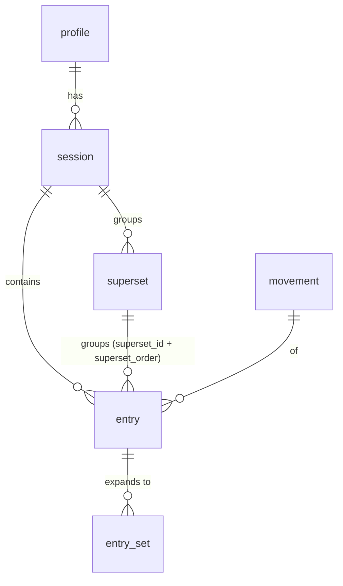

# V1-8 — Strength via session (+ superset), per-set — Staff plan & sub-PR split

> Backlog: [plan.md](../plan.md) row **V1-8** ("Kids' strength via session (+ light superset), per-set.
> **Superset model must support arbitrary adult PPL pairings — v2 reuses it**; spec.md §4 `superset`").
> This plan governs a **significant, migration-bearing** change and is split into shippable sub-PRs.
> Branches: `db/v1-8-1-supersets-schema`, then `feat/v1-8-2-strength-session`, `feat/v1-8-3-superset-ui`.

## Goal

Turn today's single-movement strength logger into a **session that groups N movements** (each still
logging its own `entry` → `entry_set`), where **2+ movements can be tagged into a `superset`** performed
alternating. The data model built here must carry **arbitrary N-movement adult PPL pairings** (Ray's DB
Bench + OHP, Dips + Lateral Raises) from the first migration, so v2 (Ray's PPL) **reuses** it rather than
re-modeling — the spec.md §4 hard requirement. The pivotal artifact is an **expand-only migration** adding
a `supersets` table + `entries.superset_id`/`superset_order`, proven by `db:verify`.

---

## 1. Scope + split recommendation (read first)

This is too large for one <400-line PR: it is a migration **plus** a session-aware transactional write path
**plus** a multi-movement/superset form **plus** a read-path grouping change. I recommend a **3-way split**,
mirroring the V1-6b-1/b-2 precedent (ship the migration + its `db:verify` proof **alone** first, then the
read/write app code):

| Sub-PR                             | Scope                                                                                                                                                                                                                                                                                                                                                                                                                                                                                                                                                     | Closes                                                                                    | ~Size |
| ---------------------------------- | --------------------------------------------------------------------------------------------------------------------------------------------------------------------------------------------------------------------------------------------------------------------------------------------------------------------------------------------------------------------------------------------------------------------------------------------------------------------------------------------------------------------------------------------------------- | ----------------------------------------------------------------------------------------- | ----- |
| **V1-8-1** ← FIRST, detailed below | `supersets` table + `entries.superset_id`/`superset_order` + covering indexes + CHECKs (migration `0005`); `schema.ts`; **`db:verify` proof** a session with a 2- and 3-movement alternating superset round-trips (superset_id + order) + constraint rejections. **DB-only — no app write path, no UI.**                                                                                                                                                                                                                                                  | The **data model** exists and is **proven to support arbitrary N-movement PPL pairings**. | ~250  |
| **V1-8-2** (sketch)                | Session-aware write path for **FLAT sessions only**: `logStrengthSession` DAL (session + N movement entries + sets in one tx, per-entry idempotency, optional `sessions.feel`), the `shared` write schema, `logStrengthSessionAction`, a **multi-movement** form (add movement / add set per movement), and the read path grouping the day's entries under their session. **No superset write branch** (that ships with its UI in 8-3 — R11). Extracts `writeStrengthEntryWithSets` (R10) and switches the read set-fetch to `movement_id`-based (R5/F2). | Acceptance **"Log a full S&C strength day."** (kids' primary flow)                        | ~330  |
| **V1-8-3** (sketch)                | **Superset grouping**: the `superset_id`/`superset_order` **write branch** in `logStrengthSession` **and** the grouping UI (group 2+ movement cards) **and** the read bracketing — shipped together so the write path has a caller + boundary tests (R11).                                                                                                                                                                                                                                                                                                | The "+ light superset" clause + the visible PPL-pairing UX.                               | ~280  |

**Why the migration ships alone (V1-8-1), not bundled with the DAL.** V1-6b-1 set the precedent: the
migration + `db:verify` proof land in a DB-only PR ("schedule ships `[]`; DB-only, no app code"), and the
DAL/UI follow. A `logStrengthSession` DAL shipped in V1-8-1 would be an **unused export** — it can't be
exercised through an action/`revalidatePath`, can't get its mandatory authZ/ownership boundary tests
(there's no caller), and trips dead-code/coverage concerns. Keeping V1-8-1 to the schema + its raw-SQL
round-trip proof (exactly how V1-6b-1 proved `ramp_targets` before its DAL existed) makes the reviewable
contract the **shape of the data**, which is where all the PPL-durability risk lives. See Open Questions
Q1 — the prompt floated putting the DAL in slice 1; this is a deliberate, precedent-backed pushback.

**Bundling alternative considered & rejected:** shipping V1-8 whole. Rejected — it fails the
one-concern/<400-line target and forces reviewing a migration, a transactional writer, and a form in one
diff, which is exactly the mixing AGENTS.md's "one migration/PR" + "one concern" rules forbid.

---

## 2. Acceptance (V1-8-1, concrete/testable)

Copy of the plan.md criterion this slice advances toward: **"Log a full S&C strength day."** (Full
acceptance closes at V1-8-2; V1-8-1's own done-when bullets:)

- Migration `0005` applies forward on an empty Docker PG (the CI ephemeral-PG job); the seed runs twice
  idempotently; `drizzle-kit generate` leaves a clean tree (the drift guard). **Squawk + Neon-branch apply
  are deferred repo-wide (status.md / migrate.yml) — not gates for this PR** (R4).
- `db:verify` proves, on real SQL (PGlite):
  1. A `sessions` row (`session_type='strength'`) with a **2-movement alternating superset** (label "DB
     Bench + Overhead Press") persists as: session → `supersets` row → **2 `entry` rows** each tagged
     `superset_id` + `superset_order` (1, 2), each `kind=NULL` carrying **`movement_id` AND `movement_name`**
     (so the retained `entries_shape_check` passes — R5) with metric_key NULL (the at-most-one CHECK holds)
     → each expanding to `entry_set` rows. Ordering by `superset_order` returns the movements
     deterministically.
  2. **PPL generality:** a **3-movement** superset round-trips identically (no arity cap CHECK) — not a
     kids-only 2-only shortcut; v2 reuses it verbatim.
  3. A **mixed** session (one superset + one standalone movement entry, `superset_id` NULL) round-trips, and
     the **session-level block order is deterministic** by insertion (`id`): the superset block sits at its
     earliest member's `id`, the standalone at its own — no session-wide ordinal column needed (R3).
  4. **Writer-produced graphs are self-consistent + profile-scoped:** the proof inserts consistent
     `entry.session_id == superset.session_id` and asserts a second profile's session never appears in the
     first's rows. (Same-session membership is a **writer invariant**, matching how `entry.profile_id` vs
     `session.profile_id` is already handled — not a composite FK. R2.)
  5. **Idempotent whole-graph replay (R8):** inserting the mixed session→superset→entries graph **twice**
     (same `client_id`s) yields **one** graph (per-row `ON CONFLICT` dedupe at every level).
- Constraint rejections (via `expectRejectedBy(constraintName, fn)`): `entries_superset_order_check`
  (superset_id set, order NULL — the pairing), **`uq_entries_superset_order`** (two members, same slot — R1),
  **`entries_superset_movement_check`** (superset_id set, movement_id NULL — R6), the `superset_id` FK, the
  `session_id` FK, `uq_supersets_client_id` (replay dedupe).
- **DAL invariants (NOT schema-enforced — stated so the proof isn't misread — R6):** a superset has **≥2
  members** (DDL can't cheaply express this; tested in V1-8-2/8-3); same-session membership (R2).
- **No legacy regression:** every existing `db:verify` assertion (V0–V1-7) still passes; the Today read
  path, `logStrengthEntry`, and `listEntriesForDay` are untouched by this slice.

---

## 3. The migration (V1-8-1 — the pivotal artifact)

`entries` already carries `session_id` (nullable FK + `idx_entries_session`, added in `0002`); this slice
adds the **superset** grouping layer only. Numbering: the next file is `0005`.

### 3.1 `supersets` table (net-new, empty → clean by construction)

| Column       | Type                        | Notes                                                                                                                    |
| ------------ | --------------------------- | ------------------------------------------------------------------------------------------------------------------------ |
| `id`         | bigint identity PK          | internal PK convention (`ramp_targets` shape)                                                                            |
| `public_id`  | uuid NOT NULL UNIQUE        | UUIDv7, app-generated (anti-IDOR)                                                                                        |
| `client_id`  | uuid NOT NULL               | offline idempotency; partial UNIQUE — the **`sessions.uq_sessions_client_id`** idiom (a superset has no natural key; D7) |
| `session_id` | bigint NOT NULL FK→sessions | the grouping parent; covering index                                                                                      |
| `label`      | text (nullable)             | "DB Bench + Overhead Press" / "light superset" (spec.md §4)                                                              |
| `note`       | text (nullable)             | spec.md §4 (part of the entity; net-new table → no later ALTER — R12)                                                    |
| timestamps   | created/updated/deleted     | shared `timestamps` group (LWW + soft delete)                                                                            |

**No `position` column (R3):** the spec models a superset as `session_id,label,note` only — ordering lives
on the entry side (`superset_order`). Session-level block order comes from insertion (`id`), so a superset
needs no session-scoped ordinal. Indexes/constraints (declared in `schema.ts`, generated by drizzle):
`idx_supersets_session` (covers the FK) + `uq_supersets_client_id` (partial `WHERE deleted_at IS NULL`). The
FK is added `NOT VALID → VALIDATE` per AGENTS.md (empty table → validates instantly).

### 3.2 `entries` additions (existing table — additive, all-NULL, no rewrite)

- `ADD COLUMN superset_id bigint` (nullable) — FK → `supersets.id`, added `NOT VALID → VALIDATE` (all-NULL
  column → validate is instant); covering `idx_entries_superset`.
- `ADD COLUMN superset_order integer` (nullable) — the movement's order **within its superset** (spec.md §4:
  "tagged by superset_id + **order**"). Explicit column, not derived from `id`/`created_at` — see D3.
- **`uq_entries_superset_order` (R1)** — `uniqueIndex` on `(superset_id, superset_order)` partial `WHERE
deleted_at IS NULL`, declared in `schema.ts`. Two members can't claim the same slot → the alternating
  order is deterministic. The exact ordinal-within-parent idiom `entry_sets.uq_entry_sets_entry_idx` uses.
- **Hand-added CHECKs** (NOT declared in `schema.ts`, mirroring `entries_value_source_check` /
  `entries_activity_type_id_not_null` so the drizzle snapshot stays trivially clean; both `NOT VALID →
VALIDATE`, instant on the all-NULL column):
  - `entries_superset_order_check CHECK ((superset_id IS NULL AND superset_order IS NULL) OR (superset_id IS
NOT NULL AND superset_order IS NOT NULL))` — pairs the two columns (no member without order, no order
    without a superset).
  - **`entries_superset_movement_check CHECK (superset_id IS NULL OR movement_id IS NOT NULL)` (R6)** — a
    superset member must be a **movement** (not a metric-only or bare-habit row); forbids a "superset of
    check-ins".

### 3.3 Migration body shape (`0005_*.sql`)

Follows `0002`/`0004` exactly:

- `SET lock_timeout = '5s'; SET statement_timeout = '60s';` before any DDL.
- `CREATE TABLE "supersets" (…)` (no `position`/`supersets_position_check` — R3).
- `ALTER TABLE supersets ADD CONSTRAINT supersets_session_id_sessions_id_fk … NOT VALID` → `VALIDATE`.
- `CREATE INDEX idx_supersets_session …`; the partial `CREATE UNIQUE INDEX uq_supersets_client_id … WHERE
deleted_at is null`.
- `ALTER TABLE entries ADD COLUMN superset_id bigint;` `ADD COLUMN superset_order integer;`
- `ALTER TABLE entries ADD CONSTRAINT entries_superset_id_supersets_id_fk … NOT VALID` → `VALIDATE`.
- `CREATE UNIQUE INDEX uq_entries_superset_order ON entries (superset_id, superset_order) WHERE deleted_at is
null;` (R1) and `CREATE INDEX idx_entries_superset ON entries (superset_id);` — **both non-concurrent**.
  On the current single-household, offline-not-yet-shipped `entries` this is sub-second; the whole file runs
  in one transaction (so ACCESS-EXCLUSIVE `ADD COLUMN` + the index SHARE lock hold to commit — which is also
  why `CONCURRENTLY` is unavailable here without the deferred transaction-stripping runner). Same risk
  profile as `0002`'s `idx_entries_session`. **Squawk is deferred repo-wide** (R4/Risk R1): it is not a gate
  now; when wired, its static `require-concurrent-index-creation` rule will flag these two `entries` indexes
  regardless of row count, resolved then by an inline `-- squawk-ignore:require-concurrent-index-creation`
  or the concurrent-index runner — not by table size.
- Hand-added block (after the generated DDL, so it doesn't perturb `meta/`), each `NOT VALID` → `VALIDATE`:
  `entries_superset_order_check` (pairing) and `entries_superset_movement_check` (member-is-a-movement — R6).

Expand-only, forward-only (no DROP/RENAME/TRUNCATE; new FKs NOT VALID→VALIDATE; new NOT NULL only on the
empty `supersets` table). One migration, one PR; `0000`–`0004` untouched.

### 3.4 Mermaid ERD delta (for the PR description)

New this migration: the `superset` node and its `session ||--o{ superset` and `superset ||--o{ entry` edges
(the `entry.superset_id`/`superset_order` tags). Everything else already exists (`0000`–`0004`).

---

## 4. Design decisions

**D1 — Session-aware write path: new `logStrengthSession` DAL, not an extend of `logStrengthEntry` (decided
here, implemented in V1-8-2).** `logStrengthEntry` writes exactly one entry + its sets and is a live caller
(the current single-movement form, retained until V1-8-2 flips the form). A session writer adds a _parent_
`sessions` insert and a loop over N movements — a different transaction shape. Add **`logStrengthSession`**
alongside it, reusing the proven primitives: `findOrCreateMovementId`,
`getActivityTypeIdByKey(SEED_ACTIVITY_TYPE_KEYS.scLift)`, the `entry_set` write loop, per-entry `client_id` +
`ON CONFLICT DO NOTHING` idempotency, and the profile-scoping seam. Retire `logStrengthEntry` only when no
caller remains (a follow-up cleanup, not this slice). Precedent: `logCheckinEntries` already generalized a
single writer into an N-item writer.

**D2 — One transaction; per-row idempotency at every level (R7).** `logStrengthSession` opens one
`db.transaction` and inserts every row with `ON CONFLICT DO NOTHING` keyed on its **own** `client_id` — the
`sessions` row, each `supersets` row, and each movement `entry` — with **no** parent-existence short-circuit.
(A "session exists → skip children" guard would orphan children if a prior attempt committed the parent then
crashed — R7.) For each movement: insert its `entry` (session_id set, **`kind=NULL`** + `movement_name`+
`movement_id` — the decoupled shape, R5/F2), then its `entry_set` rows via the extracted
`writeStrengthEntryWithSets` (R10); a superset (V1-8-3) inserts its `supersets` row, then stamps `superset_id`

- `superset_order` onto the member entries, always setting `entry.session_id = superset.session_id` (the
  same-session writer invariant — R2). `findOrCreateMovementId` resolves **outside** the tx (idempotent by
  slug). Either the whole graph lands or none does; a full replay dedupes row-by-row.

**D3 — Two order axes, no third (R3).** _Within a superset_: an explicit `entries.superset_order` (unique per
superset via `uq_entries_superset_order`, R1) — spec.md §4 mandates the explicit "order" tag, and it's stable
under v1.5 LWW re-inserts where `id` order isn't. _Session-level_ (block order): **insertion order** via
`(created_at, id)` — the existing `listEntriesForDay` tiebreak (`id` is monotonic per-tx, so a batched insert
is still deterministic); a superset block sits at its earliest member's `id`. **No `supersets.position`** —
the spec doesn't model it, arbitrary-N arity doesn't need it, and it would be a second session-scoped ordinal
D3 already rejected for standalone movements. If v1.5 edits ever require stable re-ordering independent of
insertion, a nullable `entries.session_order` is a clean additive backfill from `id` — not a re-model.

**D4 — Feel/soreness at session grain; `next_day_soreness` deferred.** `sessions.feel` already exists →
V1-8-2 surfaces an optional session feel input writing that column. **Do NOT add a `next_day_soreness`
column now** — it's a v2 concern, needs its own migration, and an unused column violates expand-only
discipline. Keeps the V1-8-1 migration to exactly the superset model.

**D5 — Read path (Today) relationship to sessions; decouple from V1-1d (R5/F2).** V1-8-1 does not touch reads.
In V1-8-2, session movement entries are written **`kind=NULL`** + `movement_id` + `movement_name` + `entry_set`s
(the forward shape, not feeding the V1-1d `kind`-drop debt). So V1-8-2 **switches `listEntriesForDay`'s
set-fetch dispatch from `kind === 'strength'` to `movement_id !== null`** (the post-V1-1d discriminant, which
catches both new session entries and legacy backfilled strength rows) — a small, decoupling read change, and
it adds `sessionId`/`supersetId`/`superset_order` to `EntryDTO`. Grouping the day's rows under their session
header (bracketing superset members) is an additive helper on the existing `TodayRow` union beside `todayRows`
(R10), not a rewrite. Non-session strength entries keep rendering flat.

**D6 — Superset UI interaction (V1-8-3).** Mobile-first, one-concern: the strength form is a list of movement
cards (each: movement name, unit, per-set reps×weight). A "Group as superset" affordance selects 2+ adjacent
movement cards into a labeled superset (default label "Movement A + Movement B"); order within = card order →
`superset_order`. Kids' "light superset" and Ray's PPL pairing are the **same interaction** — no kids-only
shortcut. ≥44px, `inputmode="numeric"`, adaptive at 360px.

**D7 — `supersets.client_id`.** Every mutable log row gets a `client_id` for the v1.5 sync graph (`session`
and `entry` already do); `supersets` is a log row, so it gets one + a partial UNIQUE, so the offline
append-outbox can replay a whole session→superset→entry graph idempotently.

**Deferred (explicitly out of V1-8 entirely):** `block_id`/`program_block`, `prescription`/
`prescription_target`, progression `ladder`/`rung`/`progression_state`, greyed suggested loads (V1-10/v2);
`next_day_soreness` (v2); weighted-calisthenics/`pullup_max` surfacing (V1-8a); edit/delete of a set
(V1-9/9b); CSV export of sessions (V1-13).

---

## 5. File-by-file (V1-8-1)

| Path                                           | Change | What & why                                                                                                                                                                                                                                                                                                                                                                                                                                                                                       |
| ---------------------------------------------- | ------ | ------------------------------------------------------------------------------------------------------------------------------------------------------------------------------------------------------------------------------------------------------------------------------------------------------------------------------------------------------------------------------------------------------------------------------------------------------------------------------------------------ |
| `packages/db/src/schema.ts`                    | EDIT   | Add the `supersets` pgTable (§3.1 — **no `position`**); add `supersetId` (FK `() => supersets.id`) + `supersetOrder` + `idx_entries_superset` + **`uq_entries_superset_order`** (R1) to `entries`. Add the comment block noting `entries_superset_order_check` + `entries_superset_movement_check` (R6) live in the migration, not the snapshot. Place `supersets` near `sessions`; arrow-fn refs handle declaration order.                                                                      |
| `packages/db/migrations/0005_*.sql`            | NEW    | Generated by `drizzle-kit generate`, then the hand-added `entries_superset_order_check` + `entries_superset_movement_check` blocks + the non-concurrent-index / Squawk-deferred comment (§3.3). The reviewed artifact. **Do not edit any of `0000`–`0004`.**                                                                                                                                                                                                                                     |
| `packages/db/migrations/meta/*`                | NEW    | drizzle snapshot/journal update from `generate` (committed as-is; drift guard).                                                                                                                                                                                                                                                                                                                                                                                                                  |
| `docs/decisions/0003-superset-log-grouping.md` | NEW    | ADR (R9): why a `supersets` table (not a denormalized group key); the order axis (entry insertion + `superset_order`); arity (no cap); same-session = writer invariant (R2); the log-event vs `prescription.superset_label`-definition seam for v2.                                                                                                                                                                                                                                              |
| `packages/db/scripts/verify.ts`                | EDIT   | Append the **V1-8-1 block**: build a strength session + a 2- and 3-movement alternating superset + a mixed standalone movement (members `kind=NULL` + `movement_name`+`movement_id` — R5); round-trip them (superset_id/order, deterministic within-superset AND mixed-session order — R3); insert the graph **twice** → one persists (R8); assert writer-consistent `session_id` + profile scoping (R2); and the six constraint rejections (§2) via `expectRejectedBy`. Reuse seeded movements. |
| `docs/plan.md`                                 | EDIT   | Update the V1-8 row → split into V1-8-1/8-2/8-3 with links; mark V1-8-1's scope (migration + proof, DB-only).                                                                                                                                                                                                                                                                                                                                                                                    |
| `docs/status.md`                               | EDIT   | Changelog + backlog pointer for V1-8-1 (status rides with the work — same PR).                                                                                                                                                                                                                                                                                                                                                                                                                   |
| `docs/plans/v1-8-strength-sessions.md`         | NEW    | This plan (the reviewed contract).                                                                                                                                                                                                                                                                                                                                                                                                                                                               |

**Not touched in V1-8-1** (land in 8-2/8-3): `packages/shared/*` (the session/superset write schema is a
V1-8-2 concern — no new _enum_ is introduced, so slice 1 needs no shared const), `apps/web/lib/dal/entries.ts`,
`apps/web/app/p/[profileId]/{actions,strength-form,page}.tsx`, `apps/web/lib/entries/*`.

### V1-8-2 file sketch (next slice)

- `packages/shared/src/strength-session.ts` NEW — `logStrengthSessionSchema` (profileId, day, sessionType
  default `'strength'`, clientId, feel?, `movements: [{ movementName, unit, sets, clientId, supersetIdx?,
supersetOrder? }]`), reusing `strengthSetSchema` + `BODYWEIGHT_UNITS` + `uuidSchema`. Export from `index.ts`.
- `apps/web/lib/dal/entries.ts` EDIT — add `logStrengthSession` (D1/D2). Add `sessionId`/`supersetId`/
  `supersetOrder` to `EntryDTO` + `listEntriesForDay` select (additive, nullable) for read grouping.
- `apps/web/app/p/[profileId]/actions.ts` EDIT — `logStrengthSessionAction` (re-auth/authZ/zod → DAL →
  `revalidatePath`), replacing `logStrengthAction` as the form's action.
- `apps/web/app/p/[profileId]/strength-form.tsx` EDIT — multi-movement UI + optional session feel.
- `apps/web/app/p/[profileId]/page.tsx` + `apps/web/lib/entries/activity-totals.ts` EDIT — group the day's
  rows under their session (additive helper beside `todayRows`).
- Tests: `actions.test.ts` (boundary: unauth/wrong-body/happy) + a pure-helper unit test + `verify.ts`
  DAL-parity (optionally single-source the session round-trip so both the DAL and verify run it, à la
  `weeklyAdherenceRows`).

### V1-8-3 file sketch

- `strength-form.tsx` + a small `superset-group` client helper — group 2+ movement cards; write
  `supersetIdx`/`supersetOrder`. `page.tsx` — bracket superset members in the Logged list. No schema change.

---

## 6. Test plan (V1-8-1)

- **`db:verify` (the proof, PGlite, `pnpm --filter @mat-plan/db verify`):** the V1-8-1 block above —
  session+superset round-trip (2- and 3-movement + mixed), profile scoping, and all six constraint rejections
  by **constraint name** (reusing `expectRejectedBy`). Same in-process-Postgres tier the whole file uses;
  deterministic public_ids in an unused id block (e.g. `…0000000008xx`).
- **CI DB gates (required, as actually wired — R4):** a clean `db:generate` tree (the drift guard) + `db:verify`
  (PGlite) + the migration applying on the **Docker-PG** service container with `db:seed` run twice
  (idempotent). Squawk lint + the Neon-branch apply are **deferred repo-wide** — not gates here.
- **No app/action/e2e tests in this slice** (no app code changed). The `e2e` job still runs (`packages/db` is
  code, not inert) and must stay green. Action-boundary + tri-viewport screenshots land with the UI in
  V1-8-2/8-3.

---

## 7. Risks / rollback

- **R1 — non-concurrent `idx_entries_superset` + `uq_entries_superset_order` on the existing `entries` table
  (R4).** The whole migration runs in one transaction, so the `ADD COLUMN` ACCESS-EXCLUSIVE locks + the index
  SHARE locks hold to commit — sub-second on the current single-household `entries` (no offline writers yet),
  same profile as `0002`'s `idx_entries_session`, and the reason `CONCURRENTLY` is unavailable anyway (can't
  run inside drizzle's transaction without the deferred stripping runner). **Squawk is not a gate now**
  (deferred repo-wide); when wired, its _static_ rule flags both `entries` indexes regardless of row count →
  resolved by an inline `-- squawk-ignore:require-concurrent-index-creation` or the runner, not by table size.
  Revisit before the table grows (v1.5 offline).
- **R2 — perturbing the drizzle snapshot with the hand-added CHECK.** `entries_superset_order_check` is added
  in raw SQL and **not** declared in `schema.ts` (mirroring `entries_value_source_check`), so
  `drizzle-kit generate` stays clean. Verified pattern.
- **R3 — the paired-nullability CHECK vs the existing `entries_shape_check` trap.** The new CHECK only
  couples `superset_id`↔`superset_order`; it is orthogonal to the retained legacy `entries_shape_check`.
  Superset member entries are `kind='strength'` with `movement_name` set → satisfy both. `db:verify` inserts
  them exactly that way.
- **R4 — FK validate cost.** Both new FKs are `NOT VALID → VALIDATE`; on the all-NULL/empty tables the
  VALIDATE is instant. No backfill, no volatile default.
- **Rollback:** fix-forward (expand-only is reversible by omission — the columns/table are unused until
  V1-8-2). Cut a Neon RESTORE branch pre-apply per the standard DB runbook before merge; no destructive step
  needs it here.

## 8. Reuse obligations (checked against the constants/DRY rule)

- `sessions`/`entries.session_id`/`idx_entries_session` — **already exist** (`0000`–`0002`); this slice adds
  only the superset layer. Do not re-add.
- `SESSION_TYPES`/`SESSION_STATUSES` + `sessionTypeSchema` (`packages/shared/src/sessions.ts`) — reuse; the
  `sessions` CHECKs already mirror them. No new enum introduced by supersets (label/note free text). V1-8-2's
  `sessionType` default comes from `SESSION_TYPES`/`sessionTypeSchema`, **not** a re-typed `'strength'` (R10).
- `timestamps` group, `newId()`, the partial-UNIQUE `client_id` idiom (the **`sessions`** shape, not
  `ramp_targets` which has none — R10), `expectRejectedBy`, the seeded movements — all reused, not re-created.
- V1-8-2 must reuse `findOrCreateMovementId`, `getActivityTypeIdByKey(SEED_ACTIVITY_TYPE_KEYS.scLift)`, the
  always-set-value idiom, `strengthSetSchema`, and — the F7 correction — the **inline `profiles`
  publicId→internal-`id` select inside the tx** (`logStrengthEntry`/`logCheckinEntries` do NOT call
  `getProfileByPublicId`, which returns a DTO with no internal id; the action layer re-resolves ownership).
  **Extract `writeStrengthEntryWithSets(tx, …)`** (the entry insert + `ON CONFLICT` + `entry_set` loop, today
  inline in `logStrengthEntry`) so `logStrengthEntry` and `logStrengthSession` share ONE set-writer and can't
  drift (R10). Single-source the session round-trip (DAL + `db:verify` run the same query, à la
  `weeklyAdherenceRows`).

## 9. Out-of-scope / deferred

Per §4 "Deferred": `program_block`/`prescription`/progression, `next_day_soreness`,
weighted-calisthenics/`pullup_max` surfacing, set edit/delete, session CSV export. And within V1-8: the write
DAL, the form, and the read grouping are V1-8-2; the superset grouping UI is V1-8-3.

## 10. Open questions

- **Q1 — DAL in slice 1 vs 2? RESOLVED (panel confirmed):** DAL in V1-8-2 (a caller-less DAL can't get its
  authZ/ownership boundary tests; the V1-6b-1 precedent). And the **superset write branch moves to V1-8-3**
  (R11) — same reason applied one level deeper.
- **Q2 — Squawk on the non-concurrent `entries` indexes? RESOLVED (R4):** Squawk is **deferred repo-wide** and
  is **not a gate** for this PR (so `0002` "passed" only because Squawk never ran, not via a deviation). When
  wired, its static rule flags `idx_entries_superset` + `uq_entries_superset_order` regardless of table size,
  resolved then by an inline `-- squawk-ignore` or the concurrent-index runner. Not a V1-8-1 blocker.
- **Q3 — Does a superset need a `status`?** No (a pure grouping; member entries carry `status`). Add later if
  a "skipped superset" concept emerges — expand-only, no cost now.
- **Q4 — Kids' "light superset" vs adult PPL in the UI (V1-8-3).** The data model is identical (2+ movements,
  alternating, `superset_id`+order). Open only whether the **copy/affordance** differs. Resolve in V1-8-3's UI
  review; does not affect the V1-8-1 schema.
- **Q5 — spec §4a alignment.** The ADR (0003) should note the schema realizes spec §4's `superset(session_id,
label, note)` exactly (no `position`) + the entry-side `superset_order`; flag any spec §4a copy that implies
  a superset ordinal for a one-line spec clarification (follow-up).

## 11. Review-response log (adversarial panel)

Five lenses: Correctness/data-integrity · Simplicity/scope · Architecture/consistency · Code-reuse/DRY ·
**DB-safety** (added — migration PR). Net: a **tighter, more correct migration** — two integrity fixes
added (`uq_entries_superset_order`, an N1 movement CHECK), one column family **cut** (`supersets.position`),
several false-gate/shape claims corrected, and the V1-1d entanglement removed. No blocking defect survives.

| #   | Lens                                                                    | Critique                                                                                                                                                                                                                                                                                                                                                                                                                                                                                                                                                         | Resolution                                                                                                                                                                                                                                                                                                                                                                                                                                                                                                                                                                                                                                                                                                                                                                                                                                       |
| --- | ----------------------------------------------------------------------- | ---------------------------------------------------------------------------------------------------------------------------------------------------------------------------------------------------------------------------------------------------------------------------------------------------------------------------------------------------------------------------------------------------------------------------------------------------------------------------------------------------------------------------------------------------------------- | ------------------------------------------------------------------------------------------------------------------------------------------------------------------------------------------------------------------------------------------------------------------------------------------------------------------------------------------------------------------------------------------------------------------------------------------------------------------------------------------------------------------------------------------------------------------------------------------------------------------------------------------------------------------------------------------------------------------------------------------------------------------------------------------------------------------------------------------------ |
| R1  | correctness (B1, blocking)                                              | No uniqueness on `(superset_id, superset_order)` → two members can both claim slot 1; the alternating order the spec mandates is non-deterministic (and the plan's own "ordering returns movements deterministically" acceptance is false).                                                                                                                                                                                                                                                                                                                      | **Incorporated.** Add `uq_entries_superset_order` on `(superset_id, superset_order)` partial `WHERE deleted_at IS NULL` — the exact ordinal-within-parent idiom `entry_sets.uq_entry_sets_entry_idx` already uses. Cheap now, needs de-duping corrupt rows later. + a 7th rejection test (dup slot).                                                                                                                                                                                                                                                                                                                                                                                                                                                                                                                                             |
| R2  | correctness (B2, blocking) — **vs** architecture/simplicity consistency | Independent FKs let an entry be tagged into another session's/profile's superset; schema-level, acceptance #4 ("reachable only via `session.profile_id`") is false. Correctness wants a composite FK `(session_id, superset_id) → supersets(session_id, id)`.                                                                                                                                                                                                                                                                                                    | **Resolved → DAL invariant + verify assertion, NOT a composite FK.** The existing schema **already** handles the identical cross-parent case — `entries.session_id` and `entries.profile_id` are independent FKs with **no** composite constraint forcing `entry.profile_id == session.profile_id`; consistency is writer-maintained. Adding the schema's **first** composite FK only for supersets would be an inconsistent one-off (architecture's consistency point + simplicity's don't-over-model). So: the writer sets `entry.session_id = superset.session_id` (V1-8-2), the `db:verify` proof asserts a produced graph is self-consistent, and **acceptance #4 is reworded** to "writer-enforced + read-scoped" (honest). The composite FK is noted as a future hardening if a non-DAL write path ever appears.                          |
| R3  | simplicity + architecture (F1) + correctness (S1)                       | `supersets.position` (+ its CHECK + `uq_supersets_session_position`) is **not in spec** (§4 = `session_id,label,note` only), **not needed** for the arbitrary-N _arity_ requirement, and **contradicted by D3** (which declines a session-wide ordinal for standalone movements as YAGNI, then adds one for supersets). And a mixed session (superset + standalone) then has no common order axis → non-deterministic interleave.                                                                                                                                | **Incorporated — cut it.** Remove `supersets.position` + `supersets_position_check` + `uq_supersets_session_position` (−2 rejection tests). **Session-level block order = insertion order** (`created_at`, `id` tiebreak — the existing `listEntriesForDay` idiom): a superset block sits at its earliest member's `id`; members order by `superset_order`. One axis, deterministic. The proof gains a **mixed-session order assertion** (D3/D5 + F1). An explicit `entries.session_order` is a clean additive later if v1.5 edits require stable reordering — deferred (not a re-model).                                                                                                                                                                                                                                                        |
| R4  | DB-safety (B1, blocking-doc)                                            | The acceptance's "Squawk passes" + "applies on a Neon branch" are **unverifiable** — Squawk isn't wired (`status.md`: "Squawk stays deferred"), Neon isn't wired (`migrate.yml`: "Neon not wired yet"). Q2's "0002 got the index past Squawk" is factually wrong (Squawk never ran). Squawk's concurrent-index rule is **static** (row-count irrelevant), so `idx_entries_superset` _will_ be flagged when wired.                                                                                                                                                | **Incorporated (correct the gates).** The real V1-8-1 gates = **drift guard (clean `generate`) + `db:verify` (PGlite) + Docker-PG `migrate`/`seed` apply**. Drop "Squawk passes"/"Neon branch" from acceptance → deferred (mirror V1-6b's status wording). Q2 rewritten: `0002` passed because Squawk isn't a gate, not via a deviation. R1 rewritten: table-size is not the mitigation; the real one is **deferred-now** / an inline `-- squawk-ignore:require-concurrent-index-creation` when Squawk is wired.                                                                                                                                                                                                                                                                                                                                 |
| R5  | DB-safety (S2) + architecture (F2)                                      | §2.1 says members carry "`movement_id` (metric_key NULL)" but omits `movement_name` — a `kind='strength'` member without `movement_name` is **rejected** by the retained `entries_shape_check`. Separately (F2): keeping `kind='strength'` only so the read renders it makes V1-8 a **net-new writer of a column V1-1d will drop**, growing that debt.                                                                                                                                                                                                           | **Incorporated.** §2.1 corrected: a member sets **`movement_name`** (kept until V1-1d) alongside `movement_id`. And per F2, the proof inserts members as **`kind=NULL`** (the decoupled forward shape — `kind=NULL` + `movement_name` set passes the 3-valued CHECK, exactly how `logCheckinEntries` writes), and **V1-8-2's read set-fetch dispatches on `movement_id !== null`** (the post-V1-1d discriminant), not `kind='strength'`. V1-8 stops feeding V1-1d.                                                                                                                                                                                                                                                                                                                                                                               |
| R6  | correctness (S2) + correctness (N1)                                     | Two integrity properties the schema doesn't guarantee: a superset with **0/1 members** (DDL can't express ≥2), and a superset member that **isn't a movement** (metric-only/bare-habit tagged with `superset_id` — a "superset of check-ins").                                                                                                                                                                                                                                                                                                                   | **Split by expressibility.** **≥2 members** is not cheaply DDL-expressible (needs a deferred trigger) → a **DAL invariant** tested in V1-8-2; the plan states this so nobody reads the proof as closing it. **Member-is-a-movement** _is_ a cheap single-table CHECK → **add `entries_superset_movement_check CHECK (superset_id IS NULL OR movement_id IS NOT NULL)`** (all-NULL column → NOT VALID→VALIDATE instant), mirroring `entries_value_source_check`. (Consistent rule: cheap single-table CHECKs get added; cross-table/exotic constraints — R2 — become writer invariants matching the existing session/profile pattern.)                                                                                                                                                                                                            |
| R7  | correctness (S3)                                                        | D2's "re-select and return without re-inserting children" conflicts with per-entry `ON CONFLICT`: if attempt 1 commits the session (or its `client_id`) then crashes before children, a replay short-circuits and never writes them → an empty session/superset (feeds R6).                                                                                                                                                                                                                                                                                      | **Incorporated (D2 reworded).** Per-row `ON CONFLICT DO NOTHING` at **every** level (session, superset, each entry — each idempotent by its own `client_id`); **no** parent-existence short-circuit. The whole-graph replay is idempotent because each row dedupes independently.                                                                                                                                                                                                                                                                                                                                                                                                                                                                                                                                                                |
| R8  | architecture (F6) + correctness                                         | The `db:verify` proof proves _schema_ correctness but the plan should also prove the schema **admits** the idempotent whole-graph replay the writer will rely on.                                                                                                                                                                                                                                                                                                                                                                                                | **Incorporated.** The proof inserts the mixed session→superset→entries graph **twice** (same `client_id`s) and asserts **one** graph persists (per-row dedupe), not merely the `uq_supersets_client_id` rejection.                                                                                                                                                                                                                                                                                                                                                                                                                                                                                                                                                                                                                               |
| R9  | architecture (F3)                                                       | The superset decision is exactly the v2-boxing modeling fork ADR 0002 was written for (spec: "v2 reuses it… no kids-only shortcut"): table-vs-denormalize, the order axis, arity, the log-event vs prescription-definition seam — currently only D-decisions in an ephemeral plan.                                                                                                                                                                                                                                                                               | **Incorporated.** Add **`docs/decisions/0003-superset-log-grouping.md`** (why a table; order = entry insertion + `superset_order`; arity = no cap; the log-superset-**event** vs `prescription.superset_label`-**definition** seam v2 links prescription-side). Added to the V1-8-1 file list.                                                                                                                                                                                                                                                                                                                                                                                                                                                                                                                                                   |
| R10 | code-reuse + architecture (F7)                                          | (a) §3.1/§5 cite `ramp_targets` for the `client_id`/partial-UNIQUE idiom, but `ramp_targets` deliberately has **no** `client_id` — the right cite is `sessions`. (b) The entry+sets write loop is **inline** in `logStrengthEntry`, not extracted → `logStrengthSession` would copy-paste it → two strength writers drift. (c) `sessionType default 'strength'` is a re-typed literal. (d) F7: `logStrengthEntry`/`logCheckinEntries` do **not** use `getProfileByPublicId` (a DTO with no internal id) — they inline a `profiles` publicId→id select in the tx. | **Incorporated (V1-8-2 obligations + a cite fix).** (a) Cite `sessions` for the `client_id`/partial-UNIQUE bits, `ramp_targets` for PK/timestamps/CHECK. (b) V1-8-2 **extracts `writeStrengthEntryWithSets(tx, …)`** that both `logStrengthEntry` and `logStrengthSession`'s loop call (the `logCheckinEntries` shared-writer precedent). (c) V1-8-2 uses `sessionTypeSchema`/`SESSION_TYPES` for the default. (d) The reuse note says **reuse the inline publicId→id select**, not `getProfileByPublicId`. (e) V1-8-2's session round-trip is **single-sourced** (non-optional), à la `weeklyAdherenceRows`.                                                                                                                                                                                                                                    |
| R11 | simplicity + architecture                                               | Keep the 3-way split, **but the superset _write branch_ is in the wrong slice**: V1-8-2 ships a `supersets`-insert + `superset_id` stamping branch with **no UI caller and no boundary test** — the exact caller-less-code anti-pattern the plan (rightly) forbids for slice 1.                                                                                                                                                                                                                                                                                  | **Incorporated.** V1-8-2 = **flat multi-movement sessions only** (a coherent, shippable kids' feature); V1-8-3 = the **superset write branch + grouping UI + read bracketing**, shipping together with its caller + tests. Still 3-way; cleaner seam; no dead code in any slice. V1-8-1 migration-only is confirmed correct (not ceremony — the V1-6b-1 precedent + the proof's weight).                                                                                                                                                                                                                                                                                                                                                                                                                                                         |
| R12 | all (confirmations)                                                     | —                                                                                                                                                                                                                                                                                                                                                                                                                                                                                                                                                                | **Kept.** `supersets` as a table is justified (label/note would drift denormalized; needs its own public_id/soft-delete — F4). v2 fit is sound, not over-fitting (no arity cap, per-movement progression is orthogonal — F5). The hand-added CHECK keeps the drift guard clean (verified: `entries_value_source_check`/`entries_activity_type_id_not_null` live only in raw SQL, absent from `meta/`). FK ordering + NOT VALID→VALIDATE correct; expand-only compliant; the partial-UNIQUE `WHERE deleted_at IS NULL` predicate matches the `ramp_targets`/`day_readiness` idiom. `supersets.note` kept (spec-listed entity; net-new table → no later ALTER). The whole migration runs in one transaction (ACCESS-EXCLUSIVE + SHARE locks held to commit) — sub-second on the tiny `entries`, and the reason CONCURRENTLY is unavailable anyway. |

**Net schema change from the panel:** −`supersets.position`/`supersets_position_check`/`uq_supersets_session_position`
(R3); +`uq_entries_superset_order` (R1); +`entries_superset_movement_check` (R6); same-session = writer
invariant not composite FK (R2). **Proof:** members inserted `kind=NULL` + `movement_name` (R5); +mixed-order
assertion (R3); +insert-twice idempotent-replay assertion (R8); rejection set becomes
{superset_order-pairing CHECK, `uq_entries_superset_order`, `entries_superset_movement_check`, `superset_id`
FK, `session_id` FK, `uq_supersets_client_id`}. **Gates:** drift + `db:verify` + Docker-PG (Squawk/Neon
deferred — R4). **Docs:** +ADR 0003 (R9). **Deferred to the right slices:** superset write branch → V1-8-3
(R11); `writeStrengthEntryWithSets` extraction + `kind=NULL` read dispatch → V1-8-2 (R5/R10).
