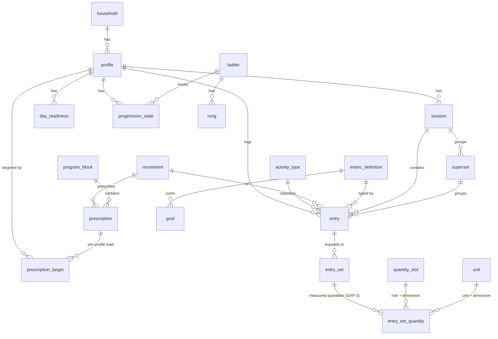

# mat-plan — Spec

**Architecture, data model, and engineering standards** — the _how_. For the _why_ (product, users,
market, what is actually shipped) see **[product-spec.md](./product-spec.md)**. Reviewed by a 3-agent adversarial stress-test
(schema / architecture / phasing) plus four research tracks (Postgres/Drizzle, Neon-serverless,
Next.js server, API/security); findings are folded in. The phased PR backlog lives in
[plan.md](./plan.md); agent rules in [../AGENTS.md](../AGENTS.md).

## 1. Context — why

The kids' training data kept going unlogged, and the stopgap was a single-file `localStorage` HTML
logger. This goes bigger for three reasons at once:

1. **Real tool** — hand it to Athlete One & Athlete Two to log everything they do in a day on a phone/iPad
   (wake, weigh-in, rice bucket, wrestling, calisthenics, brush-teeth, splits, S&C lifts, Brain Rep,
   shots), and log Ray's own PPL+core too.
2. **Learning vehicle** — hands-on React + backend + DB reps mapped to senior/staff full-stack
   **applied-AI** job targets.
3. **Portfolio** — dogfoods GitHub Actions CI + applied-AI evals.

Outcome: a portable, **entity-based** app that models _any_ logged activity, works offline in a gym,
and coexists with — then upgrades — the current Claude + CSV/markdown workflow. Built at ~4h/wk, so
**scope discipline is a first-class constraint.**

## 2. Decisions

| Decision         | Choice                                                                                                                                                                                                                                                                                                                                                                                                |
| ---------------- | ----------------------------------------------------------------------------------------------------------------------------------------------------------------------------------------------------------------------------------------------------------------------------------------------------------------------------------------------------------------------------------------------------- |
| Frontend         | Next.js (App Router/RSC) + TypeScript + Tailwind + shadcn/ui; TanStack Query at v1.5 (offline), not v0                                                                                                                                                                                                                                                                                                |
| Backend / Python | All-TS through v2. Progression engine stays **pure TypeScript** (no DB/IO) with golden vectors. Python/FastAPI only at v3, where evals/structured-output/pgvector want it                                                                                                                                                                                                                             |
| DB               | Postgres + Drizzle + Neon. Runtime = pooled string + `pg`/node-postgres through PgBouncer, Node runtime, Fluid `attachDatabasePool`; migrations = direct/unpooled string (neon-http disqualified — nested writes need interactive transactions)                                                                                                                                                       |
| Data access      | Server-only **DAL** (`lib/dal/*`) is the sole place touching Drizzle/`process.env`: auth → household-ownership authz → DTO                                                                                                                                                                                                                                                                            |
| Sync / edits     | Append-outbox + per-event UUIDv7 idempotency (DB UNIQUE + ON CONFLICT) + last-writer-wins on mutable rows, comparing the **client-supplied** timestamp                                                                                                                                                                                                                                                |
| Coexistence      | App-canonical + **versioned golden-file CSV export contract** + single-writer ownership per data type; v3 MCP/REST API that Claude fetches                                                                                                                                                                                                                                                            |
| Auth             | Access-gated stopgap until Beta 0; **Clerk** household login (Google) at Beta 0 — AUTH-1, pulled forward from v1.5 (kids have no accounts; the COPPA review is **done** — PRIV-1, [docs/privacy/](./privacy/)). Profile tiles = UX switch, not a security boundary; PIN deferred (`pin_hash` column only)                                                                                             |
| DB-in-CI         | Docker Postgres service for the CI test job; PGlite for `db:verify`. Previews point at a **separate, seed-only Neon project**, never a branch of production ([OPS-1](./plans/ops-1-preview-isolation.md), which corrected this row's long-standing "Neon branch-per-PR" claim — it was never built). A prod-shaped migration rehearsal on a Neon branch remains unwired ([tech-debt](./tech-debt.md)) |
| UI / design      | shadcn/ui + design tokens (CSS vars) + `DESIGN.md`; adult-first/clean, kid-ergonomic; Recharts for dashboards. No MUI                                                                                                                                                                                                                                                                                 |
| Host / CI / E2E  | Vercel + GitHub Actions + Playwright, from v0                                                                                                                                                                                                                                                                                                                                                         |

## 3. Repo structure

**One repo, one deployable app.** Through v2 the "backend" is Next.js Route Handlers + Server
Actions inside `apps/web` — a single full-stack Next.js app (modular monolith), not two co-located
services. Layout is a **pnpm workspace**, **not Turborepo yet** (promote when a 2nd app — the v3
Python service — lands).

```
mat-plan/
  README.md  AGENTS.md  .gitignore    # root: only these + tool-mandated config
  docs/                     # spec.md, plan.md, status.md, changelog/, definition-of-done.md, design.md, decisions/
  .github/                  # SECURITY.md, PULL_REQUEST_TEMPLATE.md, workflows/, ISSUE_TEMPLATE/
  apps/web/                 # Next.js App Router (only app through v2) — app/, components/, lib/(dal,env)
  packages/shared/          # zod schemas + TS types + golden test vectors (the contract)
  packages/engine/          # progression engine — PURE TS: (state, inputs) => decision, no DB/IO
  packages/db/              # drizzle schema + migrations + seed (catalogs)
```

File-organization rules (root stays clean, docs in `docs/`, etc.) are in [../AGENTS.md](../AGENTS.md).

## 4. Domain / entity model (tagged union, NOT EAV)

A generalized `entry` with a _fixed small_ set of typed value columns + a `unit` discriminator,
constrained by seed catalogs. Key/ID/enum conventions in [../AGENTS.md](../AGENTS.md): internal PK =
`bigint identity`; public IDs = UUIDv7; `client_id` = UUIDv7 NOT NULL UNIQUE(partial); all timestamps
`timestamptz`; `unit`/`category` = reference tables, `status` = text+CHECK; tagged-union XOR = a real
CHECK. All rows household-scoped for DAL authz.

**Catalog (seeded, versioned):**

- `household` — root; a Clerk operator owns one household.
- `profile` — id, household_id (FK), name, kind(kid|adult), birthdate, avatar, pin_hash?
- `activity_type` — key, label, category(strength|conditioning|skill|habit|measurement|routine|life),
  input_shape(set_list|single_metric|boolean|timing), default_unit, icon. _(The catalog is what makes
  it portable: wake, weigh_in, rice_bucket, wrestling_practice, calisthenics, brush_teeth, splits,
  sc_lift, brain_rep, shots are rows.)_
- `movement` — slug, name, pattern, unit_default, is_bodyweight, video_url, cues.
- `metric_definition` — key, label, unit, value_type, aggregation(sum|last|max|avg). Includes a
  canonical `shot` metric and a first-class `pullup_max` (aggregation=max).

**Program / prescription:**

- `program_block`, `prescription` (day_role, movement, superset_label?, order, sets, target_reps, scheme, notes)
- `prescription_target(prescription_id, profile_id, load, reps)` — per-profile loads (real table, not jsonb)
- `ladder` + `rung`; `progression_state` (profile, ladder, current_rung, current_target)
- `goal` (cumulative: 10K shots, calisthenics milestones). Calisthenics weekly ramp modeled as
  target rows so adherence is computable in SQL.

**Log / event (mutable rows, LWW):**

- `session` — profile_id, activity_date (declared), logged_at (device clock, informational),
  session_type, block_id?, timing, status, source, client_id. `feel`/`next_day_soreness` at session grain.
- `day_readiness` — profile_id, date, gate_color (readiness is per-day).
- `entry` — session_id?, superset_id?, profile_id, activity_date, event_at? (timing activities),
  activity_type_id, movement_id?, metric_key?, unit, raw_load, raw_reps (verbatim legacy strings for
  lossless export), scheme, status(done|skipped|sub_failure), value_num?, value_text?, context?, notes,
  client_id. CHECK: **at-most-one-of** {movement_id, metric_key} — a movement entry, a metric entry,
  or **neither** (a boolean habit check-in names only its activity_type; V1-5 is the first writer of
  that shape). Implemented in `0002` as `movement_id IS NULL OR metric_key IS NULL`.
  **`prescribed_snapshot`** (V1-22 chunk 1) is the PLAN as asked, rendered to one string and frozen at
  log time so a prescription edit cannot rewrite a past month's export. Nullable text, no index, and
  `''` ≠ NULL: `''` is a movement-only prescription's real rendering, NULL means "never snapshotted"
  and is the only state that falls back to the live `(day_role, movement)` match. Implemented in `0013`
  with `entries_prescribed_snapshot_movement_check` as
  `prescribed_snapshot IS NULL OR movement_id IS NOT NULL`.
- `entry_set` — entry_id, idx, reps?, **is_bodyweight, is_band**, status, client_id. _(Derived/queryable
  layer; `raw_*` on entry is the export source of truth.)_ **GAP-3 (migration `0011`) removed
  `weight_num`, `weight_label` and `seconds`**: one free-text column was encoding three different
  physical quantities. Magnitudes now live in `entry_set_quantity`; the two MODES stay booleans here,
  because a band has no number and bodyweight is a mode rather than a load.
- `entry_set_quantity` — entry_set_id, slot, dimension, unit, value_num, client_id. One row per
  measured quantity of a set, so a vest + ankle + wrist set is three rows and a sled's `123 (50ft)` is
  two. `UNIQUE (entry_set_id, slot)` is the arity rule. **The unit guard:** `dimension` is the shared
  column of two composite FKs — `(slot, dimension)` → `quantity_slot` and `(unit, dimension)` →
  `unit` — so `lb` in a box-jump height is rejected by the database, not by review.
- `quantity_slot` — code, dimension (composite PK). The controlled vocabulary of measurement ROLES:
  `primary` (whatever the movement measures — a mass, a length or a duration), `vest`, `ankle`,
  `wrist`, `distance`.
  - **Added-load axis (calisthenics):** a calisthenics bout may carry an optional added load
    (weighted vest/belt) — **reusing this `entry_set` reps+weight shape rather than a new structure**;
    max-strength metrics (`pullup_max`, weighted maxes) sit on top of that same data (plan.md `V1-8a`).
- `superset` — session_id, label, note (nullable).
  - **Requirement — adult PPL, not just kids:** a `superset` groups **2+ movements performed
    alternating** within a session; each movement still logs its own per-set `entry` → `entry_set`,
    tagged by `superset_id` + order. Ray's real PPL supersets pairs (e.g. **DB Bench + Overhead
    Press**, **Dips + Lateral Raises** — `job-search-context/docs/movement-templates.md`). The superset
    model built at **V1-8** (framed "light superset" for the kids) **must support arbitrary
    N-movement adult pairings from the start**, so **v2 (Ray's PPL) reuses it rather than re-modeling**
    — do not build a kids-only shortcut that later blocks PPL supersets.

**Mapping both systems:** kids strength `back-squat 3×3 "65/65/65"` → session → entry(raw_load, movement)
→ 3 entry_set (derived); export re-emits `raw_load` verbatim → lossless. Checkins/bodyweight/
calisthenics/habits → entry(metric_key or unit=bool). Life activities → one-tap entry(unit=timing|bool).
Ray's PPL → session(feel, soreness) → superset → entry → entry_set.

### 4a. Validation — ERD + worked coverage

All 11 kid activities + Ray's PPL were pushed through the schema against real data: **zero bespoke
per-activity columns needed.**



| Activity                         | Rows                                                                                               | Export                                                             |
| -------------------------------- | -------------------------------------------------------------------------------------------------- | ------------------------------------------------------------------ |
| wake                             | entry(type=wake, unit=timing, event_at)                                                            | app-only                                                           |
| weigh_in                         | entry(metric=bodyweight, unit=lb, value_num, context)                                              | bodyweight CSV                                                     |
| rice_bucket / splits / brain_rep | entry(unit=bool, status=done)                                                                      | app-only                                                           |
| wrestling_practice               | entry(type=wrestling_practice, unit=timing, value_num=min)                                         | app-only                                                           |
| calisthenics                     | 4× entry(metric∈{pushups,pullups,vsit_crunch,vsit_skill_step}, unit=count)                         | calisthenics CSV (pivot 4→1)                                       |
| brush_teeth                      | 7× entry(metric∈{stance,ladder,bridge,mobility,pressure,reaction,shot})                            | checkins CSV (pivot 7→1)                                           |
| sc_lift                          | session(strength_a, feel) + day_readiness → entry(movement, raw_load/raw_reps) → N entry_set       | strength-log CSV (per-movement, raw_load verbatim)                 |
| shots                            | entry(metric=**shot** — canonical, not double-modeled)                                             | checkins.shot projection; 10K = SUM(value_num WHERE metric='shot') |
| Ray PPL                          | session(feel,soreness) → superset → entry(unit ∈ reps+weight/sec) → entry_set; + progression_state | movement.csv / core-log.csv (v2)                                   |

Edge cases (sled `"123 (50ft)"`, box `"30in"`, `SKIPPED`, `sub-failure`) are lossless via `raw_*` +
`status`. Metric scales pinned: `pressure`=1–10, `reaction`=scale_10, `shot`=one canonical metric.

**CSV coverage caveat:** v1 CSV export covers the **4 legacy schemas** (strength-log, bodyweight,
checkins, calisthenics). The 5 no-legacy-CSV activities (wake, wrestling_practice, rice_bucket,
splits, brain_rep) are markdown-checkbox-only today, so they stay **app-only until the v3 API/MCP**
seam — "log everything" in the UI is real from v1, "Claude sees everything" lands at v3.

### 4b. Extensibility — feeding drastically new programs

Definitions (program_block, prescription, movement, activity_type, metric_definition, ladder/rung)
are split from events. "Feed a new routine" = write _definition rows_, not code.

- **🟢 Pure data (no deploy):** a new block/mesocycle, new movements/splits/loads, new metrics that
  fit an existing value_type (sleep, RPE, HRV), new habits, a new sport's practice logging. ~90% of change.
- **🟡 New seed + small mapper:** a new `activity_type` fitting the input_shape taxonomy.
- **🔴 Code/schema change (new _shape_ or _math_):** food/macros, GPS routes, barbell complexes
  (multiple movements per set), AMRAP/EMOM circuits, throw-quality+video; or a different progression
  algorithm (contained — the engine is small/pure/golden-tested).
- **Escape hatches:** extensible enums; satellite tables (e.g. `nutrition_item → entry`) for exotic
  shapes; the AI authoring path (structured-output drafts prescription rows, human confirms — never loads).

## 5. Coexistence & the Claude/API arc

- **v1:** app canonical; `GET /api/export/csv?kind=…&month=…` emits the **live** repo headers
  (`date,session_type,movement,sets,reps,load,prescribed,notes`), validated by a golden-file diff test.
  **Single-writer ownership:** at cutover the skills stop writing structured CSVs. Narrative markdown
  stays Claude's job.
- **v3:** stand up MCP + REST API; migrate skills to fetch from the API (must expose program/block
  state, not just logs). Hard per-skill CSV-or-API cutover + a blocking export-diff gate. Token = a
  scoped Clerk API key. CSV export retained as fallback.

## 6. Offline / PWA

Local-first: installable PWA. Every log writes to an IndexedDB (Dexie) **append-outbox** with a
per-event UUID (server unique-constraint = idempotency). Reads render from TanStack Query cache +
outbox. Background flush sends the whole session graph atomically to `POST /api/sync`; server rows
are **mutable, last-writer-wins** (comparing the client timestamp). Designed for: IndexedDB eviction
(treat the outbox as a buffer, `navigator.storage.persist()`, unsynced badge), service-worker
stale-cache (skipWaiting + update prompt + payload version check), multi-device semantic dupes
(client-side dedupe on profile/date/activity/movement/set-idx).

## 7. AI features (one slice early; depth at v3)

Gated behind the deterministic core — **the model never authors loads.**

- **AI-1 (early, TS-native):** NL logging via Anthropic structured outputs → human-confirm chip →
  write; shipped with a 15-case golden eval + CI accuracy assertion.
- **v3 depth:** in-app retro/summary (reads only aggregates); LLM progression _adapter_ (explain-why
  first); expand evals; optional pgvector; MCP/REST API + optional Python/FastAPI.

## 8. Foundations (not deferred)

Error boundary + shared loading/empty/error/offline UI primitives · test pyramid (unit / integration /
component / few E2E) · `client_id` from the first write PR · observability (structured logs + Sentry) ·
a11y for kids/iPad · env validation.

## 9. Server & DB engineering standards

### DAL (the backbone)

One `lib/dal/*` module (`import 'server-only'`) is the only place that imports Drizzle/Neon or reads
`process.env`. Each function: `getCurrentUser()` (Clerk, cached) → authorize ownership (scope by
`household_id`) → return a minimal DTO. Actions, Route Handlers, and the future MCP all call it.
Neutralizes most OWASP-API risk (esp. BOLA/IDOR — the #1 risk).

### Neon connection

- Two env strings: `DATABASE_URL` = pooled (PgBouncer) for runtime; `DATABASE_URL_UNPOOLED` = direct
  for migrations/seeds/DDL.
- Driver: interactive transactions rule out `neon-http`. Use `pg` (node-postgres) through the pooler
  - `drizzle-orm/node-postgres`, module-scoped `Pool` + `attachDatabasePool` (Vercel Fluid), **Node
    runtime**. Nested writes in `db.transaction()`; batch sync upserts via `onConflictDoUpdate`.

The schema conventions, server conventions, and security baseline are enumerated in
[../AGENTS.md](../AGENTS.md) and [../.github/SECURITY.md](../.github/SECURITY.md).
